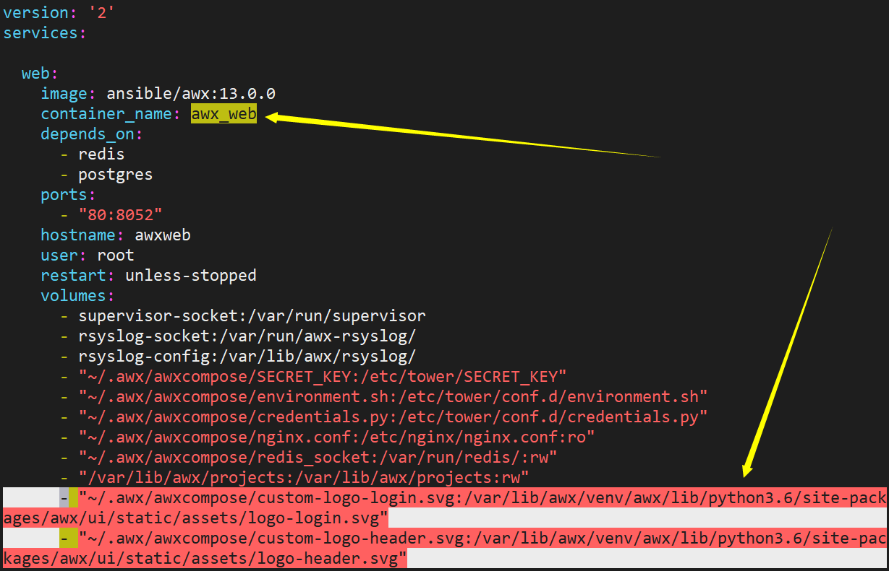

# AWX Replace Logo

> 本章主要介绍如何对Ansible AWX进行logo的替换，包括登录界面和使用界面的logo


### 上传logo

先将自定义的logo上传到Ansible AWX的服务器中


### 拷贝logo到awxcompose

将自定义的logo拷贝到compose目录下：

```bash
[root@awx ~]# cp red-hat.svg /root/.awx/awxcompose/custom-logo-login.svg
[root@awx ~]# cp red-hat.svg /root/.awx/awxcompose/custom-logo-header.svg
```


### 修改docker-compose.yml文件

修改`docker-compose.yml`文件，在`awx_web`这个container的volume部分加上如下内容：

```bash
[root@awx ~]# vim /root/.awx/awxcompose/docker-compose.yml
      - "~/.awx/awxcompose/custom-logo-header.svg:/var/lib/awx/venv/awx/lib/python3.6/site-packages/awx/ui/static/assets/logo-header.svg"
      - "/var/lib/awx/projects:/var/lib/awx/projects:rw"
```




### 修改docker-compose.yml.j2

修改`docker-compose.yml.j2`文件，加入同样的信息，如下所示：

```bash
[root@awx ~]# vim /root/awx-13.0.0/installer/roles/local_docker/templates/docker-compose.yml.j2
      - "~/.awx/awxcompose/custom-logo-login.svg:/var/lib/awx/venv/awx/lib/python3.6/site-packages/awx/ui/static/assets/logo-login.svg"
      - "~/.awx/awxcompose/custom-logo-header.svg:/var/lib/awx/venv/awx/lib/python3.6/site-packages/awx/ui/static/assets/logo-header.svg"
```


### 运行安装程序

重新运行一次awx的安装程序重建container来更新修改的信息

```bash
[root@awx awx-13.0.0]# cd /root/awx-13.0.0/installer/
[root@awx installer]# ansible-playbook -i inventory install.yml
```

运行结束后重新登录web端检查结果。