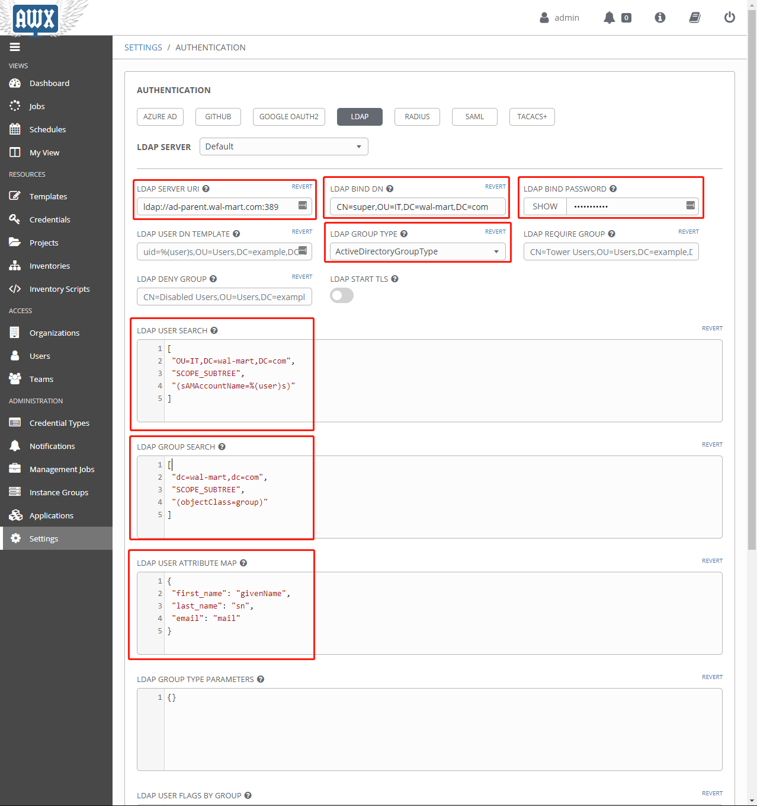
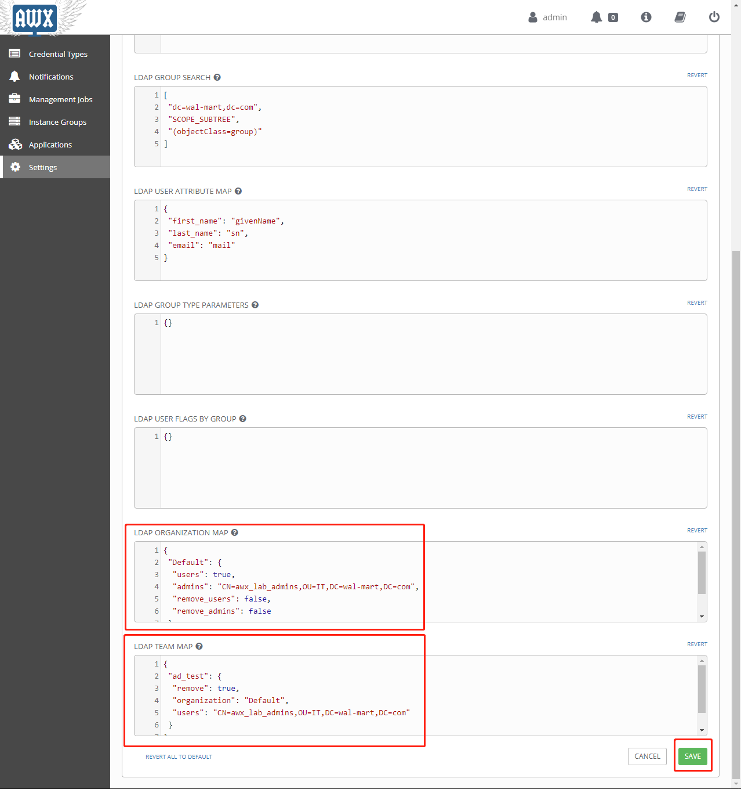

# Ansible AWX Integration with Active Directory

# Title

> 本章主要介绍在Ansible AWX中，如何去集成AD域，使用AD域来登录AWX并对AD域用户在AWX中的权限进行管控。

## Author

```
Name:Shinefire
Blog:https://github.com/shine-fire/Ops_Notes
E-mail:shine_fire@outlook.com
```

## Introduction


## Operation

配置LDAP集成AD域认证的详细操作如下。


查看一下AD域的成员情况


在AWX Web平台中操作：





填写说明

- LDAP SERVER URI

  LDAP Server 路径，包含端口389/636

- LDAP BIND DN 

  填写能够查看到组织结构与用户的AD域用户，例：CN=super,OU=IT,DN=CN,DN=WAL-MART,DC=COM

- LDAP BIND PASSWORD

  上述填写的用户的密码

- LDAP GROUP TYPE

  AD域选择`ActiveDirectoryGroupType`

- LDAP USER SEARCH

  ```json
  [
  "DC=contoso,DC=com",
  "SCOPE_SUBTREE",
  "(sAMAccountName=%(user)s)"
  ]
  ```

- LDAP GROUP SEARCH

  ```json
  [
  "OU=administration groups,DC=contoso,DC=com",
  "SCOPE_SUBTREE",
  "(objectClass=group)"
  ]
  ```

- LDAP User Attribute Map

  ```json
  {
  "first_name": "givenName",
  "last_name": "sn",
  "email": "mail"
  }
  ```

- LDAP ORGANIZATION MAP

  ```json
  {
  "Default": {
   "users": true,
   "admins": "false",
   "remove_admins": false,
   "remove_users": false
  }
  }
  ```

- LDAP TEAM MAP

  ```json
  {
  "AD_Team": {
    "organization": "Default",
    "users": "true",
    "remove": true
  }
  }
  ```

- 

## References

- 官方ldap_auth：https://docs.ansible.com/ansible-tower/latest/html/administration/ldap_auth.html
- CONFIGURING AWX (OR ANSIBLE TOWER) TO USE LDAP AUTHENTICATION AND ACTIVE DIRECTORY：https://hailsatan.xyz/blog/configuring-awx-or-ansible-tower-to-use-ldap-authentication/
- Ansible Tower Integration with Active Directory：https://www.markiiisys.com/blog/ansible-tower-integration-with-active-directory/
- ldapsearch 工具简单使用：https://www.jianshu.com/p/c206c1fa47ab