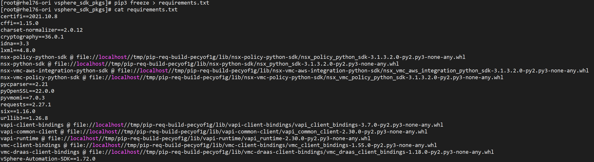
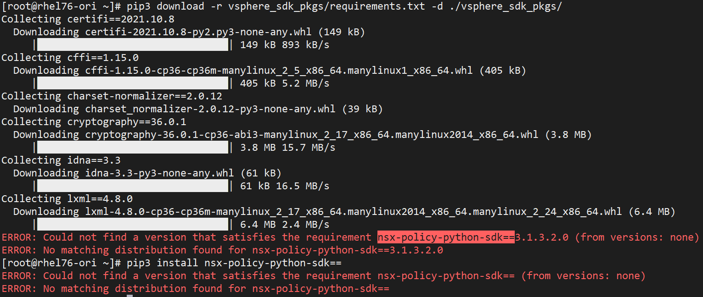
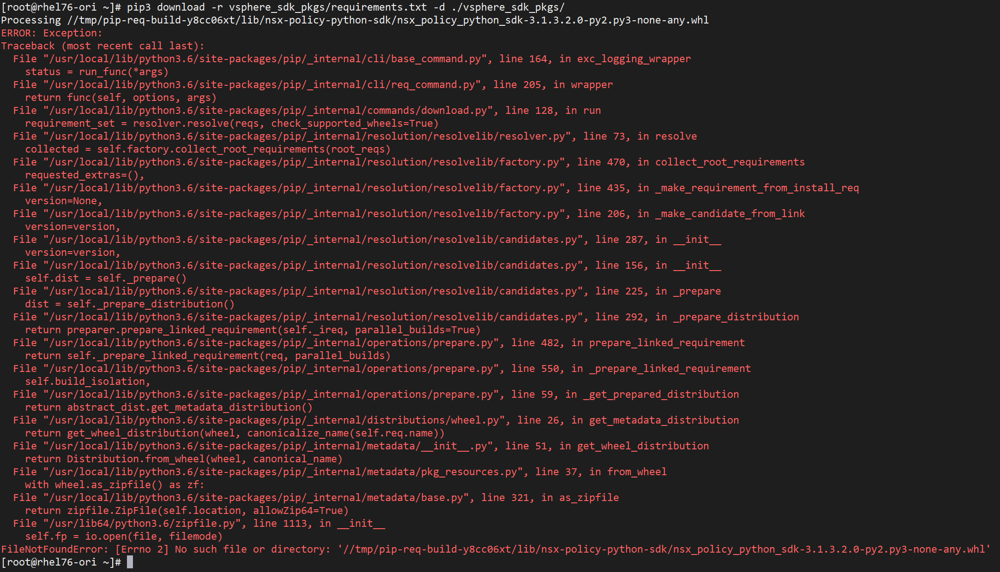

# VMware SDK


## 说明

在使用 Ansible 来调用 VMware 接口之前，需要在 Ansible 机器上安装好一个 python SDK 用做后续的调用使用。

主要是 pyvmomi 这个 python SDK，Ansible 的 VMware module 也是基于这个 SDK 来进行开发的。

另外为了可以使用 vSphere(6.0+)  上的新特性，Ansible VMware module 还会用到 `vSphere Automation Python SDK` 。

具体的 Ansible 官方对这方面的要求可以查看官网：

https://docs.ansible.com/ansible/2.9/scenario_guides/vmware_scenarios/vmware_intro.html


在线安装 SDK 官方给出了非常方便的方式，直接照着来即可。

我这里主要写一下离线环境怎么来安装 SDK 的问题。


## 离线环境安装 pyvmomi SDK

### 上网机离线 pyvmomi SDK

环境资源说明：

- 上网机一台（用于联网下载相关的软件包）

OS version：

```bash
[root@rhel76-ori ~]# cat /etc/redhat-release
Red Hat Enterprise Linux Server release 7.6 (Maipo)
```


安装离线用到的工具

```bash
yum install -y python3-pip.noarch
```


创建用于保存离线pip包的目录

```bash
mkdir pyvmomi_sdk_pkgs
```


查看当前 pip 提供的最新版本

```bash
~]# pip3 install pip==
WARNING: Running pip install with root privileges is generally not a good idea. Try `pip3 install --user` instead.
Collecting pip==
  Could not find a version that satisfies the requirement pip== (from versions: 0.2, 0.2.1, 0.3, 0.3.1, 0.4, 0.5, 0.5.1, 0.6, 0.6.1, 0.6.2, 0.6.3, 0.7, 0.7.1, 0.7.2, 0.8, 0.8.1, 0.8.2, 0.8.3, 1.0, 1.0.1, 1.0.2, 1.1, 1.2, 1.2.1, 1.3, 1.3.1, 1.4, 1.4.1, 1.5, 1.5.1, 1.5.2, 1.5.3, 1.5.4, 1.5.5, 1.5.6, 6.0, 6.0.1, 6.0.2, 6.0.3, 6.0.4, 6.0.5, 6.0.6, 6.0.7, 6.0.8, 6.1.0, 6.1.1, 7.0.0, 7.0.1, 7.0.2, 7.0.3, 7.1.0, 7.1.1, 7.1.2, 8.0.0, 8.0.1, 8.0.2, 8.0.3, 8.1.0, 8.1.1, 8.1.2, 9.0.0, 9.0.1, 9.0.2, 9.0.3, 10.0.0b1, 10.0.0b2, 10.0.0, 10.0.1, 18.0, 18.1, 19.0, 19.0.1, 19.0.2, 19.0.3, 19.1, 19.1.1, 19.2, 19.2.1, 19.2.2, 19.2.3, 19.3, 19.3.1, 20.0, 20.0.1, 20.0.2, 20.1b1, 20.1, 20.1.1, 20.2b1, 20.2, 20.2.1, 20.2.2, 20.2.3, 20.2.4, 20.3b1, 20.3, 20.3.1, 20.3.2, 20.3.3, 20.3.4, 21.0, 21.0.1, 21.1, 21.1.1, 21.1.2, 21.1.3, 21.2, 21.2.1, 21.2.2, 21.2.3, 21.2.4, 21.3, 21.3.1)
No matching distribution found for pip==
```


安装 pip3 和 pyvmomi

```bash
~]# pip3 download pip==21.3.1
~]# pip3 install pyvmomi
```


生成 requirements.txt

```bash
~]# pip3 freeze > pyvmomi_sdk_pkgs/requirements.txt
```


离线所有的 pip 包

```bash
~]# python3 -m pip download -r pyvmomi_sdk_pkgs/requirements.txt -d ./pyvmomi_sdk_pkgs/
```


打包

```bash
~]# ls pyvmomi_sdk_pkgs/
certifi-2021.10.8-py2.py3-none-any.whl      idna-3.3-py3-none-any.whl  requests-2.27.1-py2.py3-none-any.whl  six-1.16.0-py2.py3-none-any.whl
charset_normalizer-2.0.12-py3-none-any.whl  pyvmomi-7.0.3.tar.gz       requirements.txt                      urllib3-1.26.8-py2.py3-none-any.whl
~]# tar czf pyvmomi_sdk_pkgs.tar.gz pyvmomi_sdk_pkgs
```


### 离线环境安装 pyvmomi SDK

> 离线环境也用上面的机器原始快照断网进行模拟

将离线包拷贝到离线环境中解压

```bash
~]# ls
anaconda-ks.cfg  pyvmomi_sdk_pkgs.tar.gz
~]# tar xzf pyvmomi_sdk_pkgs.tar.gz
```


安装 pip

```bash
~]# yum install python3-pip.noarch -y
```


安装 SDK

```bash
~]# pip3 install --no-index --find-links=./pyvmomi_sdk_pkgs pyvmomi
WARNING: Running pip install with root privileges is generally not a good idea. Try `pip3 install --user` instead.
Collecting pyvmomi
Collecting requests>=2.3.0 (from pyvmomi)
Collecting six>=1.7.3 (from pyvmomi)
Collecting idna<4,>=2.5; python_version >= "3" (from requests>=2.3.0->pyvmomi)
Collecting urllib3<1.27,>=1.21.1 (from requests>=2.3.0->pyvmomi)
Collecting charset-normalizer~=2.0.0; python_version >= "3" (from requests>=2.3.0->pyvmomi)
Collecting certifi>=2017.4.17 (from requests>=2.3.0->pyvmomi)
Installing collected packages: idna, urllib3, charset-normalizer, certifi, requests, six, pyvmomi
  Running setup.py install for pyvmomi ... done
Successfully installed certifi-2021.10.8 charset-normalizer-2.0.12 idna-3.3 pyvmomi-7.0.3 requests-2.27.1 six-1.16.0 urllib3-1.26.8
```


检查结果

```bash
~]# pip3 list
DEPRECATION: The default format will switch to columns in the future. You can use --format=(legacy|columns) (or define a format=(legacy|columns) in your pip.conf under the [list] section) to disable this warning.
certifi (2021.10.8)
charset-normalizer (2.0.12)
idna (3.3)
pip (9.0.3)
pyvmomi (7.0.3)
requests (2.27.1)
setuptools (39.2.0)
six (1.16.0)
urllib3 (1.26.8)
```


## 离线环境安装 vSphere Automation Python SDK

离线环境安装 Python SDK ，我觉得主要麻烦在于如何去离线，这里记录了一下我离线 Python SDK 的方法。

有需要的朋友可以参考。


### 上网机离线 SDK

环境资源说明：

- 上网机一台（用于联网下载相关的软件包）


OS version：

```bash
[root@rhel76-ori ~]# cat /etc/redhat-release
Red Hat Enterprise Linux Server release 7.6 (Maipo)
```


安装离线用到的工具

```bash
yum install -y git python3-pip.noarch
```


创建用于保存离线pip包的目录

```bash
mkdir vsphere_sdk_pkgs
```


查看当前 pip 提供的最新版本

```bash
~]# pip3 install pip==
WARNING: Running pip install with root privileges is generally not a good idea. Try `pip3 install --user` instead.
Collecting pip==
  Could not find a version that satisfies the requirement pip== (from versions: 0.2, 0.2.1, 0.3, 0.3.1, 0.4, 0.5, 0.5.1, 0.6, 0.6.1, 0.6.2, 0.6.3, 0.7, 0.7.1, 0.7.2, 0.8, 0.8.1, 0.8.2, 0.8.3, 1.0, 1.0.1, 1.0.2, 1.1, 1.2, 1.2.1, 1.3, 1.3.1, 1.4, 1.4.1, 1.5, 1.5.1, 1.5.2, 1.5.3, 1.5.4, 1.5.5, 1.5.6, 6.0, 6.0.1, 6.0.2, 6.0.3, 6.0.4, 6.0.5, 6.0.6, 6.0.7, 6.0.8, 6.1.0, 6.1.1, 7.0.0, 7.0.1, 7.0.2, 7.0.3, 7.1.0, 7.1.1, 7.1.2, 8.0.0, 8.0.1, 8.0.2, 8.0.3, 8.1.0, 8.1.1, 8.1.2, 9.0.0, 9.0.1, 9.0.2, 9.0.3, 10.0.0b1, 10.0.0b2, 10.0.0, 10.0.1, 18.0, 18.1, 19.0, 19.0.1, 19.0.2, 19.0.3, 19.1, 19.1.1, 19.2, 19.2.1, 19.2.2, 19.2.3, 19.3, 19.3.1, 20.0, 20.0.1, 20.0.2, 20.1b1, 20.1, 20.1.1, 20.2b1, 20.2, 20.2.1, 20.2.2, 20.2.3, 20.2.4, 20.3b1, 20.3, 20.3.1, 20.3.2, 20.3.3, 20.3.4, 21.0, 21.0.1, 21.1, 21.1.1, 21.1.2, 21.1.3, 21.2, 21.2.1, 21.2.2, 21.2.3, 21.2.4, 21.3, 21.3.1)
No matching distribution found for pip==
```


离线 pip 

```bash
~]# pip3 download pip==21.3.1 -d ./vsphere_sdk_pkgs/
```


更新 pip

```bash
~]# pip3 install pip==21.3.1 
```


安装 SDK（Linux访问github有问题的话跳过此步骤看下一步）

```bash
~]# python3 -m pip install --upgrade git+https://github.com/vmware/vsphere-automation-sdk-python.git
```

> 新版本pip需要改一下使用命令


github 离线 repo 安装（Linux无法联网的情况下，可以让其他人帮忙访问github下载）

```bash
~]# ls vsphere-automation-sdk-python-master.zip
vsphere-automation-sdk-python-master.zip
~]# unzip vsphere-automation-sdk-python-master.zip
~]# python3 -m pip install ./vsphere-automation-sdk-python-master.zip
```


生成 requirement.txt

```bash
~]# pip3 list --format=freeze > ./vsphere_sdk_pkgs/requirements.txt
```

> 注意：由于 pip 安装软件包的一种特殊语法（自19.1开始受支持），如果直接使用以前的 freeze 来导出 requirement 文件可能会导致 pip 包的版本显示不是版本号而是 @file ，这会导致无法正常离线 pip 包。
>
> （这 pip 怎么越改越恶心人了...）


离线 pip 包

```bash
~]# pip3 download -r vsphere_sdk_pkgs/requirements.txt -d ./vsphere_sdk_pkgs/
```


打包目录拷贝到离线安装环境中

```bash
vsphere_sdk_pkgs]# ls
certifi-2021.10.8-py2.py3-none-any.whl                                                      pyOpenSSL-22.0.0-py2.py3-none-any.whl
cffi-1.15.0-cp36-cp36m-manylinux_2_5_x86_64.manylinux1_x86_64.whl                           pyvmomi-7.0.3.tar.gz
charset_normalizer-2.0.12-py3-none-any.whl                                                  requests-2.27.1-py2.py3-none-any.whl
cryptography-36.0.1-cp36-abi3-manylinux_2_17_x86_64.manylinux2014_x86_64.whl                setuptools-59.6.0-py3-none-any.whl
idna-3.3-py3-none-any.whl                                                                   six-1.16.0-py2.py3-none-any.whl
lxml-4.8.0-cp36-cp36m-manylinux_2_17_x86_64.manylinux2014_x86_64.manylinux_2_24_x86_64.whl  urllib3-1.26.8-py2.py3-none-any.whl
nsx_policy_python_sdk-3.1.3.2.0-py2.py3-none-any.whl                                        vapi_client_bindings-3.7.0-py2.py3-none-any.whl
nsx_python_sdk-3.1.3.2.0-py2.py3-none-any.whl                                               vapi_common_client-2.30.0-py2.py3-none-any.whl
nsx_vmc_aws_integration_python_sdk-3.1.3.2.0-py2.py3-none-any.whl                           vapi_runtime-2.30.0-py2.py3-none-any.whl
nsx_vmc_policy_python_sdk-3.1.3.2.0-py2.py3-none-any.whl                                    vmc_client_bindings-1.55.0-py2.py3-none-any.whl
pip-21.3.1-py3-none-any.whl                                                                 vmc_draas_client_bindings-1.18.0-py2.py3-none-any.whl
pycparser-2.21-py2.py3-none-any.whl                                                         vSphere-Automation-SDK-1.72.0.zip

vsphere_sdk_pkgs]# cd ..
~]# tar czvf vsphere_sdk_pkgs.tar.gz vsphere_sdk_pkgs
```


### 离线环境安装 SDK

> 离线环境也用上面的机器原始快照断网进行模拟

将离线包拷贝到离线环境中解压

```bash
~]# ls
anaconda-ks.cfg  vsphere_sdk_pkgs.tar.gz
~]# tar xzvf vsphere_sdk_pkgs.tar.gz
```


安装 pip

```bash
~]# yum install python3-pip.noarch -y
```


更新 pip

```bash
~]# cd vsphere_sdk_pkgs
vsphere_sdk_pkgs]# pip3 install ./pip-21.3.1-py3-none-any.whl
WARNING: Running pip install with root privileges is generally not a good idea. Try `pip3 install --user` instead.
Processing ./pip-21.3.1-py3-none-any.whl
Installing collected packages: pip
Successfully installed pip-21.3.1
```


安装 SDK

```bash
pip3 install ./vsphere_sdk_pkgs/vSphere-Automation-SDK-1.72.0.zip
```


## 错误记录

Q1：

pip freeze 导出 requirement.txt 存在一些 pip 包并未显示版本问题：




A：

这个可以使用另外的命令来解决：pip3 list --format=freeze > ./requirements.txt

原因：这是 pip 安装软件包的一种特殊语法（自19.1开始受支持）[PEP404](https://www.python.org/dev/peps/pep-0440/#direct-references)。但是该此种路径取决于环境，`file:///URL` 仅在本地文件系统上可用，你不能将生成的 `requirements.txt` 文件提供给其他人使用


Q2：

由于 vSphere 提供的 SDK，并不在 pypi 官网，所以离线的情况下，涉及到的方式比较混合... 加上 pip3 新版本的一些功能变更，离线比较复杂。

猜测上面 freeze 的一些包使用的本地路径，也可能是和使用的第三方pip包有关系。

即使在使用 pip3 list --format=freeze 的方式导出 requirement 后，download 也会失败，pip3 install 命令尝试搜索 nsx-policy-python-sdk ，果然也没有发现这个 pip 包。



即使使用 freeze 的方式，生成 @file 也一样没办法 download 下来，会提示找不到：



接下来只能再寻求一下，混合pip包的离线导入方式了。


A：

