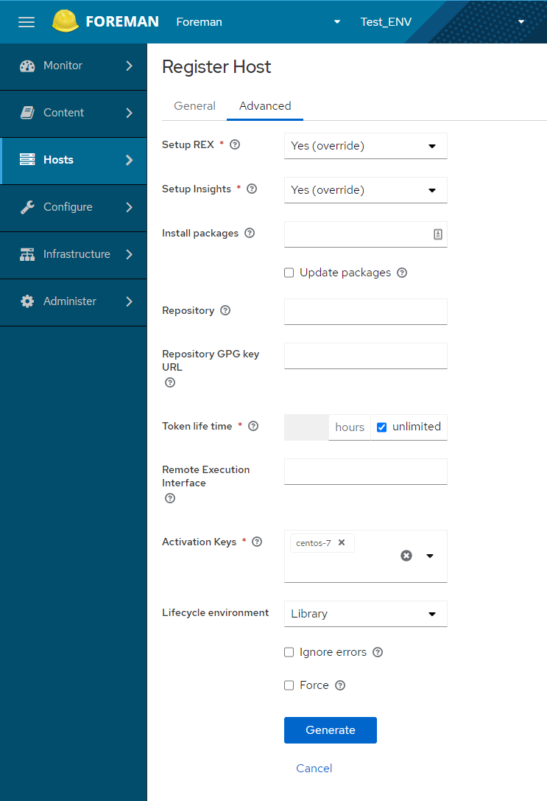

# Registering Hosts


## 客户端主机纳管

不同的linux服务器注册到foreman的时候，通过activation key来进行区分并绑定到不同的发布内容上， 再foreman中需要先创建好各个不同的activation key，并绑定到对应的资源，这样机器注册时指需要选择不同的activation key即可。 


### 客户端主机安装客户端软件包


Foreman subscription-manager 是否一定需要DNS解析才能成功的订阅？

确保安装 subscription-manager

```bash
[root@foreman-client1 ~]# yum install -y subscription-manager
```

安装 katello-ca-consumer-latest.noarch.rpm

```bash
[root@foreman-client1 ~]# yum localinstall -y http://foreman-server.shinefire.com/pub/katello-ca-consumer-latest.noarch.rpm
```


通过key订阅

```bash
~]# subscription-manager register --org="Shine-Fire" --activationkey="centos-7"
```


### 在 Foreman 上配置注册命令

点击 "Hosts" --> "Register Hosts"，进入到 "Register Hosts" 的主界面开始填写内容生成注册命令

如下配置生成一条命令：



未配置 SSL 证书的情况下，再添加一个 --insecure 参数进行注册。


## Host免密配置

配置免密主要有以下几种方式：

To use SSH keys for authenticating remote execution connections, you must distribute the public SSH key from Smart Proxy to its attached hosts that you want to manage. Ensure that the SSH service is enabled and running on the hosts. Configure any network or host-based firewalls to enable access to port 22.

Use one of the following methods to distribute the public SSH key from Smart Proxy to target hosts:

1. [Distributing SSH Keys for Remote Execution Manually](https://docs.theforeman.org/3.2/Managing_Hosts/index-katello.html#distributing-ssh-keys-for-remote-execution-manually_managing-hosts).
2. [Using the Foreman API to Obtain SSH Keys for Remote Execution](https://docs.theforeman.org/3.2/Managing_Hosts/index-katello.html#using-the-api-to-obtain-ssh-keys-for-remote-execution_managing-hosts).
3. [Configuring a Kickstart Template to Distribute SSH Keys during Provisioning](https://docs.theforeman.org/3.2/Managing_Hosts/index-katello.html#configuring-a-kickstart-template-to-distribute-ssh-keys-during-provisioning_managing-hosts).
4. For new Foreman hosts, you can deploy SSH keys to Foreman hosts during registration using the global registration template. For more information, see [Registering a Host to Foreman Using the Global Registration Template](https://docs.theforeman.org/3.2/Managing_Hosts/index-katello.html#registering-a-host_managing-hosts).


拷贝 ssh key 密钥对给 host

```bash
ssh-copy-id -i ~foreman-proxy/.ssh/id_rsa_foreman_proxy.pub root@target.example.com
```


也可以使用 curl 的方式，通过调用 Foreman 的 API 来下载公钥的内容到 Host 的 authorized_keys 来实现（这个可以作为备选方案）

```bash
# mkdir ~/.ssh
# curl https://smartproxy.example.com:8443/ssh/pubkey >> ~/.ssh/authorized_keys
# chmod 700 ~/.ssh
# chmod 600 ~/.ssh/authorized_keys
```


另外针对新的主机，可以将密钥添加到 kickstart 中，这样创建的新主机默认就可以实现免密连接。具体的实现方案可以参考：https://docs.theforeman.org/3.2/Managing_Hosts/index-foreman-el.html#configuring-a-kickstart-template-to-distribute-ssh-keys-during-provisioning_managing-hosts


## 后续配置

### 修改使用远程命令行执行

1. In the Foreman web UI, navigate to **Administer** > **Settings**.
2. Select the **Content** tab.
3. Set the **Use remote execution by default** parameter to **Yes**.


## Others

### 关于 katello agent 被弃用

参考官方文档：

https://docs.theforeman.org/3.2/Managing_Hosts/index-katello.html#Migrating_From_Katello_Agent_to_Remote_Execution_managing-hosts

`Remote Execution` is the preferred way to manage package content on hosts. The Katello Agent is deprecated and will be removed in a future Foreman version. Follow these steps to switch to Remote Execution.

从官方文档可以得知，Katello Agent 是要被弃用了的，况且现在 Foreman 3.2 的版本里面，那些需要使用到的 YUM 源里面也并不在提供 Katello Agent 的 RPM 包了。


## References

- Registering Hosts：https://docs.theforeman.org/3.2/Managing_Hosts/index-katello.html#Registering_Hosts_managing-hosts
- 


