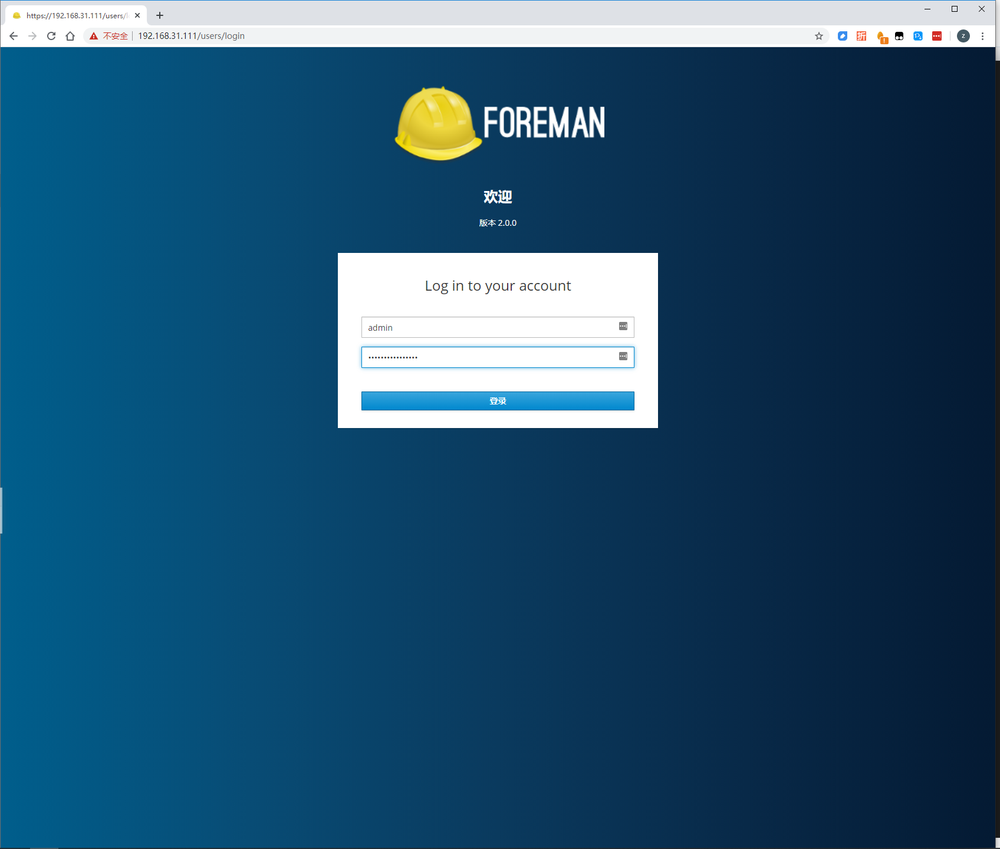
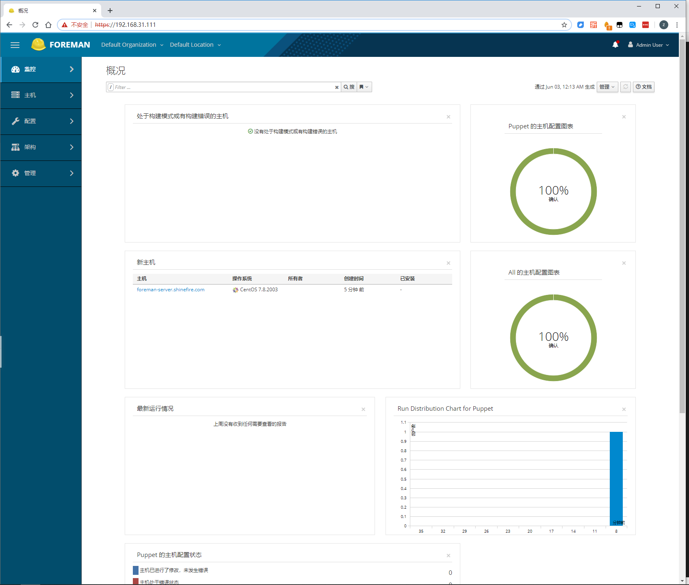
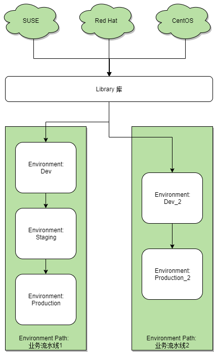
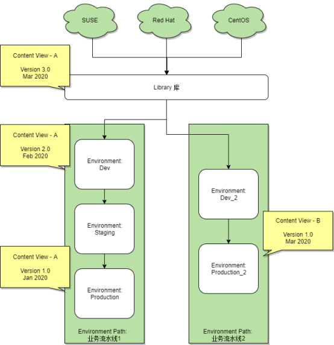

# Foreman Deployment

> 本章主要介绍如何快速的部署一个Foreman上手使用，适用于个人或者公司平时的补丁管理。


**Author**

```
Name:Shinefire
Blog:https://github.com/shine-fire/Ops_Notes
E-mail:shine_fire@outlook.com
```

[TOC]

## 介绍

Foreman-katello  是一个All in one的开源项目，整合了很多其他开源模块用于实现服务器的集中管理，他从上游repo获取内容后，部署到各种平台上，可以支持虚拟化，物理机，公有云上的操作系统的统一管理。


## 环境规划

### 版本说明

| Items           | Var                                     |
| --------------- | --------------------------------------- |
| OS Version      | CentOS Stream 8（7版本马上要被抛弃...） |
| Foreman Version | 3.2（当前的稳定版本）                   |


### 硬件要求

默认安装的需求：

- 20GB RAM + 4G swap（这是官方建议的最小值，不过最小值也可能会存在无法正常运行的可能性，所以最好配置更大一些）
- 300G disk

另外需要根据实际环境来确定当前具体的资源需求，可以参考以下：

| profile           | 受控机器数量范围 | 建议最小内存 | 建议最小CPU |
| ----------------- | ---------------- | ------------ | ----------- |
| default           | up-to 5000       | 20G          | 4           |
| medium            | 5000 to 10000    | 32G          | 8           |
| large             | 10000 to 20000   | 64G          | 16          |
| extra-large       | 20000 to 40000   | 128G         | 32          |
| extra-extra-large | 40000 to 60000   | 256G         | 48          |


### 文件系统要求

| Directory       | Installation Size | Runtime Size   |
| :-------------- | :---------------- | :------------- |
| /var/log/       | 10 MB             | 10 GB          |
| /var/lib/pgsql  | 100 MB            | 20 GB          |
| /usr            | 3 GB              | Not Applicable |
| /opt/puppetlabs | 500 MB            | Not Applicable |
| /var/lib/pulp/  | 1 MB              | 300 GB         |
| /var/lib/qpidd/ | 25 MB             | Not Applicable |


### 浏览器版本推荐

- Google Chrome 54 or higher
- Microsoft Edge
- Microsoft Internet Explorer 10 or higher
- Mozilla Firefox 49 or higher

> 其他版本的浏览器官方未进行测试，不保证都能正常运行


### 防火墙

Protect your Foreman environment by blocking all unnecessary and unused ports.

| Port        | Protocol  | Required For                                                 |
| :---------- | :-------- | :----------------------------------------------------------- |
| 53          | TCP & UDP | DNS Server                                                   |
| 67, 68      | UDP       | DHCP Server                                                  |
| 69          | UDP       | TFTP Server                                                  |
| 80, 443     | TCP       | ***** HTTP & HTTPS access to Foreman web UI / provisioning templates - using Apache + Passenger |
| 3000        | TCP       | HTTP access to Foreman web UI / provisioning templates - using standalone WEBrick service |
| 5910 - 5930 | TCP       | Server VNC Consoles                                          |
| 5432        | TCP       | Separate PostgreSQL database                                 |
| 8140        | TCP       | ***** Puppet server                                          |
| 8443        | TCP       | Smart Proxy, open only to Foreman                            |

> Ports indicated with ***** are running by default on a Foreman all-in-one installation and should be open.


### YUM源

对于 CentOS Stream 8，安装Foreman平台之前需要准备好以下YUM源：

- CentOS Stream 8 - AppStream
- CentOS Stream 8 - BaseOS
- CentOS Stream 8 - Extras
- EPEL
- epel-modular
- Foreman 3.2
- Foreman plugins 3.2
- Puppet 7 Repository el 8 - x86_64
- katello 4.4 
- katello-candlepin
- pulpcore
- centos-ansible-29


## 系统环境准备


### 关闭firewalld

关闭 firewalld

```bash
~]# systemctl disable firewalld.service --now
Removed /etc/systemd/system/multi-user.target.wants/firewalld.service.
Removed /etc/systemd/system/dbus-org.fedoraproject.FirewallD1.service.
```

检查结果

```bash
[root@foreman-server ~]# systemctl status firewalld.service
● firewalld.service - firewalld - dynamic firewall daemon
   Loaded: loaded (/usr/lib/systemd/system/firewalld.service; disabled; vendor preset: enable>
   Active: inactive (dead)
     Docs: man:firewalld(1)
...
```


### 开启 SELinux

```bash
~]# vim /etc/selinux/config
SELINUX=enforcing
~]# reboot
```


### 配置FQDN

```bash
~]# hostnamectl set-hostname foreman-server.shinefire.com
```

> 注意：即使主机名不配置fqdn的形式，下面的配置hosts里面也必须要写入一个fqdn，因为通过 foreman-installer 安装的时候，需要读取这个fqdn来作为web端的访问域名。


### 配置 hosts

```bash
~]# vi /etc/hosts
127.0.0.1   localhost localhost.localdomain localhost4 localhost4.localdomain4
::1         localhost localhost.localdomain localhost6 localhost6.localdomain6
192.168.31.111  foreman-server.shinefire.com  foreman-server
```


### 配置DNS

略过，网络配置的时候通常会进行配置DNS了。


### 检查域名解析

检查域名解析是否能够符合预期得到相应的 IP 地址和 fqdn

```bash
~]# ping -c1 localhost
~]# ping -c1 `hostname -f` # my_system.domain.com
```


### 配置时间同步

安装 chrony

```bash
~]# dnf -y install chrony
```

配置时钟服务器

```bash
vim /etc/chrony.conf
server xx.xx.xx.xx
```

启用服务

```bash
~]# systemctl enable chronyd --now
Created symlink /etc/systemd/system/multi-user.target.wants/chronyd.service → /usr/lib/systemd/system/chronyd.service.
```

配置时区

```bash
~]# timedatectl set-timezone Asia/Shanghai
```


## 部署 Foreman


### 配置在线YUM源

#### 配置最新的基础源

略过基础源的配置，用系统默认的或者配置国内的镜像源即可。

- BaseOS
- AppStream
- Extras（镜像不自带）


#### 安装在线repos（适用于可以连通外网的环境）

清理缓存

```bash
~]# dnf clean all
```


配置 epel 源

```bash
~]# dnf localinstall -y https://dl.fedoraproject.org/pub/epel/epel-release-latest-8.noarch.rpm
```

> 虽然官方文档没写要配置epel，但是实际上如果没有的话，就会遇到很多报错...


配置 Foreman 仓库

```bash
~]# dnf localinstall -y https://yum.theforeman.org/releases/3.2/el8/x86_64/foreman-release.rpm
```


配置 Katello 仓库

```bash
~]# dnf -y localinstall https://yum.theforeman.org/katello/4.4/katello/el8/x86_64/katello-repos-latest.rpm
```


配置 Ansible 仓库（来自extras源）

```bash
~]# dnf install -y centos-release-ansible-29
```


配置 puppet7 仓库

``` bash
~]# dnf localinstall -y https://yum.puppet.com/puppet7-release-el-8.noarch.rpm
```


### 配置内网离线YUM源

如果企业环境无法联网的时候，则无法使用在线yum源，只能根据实际环境来配置内网yum源（此处略过）


### 检查repos

```bash
~]# dnf repolist
repo id               repo name
appstream             CentOS Stream 8 - AppStream
baseos                CentOS Stream 8 - BaseOS
centos-ansible-29     CentOS Configmanagement SIG - ansible-29
epel                  Extra Packages for Enterprise Linux 8 - x86_64
epel-modular          Extra Packages for Enterprise Linux Modular 8 - x86_64
extras                CentOS Stream 8 - Extras
foreman               Foreman 3.2
foreman-plugins       Foreman plugins 3.2
katello               Katello 4.4
katello-candlepin     Candlepin: an open source entitlement management system.
powertools            CentOS Stream 8 - PowerTools
pulpcore              pulpcore: Fetch, Upload, Organize, and Distribute Software Packages.
puppet7               Puppet 7 Repository el 8 - x86_64
```


### 安装必需软件包

#### 更新所有rpm包

更新补丁

```bash
~]# dnf update --refresh -y
~]# reboot
```


#### 安装需要的软件包

开启 Ruby 2.7 module

```bash
~]# dnf module reset ruby -y
~]# dnf module enable ruby:2.7 -y
```

启用 postgresql module

```bash
~]# dnf module reset postgresql -y
~]# dnf module enable postgresql:12 -y
```

启用 pki-core module

``` bash
~]# dnf module enable pki-core -y
```

启用 katello module

```bash
~]# dnf module enable katello -y
```

启用 pulpcore module

```bash
~]# dnf module enable pulpcore -y
```

启用 foreman module

```bash
~]# dnf module enable foreman -y
```


安装 foreman-installer

```bash
~]# dnf -y install foreman-installer
```

安装 foreman-installer-katello

```bash
~]# dnf -y install foreman-installer-katello
```

安装 rubygem-foreman_maintain

```bash
~]# dnf -y install rubygem-foreman_maintain
```

安装 selinux 相关

```bash
~]# dnf -y install foreman-selinux katello-selinux candlepin-selinux pulpcore-selinux
```


### 使用foreman-installer进行安装


#### 启动instller安装

##### 安装选项说明

如下：

| 选项                                               | 说明                                                 |
| -------------------------------------------------- | ---------------------------------------------------- |
| --[no-]enable-foreman-cli-openscap                 | 启用openscap相关                                     |
| --[no-]enable-foreman-plugin-openscap              | 启用openscap相关                                     |
| --[no-]enable-foreman-proxy-plugin-openscap        | 启用openscap相关                                     |
| --foreman-initial-organization                     | 指定组织名称                                         |
| --tuning medium                                    | 根据规模进行相应的优化，主要是优化了postgresql的参数 |
| --enable-foreman-plugin-remote-execution           |                                                      |
| --enable-foreman-proxy-plugin-remote-execution-ssh |                                                      |
| --enable-foreman-compute-vmware                    | vmware相关的支持                                     |
| --enable-foreman-compute-ovirt                     | ovirt相关的支持                                      |


##### 安装 katello

foreman-installer 安装

```bash
~]# foreman-installer --scenario katello \
--foreman-initial-organization "Shine-Fire" \
--foreman-initial-location "China" \
--foreman-initial-admin-username admin \
--foreman-initial-admin-password password \
--foreman-initial-admin-timezone Asia/Shanghai
```

安装输出结果如下：

```bash
[root@foreman-server ~]# foreman-installer --scenario katello \
> --foreman-initial-organization "Shine-Fire" \
> --foreman-initial-location "China" \
> --foreman-initial-admin-username admin \
> --foreman-initial-admin-password password \
> --foreman-initial-admin-timezone Asia/Shanghai
2022-03-18 01:13:26 [NOTICE] [root] Loading installer configuration. This will take some time.
2022-03-18 01:13:31 [NOTICE] [root] Running installer with log based terminal output at level NOTICE.
2022-03-18 01:13:31 [NOTICE] [root] Use -l to set the terminal output log level to ERROR, WARN, NOTICE, INFO, or DEBUG. See --full-help for definitions.
2022-03-18 01:18:44 [NOTICE] [configure] Starting system configuration.
2022-03-18 01:20:40 [NOTICE] [configure] 250 configuration steps out of 1700 steps complete.
2022-03-18 01:21:36 [NOTICE] [configure] 500 configuration steps out of 1700 steps complete.
2022-03-18 01:21:36 [NOTICE] [configure] 750 configuration steps out of 1704 steps complete.
2022-03-18 01:22:47 [NOTICE] [configure] 1000 configuration steps out of 1711 steps complete.
2022-03-18 01:22:54 [NOTICE] [configure] 1250 configuration steps out of 1731 steps complete.
2022-03-18 01:28:04 [NOTICE] [configure] 1500 configuration steps out of 1731 steps complete.
2022-03-18 01:33:21 [NOTICE] [configure] System configuration has finished.
Executing: foreman-rake upgrade:run
=============================================
Upgrade Step 1/8: katello:correct_repositories. This may take a long while.
=============================================
Upgrade Step 2/8: katello:clean_backend_objects. This may take a long while.
0 orphaned consumer id(s) found in candlepin.
Candlepin orphaned consumers: []
=============================================
Upgrade Step 3/8: katello:upgrades:4.0:remove_ostree_puppet_content. =============================================
Upgrade Step 4/8: katello:upgrades:4.1:sync_noarch_content. =============================================
Upgrade Step 5/8: katello:upgrades:4.1:fix_invalid_pools. I, [2022-03-18T01:33:37.046834 #26243]  INFO -- : Corrected 0 invalid pools
I, [2022-03-18T01:33:37.046893 #26243]  INFO -- : Removed 0 orphaned pools
=============================================
Upgrade Step 6/8: katello:upgrades:4.1:reupdate_content_import_export_perms. =============================================
Upgrade Step 7/8: katello:upgrades:4.2:remove_checksum_values. =============================================
Upgrade Step 8/8: katello:upgrades:4.4:publish_import_cvvs.   Success!
  * Foreman is running at https://foreman-server.shinefire.com
      Initial credentials are admin / password
  * To install an additional Foreman proxy on separate machine continue by running:

      foreman-proxy-certs-generate --foreman-proxy-fqdn "$FOREMAN_PROXY" --certs-tar "/root/$FOREMAN_PROXY-certs.tar"
  * Foreman Proxy is running at https://foreman-server.shinefire.com:9090

  The full log is at /var/log/foreman-installer/katello.log
```


##### 后续待安装

```bash
~]# foreman-installer --scenario katello \
--enable-foreman-plugin-openscap  \
--enable-foreman-proxy-plugin-openscap  \
--enable-foreman-cli-openscap  \
--enable-foreman-compute-vmware  \
--enable-foreman-compute-ovirt \
--enable-foreman-plugin-ansible  \
--enable-foreman-proxy-plugin-ansible \
--enable-foreman-plugin-remote-execution  \
--enable-foreman-proxy-plugin-remote-execution-ssh  \
--enable-foreman-plugin-templates  \
--foreman-proxy-plugin-ansible-install-runner=false \
--foreman-initial-organization "Shine-Fire" \
--foreman-initial-location "China-SZ" \
--foreman-initial-admin-username admin \
--foreman-initial-admin-password password \
--foreman-initial-admin-timezone Asia/Shanghai \
--tuning medium
```


临时测试用 ↓

```bash
~]# foreman-installer --scenario katello \
--foreman-initial-organization "Shine-Fire" \
--foreman-initial-location "China" \
--foreman-initial-admin-username admin \
--foreman-initial-admin-password password \
--foreman-initial-admin-timezone Asia/Shanghai

--enable-foreman-plugin-remote-execution  \
--enable-foreman-proxy-plugin-remote-execution-ssh  \
--enable-foreman-plugin-openscap \
--enable-foreman-proxy-plugin-openscap \
--enable-foreman-cli-openscap \

```


```bash
~]# foreman-installer
2022-03-04 23:47:44 [NOTICE] [root] Loading installer configuration. This will take some time.
2022-03-04 23:47:48 [NOTICE] [root] Running installer with log based terminal output at level NOTICE.
2022-03-04 23:47:48 [NOTICE] [root] Use -l to set the terminal output log level to ERROR, WARN, NOTICE, INFO, or DEBUG. See --full-help for definitions.
2022-03-04 23:47:50 [NOTICE] [configure] Starting system configuration.
2022-03-04 23:51:20 [NOTICE] [configure] 250 configuration steps out of 1357 steps complete.
2022-03-04 23:52:05 [NOTICE] [configure] 500 configuration steps out of 1359 steps complete.
2022-03-04 23:52:34 [NOTICE] [configure] 750 configuration steps out of 1371 steps complete.
2022-03-04 23:57:00 [NOTICE] [configure] 1000 configuration steps out of 1385 steps complete.
2022-03-04 23:58:23 [NOTICE] [configure] 1250 configuration steps out of 1385 steps complete.
2022-03-04 23:58:34 [NOTICE] [configure] System configuration has finished.
Executing: foreman-rake upgrade:run
  Success!
  * Foreman is running at https://foreman-server.shinefire.com
      Initial credentials are admin / EWqPjxTNXheNpyxr
  * Foreman Proxy is running at https://foreman-server.shinefire.com:8443

  The full log is at /var/log/foreman-installer/foreman.log
```

等待提示Success!安装成功，记录默认的admin**管理员密码**，例如上面的`EWqPjxTNXheNpyxr`，可以在提示的路径中查看安装日志。


#### 检查安装结果

使用 命令检查服务运行状态

不加任何参数安装后的结果如下，是默认带有puppetserver的：

```bash
~]# foreman-maintain service list
Running Service List
================================================================================
List applicable services:
dynflow-sidekiq@.service                   indirect
foreman-proxy.service                      enabled
foreman.service                            enabled
httpd.service                              enabled
postgresql.service                         enabled
pulpcore-api.service                       enabled
pulpcore-content.service                   enabled
pulpcore-worker@.service                   indirect
redis.service                              enabled
tomcat.service                             enabled

All services listed                                                   [OK]
--------------------------------------------------------------------------------
```


#### 停用 puppet 服务

安装成功后，可以先停用 puppet 服务，目前并不打算使用 puppet，如果不停用，会有可能影响后面 web 端的登录使用

```bash
~]# systemctl disable puppet --now
```


### WEB端登陆使用

浏览器中输入IP或者域名即可访问，



查看主界面




## 导入errata

centos 操作系统所需要使用的 errata 的导入方式可以参考：https://github.com/vmfarms/generate_updateinfo

centos 的 errata 生成现在需要先将 errata 转化为 updateinfo，再导入到上游 yum 仓库里面去，最终从 yum 仓库中导入到 Foreman 中。


### 生成 updateinfo


**获取最新到 errata**

最新的 errata 下载站点：http://cefs.steve-meier.de/errata.latest.xml.bz2


**获取通过 errata 生成 updateinfo 的脚本**

通过 errata 生成 updateinfo 脚本有一个开源项目，项目地址：

https://github.com/vmfarms/generate_updateinfo/archive/refs/heads/master.zip


**解压压缩包**

 ```bash
[root@nuc tmp]# bzip2 -d errata.latest.xml.bz2
[root@nuc tmp]# unzip generate_updateinfo-master.zip
Archive:  generate_updateinfo-master.zip
150a98f8f307d8b40b814b23b0e39270cd23215b
   creating: generate_updateinfo-master/
  inflating: generate_updateinfo-master/LICENSE.txt
  inflating: generate_updateinfo-master/README.md
  inflating: generate_updateinfo-master/generate_updateinfo.py
 ```


生成 updateinfo 文件

```bash
[root@nuc tmp]# ./generate_updateinfo-master/generate_updateinfo.py errata.latest.xml
[root@nuc tmp]# ls updateinfo-*
updateinfo-5:
updateinfo.xml

updateinfo-6:
updateinfo.xml

updateinfo-7:
updateinfo.xml

updateinfo-8:
updateinfo.xml

updateinfo-other:
updateinfo.xml
```


将对应版本的 updateinfo.xml 文件放到自己的对应的 yum 源仓库里面，我这里是自己有本地的yum源仓库。

```bash
[root@nuc tmp]# modifyrepo updateinfo-7/updateinfo.xml /var/www/html/yum/centos/centos7/base/repodata/
Wrote: /var/www/html/yum/centos/centos7/base/repodata/updateinfo.xml.gz
           type = updateinfo
       location = repodata/2f24c71f5645711b58219992060e1ae5511c49502cdd79bf38f24d6d0862d414-updateinfo.xml.gz
       checksum = 2f24c71f5645711b58219992060e1ae5511c49502cdd79bf38f24d6d0862d414
      timestamp = 1648367157
  open-checksum = 0b5a6d8a6a7020ae27f240db49fc07aa0b43db058774c92a6a4c52e3e4dc0834
Wrote: /var/www/html/yum/centos/centos7/base/repodata/repomd.xml
```


## Foreman-Kattlo资源管理框架

环境(Environment) 和发布路径（Environment Paths） :
所有从外部同步回来得资源会先放置与 Library 库中， 然后根据不同得生命周期需求，产生不同得发布路径， 如：Library   ->   开发  ->  测试 - >  生产环境

处于不同环境得client机器，可以选择从不同得environment中下载补丁包，实现生命周期管理需求， 如果为了简化，也可以统一直接从Library中拉取

完成这样定义后，所有软件包，需要经过一步步得发布流程，最终才能到生产环境中：



### Environment 

Create Environment Path

界面操作：[menu]-->[Content]-->[Lifecycle Enviroments]-->[Create Environment Path]

如下图：

【图】

Create Environment

界面操作：

【图】

### Content Views
因为library中的内容是持续不断再更新的（follow上游repo的发布频率），但是实际生产环境中的机器往往不需要经常更新，我们需要一个相对比较静态的library的“快照”，这样客户端只需要跟随content view来刷新，而不是上游一有变化立即随之升级，content view是一个集合，可以包含软件包，配置等
content view有版本。可以定期发布一个新的版本，同步Library中的更新

创建一个Content View步骤如下：
[Main] -> [Content] -> [Content View] -> [Create New View] 

【图】

在新创建的CV 添加yum content 后 Publish New Version
【图】add repository
【图】save

查看结果
【图】

后续可以定期发布新的CV版本 来实现内容版本管理。
【图】

### Content Promote

Content View 的新版本创立初期，都默认关联当前Library库中的内容（可以当作是Library在当时的快照）

Content View需要promote到不同的环境中以便关联不同类型的客户端，通常一个新的version release出来，优先promote给dev环境中使用， 一段时间后，发布新的2.0版本，则把1.0版本推到production中。dev环境使用较新版本。 依次发布，实现版本流水线控制



操作步骤如下:
[Main] -> [Content] -> [Content View] 
点击指定的content view进去选择指定的版本选择Actions-->Promote
【图】


## 附录

### 附录1 获取官方errata

**CentOS Errata**

可以参考这个网站提供的（这个网站应该是个个人开源项目，具体的运作方式后面我再仔细了解一下）：https://cefs.steve-meier.de/ 

最新的 centos errata 下载地址：https://cefs.steve-meier.de/errata.latest.xml.bz2


**RHEL Errata**

红帽官方的可以在官方提供的资源中获取：https://www.redhat.com/security/data/oval/v2/

> 不同的版本所需的errata，可以在官网中自行选择。


### 附录2 重装Foreman

如果要完全重装最好还是重新安装一台机器，来重头进行安装，最新的版本已经取消掉了remove功能，自己手动移除不一定能够完全移除干净。


## 待测试功能

### 无fqdn

测试一下如果不是fqdn的hostname，是否会影响到后面的使用，例如安装foreman后，登录界面如果不是fqdn的话，怎么访问？

需要问一下客户，他们其他的业务，都是怎么用的？直接输入IP地址吗？

如果不配置 fqdn 的域名，会有问题：

```bash
[root@foreman-server ~]# hostname -f
foreman-server
[root@foreman-server ~]# cat /etc/hosts
127.0.0.1   localhost localhost.localdomain localhost4 localhost4.localdomain4
::1         localhost localhost.localdomain localhost6 localhost6.localdomain6
192.168.31.111  foreman-server
[root@foreman-server ~]# foreman-installer --scenario katello \
> --foreman-initial-organization "Shine-Fire" \
> --foreman-initial-location "China" \
> --foreman-initial-admin-username admin \
> --foreman-initial-admin-password password \
> --foreman-initial-admin-timezone Asia/Shanghai
2022-03-18 18:22:09 [NOTICE] [root] Loading installer configuration. This will take some time.
2022-03-18 18:22:14 [NOTICE] [root] Running installer with log based terminal output at level NOTICE.
2022-03-18 18:22:14 [NOTICE] [root] Use -l to set the terminal output log level to ERROR, WARN, NOTICE, INFO, or DEBUG. See --full-help for definitions.
Output of 'facter fqdn' is different from 'hostname -f'

Make sure above command gives the same output. If needed, change the hostname permanently via the
'hostname' or 'hostnamectl set-hostname' command
and editing the appropriate configuration file.
(e.g. on Red Hat systems /etc/sysconfig/network,
on Debian based systems /etc/hostname).

If 'hostname -f' still returns an unexpected result, check /etc/hosts and put
the hostname entry in the correct order, for example:

  1.2.3.4 hostname.example.com hostname

The fully qualified hostname must be the first entry on the line
Your system does not meet configuration criteria

```

从结果上看还是必须要配置fqdn才行


## References

- theforeman 官方文档：https://www.theforeman.org/manuals/3.1/index.html
- Katello 相关文档：https://docs.theforeman.org/ （目前开源红帽Satellite文档的工作还在进行中，该站点仅用于参考，目前只有Katello相关的文档）
- Installing Katello on RHEL/CentOS：https://docs.theforeman.org/3.1/Installing_Server/index-katello.html
- Foreman Plugins 文档：https://www.theforeman.org/plugins/  
- Foreman-installer –scenario katello does not install puppet-server https://community.theforeman.org/t/foreman-installer-scenario-katello-does-not-install-puppet-server/26664

