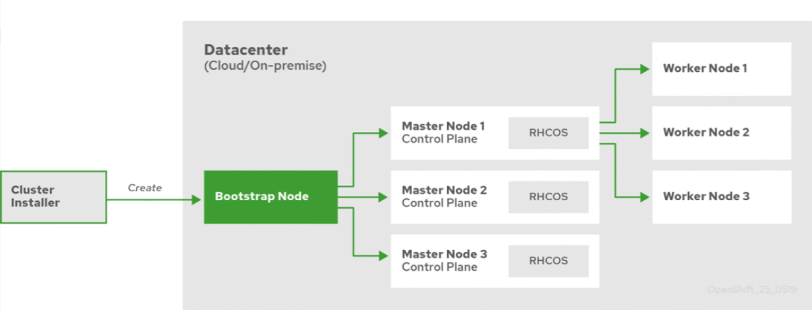
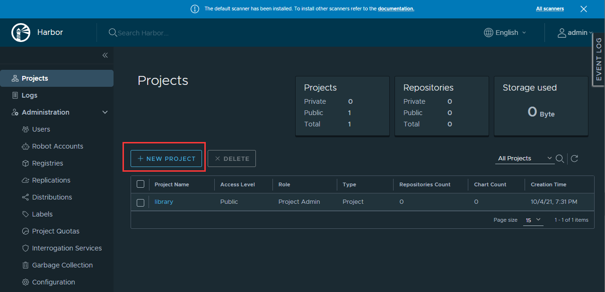
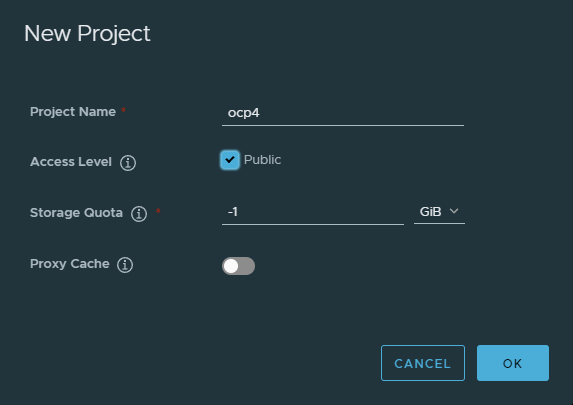

# Deployment UPI OpenShift 4.8.12 on a restricted network


## 文档说明

本文档为离线环境的 UPI（UserProvisioned Infrastructure）安装

Installing a user-provisioned bare metal cluster on a restricted network


### 环境说明

最开始写的时候规划是三个 master 节点，两个 worker 节点，后面因为自己的环境资源有限，就改成只使用三个 master 节点来进行安装。

另外我最开始是尝试使用 VMware Workstations 上面部署虚拟机来进行安装集群的，但是最后死活就是无法成功，在安装后集群后 authentication 这个 clusteroperator 一直不能成功，导致无法正吃使用。多次尝试无果后，换成了 VirtualBox 来提供虚拟机进行安装一次就成功了，我猜测可能跟两个软件的底层网络架构有关系，但也仅限于我自己的猜测而已，毕竟网上很多朋友是用 VMware Workstations 来提供虚拟机也一样能够成功，原因没有查明，并且也没打算再花时间去折腾安装了，所以如果你在使用 VMware Workstations 的时候如果遇到了此类问题，也可以考虑替换成 VirtualBox 试试


## 一、Architecture

### Host List

服务器规划如下：

- 一台离线OpenShift镜像节点，用于专门连接公网离线部署需要的镜像，后面再将离线好的镜像导入到集群中的私有镜像仓库节点使用
- 一个bastion节点，用于部署负载均衡。
- 三个控制平面节点，安装 `Etcd`、控制平面组件和 `Infras` 基础组件。
- 两个计算节点，运行实际负载。
- 一个bootstrap引导主机，执行安装任务，集群部署完成后可删除。
- 一个内部镜像仓库，用于部署OCP时使用以及后续镜像存放于使用。
- 一个基础节点nuc，用于准备提到安装OpenShift的离线资源，同时用来部署 DNS

| Hostname                      | IP             | Hardware     | Role              |
| ----------------------------- | -------------- | ------------ | ----------------- |
| mirror-ocp.ocp4.example.com   | 192.168.31.158 | 4C/8G/100GB  | 离线OpenShift镜像 |
| bastion.ocp4.shinefire.com    | 192.168.31.160 | 4C/8G/100GB  | OpenShift客户端   |
| api.ocp4.shinefire.com        | 192.168.31.160 | 4C/8G/100GB  | HAProxy           |
| api-int.ocp4.shinefire.com    | 192.168.31.160 | 4C/8G/100GB  |                   |
| bootstrap.ocp4.shinefire.com  | 192.168.31.159 | 4C/16G/100GB | bootstrap         |
| master-1.ocp4.shinefire.com   | 192.168.31.161 | 4C/16G/100GB | master节点        |
| etcd-1.ocp4.shinefire.com     | 192.168.31.161 | 4C/16G/100GB | etcd节点          |
| master-2.ocp4.shinefire.com   | 192.168.31.162 | 4C/16G/100GB | master节点        |
| etcd-2.ocp4.shinefire.com     | 192.168.31.162 | 4C/16G/100GB | etcd节点          |
| master-3.ocp4.shinefire.com   | 192.168.31.163 | 4C/16G/100GB | master节点        |
| etcd-3.ocp4.shinefire.com     | 192.168.31.163 | 4C/16G/100GB | etcd节点          |
| worker-1.ocp4.shinefire.com   | 192.168.31.164 | 2C/8G/100GB  | worker节点        |
| apps.ocp4.shinefire.com       | 192.168.31.164 | 2C/8G/100GB  | 入口地址          |
| worker-2.ocp4.shinefire.com   | 192.168.31.165 | 2C/8G/100GB  | worker节点        |
| registry-1.ocp4.shinefire.com | 192.168.31.167 | 4C/8G/100GB  | 内部镜像仓库      |
| nuc.shinefire.com             | 192.168.31.100 | N/A          | YUM/DNS/httpd     |

官方对于每个节点的最小化建议如下：

| Machine       | Operating System  | vCPU | Virtual RAM | Storage |
| :------------ | :---------------- | :--- | :---------- | :------ |
| Bootstrap     | RHCOS             | 4    | 16 GB       | 100 GB  |
| Control plane | RHCOS             | 4    | 16 GB       | 100 GB  |
| Compute       | RHCOS or RHEL 7.9 | 2    | 8 GB        | 100 GB  |


### Softwares List

| 软件名称              | 软件包名                             |
| --------------------- | ------------------------------------ |
| RHEL8.4 DVD           | rhel-server-8.4-x86_64-dvd.iso       |
| 镜像仓库软件          | harbor-offline-installer-v2.3.2.tgz  |
| Registry仓库镜像      | ocp4.tar.gz                          |
| Openshift客户端oc命令 | openshift-client-linux-4.8.12.tar.gz |
| Openshift安装程序     | openshift-install                    |
| CoreOS引导光盘        | rhcos-4.8.2-x86_64-live.x86_64.iso   |

资源获取说明：

- rhel-server-8.4-x86_64-dvd.iso：官方下载iso即可
- harbor-offline-installer-v2.3.2.tgz：官方下载的offline版本
- ocp4.tar.gz：需要自己离线官方的镜像并保存使用，后面离线 OpenShift 镜像的步骤中会说明
- openshift-client-linux-4.8.12.tar.gz：官网下载
- openshift-install：官方直接下载（之前试了使用自己生成的那种方式，但是在后面安装的时候会有问题，安装集群的时候去仓库拉镜像的时候应该会被这个 openshi-install 影响，到它这个指定的那个仓库去拉取镜像从而导致安装集群失败）
- rhcos-4.8.2-x86_64-live.x86_64.iso：官网下载，iso的版本不一定会每个小版本都更新的，下载小于安装版本的就行了。


### Install Produce

在安装 OCP 时，我们需要有一台引导主机（`Bootstrap`）。这个主机可以访问所有的 OCP 节点。引导主机启动一个临时控制平面，它启动 OCP 集群的其余部分然后被销毁。引导主机使用 Ignition 配置文件进行集群安装引导，该文件描述了如何创建 OCP 集群。**安装程序生成的 Ignition 配置文件包含 24 小时后过期的证书，所以必须在证书过期之前完成集群安装。**

引导集群安装包括如下步骤：

- 引导主机启动并开始托管 `Master` 节点启动所需的资源。
- `Master` 节点从引导主机远程获取资源并完成引导。
- `Master` 节点通过引导主机构建 `Etcd` 集群。
- 引导主机使用新的 `Etcd` 集群启动临时 `Kubernetes` 控制平面。
- 临时控制平面在 Master 节点启动生成控制平面。
- 临时控制平面关闭并将控制权传递给生产控制平面。
- 引导主机将 OCP 组件注入生成控制平面。
- 安装程序关闭引导主机。

引导安装过程完成以后，OCP 集群部署完毕。然后集群开始下载并配置日常操作所需的其余组件，包括创建计算节点、通过 `Operator` 安装其他服务等。




### 端口开放要求

Ports used for all-machine to all-machine communications

| Protocol | Port            | Description                                                  |
| :------- | :-------------- | :----------------------------------------------------------- |
| ICMP     | N/A             | Network reachability tests                                   |
| TCP      | 1936            | Metrics                                                      |
|          | `9000`-`9999`   | Host level services, including the node exporter on ports `9100`-`9101` and the Cluster Version Operator on port `9099`. |
|          | `10250`-`10259` | The default ports that Kubernetes reserves                   |
|          | `10256`         | openshift-sdn                                                |
| UDP      | `4789`          | VXLAN and Geneve                                             |
|          | `6081`          | VXLAN and Geneve                                             |
|          | `9000`-`9999`   | Host level services, including the node exporter on ports `9100`-`9101`. |
| TCP/UDP  | `30000`-`32767` | Kubernetes node port                                         |

Ports used for all-machine to control plane communications

| Protocol | Port   | Description    |
| :------- | :----- | :------------- |
| TCP      | `6443` | Kubernetes API |

Ports used for control plane machine to control plane machine communications

| Protocol | Port          | Description                |
| :------- | :------------ | :------------------------- |
| TCP      | `2379`-`2380` | etcd server and peer ports |


## 二、基础环境设施提供说明

### DNS

公共 DNS 是由 dnsmasq 部署的，这里就只介绍一下具体配置的内容，具体的部署方法可以自行检索

官方要求：

https://docs.openshift.com/container-platform/4.8/installing/installing_bare_metal/installing-restricted-networks-bare-metal.html#installation-dns-user-infra_installing-restricted-networks-bare-metal

我的环境中配置的解析条目如下：

```
# ocp4
address=/mirror-ocp.ocp4.shinefire.com/192.168.31.158
address=/bootstrap.ocp4.shinefire.com/192.168.31.159
address=/bastion.ocp4.shinefire.com/192.168.31.160
address=/registry-01.ocp4.shinefire.com/192.168.31.167
address=/api.ocp4.shinefire.com/192.168.31.160
address=/api-int.ocp4.shinefire.com/192.168.31.160
address=/apps.ocp4.shinefire.com/192.168.31.160
address=/master-1.ocp4.shinefire.com/192.168.31.161
address=/master-2.ocp4.shinefire.com/192.168.31.162
address=/master-3.ocp4.shinefire.com/192.168.31.163
address=/worker-1.ocp4.shinefire.com/192.168.31.164
address=/worker-2.ocp4.shinefire.com/192.168.31.165
ptr-record=158.31.168.192.in-addr.arpa,mirror-ocp.ocp4.shinefire.com
ptr-record=159.31.168.192.in-addr.arpa,bootstrap.ocp4.shinefire.com
ptr-record=160.31.168.192.in-addr.arpa,bastion.ocp4.shinefire.com
ptr-record=160.31.168.192.in-addr.arpa,api.ocp4.shinefire.com
ptr-record=160.31.168.192.in-addr.arpa,api-int.ocp4.shinefire.com
ptr-record=160.31.168.192.in-addr.arpa,apps.ocp4.shinefire.com
ptr-record=161.31.168.192.in-addr.arpa,master-1.ocp4.shinefire.com
ptr-record=162.31.168.192.in-addr.arpa,master-2.ocp4.shinefire.com
ptr-record=163.31.168.192.in-addr.arpa,master-3.ocp4.shinefire.com
ptr-record=164.31.168.192.in-addr.arpa,worker-1.ocp4.shinefire.com
ptr-record=165.31.168.192.in-addr.arpa,worker-2.ocp4.shinefire.com
```

> 注意： In OpenShift Container Platform 4.4 and later, you do not need to specify etcd host and SRV records in your DNS configuration.


客户端验证结果，例如：

```bash
~]# dig +noall +answer @192.168.31.100 api.ocp4.shinefire.com
api.ocp4.shinefire.com. 0       IN      A       192.168.31.160
~]# dig +noall +answer @192.168.31.100 api-int.ocp4.shinefire.com
api.ocp4.shinefire.com. 0       IN      A       192.168.31.160
~]# dig +noall +answer @192.168.31.100 -x 192.168.31.160
160.31.168.192.in-addr.arpa. 0  IN      PTR     apps.ocp4.shinefire.com.
160.31.168.192.in-addr.arpa. 0  IN      PTR     api-int.ocp4.shinefire.com.
160.31.168.192.in-addr.arpa. 0  IN      PTR     api.ocp4.shinefire.com.
160.31.168.192.in-addr.arpa. 0  IN      PTR     bastion.ocp4.shinefire.com.
```


### YUM源

本篇文章基于 RHEL8.4 的操作系统进行部署，YUM源直接使用 RHEL8.4 的 ISO 镜像提供即可。


### HTTP

公共的 HTTP 服务主要是用于为后续安装各节点时，提供 ignition 文件，coreOS 的依赖文件等

安装过程（略）


## 三、部署内部镜像仓库

内部镜像仓库部署在 registry-1.ocp4.shinefire.com 节点，我这里使用 Harbor 来作为我的镜像仓库，后面将 mirror-ocp.ocp4.example.com 节点离线的所有镜像导入到内部仓库中。

### Harbor部署

内部镜像仓库也要再部署一遍 harbor 仓库，此处略过

部署方式可以参考我的另外一篇博客：[RHEL8部署Harbor](../../Harbor/RHEL8部署Harbor.md)


## 四、离线OpenShift镜像

> 离线 OpenShift 镜像的步骤在 mirror-ocp 节点中进行


### 安装openshift client

目前选择使用的 OCP 版本是 4.8.12 stable版本，可以从这里下载客户端：

- https://mirror.openshift.com/pub/openshift-v4/clients/ocp/stable-4.8/

```bash
~]# wget https://mirror.openshift.com/pub/openshift-v4/clients/ocp/stable-4.8/openshift-client-linux-4.8.12.tar.gz
~]# tar xzvf openshift-client-linux-4.8.12.tar.gz
README.md
oc
kubectl
~]# mv oc kubectl /usr/local/bin/
```

### 验证版本信息

解压出来的二进制文件放到基础节点的 `$PATH` 下，看看版本信息验证一下：

```bash
~]# oc adm release info quay.io/openshift-release-dev/ocp-release:4.8.12-x86_64
Name:      4.8.12
Digest:    sha256:c3af995af7ee85e88c43c943e0a64c7066d90e77fafdabc7b22a095e4ea3c25a
Created:   2021-09-15T05:24:54Z
OS/Arch:   linux/amd64
Manifests: 495

Pull From: quay.io/openshift-release-dev/ocp-release@sha256:c3af995af7ee85e88c43c943e0a64c7066d90e77fafdabc7b22a095e4ea3c25a

Release Metadata:
  Version:  4.8.12
  Upgrades: 4.7.21, 4.7.22, 4.7.23, 4.7.24, 4.7.25, 4.7.26, 4.7.28, 4.7.29, 4.7.30, 4.7.31, 4.8.2, 4.8.3, 4.8.4, 4.8.5, 4.8.6, 4.8.7, 4.8.9, 4.8.10, 4.8.11
  Metadata:
    url: https://access.redhat.com/errata/RHBA-2021:3511

Component Versions:
  kubernetes 1.21.1
  machine-os 48.84.202109100857-0 Red Hat Enterprise Linux CoreOS

Images:
  NAME                                           DIGEST
  aws-ebs-csi-driver                             sha256:a544af7ed353c5df13a66f12790ea7e920accaccac142925e0878e3340ce2110
  aws-ebs-csi-driver-operator                    sha256:388b19df5c9633fdd9eba6cbca732789575f28c52d0f336a1ee30f6b1c0460a8
  aws-machine-controllers                        sha256:5614c4f278566db1802436c24b61bb736c0a28b8edb4c5cf466e780e1c4a03c8
...
```

### 离线 OpenShift 镜像

#### 配置 pull-secret

准备拉取镜像权限认证文件。从 `Red Hat OpenShift Cluster Manager` 站点的 **[Pull Secret 页面](https://cloud.redhat.com/openshift/install/pull-secret)** 下载 `registry.redhat.io` 的 `pull secret`

把下载的 txt 文件转出 json 格式：

```bash
~]# cat ./pull-secret.txt | jq . > pull-secret.json
```

JSON 内容如下：

```json
{
  "auths": {
    "cloud.openshift.com": {
      "auth": "b3Blbn...",
      "email": "shine_fire@qq.com"
    },
    "quay.io": {
      "auth": "b3Blbn...",
      "email": "shine_fire@qq.com"
    },
    "registry.connect.redhat.com": {
      "auth": "fHVoYy1wb...",
      "email": "shine_fire@qq.com"
    },
    "registry.redhat.io": {
      "auth": "fHVoYy1wb...",
      "email": "shine_fire@qq.com"
    }
  }
}
```


**待删除部分，这里应该还不需要配置本地仓库的pull-secret**

把本地仓库的用户密码转换成 `base64` 编码：

```bash
~]# echo -n 'admin:Harbor12345' | base64 -w0
YWRtaW46SGFyYm9yMTIzNDU=
```

然后在 `pull-secret.json` 里面加一段本地仓库的权限。第一行仓库域名和端口，第二行是上面的 `base64`，第三行随便填个邮箱：

```json
  "auths": {
...
    "mirror-ocp.ocp4.shinefire.com": {
      "auth": "YWRtaW46SGFyYm9yMTIzNDU=",
      "email": "you@example.com"
   },
...
```


#### 设置环境变量

以下为一些环境变量配置的参考

待删除：

```bash
~]# export OCP_RELEASE="4.8.12"
~]# export PRODUCT_REPO="openshift-release-dev"
~]# export LOCAL_SECRET_JSON="/root/pull-secret.json"
~]# export RELEASE_NAME="ocp-release"
~]# export ARCHITECTURE="x86_64"
~]# export REMOVABLE_MEDIA_PATH="/mirror"
```

- **OCP_RELEASE** : OCP 版本，可以在**[这个页面](https://quay.io/repository/openshift-release-dev/ocp-release?tab=tags)**查看。如果版本不对，下面执行 `oc adm` 时会提示 `image does not exist`。
- **LOCAL_REGISTRY** : 本地仓库的域名和端口。
- **LOCAL_REPOSITORY** : 镜像存储库名称，使用 ocp4/openshift4，如果没有的话，可以自己在Harbor中创建一个名为`ocp4`的project，后面可能会需要用到（因为我也并没有实际测过...）
- `PRODUCT_REPO` 和 `RELEASE_NAME` 都不需要改，这些都是一些版本特征，保持不变即可。
- **LOCAL_SECRET_JSON** : 密钥路径，就是上面 `pull-secret.json` 的存放路径。
- **ARCHITECTURE**：系统的架构，按实际需求来即可，一般都是x86_64的
- **REMOVABLE_MEDIA_PATH**：自定义的一个导出镜像所在目录的路径，**没有的话记得创建该路径**，可以理解为你把 OpenShift 的镜像导出到一个临时目录（可移除设备）中，然后再把这个临时目录（可移除设备）放到你后面需要用到的内部镜像仓库中去供部署 OCP 使用。这个变量建议尽量定义一下吧，在openshift的一个solution中有看到因为没有定义这个变量从而导致了同步时出现报错的情况。我这里用的单独的一台外部Harbor仓库来离线 OpenShift 镜像的，所以是一定需要定义的，因为后面要使用到这个。可参考：https://docs.openshift.com/container-platform/4.8/installing/installing-mirroring-installation-images.html#installation-mirror-repository_installing-mirroring-installation-images


#### 离线 OpenShift 镜像到本地目录

离线镜像到 REMOVABLE_MEDIA_PATH 指定的路径中

这种方式适合离线镜像的节点与内网环境不通的情况，需要先离线好镜像打包成文件再带到内网环境中，如果节点相通的环境其实也是可以考虑直接用转发的方式来进行的，直接将公网的 OpenShift 镜像转发保存到内部镜像仓库里面去

```bash
~]# mkdir /mirror
[root@mirror-ocp ~]# oc adm release mirror \
  -a ${LOCAL_SECRET_JSON} \
  --to-dir=${REMOVABLE_MEDIA_PATH} \
  quay.io/${PRODUCT_REPO}/${RELEASE_NAME}:${OCP_RELEASE}-${ARCHITECTURE}

......
sha256:03308edf0505b338901453121032897fb4de56c73c3eed0ffc437baccbdbae51 file://openshift/release:4.8.12-x86_64-jenkins-agent-nodejs
sha256:2ce3388269a3d82e9735601d37f9368f0de982c94288e69a9f4e627b3cc0d8ac file://openshift/release:4.8.12-x86_64-vsphere-csi-driver
sha256:c17581091fe49d1c9c136b6c303951cfa9ca20b2d130f9cc6c4403603d4038a5 file://openshift/release:4.8.12-x86_64-haproxy-router
sha256:cb06daffca709eeb4c41e4b8678dda8bfa3822604a2108aa2add9dc6cce9e368 file://openshift/release:4.8.12-x86_64-cluster-bootstrap
sha256:e9de94a775df9cd6f86712410794393aa58f07374f294ba5a7b503f9fb23cf42 file://openshift/release:4.8.12-x86_64-hyperkube
info: Mirroring completed in 58m33.43s (2.623MB/s)

Success
Update image:  openshift/release:4.8.12-x86_64

To upload local images to a registry, run:

    oc image mirror --from-dir=/mirror 'file://openshift/release:4.8.12-x86_64*' REGISTRY/REPOSITORY

Configmap signature file /mirror/config/signature-sha256-c3af995af7ee85e8.yaml created
```


将离线下来的镜像打包好，用于后续同步到内部镜像仓库中

```bash
[root@mirror-ocp /]# tar czvf ocp4-mirror.tar.gz /mirror/
```


## 五、导入OpenShift镜像到内部镜像仓库

部署完毕内部的Harbor镜像仓库后，再将之前离线好的OpenShift镜像，同步到内部镜像仓库中，用于后续的部署


### 创建 OCP Project

现在内部镜像仓库中创建一个 OCP 项目，将 OpenShift 离线镜像同步到此项目中






### 定义环境变量

还是跟离线仓库用的环境变量基本一致

```bash
~]# export OCP_RELEASE="4.8.12"
~]# export LOCAL_REGISTRY="registry-1.ocp4.shinefire.com"
~]# export LOCAL_REPOSITORY="ocp4/openshift4"
~]# export LOCAL_SECRET_JSON="/root/registry-1-secret.json"
~]# export ARCHITECTURE="x86_64"
~]# export REMOVABLE_MEDIA_PATH="/mirror"
```

**注意**：这里的 **LOCAL_REGISTRY** 要换成 registry-1.ocp4.shinefire.com 仓库的地址


### 导入离线镜像到内部镜像仓库

安装 openshift client，主要是为了有 oc 命令来导入镜像

```bash
~]# tar xzvf openshift-client-linux-4.8.12.tar.gz
README.md
oc
kubectl
~]# mv oc kubectl /usr/local/bin/
```

将之前离线好的镜像包导入到内部镜像仓库中，这里用的secret.json，是用来登录内部镜像仓库的

```bash
~]# tar xzf ocp4-mirror.tar.gz -C /
~]# docker login registry.ocp4.shinefire.com
[root@registry-1 ~]# oc image mirror -a ${LOCAL_SECRET_JSON} \
  --from-dir=${REMOVABLE_MEDIA_PATH} \
  "file://openshift/release:${OCP_RELEASE}*" \
  ${LOCAL_REGISTRY}/${LOCAL_REPOSITORY}
或者
[root@registry-1 ~]# oc image mirror -a ${LOCAL_SECRET_JSON} \
  --from-dir=--from-dir=${REMOVABLE_MEDIA_PATH} \
  "file://openshift/release:${OCP_RELEASE}-${ARCHITECTURE}*" \
  ${LOCAL_REGISTRY}/${LOCAL_REPOSITORY}
```

导入完成后可以登录到 harbor web端查看 ocp4 项目里面的镜像来检查是否都有了

（此处略过界面查看）

导入完成后删除旧的资源

```bash
~]# rm -rf /data/registry/ocp4/
```


### 检查导入的结果

安装jq

```bash
~]# yum install -y jq
```

导入镜像后，通过 `_catalog` 接口查看 _catalog

```bash
~]# curl -s -u admin:Harbor12345 -k https://registry-1.ocp4.shinefire.com/v2/_catalog | jq .
{
  "repositories": [
    "ocp4/openshift4"
  ]
}
```

通过 `tag/list` 接口查看所有 tag，如果能列出来一堆就说明是正常的：

```bash
~]# curl -s -u admin:Harbor12345 -k https://registry-1.ocp4.shinefire.com/v2/ocp4/openshift4/tags/list|jq .
{
  "name": "ocp4/openshift4",
  "tags": [
    "4.8.12-x86_64",
    "4.8.12-x86_64-aws-ebs-csi-driver",
    "4.8.12-x86_64-aws-ebs-csi-driver-operator",
    "4.8.12-x86_64-aws-machine-controllers",
    ......
    "4.8.12-x86_64-vsphere-csi-driver-syncer",
    "4.8.12-x86_64-vsphere-problem-detector"
  ]
}
```


## 六、配置 HAProxy

本环境使用 HAProxy 来实现负载均衡配置，以下配置均在 bastion.ocp4.shinefire.com 节点中进行。

### 安装HAProxy

haproxy主要用于负载master api 6443 22623，worker节点的router 80 443

```bash
~]# yum install -y haproxy
```

配置HAProxy

```bash
~]# cat /etc/haproxy/haproxy.cfg
global
    log         127.0.0.1 local2
    chroot      /var/lib/haproxy
    pidfile     /var/run/haproxy.pid
    maxconn     4000
    user        haproxy
    group       haproxy
    daemon

defaults
    mode                    tcp
    log                     global
    option                  tcplog
    option                  dontlognull
    option http-server-close
    # option forwardfor       except 127.0.0.0/8
    option                  redispatch
    retries                 3
    timeout http-request    10s
    timeout queue           1m
    timeout connect         10s
    timeout client          1m
    timeout server          1m
    timeout http-keep-alive 10s
    timeout check           10s
    maxconn                 30000

# 可选项,可以通过页面查看负载监控状态
frontend stats
    bind *:9000
    mode            http
    log             global
    maxconn 10
    stats enable
    stats hide-version
    stats refresh 30s
    stats show-node
    stats show-desc Stats for ocp4 cluster
    stats auth admin:ocp4
    stats uri /stats
    monitor-uri /healthz

listen api-server-6443
    bind *:6443
    mode tcp
    server bootstrap bootstrap.ocp4.shinefire.com:6443 check inter 1s backup
    server master-1 master-1.ocp4.shinefire.com:6443 check inter 1s
    server master-2 master-2.ocp4.shinefire.com:6443 check inter 1s
    server master-3 master-3.ocp4.shinefire.com:6443 check inter 1s

listen machine-config-server-22623
    bind *:22623
    mode tcp
    server bootstrap bootstrap.ocp4.shinefire.com:22623 check inter 1s backup
    server master-1 master-1.ocp4.shinefire.com:22623 check inter 1s
    server master-2 master-2.ocp4.shinefire.com:22623 check inter 1s
    server master-3 master-3.ocp4.shinefire.com:22623 check inter 1s

listen ingress-router-443
    bind *:443
    mode tcp
    balance source
    server worker-1 worker-1.ocp4.shinefire.com:443 check inter 1s
    server worker-2 worker-2.ocp4.shinefire.com:443 check inter 1s

listen ingress-router-80
    bind *:80
    mode tcp
    balance source
    server worker-1 worker-1.ocp4.shinefire.com:80 check inter 1s
    server worker-2 worker-2.ocp4.shinefire.com:80 check inter 1s
```

启动并设置为开机自启动

```bash
~]# systemctl enable haproxy.service --now
```

使用 netstat 命令检查端口，看看是否都处于监听状态

```bash
~]# netstat -nltup
Active Internet connections (only servers)
Proto Recv-Q Send-Q Local Address           Foreign Address         State       PID/Program name
tcp        0      0 0.0.0.0:9000            0.0.0.0:*               LISTEN      24703/haproxy
tcp        0      0 0.0.0.0:6443            0.0.0.0:*               LISTEN      24703/haproxy
tcp        0      0 0.0.0.0:80              0.0.0.0:*               LISTEN      24703/haproxy
tcp        0      0 0.0.0.0:22              0.0.0.0:*               LISTEN      1165/sshd
tcp        0      0 0.0.0.0:443             0.0.0.0:*               LISTEN      24703/haproxy
tcp        0      0 0.0.0.0:22623           0.0.0.0:*               LISTEN      24703/haproxy
tcp6       0      0 :::22                   :::*                    LISTEN      1165/sshd
udp        0      0 0.0.0.0:56951           0.0.0.0:*                           24696/haproxy
udp        0      0 127.0.0.1:323           0.0.0.0:*                           1049/chronyd
udp6       0      0 ::1:323                 :::*                                1049/chronyd
```


## 配置Bastion节点

### 部署oc命令

```bash
~]# tar xzvf openshift-client-linux-4.8.12.tar.gz
README.md
oc
kubectl
~]# mv oc kubectl /usr/local/bin/
~]# oc version
Client Version: 4.8.12
```


### oc命令补全

启用oc命令自动补全，配置后切换一下bash即可生效

```bash
[root@bastion ~]# oc completion bash > oc_bash_completion
[root@bastion ~]# mv oc_bash_completion /etc/bash_completion.d/
[root@bastion ~]# bash
```


### 部署openshift-install

将上传到bastion中的 `openshift-install` 放到环境变量路径下使用

```bash
~]# chmod +x openshift-install
~]# mv openshift-install /usr/local/bin/
~]# openshift-install version
openshift-install 4.8.12
built from commit 450e95767d89f809cb1afe5a142e9c824a269de8
release image mirror-ocp.ocp4.shinefire.com/ocp4/openshift4@sha256:c3af995af7ee85e88c43c943e0a64c7066d90e77fafdabc7b22a095e4ea3c25a
```


### 配置 SSH 密钥用于后续登录 OpenShift 节点

#### 创建SSH密钥对

在安装过程中，我们会在基础节点上执行 OCP 安装调试和灾难恢复，因此必须在基础节点上配置 SSH key，`ssh-agent` 将会用它来执行安装程序。

基础节点上的 `core` 用户可以使用该私钥登录到 Master 节点。部署集群时，该私钥会被添加到 core 用户的 `~/.ssh/authorized_keys` 列表中。

```bash
~]# ssh-keygen -t rsa -b 4096 -N "" -f /root/.ssh/id_rsa
Generating public/private rsa key pair.
Your identification has been saved in /root/.ssh/id_rsa.
Your public key has been saved in /root/.ssh/id_rsa.pub.
The key fingerprint is:
SHA256:YuQvNqm4lukBrjwdKfKoo1iWhDSVuQvkLgAt+WnV4/c root@bastion.ocp4.shinefire.com
The key's randomart image is:
+---[RSA 4096]----+
| o .o.           |
|+.oo. o          |
|+= o....         |
|o+=. o. .        |
|=.o o +.S.       |
|+= = . +  E      |
|o+Bo. = .        |
|*+=+ o o         |
|B==..            |
+----[SHA256]-----+
```

> 注意：这里生成的密钥很重要，请及时保存好，以防丢失。

#### 查看公钥内容

查看公钥内容，后面需要添加到 install-config.yaml 安装配置文件中

```bash
~]# cat /root/.ssh/id_rsa.pub
ssh-rsa AAAAB3NzaC1yc2EAAAADAQABAAACAQCmBATHa2pREM2hnKp4HwIa6hpZvzHv7hpOooGQmi95eqLCldj8DVRkhzmRG/6bYJdo//sqURwTdBkc+/XTmd6BI/qVE6ZXqOUrNnYDbDo3k8e5hfv4nEeaEoqZDR6PNW68zGAPAuV0VMZSMQ7Ib4/YjU4bXiLc0uBppFN4vtJ5pV0hBFRM+XPsAfhJzx5KCNxkFDgdbHSSdEcljPtbPoG+7JAvzQh38lt2O1Frp18WwAgQnM0sH+aWRsEOW2+EcdGXRV2ruRJvHPm9HTqvgfd6IyYIteiIJA7gdlYrUvrjc42JNuky1N7bsp7QrEEuWET7/u2x7ub33a34kPkpmvDFkuy0Uwm8F27gO7TGDtS8VXfB5TyQAKGQQdtRXY0sVJXsmom12kTzS+i+5hsGzCmsq59Ln8Ogjxr6uLjYAF9fGt+Uw6E4YL6zujGF0ocFiiohVf3BUDOPgsufeztL5Y7cf5LFYV+y0iX4bL2Q54endf+wqfZRqpCagwZAmUbUn2WYFCVx9n8dqNXafEGm45QT3XEKMDwN9G6j72s3QvZzyvsBhBj1lO3b25kq/uOB0LeCUqLVJNrIGZtbZ+9FayPhNzrG80DrBWzMCpBPvi7kp0EwBBlUa8vl7p5+6SGO3708h8xCzzZgTF8h6MvcH3ySrklNQQl8vsPGqRNYNOjovw== root@bastion.ocp4.shinefire.com
```

### 查看内部仓库的CA证书内容

登录到 registry-1.ocp4.shinefire.com 节点中查看内部仓库的CA证书内容，后面需要添加到 install-config.yaml 安装配置文件中

```bash
~]# cat /etc/pki/ca-trust/source/anchors/myrootCA.crt
-----BEGIN CERTIFICATE-----
MIIFyTCCA7GgAwIBAgIUCR7HdDLpPr03AR8WOgFTe32a2/UwDQYJKoZIhvcNAQEN
BQAwdDELMAkGA1UEBhMCQ04xCzAJBgNVBAgMAkdEMQswCQYDVQQHDAJHWjEQMA4G
A1UECgwHZXhhbXBsZTERMA8GA1UECwwIUGVyc29uYWwxJjAkBgNVBAMMHXJlZ2lz
dHJ5LTEub2NwNC5zaGluZWZpcmUuY29tMB4XDTIxMTAwNTA5MzIzNVoXDTMxMTAw
MzA5MzIzNVowdDELMAkGA1UEBhMCQ04xCzAJBgNVBAgMAkdEMQswCQYDVQQHDAJH
WjEQMA4GA1UECgwHZXhhbXBsZTERMA8GA1UECwwIUGVyc29uYWwxJjAkBgNVBAMM
HXJlZ2lzdHJ5LTEub2NwNC5zaGluZWZpcmUuY29tMIICIjANBgkqhkiG9w0BAQEF
AAOCAg8AMIICCgKCAgEAk6fIY9RJfywxiW2J5M0waoaIe1SOhVBVMoobJvEEpYk+
6QQaPfnDcVJfthfVG/2druDK0S09exzYkNvGv68VeGMzFa5tQAyLK8U8xTIbLO2L
PxTNI91ErmuHB+zPzM1zuNWZcYL6om0X31mW0P+XGieM4EF+JctTqLxAv/dQpmE2
QOsdH+G+tcMicRG5TLDA0kcxmDueWOkH5ZM5hzXJAj/nZWaYC0OVFjT78B7ICp8l
EyGC3sOR5cqzSpqoycQM94R5bP1U/Pb2shVBPRrxExZGvHK2b++HMDlxZ+zEuORb
6uhiwz6zXeE/L0F6EJguGBLIrX1PfsBCJXc5gGJMq3iMoNaA3UyZnvOvyZonhxxO
dYfLyZXh20wIzCxHS7nWcJePIw3WMNHGm2ObhBGmyZdI2rXfvoOz3aHTMXanPRJC
7PjEDa0h5Z6XEaazuweGTqQ/kqvJijV4ZU30abBVAQzlD84kFeiSdyYJ1mhO18dA
/xOeKEKKKiid9rZ4Brb3x1VTpw6dh6bJEzWb9SGzDQpmFNQcx4ij74366qOOf9iK
yyiwiQaJ/uluQZKbZ18xw20qOflD1Qlp+m3jzQhxQ5X3rlkuQlFHOdxMx3jd/Vg8
A8/EC9wS8R386oz6MHLVTzlpRRr807cSkp2asrOOHTvBlC//U/NEhACIE1+jOAEC
AwEAAaNTMFEwHQYDVR0OBBYEFFBZ1bwIJxLPPC72Fhz63ekYNlxYMB8GA1UdIwQY
MBaAFFBZ1bwIJxLPPC72Fhz63ekYNlxYMA8GA1UdEwEB/wQFMAMBAf8wDQYJKoZI
hvcNAQENBQADggIBACC1OctTNyLeR5gRPGMLgW4nSgZVE8wDhdsM/cGw7UCWhiX3
fp+twxO7IzkYi/n/QDm5HbfYCHJxMKDGOJNCelRg/ZQITtITmwknMYCz99vK7Re+
6Q9QyzKT0ofdNnqRGif4Sdp86CYhTI9t/pHbmBL1V1U2aHbVf1q2nXcfsvnBrxax
sKswaaRMzAzTXz+tFIQNFneu137RM8wWESqLqZ0tXMiQyYm35tkQJkeN6uiq9PW3
o6H7/HnhVZY0ZLu0Dt0Zg3QpbWKZT1dRN0M1dk54H42HOrWIlwrastsNn+03MxZF
qO0mxqHodUhHjh3cMtNYWTmDSfjp3QdaqFtQdR1tBswycXmrj8rUq9h2wzlAANtr
Cv1b+1wbxdXRJcOM1F7NpgRt3Qm0k+VyKELAl0GnBAmF5pM5JbnzYzYEYEpgCtX+
bR85lghlnEnAgnur7ZgiBhJRac3PfywG+d5kkzLTBch4gVjjALBaIaiROSgg3XUc
+Y/Hz0fG3OmdTgbz3InbQFE2QaTZWSJR+TdJSKRLVGji8HNPDmXqbQwafiofSwSx
8eWBOu4XkJYKmfWZ4f1rTWeQoGcTiPwxJyJdNWI18Cp8HEngOCbiaEl/alwOvutU
tf0keYlTxauJwtuEHTecgudtKVidErmdukNWYL9iVDxoxjUPhC5pjBXk4qhy
-----END CERTIFICATE-----
```

### 加密内部仓库的登录账户

将内部仓库的登录用户名和密码转成 base64 编码，后面需要添加到 install-config.yaml 安装配置文件中

```bash
~]# echo -n 'admin:Harbor12345'| base64 -w0
YWRtaW46SGFyYm9yMTIzNDU=
```


### 创建 install-config.yaml

使用 UPI 方式部署 OCP 集群，需要手动创建一个 install-config.yaml 的配置文件。


创建一个安装目录

```bash
~]# mkdir /root/ocp4-install
~]# touch /root/ocp4-install/install-config.yaml
```


自定义一个 install-config.yaml 

```yaml
apiVersion: v1
baseDomain: shinefire.com
compute:
- hyperthreading: Enabled
  name: worker
  replicas: 0
controlPlane:
  hyperthreading: Enabled
  name: master
  replicas: 3
metadata:
  name: ocp4
networking:
  clusterNetworks:
  - cidr: 10.254.0.0/16
    hostPrefix: 24
  networkType: OVNKubernetes
  serviceNetwork:
  - 172.30.0.0/16
platform:
  none: {}
pullSecret: '{"auths":{"registry-1.ocp4.shinefire.com": {"auth": "YWRtaW46SGFyYm9yMTIzNDU=","email": "noemail@localhost"}}}'
sshKey: 'ssh-rsa AAAAB3NzaC1yc2EAAAADAQABAAACAQCmBATHa2pREM2hnKp4HwIa6hpZvzHv7hpOooGQmi95eqLCldj8DVRkhzmRG/6bYJdo//sqURwTdBkc+/XTmd6BI/qVE6ZXqOUrNnYDbDo3k8e5hfv4nEeaEoqZDR6PNW68zGAPAuV0VMZSMQ7Ib4/YjU4bXiLc0uBppFN4vtJ5pV0hBFRM+XPsAfhJzx5KCNxkFDgdbHSSdEcljPtbPoG+7JAvzQh38lt2O1Frp18WwAgQnM0sH+aWRsEOW2+EcdGXRV2ruRJvHPm9HTqvgfd6IyYIteiIJA7gdlYrUvrjc42JNuky1N7bsp7QrEEuWET7/u2x7ub33a34kPkpmvDFkuy0Uwm8F27gO7TGDtS8VXfB5TyQAKGQQdtRXY0sVJXsmom12kTzS+i+5hsGzCmsq59Ln8Ogjxr6uLjYAF9fGt+Uw6E4YL6zujGF0ocFiiohVf3BUDOPgsufeztL5Y7cf5LFYV+y0iX4bL2Q54endf+wqfZRqpCagwZAmUbUn2WYFCVx9n8dqNXafEGm45QT3XEKMDwN9G6j72s3QvZzyvsBhBj1lO3b25kq/uOB0LeCUqLVJNrIGZtbZ+9FayPhNzrG80DrBWzMCpBPvi7kp0EwBBlUa8vl7p5+6SGO3708h8xCzzZgTF8h6MvcH3ySrklNQQl8vsPGqRNYNOjovw== root@bastion.ocp4.shinefire.com'

additionalTrustBundle: |
  -----BEGIN CERTIFICATE-----
  MIIFyTCCA7GgAwIBAgIUCR7HdDLpPr03AR8WOgFTe32a2/UwDQYJKoZIhvcNAQEN
  BQAwdDELMAkGA1UEBhMCQ04xCzAJBgNVBAgMAkdEMQswCQYDVQQHDAJHWjEQMA4G
  A1UECgwHZXhhbXBsZTERMA8GA1UECwwIUGVyc29uYWwxJjAkBgNVBAMMHXJlZ2lz
  dHJ5LTEub2NwNC5zaGluZWZpcmUuY29tMB4XDTIxMTAwNTA5MzIzNVoXDTMxMTAw
  MzA5MzIzNVowdDELMAkGA1UEBhMCQ04xCzAJBgNVBAgMAkdEMQswCQYDVQQHDAJH
  WjEQMA4GA1UECgwHZXhhbXBsZTERMA8GA1UECwwIUGVyc29uYWwxJjAkBgNVBAMM
  HXJlZ2lzdHJ5LTEub2NwNC5zaGluZWZpcmUuY29tMIICIjANBgkqhkiG9w0BAQEF
  AAOCAg8AMIICCgKCAgEAk6fIY9RJfywxiW2J5M0waoaIe1SOhVBVMoobJvEEpYk+
  6QQaPfnDcVJfthfVG/2druDK0S09exzYkNvGv68VeGMzFa5tQAyLK8U8xTIbLO2L
  PxTNI91ErmuHB+zPzM1zuNWZcYL6om0X31mW0P+XGieM4EF+JctTqLxAv/dQpmE2
  QOsdH+G+tcMicRG5TLDA0kcxmDueWOkH5ZM5hzXJAj/nZWaYC0OVFjT78B7ICp8l
  EyGC3sOR5cqzSpqoycQM94R5bP1U/Pb2shVBPRrxExZGvHK2b++HMDlxZ+zEuORb
  6uhiwz6zXeE/L0F6EJguGBLIrX1PfsBCJXc5gGJMq3iMoNaA3UyZnvOvyZonhxxO
  dYfLyZXh20wIzCxHS7nWcJePIw3WMNHGm2ObhBGmyZdI2rXfvoOz3aHTMXanPRJC
  7PjEDa0h5Z6XEaazuweGTqQ/kqvJijV4ZU30abBVAQzlD84kFeiSdyYJ1mhO18dA
  /xOeKEKKKiid9rZ4Brb3x1VTpw6dh6bJEzWb9SGzDQpmFNQcx4ij74366qOOf9iK
  yyiwiQaJ/uluQZKbZ18xw20qOflD1Qlp+m3jzQhxQ5X3rlkuQlFHOdxMx3jd/Vg8
  A8/EC9wS8R386oz6MHLVTzlpRRr807cSkp2asrOOHTvBlC//U/NEhACIE1+jOAEC
  AwEAAaNTMFEwHQYDVR0OBBYEFFBZ1bwIJxLPPC72Fhz63ekYNlxYMB8GA1UdIwQY
  MBaAFFBZ1bwIJxLPPC72Fhz63ekYNlxYMA8GA1UdEwEB/wQFMAMBAf8wDQYJKoZI
  hvcNAQENBQADggIBACC1OctTNyLeR5gRPGMLgW4nSgZVE8wDhdsM/cGw7UCWhiX3
  fp+twxO7IzkYi/n/QDm5HbfYCHJxMKDGOJNCelRg/ZQITtITmwknMYCz99vK7Re+
  6Q9QyzKT0ofdNnqRGif4Sdp86CYhTI9t/pHbmBL1V1U2aHbVf1q2nXcfsvnBrxax
  sKswaaRMzAzTXz+tFIQNFneu137RM8wWESqLqZ0tXMiQyYm35tkQJkeN6uiq9PW3
  o6H7/HnhVZY0ZLu0Dt0Zg3QpbWKZT1dRN0M1dk54H42HOrWIlwrastsNn+03MxZF
  qO0mxqHodUhHjh3cMtNYWTmDSfjp3QdaqFtQdR1tBswycXmrj8rUq9h2wzlAANtr
  Cv1b+1wbxdXRJcOM1F7NpgRt3Qm0k+VyKELAl0GnBAmF5pM5JbnzYzYEYEpgCtX+
  bR85lghlnEnAgnur7ZgiBhJRac3PfywG+d5kkzLTBch4gVjjALBaIaiROSgg3XUc
  +Y/Hz0fG3OmdTgbz3InbQFE2QaTZWSJR+TdJSKRLVGji8HNPDmXqbQwafiofSwSx
  8eWBOu4XkJYKmfWZ4f1rTWeQoGcTiPwxJyJdNWI18Cp8HEngOCbiaEl/alwOvutU
  tf0keYlTxauJwtuEHTecgudtKVidErmdukNWYL9iVDxoxjUPhC5pjBXk4qhy
  -----END CERTIFICATE-----
imageContentSources:
- mirrors:
  - registry-1.ocp4.shinefire.com/ocp4/openshift4
  source: quay.io/openshift-release-dev/ocp-release
- mirrors:
  - registry-1.ocp4.shinefire.com/ocp4/openshift4
  source: quay.io/openshift-release-dev/ocp-v4.0-art-dev
```


备份 install-config.yaml ，备份这个文件很重要，因为安装的时候会消费掉这个文件，不备份就没有了。

```bash
~]# cp /root/ocp4-install/install-config.yaml /root/install-config.yaml.bak
```


### 创建 manifest 与 ignition 配置文件

生成集群的kubernetes manifests

```bash
~]# ./openshift-install create manifests --dir=/root/ocp4-install/
INFO Consuming Install Config from target directory
WARNING Making control-plane schedulable by setting MastersSchedulable to true for Scheduler cluster settings
INFO Manifests created in: /root/ocp4-install/manifests and /root/ocp4-install/openshift
~]# ls ocp4-install/
manifests  openshift
```


修改生成的 `<installation_directory>/manifests/cluster-scheduler-02-config.yml` 文件，将 `mastersSchedulable` 改为 `false` ，让以后使用 OpenShift 平台的时候，不会把 Pod 调度到 Master 节点上。

```yaml
~]# vim /root/ocp4-install/manifests/cluster-scheduler-02-config.yml
~]# cat /root/ocp4-install/manifests/cluster-scheduler-02-config.yml
apiVersion: config.openshift.io/v1
kind: Scheduler
metadata:
  creationTimestamp: null
  name: cluster
spec:
  mastersSchedulable: false
  policy:
    name: ""
status: {}
```


创建 ignition 配置文件

```bash
~]# ./openshift-install create ignition-configs --dir=/root/ocp4-install/
INFO Consuming Master Machines from target directory
INFO Consuming Worker Machines from target directory
INFO Consuming Common Manifests from target directory
INFO Consuming OpenShift Install (Manifests) from target directory
INFO Consuming Openshift Manifests from target directory
INFO Ignition-Configs created in: /root/ocp4-install and /root/ocp4-install/auth
```

检查创建结果

```bash
~]# tree /root/ocp4-install
/root/ocp4-install
├── auth
│   ├── kubeadmin-password
│   └── kubeconfig
├── bootstrap.ign
├── master.ign
├── metadata.json
└── worker.ign
```


### 上传 ignition 配置文件到 HTTP 服务器中

创建好的 ignition 配置文件全部需要上传到 httpd 服务器中，后面在使用 RHCOS 安装的时候，会需要访问 http server 来获取 ignition 配置来供各个节点使用。

本环境中使用 NUC 节点来当 httpd 服务器

```bash
[root@nuc ignition]# pwd
/var/www/html/ignition
[root@nuc ignition]# scp bastion.ocp4.shinefire.com:/root/ocp4-install/*.ign ./
bootstrap.ign                                  100%  267KB  19.6MB/s   00:00
master.ign                                     100% 1720     3.0MB/s   00:00
worker.ign                                     100% 1720     2.9MB/s   00:00
[root@nuc ignition]# ll
total 276
-rw-r----- 1 root root 273215 Oct  5 19:31 bootstrap.ign
-rw-r----- 1 root root   1720 Oct  5 19:31 master.ign
-rw-r----- 1 root root   1720 Oct  5 19:31 worker.ign
[root@nuc ignition]# chmod 755 *
```

从 httpd 服务器中拉取 ignition 文件测试，验证可用性

```bash
[root@bastion ~]# wget http://192.168.31.100/ignition/worker.ign
--2021-10-05 19:31:40--  http://192.168.31.100/ignition/worker.ign
Connecting to 192.168.31.100:80... connected.
HTTP request sent, awaiting response... 200 OK
Length: 1720 (1.7K)
Saving to: ‘worker.ign’

worker.ign         100%[=============================>]   1.68K  --.-KB/s    in 0s

2021-10-05 19:31:40 (348 MB/s) - ‘worker.ign’ saved [1720/1720]
```


## 安装 RHCOS 启动 OCP 集群

### 监控部署

执行openshift-install命令监控bootstrap是否正常运行

```bash
[root@bastion ~]# ./openshift-install --dir=/root/ocp4-install wait-for bootstrap-complete --log-level=debug
```


### Bootstrap

直接通过iso启动进入系统，先用 nmcli 删除当前的网络

```bash
$ nmcli connection delete "xxx"
```

配置网络

```bash
$ sudo nmcli connection add con-name 'static-ip' ifname ens160 type Ethernet ip4 192.168.31.159/24 gw4 192.168.31.1 ipv4.dns 192.168.31.100 ipv4.method manual connection.autoconnect yes
$ sudo nmcli connection up static-ip 
```

配置好网络后进入系统，再使用命令指定 ignition 文件进行后面的安装

```bash
$ sudo coreos-installer install /dev/sda --copy-network --ignition-url http://192.168.31.100/ignition/bootstrap.ign --insecure-ignition
```


### Master 集群

#### master-1

直接通过iso启动进入系统，先用 nmcli 删除当前的网络

```bash
$ nmcli connection delete "xxx"
```

配置网络

```bash
$ sudo nmcli connection add con-name 'static-ip' ifname ens160 type Ethernet ip4 192.168.31.161/24 gw4 192.168.31.1 ipv4.dns 192.168.31.100 ipv4.method manual connection.autoconnect yes
$ sudo nmcli connection up static-ip 
```

配置好网络后进入系统，再使用命令指定 ignition 文件进行后面的安装

```bash
$ sudo coreos-installer install /dev/sda --copy-network --ignition-url http://192.168.31.100/ignition/master.ign --insecure-ignition
```


### Worker 节点

#### worker-1

直接通过iso启动进入系统，先用 nmcli 删除当前的网络

```bash
$ nmcli connection delete "xxx"
```

配置网络

```bash
$ sudo nmcli connection add con-name 'static-ip' ifname ens160 type Ethernet ip4 192.168.31.164/24 gw4 192.168.31.1 ipv4.dns 192.168.31.100 ipv4.method manual connection.autoconnect yes
$ sudo nmcli connection up static-ip 
```

配置好网络后进入系统，再使用命令指定 ignition 文件进行后面的安装

```bash
$ sudo coreos-installer install /dev/sda --copy-network --ignition-url http://192.168.31.100/ignition/worker.ign --insecure-ignition
```


## 安装后的一些操作

### 清理 bootstrap 节点

#### 注释haproxy

haproxy 可以在配置文件里面注释掉或者删除关于 bootstrap 的负载条目，操作略过。

#### 关闭该机器

关闭或者删除该机器，后续已经不会再需要 bootstrap 机器。


### 配置kubeconfig

将 kubeconfig 的配置拷贝到指定路径下，就能免登陆直接使用 oc 命令操作集群

```bash
[root@bastion ~]# mkdir  ~/.kube/
[root@bastion ~]# cp /root/ocp4-install/auth/kubeconfig ~/.kube/config
[root@bastion ~]# oc get nodes
NAME                          STATUS   ROLES    AGE   VERSION
master-1.ocp4.shinefire.com   Ready    master   17m   v1.21.1+d8043e1
master-2.ocp4.shinefire.com   Ready    master   15m   v1.21.1+d8043e1
master-3.ocp4.shinefire.com   Ready    master   13m   v1.21.1+d8043e1
```


### 配置 master 节点不可被调度

修改配置命令

```bash
oc edit schedulers.config.openshift.io cluster
```


### 配置 chrony 时间服务（暂未配置，可选项仅供参考）

虽然配置时间服务是非必需的，不过有条件的话，也配置一下时间服务器会比较好，能让集群的各个节点更好的统一时间。

下面配置 chrony 时间服务的操作，摘自官方：https://docs.openshift.com/container-platform/4.8/installing/installing_bare_metal/installing-restricted-networks-bare-metal.html#installation-special-config-chrony_installing-restricted-networks-bare-metal

Create a Butane config including the contents of the `chrony.conf` file. For example, to configure chrony on worker nodes, create a `99-worker-chrony.bu` file.

```yaml
variant: openshift
version: 4.8.0
metadata:
  name: 99-worker-chrony 
  labels:
    machineconfiguration.openshift.io/role: worker 
storage:
  files:
  - path: /etc/chrony.conf
    mode: 0644
    overwrite: true
    contents:
      inline: |
        pool 0.rhel.pool.ntp.org iburst 
        driftfile /var/lib/chrony/drift
        makestep 1.0 3
        rtcsync
        logdir /var/log/chrony
```

Use Butane to generate a `MachineConfig` object file, `99-worker-chrony.yaml`, containing the configuration to be delivered to the nodes:

```bash
butane 99-worker-chrony.bu -o 99-worker-chrony.yaml
```

Apply the configurations in one of two ways:

- If the cluster is not running yet, after you generate manifest files, add the `MachineConfig` object file to the `<installation_directory>/openshift` directory, and then continue to create the cluster.

- If the cluster is already running, apply the file:

  ```bash
  oc apply -f ./99-worker-chrony.yaml
  ```


## Q&A

Q1：

之前一个离线部署的环境中，发现开箱即用的一些镜像并没有，例如openjdk，今天看到官方文档有下面这么一句话，我猜想之前离线部署的环境中没有开发相关的镜像和这个有关：

https://docs.openshift.com/container-platform/4.8/installing/installing_bare_metal/installing-restricted-networks-bare-metal.html#installation-restricted-network-limits_installing-restricted-networks-bare-metal

**Additional limits**

Clusters in restricted networks have the following additional limitations and restrictions:

- By default, **you cannot use the contents of the Developer Catalog** because you cannot access the required image stream tags.

A：


---

Q2：

oc image mirror 导入镜像到内部仓库时，遇到无法通过导入镜像到仓库的报错

error: unable to upload blob sha256:415b96ebc4e11337d8445b922ff276251de13e94c0482784ec9a1011b78dda9f to bastion.ocp4.shinefire.com/ocp4/openshift4: unauthorized: unauthorized to access repository: ocp4/openshift4, action: push: unauthorized to access repository: ocp4/openshift4, action: push

A：

提前 docker login 登录仓库后再进行导入操作


---

Q3：

关于 OpenShift 中各个节点的分区有什么要求吗？和传统的系统的文件系统分区是不是也有一些类似的需求呢？例如是否需要考虑后续的扩容的问题呢？

A：


---

Q4：

安装的时候去错误的镜像仓库拉镜像，我的预期应该是去我内部镜像仓库 registry-1.ocp4.shinefire.com 中拉取镜像来进行安装的，但是它默认到我离线公网镜像的那个仓库去 pull 镜像然后失败了

我怀疑和我 install-config.yaml 配置中定义的 imageContentSources 字段有关系

后来尝试修改了 install-config.yaml 配置中定义的 imageContentSources 字段，将imagesource改成内部的镜像仓库，依旧出现同样的报错。

```bash
bootstrap.ocp4.shinefire.com release-image-download.sh[1698]: Error: Error initializing source docker://mirror-ocp.ocp4.shinefire.com/ocp4/openshift4@sha256:c3af995af7ee85e88c43c943e0a64c7066d90e77fafdabc7b22a095e4ea3c25a: error pinging docker registry mirror-ocp.ocp4.shinefire.com: Get "https://mirror-ocp.ocp4.shinefire.com/v2/": dial tcp 192.168.31.158:443: connect: connection refused
bootstrap.ocp4.shinefire.com release-image-download.sh[1698]: Pull failed. Retrying mirror-ocp.ocp4.shinefire.com/ocp4/openshift4@sha256:c3af995af7ee85e88c43c943e0a64c7066d90e77fafdabc7b22a095e4ea3c25a...
bootstrap.ocp4.shinefire.com release-image-download.sh[1698]: time="2021-10-05T13:27:17Z" level=warning msg="failed, retrying in 1s ... (1/3). Error: Error initializing source docker://mirror-ocp.ocp4.shinefire.com/ocp4/openshift4@sha256:c3af995af7ee85e88c43c943e0a64c7066d90e77fafdabc7b22a095e4ea3c25a: error pinging docker registry mirror-ocp.ocp4.shinefire.com: Get \"https://mirror-ocp.ocp4.shinefire.com/v2/\": dial tcp 192.168.31.158:443: connect: connection refused"
```

A：

这种情况我猜测是导入离线镜像的时候除了问题


---

Q6：

安装过程中，debug的一些报错信息：

```
[root@bastion ~]# ./openshift-install --dir=/root/ocp4-install wait-for bootstrap-complete --log-level debug
DEBUG OpenShift Installer 4.8.12
DEBUG Built from commit 450e95767d89f809cb1afe5a142e9c824a269de8
INFO Waiting up to 20m0s for the Kubernetes API at https://api.ocp4.shinefire.com:6443...
INFO API v1.21.1+d8043e1 up
INFO Waiting up to 30m0s for bootstrapping to complete...
W1007 04:15:44.830146  358448 reflector.go:436] k8s.io/client-go/tools/watch/informerwatcher.go:146: watch of *v1.ConfigMap ended with: very short watch: k8s.io/client-go/tools/watch/informerwatcher.go:146: Unexpected watch close - watch lasted less than a second and no items received
ERROR Cluster operator authentication Degraded is True with IngressStateEndpoints_MissingSubsets::OAuthServerConfigObservation_Error::OAuthServerServiceEndpointAccessibleController_SyncError::OAuthServerServiceEndpointsEndpointAccessibleController_SyncError::RouterCerts_NoRouterCertSecret: IngressStateEndpointsDegraded: No subsets found for the endpoints of oauth-server
ERROR OAuthServerConfigObservationDegraded: secret "v4-0-config-system-router-certs" not found
ERROR OAuthServerServiceEndpointAccessibleControllerDegraded: Get "https://172.30.131.126:443/healthz": dial tcp 172.30.131.126:443: connect: connection refused
ERROR OAuthServerServiceEndpointsEndpointAccessibleControllerDegraded: oauth service endpoints are not ready
ERROR RouterCertsDegraded: secret/v4-0-config-system-router-certs -n openshift-authentication: could not be retrieved: secret "v4-0-config-system-router-certs" not found
INFO Cluster operator authentication Progressing is True with APIServerDeployment_PodsUpdating: APIServerDeploymentProgressing: deployment/apiserver.openshift-oauth-apiserver: 1/3 pods have been updated to the latest generation
INFO Cluster operator authentication Available is False with APIServerDeployment_NoPod::APIServices_PreconditionNotReady::OAuthServerServiceEndpointAccessibleController_EndpointUnavailable::OAuthServerServiceEndpointsEndpointAccessibleController_ResourceNotFound::ReadyIngressNodes_NoReadyIngressNodes: APIServerDeploymentAvailable: no apiserver.openshift-oauth-apiserver pods available on any node.
INFO APIServicesAvailable: PreconditionNotReady
INFO OAuthServerServiceEndpointAccessibleControllerAvailable: Get "https://172.30.131.126:443/healthz": dial tcp 172.30.131.126:443: connect: connection refused
INFO OAuthServerServiceEndpointsEndpointAccessibleControllerAvailable: endpoints "oauth-openshift" not found
INFO ReadyIngressNodesAvailable: Authentication requires functional ingress which requires at least one schedulable and ready node. Got 0 worker nodes, 3 master nodes, 0 custom target nodes (none are schedulable or ready for ingress pods).
INFO Cluster operator baremetal Disabled is True with UnsupportedPlatform: Nothing to do on this Platform
ERROR Cluster operator etcd Degraded is True with NodeController_MasterNodesReady::StaticPods_Error: NodeControllerDegraded: The master nodes not ready: node "master-1.ocp4.shinefire.com" not ready since 2021-10-06 20:25:02 +0000 UTC because KubeletNotReady (container runtime network not ready: NetworkReady=false reason:NetworkPluginNotReady message:Network plugin returns error: No CNI configuration file in /etc/kubernetes/cni/net.d/. Has your network provider started?)
ERROR StaticPodsDegraded: pods "etcd-master-2.ocp4.shinefire.com" not found
ERROR StaticPodsDegraded: pods "etcd-master-3.ocp4.shinefire.com" not found
ERROR StaticPodsDegraded: pods "etcd-master-1.ocp4.shinefire.com" not found
INFO Cluster operator etcd Progressing is True with NodeInstaller: NodeInstallerProgressing: 3 nodes are at revision 0; 0 nodes have achieved new revision 2
INFO Cluster operator etcd Available is False with StaticPods_ZeroNodesActive: StaticPodsAvailable: 0 nodes are active; 3 nodes are at revision 0; 0 nodes have achieved new revision 2
INFO Cluster operator etcd RecentBackup is Unknown with ControllerStarted:
INFO Cluster operator ingress Available is Unknown with IngressDoesNotHaveAvailableCondition: The "default" ingress controller is not reporting an Available status condition.
INFO Cluster operator ingress Progressing is True with Reconciling: Not all ingress controllers are available.
ERROR Cluster operator ingress Degraded is Unknown with IngressDoesNotHaveDegradedCondition: The "default" ingress controller is not reporting a Degraded status condition.
INFO Cluster operator insights Disabled is True with Disabled: Health reporting is disabled
ERROR Cluster operator kube-apiserver Degraded is True with NodeController_MasterNodesReady::StaticPods_Error: NodeControllerDegraded: The master nodes not ready: node "master-1.ocp4.shinefire.com" not ready since 2021-10-06 20:25:02 +0000 UTC because KubeletNotReady (container runtime network not ready: NetworkReady=false reason:NetworkPluginNotReady message:Network plugin returns error: No CNI configuration file in /etc/kubernetes/cni/net.d/. Has your network provider started?)
ERROR StaticPodsDegraded: pod/kube-apiserver-master-3.ocp4.shinefire.com container "kube-apiserver" is waiting: CrashLoopBackOff: back-off 2m40s restarting failed container=kube-apiserver pod=kube-apiserver-master-3.ocp4.shinefire.com_openshift-kube-apiserver(1ae20f05-6329-4ea1-8299-8b236b94c43e)
ERROR StaticPodsDegraded: pod/kube-apiserver-master-3.ocp4.shinefire.com container "kube-apiserver-check-endpoints" is waiting: CrashLoopBackOff: back-off 2m40s restarting failed container=kube-apiserver-check-endpoints pod=kube-apiserver-master-3.ocp4.shinefire.com_openshift-kube-apiserver(1ae20f05-6329-4ea1-8299-8b236b94c43e)
ERROR StaticPodsDegraded: pod/kube-apiserver-master-2.ocp4.shinefire.com container "kube-apiserver" is waiting: CrashLoopBackOff: back-off 2m40s restarting failed container=kube-apiserver pod=kube-apiserver-master-2.ocp4.shinefire.com_openshift-kube-apiserver(87f9b15b-97af-4b1c-8e6e-8a2b0293d770)
ERROR StaticPodsDegraded: pod/kube-apiserver-master-2.ocp4.shinefire.com container "kube-apiserver-check-endpoints" is waiting: CrashLoopBackOff: back-off 2m40s restarting failed container=kube-apiserver-check-endpoints pod=kube-apiserver-master-2.ocp4.shinefire.com_openshift-kube-apiserver(87f9b15b-97af-4b1c-8e6e-8a2b0293d770)
ERROR StaticPodsDegraded: pods "kube-apiserver-master-1.ocp4.shinefire.com" not found
INFO Cluster operator kube-apiserver Progressing is True with NodeInstaller: NodeInstallerProgressing: 3 nodes are at revision 0; 0 nodes have achieved new revision 4
INFO Cluster operator kube-apiserver Available is False with StaticPods_ZeroNodesActive: StaticPodsAvailable: 0 nodes are active; 3 nodes are at revision 0; 0 nodes have achieved new revision 4
INFO Cluster operator kube-controller-manager Progressing is True with NodeInstaller: NodeInstallerProgressing: 1 nodes are at revision 0; 2 nodes are at revision 5
INFO Cluster operator kube-scheduler Progressing is True with NodeInstaller: NodeInstallerProgressing: 1 nodes are at revision 0; 2 nodes are at revision 5
INFO Cluster operator monitoring Available is False with UpdatingconfigurationsharingFailed: Rollout of the monitoring stack failed and is degraded. Please investigate the degraded status error.
INFO Cluster operator monitoring Progressing is True with RollOutInProgress: Rolling out the stack.
ERROR Cluster operator monitoring Degraded is True with UpdatingconfigurationsharingFailed: Failed to rollout the stack. Error: running task Updating configuration sharing failed: failed to retrieve Prometheus host: getting Route object failed: the server could not find the requested resource (get routes.route.openshift.io prometheus-k8s)
INFO Cluster operator network ManagementStateDegraded is False with :
INFO Cluster operator network Progressing is True with Deploying: DaemonSet "openshift-multus/network-metrics-daemon" is not available (awaiting 1 nodes)
INFO DaemonSet "openshift-ovn-kubernetes/ovnkube-master" update is rolling out (2 out of 3 updated)
INFO DaemonSet "openshift-ovn-kubernetes/ovnkube-node" update is rolling out (2 out of 3 updated)
INFO DaemonSet "openshift-network-diagnostics/network-check-target" is not available (awaiting 1 nodes)
INFO Deployment "openshift-network-diagnostics/network-check-source" is not available (awaiting 1 nodes)
INFO Cluster operator openshift-apiserver Progressing is True with APIServerDeployment_PodsUpdating: APIServerDeploymentProgressing: deployment/apiserver.openshift-apiserver: 1/3 pods have been updated to the latest generation
INFO Cluster operator openshift-apiserver Available is False with APIServerDeployment_NoPod::APIServices_PreconditionNotReady: APIServerDeploymentAvailable: no apiserver.openshift-apiserver pods available on any node.
INFO APIServicesAvailable: PreconditionNotReady
INFO Cluster operator openshift-controller-manager Progressing is True with _DesiredStateNotYetAchieved: Progressing: daemonset/controller-manager: number available is 0, desired number available > 1
INFO Cluster operator openshift-controller-manager Available is False with _NoPodsAvailable: Available: no daemon pods available on any node.
INFO Cluster operator operator-lifecycle-manager-packageserver Available is False with ClusterServiceVersionNotSucceeded: ClusterServiceVersion openshift-operator-lifecycle-manager/packageserver observed in phase Failed with reason: InstallCheckFailed, message: install timeout
INFO Cluster operator operator-lifecycle-manager-packageserver Progressing is True with : Working toward 0.17.0
INFO Use the following commands to gather logs from the cluster
INFO openshift-install gather bootstrap --help
ERROR Bootstrap failed to complete: timed out waiting for the condition
ERROR Failed to wait for bootstrapping to complete. This error usually happens when there is a problem with control plane hosts that prevents the control plane operators from creating the control plane.
FATAL Bootstrap failed to complete
```

A：


---

Q7：

安装集群后，oc describe 检查 console pod 发现存在一些问题：

```
  Type     Reason      Age                  From     Message
  ----     ------      ----                 ----     -------
  Normal   Pulled      57m (x90 over 9h)    kubelet  Container image "quay.io/openshift-release-dev/ocp-v4.0-art-dev@sha256:736f0f5744455e94fbcd220c347dba50d4de6c03ee104189ba54ccc43b654136" already present on machine
  Warning  ProbeError  17m (x2072 over 9h)  kubelet  Readiness probe error: Get "https://10.254.2.39:8443/health": dial tcp 10.254.2.39:8443: connect: connection refused
body:
  Warning  ProbeError  7m39s (x297 over 9h)  kubelet  Liveness probe error: Get "https://10.254.2.39:8443/health": dial tcp 10.254.2.39:8443: connect: connection refused
body:
  Warning  BackOff  2m33s (x1140 over 9h)  kubelet  Back-off restarting failed container
```

检查一下 logs 发现：

```
W1008 01:50:12.638683       1 main.go:206] Flag inactivity-timeout is set to less then 300 seconds and will be ignored!
I1008 01:50:12.639040       1 main.go:278] cookies are secure!
E1008 01:50:17.699041       1 auth.go:231] error contacting auth provider (retrying in 10s): request to OAuth issuer endpoint https://oauth-openshift.apps.ocp4.shinefire.com/oauth/token failed: Head "https://oauth-openshift.apps.ocp4.shinefire.com": context deadline exceeded (Client.Timeout exceeded while awaiting headers)
E1008 01:50:32.713905       1 auth.go:231] error contacting auth provider (retrying in 10s): request to OAuth issuer endpoint https://oauth-openshift.apps.ocp4.shinefire.com/oauth/token failed: Head "https://oauth-openshift.apps.ocp4.shinefire.com": context deadline exceeded (Client.Timeout exceeded while awaiting headers)
E1008 01:50:47.726628       1 auth.go:231] error contacting auth provider (retrying in 10s): request to OAuth issuer endpoint https://oauth-openshift.apps.ocp4.shinefire.com/oauth/token failed: Head "https://oauth-openshift.apps.ocp4.shinefire.com": context deadline exceeded (Client.Timeout exceeded while awaiting headers)
E1008 01:51:02.738135       1 auth.go:231] error contacting auth provider (retrying in 10s): request to OAuth issuer endpoint https://oauth-openshift.apps.ocp4.shinefire.com/oauth/token failed: Head "https://oauth-openshift.apps.ocp4.shinefire.com": dial tcp 3.223.115.185:443: i/o timeout (Client.Timeout exceeded while awaiting headers)
```


A：

参考资料：

https://access.redhat.com/solutions/5507511

官网有一个solution，表示这个问题需要检查 ingress 的 pod 是否已经正常的跑在了预期的节点上，并且相关的节点是否正常运行了。

原因：The issue is often due to the ingress router not responding to requests for the web console because it is running on unexpected nodes, or not enough nodes.


https://www.reddit.com/r/openshift/comments/hayxas/help_openshift_web_console_is_down/

发现在 reddit 上面也有一个人遇到类似的问题，但是他的问题是因为他有多个 worker 节点，但是他的 haproxy 配置并不全，且 console pod 并没有运行在他 haproxy 指定了的节点上面去。他调整 haproxy 节点即可。

但是这里面有人提到了一个可能性原因，就是他的 console 跑到了 master 节点上，虽然他的 master 节点设置了不可被调度（这个和我的情况一模一样），所以建议他设置对 pod 的容忍度，让系统不会把 console 的 pod 调度到 master 节点上去。


因为 console 启动异常，并且在 logs 中发现了请求 OAuth 的 endpoint 异常，所以查看了一下 co 发现了一点问题，即 authentication 这个 co 的可用性是 False 状态的。

```bash
[root@bastion ~]# oc get co
NAME                                       VERSION   AVAILABLE   PROGRESSING   DEGRADED   SINCE
authentication                             4.8.12    False       False         True       31h
```

然后查看了这个 co 的 event 

```bash
[root@bastion ~]# oc describe clusteroperator authentication
Name:         authentication
Namespace:
Labels:       <none>
Annotations:  exclude.release.openshift.io/internal-openshift-hosted: true
              include.release.openshift.io/self-managed-high-availability: true
              include.release.openshift.io/single-node-developer: true
API Version:  config.openshift.io/v1
Kind:         ClusterOperator
Metadata:
  Creation Timestamp:  2021-10-06T19:54:26Z
  Generation:          1
  Managed Fields:
    API Version:  config.openshift.io/v1
    Fields Type:  FieldsV1
    fieldsV1:
      f:metadata:
        f:annotations:
          .:
          f:exclude.release.openshift.io/internal-openshift-hosted:
          f:include.release.openshift.io/self-managed-high-availability:
          f:include.release.openshift.io/single-node-developer:
      f:spec:
      f:status:
        .:
        f:extension:
    Manager:      cluster-version-operator
    Operation:    Update
    Time:         2021-10-06T19:54:27Z
    API Version:  config.openshift.io/v1
    Fields Type:  FieldsV1
    fieldsV1:
      f:status:
        f:conditions:
        f:relatedObjects:
        f:versions:
    Manager:         authentication-operator
    Operation:       Update
    Time:            2021-10-06T20:13:36Z
  Resource Version:  868054
  UID:               17d1f897-e4bc-498c-bcd6-f4b8f6feb03b
Spec:
Status:
  Conditions:
    Last Transition Time:  2021-10-08T06:57:13Z
    Message:               OAuthServerRouteEndpointAccessibleControllerDegraded: Get "https://oauth-openshift.apps.ocp4.shinefire.com/healthz": context deadline exceeded (Client.Timeout exceeded while awaiting headers)
    Reason:                OAuthServerRouteEndpointAccessibleController_SyncError
    Status:                True
    Type:                  Degraded
    Last Transition Time:  2021-10-06T21:03:28Z
    Message:               AuthenticatorCertKeyProgressing: All is well
    Reason:                AsExpected
    Status:                False
    Type:                  Progressing
    Last Transition Time:  2021-10-08T06:55:10Z
    Message:               OAuthServerRouteEndpointAccessibleControllerAvailable: Get "https://oauth-openshift.apps.ocp4.shinefire.com/healthz": context deadline exceeded (Client.Timeout exceeded while awaiting headers)
    Reason:                OAuthServerRouteEndpointAccessibleController_EndpointUnavailable
    Status:                False
    Type:                  Available
    Last Transition Time:  2021-10-06T20:13:36Z
    Message:               All is well
    Reason:                AsExpected
    Status:                True
    Type:                  Upgradeable
  Extension:               <nil>
  Related Objects:
    Group:      operator.openshift.io
    Name:       cluster
    Resource:   authentications
    Group:      config.openshift.io
    Name:       cluster
    Resource:   authentications
    Group:      config.openshift.io
    Name:       cluster
    Resource:   infrastructures
    Group:      config.openshift.io
    Name:       cluster
    Resource:   oauths
    Group:      route.openshift.io
    Name:       oauth-openshift
    Namespace:  openshift-authentication
    Resource:   routes
    Group:
    Name:       oauth-openshift
    Namespace:  openshift-authentication
    Resource:   services
    Group:
    Name:       openshift-config
    Resource:   namespaces
    Group:
    Name:       openshift-config-managed
    Resource:   namespaces
    Group:
    Name:       openshift-authentication
    Resource:   namespaces
    Group:
    Name:       openshift-authentication-operator
    Resource:   namespaces
    Group:
    Name:       openshift-ingress
    Resource:   namespaces
    Group:
    Name:       openshift-oauth-apiserver
    Resource:   namespaces
  Versions:
    Name:     operator
    Version:  4.8.12
    Name:     oauth-apiserver
    Version:  4.8.12
    Name:     oauth-openshift
    Version:  4.8.12_openshift
Events:       <none>
```

这里面也有提到 `https://oauth-openshift.apps.ocp4.shinefire.com/healthz` get 超时的记录，于是我自己尝试 curl 一下，但是在bastion节点发现又是可以正常 curl 的（可能是我用的这种方式不对）

```
[root@bastion ~]# curl  -kv https://oauth-openshift.apps.ocp4.shinefire.com/healthz
*   Trying 192.168.31.160...
* TCP_NODELAY set
* Connected to oauth-openshift.apps.ocp4.shinefire.com (192.168.31.160) port 443 (#0)
* ALPN, offering h2
* ALPN, offering http/1.1
* successfully set certificate verify locations:
*   CAfile: /etc/pki/tls/certs/ca-bundle.crt
  CApath: none
* TLSv1.3 (OUT), TLS handshake, Client hello (1):
* TLSv1.3 (IN), TLS handshake, Server hello (2):
* TLSv1.3 (IN), TLS handshake, [no content] (0):
* TLSv1.3 (IN), TLS handshake, Encrypted Extensions (8):
* TLSv1.3 (IN), TLS handshake, [no content] (0):
* TLSv1.3 (IN), TLS handshake, Request CERT (13):
* TLSv1.3 (IN), TLS handshake, [no content] (0):
* TLSv1.3 (IN), TLS handshake, Certificate (11):
* TLSv1.3 (IN), TLS handshake, [no content] (0):
* TLSv1.3 (IN), TLS handshake, CERT verify (15):
* TLSv1.3 (IN), TLS handshake, [no content] (0):
* TLSv1.3 (IN), TLS handshake, Finished (20):
* TLSv1.3 (OUT), TLS change cipher, Change cipher spec (1):
* TLSv1.3 (OUT), TLS handshake, [no content] (0):
* TLSv1.3 (OUT), TLS handshake, Certificate (11):
* TLSv1.3 (OUT), TLS handshake, [no content] (0):
* TLSv1.3 (OUT), TLS handshake, Finished (20):
* SSL connection using TLSv1.3 / TLS_AES_256_GCM_SHA384
* ALPN, server accepted to use http/1.1
* Server certificate:
*  subject: CN=*.apps.ocp4.shinefire.com
*  start date: Oct  6 20:30:31 2021 GMT
*  expire date: Oct  6 20:30:32 2023 GMT
*  issuer: CN=ingress-operator@1633551404
*  SSL certificate verify result: self signed certificate in certificate chain (19), continuing anyway.
* TLSv1.3 (OUT), TLS app data, [no content] (0):
> GET /healthz HTTP/1.1
> Host: oauth-openshift.apps.ocp4.shinefire.com
> User-Agent: curl/7.61.1
> Accept: */*
>
* TLSv1.3 (IN), TLS handshake, [no content] (0):
* TLSv1.3 (IN), TLS handshake, Newsession Ticket (4):
* TLSv1.3 (IN), TLS app data, [no content] (0):
< HTTP/1.1 200 OK
< Cache-Control: no-cache, no-store, max-age=0, must-revalidate
< Content-Type: text/plain; charset=utf-8
< Expires: 0
< Pragma: no-cache
< Referrer-Policy: strict-origin-when-cross-origin
< X-Content-Type-Options: nosniff
< X-Dns-Prefetch-Control: off
< X-Frame-Options: DENY
< X-Xss-Protection: 1; mode=block
< Date: Fri, 08 Oct 2021 08:04:59 GMT
< Content-Length: 2
<
* Connection #0 to host oauth-openshift.apps.ocp4.shinefire.com left intact
ok
```


进一步搜索资料，在这个提问：https://stackoverflow.com/questions/66678009/ocp-4-7-1-curl-oauth-openshift-apps-resutls-in-ssl-error-syscall

发现之前有人问的问题下有个回答说：Probably you hit a backend that is not functioning properly. You might have to look for errors in each of the "ingress" pods


于是我又继续检查我的 router

```bash
[root@bastion ~]# oc get pod -n openshift-ingress -o wide
NAME                              READY   STATUS    RESTARTS   AGE    IP               NODE                          NOMINATED NODE   READINESS GATES
router-default-6f6f7d99fb-b5bcn   1/1     Running   0          122m   192.168.31.165   worker-2.ocp4.shinefire.com   <none>           <none>
router-default-6f6f7d99fb-qzgwq   1/1     Running   0          122m   192.168.31.164   worker-1.ocp4.shinefire.com   <none>           <none>
```

router 表面上看上去是没有问题的，于是我又看了一下日志发现了问题：

```bash
[root@bastion ~]# oc logs router-default-6f6f7d99fb-b5bcn -n openshift-ingress
Error from server: Get "https://192.168.31.165:10250/containerLogs/openshift-ingress/router-default-6f6f7d99fb-b5bcn/router": remote error: tls: internal error
```

看来 router 是没能正常启动的。


查资料看到一个solution：https://access.redhat.com/solutions/4307511

于是检查集群的 csr ，发现一堆 Pending 

```bash
[root@bastion ~]# oc get csr
NAME        AGE     SIGNERNAME                      REQUESTOR                                 CONDITION
csr-25fcc   35m     kubernetes.io/kubelet-serving   system:node:worker-2.ocp4.shinefire.com   Pending
csr-2jxq8   4m19s   kubernetes.io/kubelet-serving   system:node:worker-2.ocp4.shinefire.com   Pending
csr-2mhgw   97m     kubernetes.io/kubelet-serving   system:node:worker-2.ocp4.shinefire.com   Pending
csr-2xxms   3h9m    kubernetes.io/kubelet-serving   system:node:worker-2.ocp4.shinefire.com   Pending
csr-5tv9p   158m    kubernetes.io/kubelet-serving   system:node:worker-2.ocp4.shinefire.com   Pending
csr-9v7kg   81m     kubernetes.io/kubelet-serving   system:node:worker-2.ocp4.shinefire.com   Pending
csr-bqxlf   4h41m   kubernetes.io/kubelet-serving   system:node:worker-2.ocp4.shinefire.com   Pending
csr-cs88g   50m     kubernetes.io/kubelet-serving   system:node:worker-2.ocp4.shinefire.com   Pending
csr-h7vdg   66m     kubernetes.io/kubelet-serving   system:node:worker-2.ocp4.shinefire.com   Pending
csr-hj6pp   174m    kubernetes.io/kubelet-serving   system:node:worker-2.ocp4.shinefire.com   Pending
csr-hpljf   4h26m   kubernetes.io/kubelet-serving   system:node:worker-2.ocp4.shinefire.com   Pending
csr-lhvvp   3h40m   kubernetes.io/kubelet-serving   system:node:worker-2.ocp4.shinefire.com   Pending
csr-ndmgz   19m     kubernetes.io/kubelet-serving   system:node:worker-2.ocp4.shinefire.com   Pending
csr-rv8bh   128m    kubernetes.io/kubelet-serving   system:node:worker-2.ocp4.shinefire.com   Pending
csr-rx9nw   3h25m   kubernetes.io/kubelet-serving   system:node:worker-2.ocp4.shinefire.com   Pending
csr-wpfs7   3h56m   kubernetes.io/kubelet-serving   system:node:worker-2.ocp4.shinefire.com   Pending
csr-x29wb   112m    kubernetes.io/kubelet-serving   system:node:worker-2.ocp4.shinefire.com   Pending
csr-xtfzl   4h56m   kubernetes.io/kubelet-serving   system:node:worker-2.ocp4.shinefire.com   Pending
csr-zfb67   4h11m   kubernetes.io/kubelet-serving   system:node:worker-2.ocp4.shinefire.com   Pending
csr-zzjsn   143m    kubernetes.io/kubelet-serving   system:node:worker-2.ocp4.shinefire.com   Pending
```

再 approve 一下所有 Pending 的 csr

```bash
[root@bastion ~]# oc get csr -o name | xargs oc adm certificate approve
certificatesigningrequest.certificates.k8s.io/csr-25fcc approved
certificatesigningrequest.certificates.k8s.io/csr-2jxq8 approved
certificatesigningrequest.certificates.k8s.io/csr-2mhgw approved
certificatesigningrequest.certificates.k8s.io/csr-2xxms approved
certificatesigningrequest.certificates.k8s.io/csr-5tv9p approved
certificatesigningrequest.certificates.k8s.io/csr-9v7kg approved
certificatesigningrequest.certificates.k8s.io/csr-bqxlf approved
certificatesigningrequest.certificates.k8s.io/csr-cs88g approved
certificatesigningrequest.certificates.k8s.io/csr-h7vdg approved
certificatesigningrequest.certificates.k8s.io/csr-hj6pp approved
certificatesigningrequest.certificates.k8s.io/csr-hpljf approved
certificatesigningrequest.certificates.k8s.io/csr-lhvvp approved
certificatesigningrequest.certificates.k8s.io/csr-ndmgz approved
certificatesigningrequest.certificates.k8s.io/csr-rv8bh approved
certificatesigningrequest.certificates.k8s.io/csr-rx9nw approved
certificatesigningrequest.certificates.k8s.io/csr-wpfs7 approved
certificatesigningrequest.certificates.k8s.io/csr-x29wb approved
certificatesigningrequest.certificates.k8s.io/csr-xtfzl approved
certificatesigningrequest.certificates.k8s.io/csr-zfb67 approved
certificatesigningrequest.certificates.k8s.io/csr-zzjsn approved
```


approve 后再次查看日志，发现已经正常运行了。

```bash
[root@bastion ~]# oc logs router-default-6f6f7d99fb-b5bcn
I1008 06:06:16.691746       1 template.go:437] router "msg"="starting router"  "version"="majorFromGit: \nminorFromGit: \ncommitFromGit: 9c9f9f422fd55b6535bd2a669a88657f97569c4d\nversionFromGit: 4.0.0-312-g9c9f9f42\ngitTreeState: clean\nbuildDate: 2021-09-09T21:10:24Z\n"
I1008 06:06:16.694715       1 metrics.go:155] metrics "msg"="router health and metrics port listening on HTTP and HTTPS"  "address"="0.0.0.0:1936"
I1008 06:06:16.701349       1 router.go:191] template "msg"="creating a new template router"  "writeDir"="/var/lib/haproxy"
I1008 06:06:16.701517       1 router.go:270] template "msg"="router will coalesce reloads within an interval of each other"  "interval"="5s"
I1008 06:06:16.701868       1 router.go:332] template "msg"="watching for changes"  "path"="/etc/pki/tls/private"
I1008 06:06:16.701942       1 router.go:262] router "msg"="router is including routes in all namespaces"
E1008 06:06:16.819644       1 haproxy.go:418] can't scrape HAProxy: dial unix /var/lib/haproxy/run/haproxy.sock: connect: no such file or directory
I1008 06:06:16.907565       1 router.go:579] template "msg"="router reloaded"  "output"=" - Checking http://localhost:80 ...\n - Health check ok : 0 retry attempt(s).\n"
```


但是目前为止，authentication 这个 clusteroperator 也并没能恢复正常。

尝试重启集群...

重启集群可以参考官方文档：

shutdown：https://docs.openshift.com/container-platform/4.5/backup_and_restore/graceful-cluster-shutdown.html#graceful-shutdown-cluster

restart：https://docs.openshift.com/container-platform/4.5/backup_and_restore/graceful-cluster-restart.html


重启后 authentication 这个 clusteroperator 也还是一样的情况，于是再查看相关的 pod 的 event，发现了另外的问题：

```bash
[root@bastion ~]# oc describe pod oauth-openshift-5fd5cc85f9-77fhv
......
Events:
  Type     Reason                  Age                From     Message
  ----     ------                  ----               ----     -------
  Warning  FailedMount             36m                kubelet  MountVolume.SetUp failed for volume "v4-0-config-user-template-login" : failed to sync secret cache: timed out waiting for the condition
  Warning  FailedMount             36m                kubelet  MountVolume.SetUp failed for volume "v4-0-config-system-serving-cert" : failed to sync secret cache: timed out waiting for the condition
  Warning  FailedMount             36m                kubelet  MountVolume.SetUp failed for volume "v4-0-config-system-session" : failed to sync secret cache: timed out waiting for the condition
  Warning  FailedMount             36m                kubelet  MountVolume.SetUp failed for volume "v4-0-config-system-router-certs" : failed to sync secret cache: timed out waiting for the condition
  Warning  FailedMount             36m                kubelet  MountVolume.SetUp failed for volume "v4-0-config-system-service-ca" : failed to sync configmap cache: timed out waiting for the condition
  Warning  FailedMount             36m (x2 over 36m)  kubelet  MountVolume.SetUp failed for volume "v4-0-config-system-trusted-ca-bundle" : failed to sync configmap cache: timed out waiting for the condition
  Warning  FailedMount             36m (x2 over 36m)  kubelet  MountVolume.SetUp failed for volume "v4-0-config-system-ocp-branding-template" : failed to sync secret cache: timed out waiting for the condition
  Warning  FailedCreatePodSandBox  35m                kubelet  Failed to create pod sandbox: rpc error: code = Unknown desc = failed to create pod network sandbox k8s_oauth-openshift-5fd5cc85f9-77fhv_openshift-authentication_d903dfdb-bc05-42f3-8713-952d0a648363_0(37f14c5b023b1167937881afda453ffec91fdcf046d88d664f5ddda02ba07af5): error adding pod openshift-authentication_oauth-openshift-5fd5cc85f9-77fhv to CNI network "multus-cni-network": Multus: [openshift-authentication/oauth-openshift-5fd5cc85f9-77fhv]: have you checked that your default network is ready? still waiting for readinessindicatorfile @ /var/run/multus/cni/net.d/10-ovn-kubernetes.conf. pollimmediate error: timed out waiting for the condition
  Normal   AddedInterface          34m                multus   Add eth0 [10.254.1.56/24] from ovn-kubernetes
  Normal   Pulled                  33m                kubelet  Container image "quay.io/openshift-release-dev/ocp-v4.0-art-dev@sha256:5b085b45359fa4425a34beaf9885a98069279ff2ffc7fb06936d3512b9830855" already present on machine
  Normal   Created                 33m                kubelet  Created container oauth-openshift
  Normal   Started                 33m                kubelet  Started container oauth-openshift
  Warning  ProbeError              33m                kubelet  Readiness probe error: Get "https://10.254.1.56:6443/healthz": dial tcp 10.254.1.56:6443: connect: connection refused
body:
  Warning  Unhealthy   33m  kubelet  Readiness probe failed: Get "https://10.254.1.56:6443/healthz": dial tcp 10.254.1.56:6443: connect: connection refused
  Warning  ProbeError  33m  kubelet  Readiness probe error: Get "https://10.254.1.56:6443/healthz": net/http: request canceled while waiting for connection (Client.Timeout exceeded while awaiting headers)
body:
  Warning  Unhealthy  33m  kubelet  Readiness probe failed: Get "https://10.254.1.56:6443/healthz": net/http: request canceled while waiting for connection (Client.Timeout exceeded while awaiting headers)
```


尝试修改 HAproxy ，把 ingress 全部负载到 master 节点，然后重装集群，发现还是一样的问题...

查看 router 的一个 pod，里面有如下的一些报错，不知道后面算是恢复了还是说没有恢复...

```bash
[root@bastion ~]# oc get po -owide
NAME                              READY   STATUS    RESTARTS   AGE     IP               NODE                          NOMINATED NODE   READINESS GATES
router-default-6f6f7d99fb-5nmv7   1/1     Running   0          34m     192.168.31.162   master-2.ocp4.shinefire.com   <none>           <none>
router-default-6f6f7d99fb-lrmks   1/1     Running   0          3m18s   192.168.31.165   worker-2.ocp4.shinefire.com   <none>           <none>
router-default-6f6f7d99fb-x8mv2   1/1     Running   0          34m     192.168.31.163   master-3.ocp4.shinefire.com   <none>           <none>
[root@bastion ~]# oc logs router-default-6f6f7d99fb-5nmv7
I1008 14:56:15.985172       1 router.go:579] template "msg"="router reloaded"  "output"=" - Checking http://localhost:80 ...\n - Health check ok : 0 retry attempt(s).\n"
I1008 14:56:53.103297       1 router.go:579] template "msg"="router reloaded"  "output"=" - Checking http://localhost:80 ...\n - Health check ok : 0 retry attempt(s).\n"
I1008 14:57:15.091283       1 router.go:579] template "msg"="router reloaded"  "output"=" - Checking http://localhost:80 ...\n - Health check ok : 0 retry attempt(s).\n"
I1008 14:57:21.777530       1 router.go:579] template "msg"="router reloaded"  "output"=" - Checking http://localhost:80 ...\n - Health check ok : 0 retry attempt(s).\n"
2021-10-08 14:57:35.242546 I | http: TLS handshake error from [::1]:60812: EOF
2021-10-08 14:57:35.676213 I | http: TLS handshake error from 127.0.0.1:50832: EOF
2021-10-08 14:57:35.770862 I | http: TLS handshake error from [::1]:60840: EOF
2021-10-08 14:57:44.434767 I | http: TLS handshake error from 127.0.0.1:51048: EOF
2021-10-08 14:57:48.518171 I | http: TLS handshake error from [::1]:32858: EOF
2021-10-08 14:58:13.686885 I | http: TLS handshake error from 127.0.0.1:51908: EOF
2021-10-08 14:58:13.687168 I | http: TLS handshake error from 127.0.0.1:51906: EOF
2021-10-08 14:59:04.047475 I | http: TLS handshake error from [::1]:35226: EOF
I1008 15:00:00.314604       1 router.go:579] template "msg"="router reloaded"  "output"=" - Checking http://localhost:80 ...\n - Health check ok : 0 retry attempt(s).\n"
I1008 15:00:05.887665       1 router.go:579] template "msg"="router reloaded"  "output"=" - Checking http://localhost:80 ...\n - Health check ok : 0 retry attempt(s).\n"
```


---

Q8：

折腾了一番发现有的 console pod 处于 Pending 状态，查看 event 发现以下内容：

```
Events:
  Type     Reason            Age   From               Message
  ----     ------            ----  ----               -------
  Warning  FailedScheduling  81s   default-scheduler  0/5 nodes are available: 2 node(s) didn't match Pod's node affinity/selector, 3 node(s) had taint {node-role.kubernetes.io/master: }, that the pod didn't tolerate.
  Warning  FailedScheduling  79s   default-scheduler  0/5 nodes are available: 2 node(s) didn't match Pod's node affinity/selector, 3 node(s) had taint {node-role.kubernetes.io/master: }, that the pod didn't tolerate.
```

看来是目前的5个节点，没有一个满足 console 调度要求的，2个 worker 节点不满足它的调度亲和性策略，3个 worker 节点又因为污点容忍度策略不能调度，所以它没法调度了。

A：

修改了 node 的调度性的话倒是可以被调度了，但是依然不能正常启动


Q9：

尝试换了默认的网络类型再次安装依旧是一模一样的错误，我觉得和我的VMware Workstations环境有关系了...

尝试使用`oc adm must-gather`命令，发现一些报错如下：

```bash
ClusterID: 057052b0-4793-4fca-b5ed-410fa9331e05
ClusterVersion: Installing "4.8.12" for About an hour: Unable to apply 4.8.12: some cluster operators have not yet rolled out
ClusterOperators:
        clusteroperator/authentication is not available (OAuthServerRouteEndpointAccessibleControllerAvailable: Get "https://oauth-openshift.apps.ocp4.shinefire.com/healthz": dial tcp 3.223.115.185:443: i/o timeout (Client.Timeout exceeded while awaiting headers)) because OAuthServerRouteEndpointAccessibleControllerDegraded: Get "https://oauth-openshift.apps.ocp4.shinefire.com/healthz": dial tcp 3.223.115.185:443: i/o timeout (Client.Timeout exceeded while awaiting headers)
        clusteroperator/console is not available (DeploymentAvailable: 0 replicas available for console deployment
RouteHealthAvailable: failed to GET route (https://console-openshift-console.apps.ocp4.shinefire.com/health): Get "https://console-openshift-console.apps.ocp4.shinefire.com/health": context deadline exceeded (Client.Timeout exceeded while awaiting headers)) because RouteHealthDegraded: failed to GET route (https://console-openshift-console.apps.ocp4.shinefire.com/health): Get "https://console-openshift-console.apps.ocp4.shinefire.com/health": context deadline exceeded (Client.Timeout exceeded while awaiting headers)
        clusteroperator/ingress is degraded because The "default" ingress controller reports Degraded=True: DegradedConditions: One or more other status conditions indicate a degraded state: CanaryChecksSucceeding=False (CanaryChecksRepetitiveFailures: Canary route checks for the default ingress controller are failing)
```

另外查看了一下 ingress 的 event，内容如下：

```
[root@bastion ~]# oc get events -n openshift-ingress
LAST SEEN   TYPE      REASON             OBJECT                                MESSAGE
45m         Normal    CreatedSCCRanges   namespace/openshift-ingress           created SCC ranges
39m         Normal    Scheduled          pod/router-default-6f6f7d99fb-7zj59   Successfully assigned openshift-ingress/router-default-6f6f7d99fb-7zj59 to master-1.ocp4.shinefire.com
39m         Normal    Pulling            pod/router-default-6f6f7d99fb-7zj59   Pulling image "quay.io/openshift-release-dev/ocp-v4.0-art-dev@sha256:c17581091fe49d1c9c136b6c303951cfa9ca20b2d130f9cc6c4403603d4038a5"
39m         Normal    Pulled             pod/router-default-6f6f7d99fb-7zj59   Successfully pulled image "quay.io/openshift-release-dev/ocp-v4.0-art-dev@sha256:c17581091fe49d1c9c136b6c303951cfa9ca20b2d130f9cc6c4403603d4038a5" in 10.297290755s
39m         Normal    Created            pod/router-default-6f6f7d99fb-7zj59   Created container router
39m         Normal    Started            pod/router-default-6f6f7d99fb-7zj59   Started container router
45m         Normal    Scheduled          pod/router-default-6f6f7d99fb-q9pbp   Successfully assigned openshift-ingress/router-default-6f6f7d99fb-q9pbp to master-3.ocp4.shinefire.com
44m         Warning   FailedMount        pod/router-default-6f6f7d99fb-q9pbp   MountVolume.SetUp failed for volume "metrics-certs" : secret "router-metrics-certs-default" not found
43m         Warning   FailedMount        pod/router-default-6f6f7d99fb-q9pbp   Unable to attach or mount volumes: unmounted volumes=[metrics-certs], unattached volumes=[kube-api-access-6h5qp default-certificate service-ca-bundle stats-auth metrics-certs]: timed out waiting for the condition
42m         Normal    Pulling            pod/router-default-6f6f7d99fb-q9pbp   Pulling image "quay.io/openshift-release-dev/ocp-v4.0-art-dev@sha256:c17581091fe49d1c9c136b6c303951cfa9ca20b2d130f9cc6c4403603d4038a5"
42m         Normal    Pulled             pod/router-default-6f6f7d99fb-q9pbp   Successfully pulled image "quay.io/openshift-release-dev/ocp-v4.0-art-dev@sha256:c17581091fe49d1c9c136b6c303951cfa9ca20b2d130f9cc6c4403603d4038a5" in 1.758390459s
42m         Normal    Created            pod/router-default-6f6f7d99fb-q9pbp   Created container router
42m         Normal    Started            pod/router-default-6f6f7d99fb-q9pbp   Started container router
45m         Normal    Scheduled          pod/router-default-6f6f7d99fb-rtvlv   Successfully assigned openshift-ingress/router-default-6f6f7d99fb-rtvlv to master-2.ocp4.shinefire.com
44m         Warning   FailedMount        pod/router-default-6f6f7d99fb-rtvlv   MountVolume.SetUp failed for volume "metrics-certs" : secret "router-metrics-certs-default" not found
43m         Warning   FailedMount        pod/router-default-6f6f7d99fb-rtvlv   Unable to attach or mount volumes: unmounted volumes=[metrics-certs], unattached volumes=[default-certificate service-ca-bundle stats-auth metrics-certs kube-api-access-9wnlq]: timed out waiting for the condition
42m         Normal    Pulling            pod/router-default-6f6f7d99fb-rtvlv   Pulling image "quay.io/openshift-release-dev/ocp-v4.0-art-dev@sha256:c17581091fe49d1c9c136b6c303951cfa9ca20b2d130f9cc6c4403603d4038a5"
42m         Normal    Pulled             pod/router-default-6f6f7d99fb-rtvlv   Successfully pulled image "quay.io/openshift-release-dev/ocp-v4.0-art-dev@sha256:c17581091fe49d1c9c136b6c303951cfa9ca20b2d130f9cc6c4403603d4038a5" in 1.667935886s
42m         Normal    Created            pod/router-default-6f6f7d99fb-rtvlv   Created container router
42m         Normal    Started            pod/router-default-6f6f7d99fb-rtvlv   Started container router
41m         Warning   ProbeError         pod/router-default-6f6f7d99fb-rtvlv   Readiness probe error: Get "http://localhost:1936/healthz/ready": context deadline exceeded (Client.Timeout exceeded while awaiting headers)
body:
41m         Warning   Unhealthy          pod/router-default-6f6f7d99fb-rtvlv   Readiness probe failed: Get "http://localhost:1936/healthz/ready": context deadline exceeded (Client.Timeout exceeded while awaiting headers)
40m         Warning   ProbeError         pod/router-default-6f6f7d99fb-rtvlv   Liveness probe error: Get "http://localhost:1936/healthz": context deadline exceeded (Client.Timeout exceeded while awaiting headers)
body:
40m         Warning   Unhealthy           pod/router-default-6f6f7d99fb-rtvlv    Liveness probe failed: Get "http://localhost:1936/healthz": context deadline exceeded (Client.Timeout exceeded while awaiting headers)
45m         Normal    SuccessfulCreate    replicaset/router-default-6f6f7d99fb   Created pod: router-default-6f6f7d99fb-rtvlv
45m         Normal    SuccessfulCreate    replicaset/router-default-6f6f7d99fb   Created pod: router-default-6f6f7d99fb-q9pbp
39m         Normal    SuccessfulCreate    replicaset/router-default-6f6f7d99fb   Created pod: router-default-6f6f7d99fb-7zj59
45m         Normal    NoPods              poddisruptionbudget/router-default     No matching pods found
45m         Normal    ScalingReplicaSet   deployment/router-default              Scaled up replica set router-default-6f6f7d99fb to 2
39m         Normal    ScalingReplicaSet   deployment/router-default              Scaled up replica set router-default-6f6f7d99fb to 3
```


Q10：

监控安装集群的时候提示了一些报错

```
DEBUG OpenShift Installer 4.8.12
DEBUG Built from commit 450e95767d89f809cb1afe5a142e9c824a269de8
INFO Waiting up to 20m0s for the Kubernetes API at https://api.ocp4.shinefire.com:6443...
DEBUG Still waiting for the Kubernetes API: an error on the server ("") has prevented the request from succeeding
INFO API v1.21.1+d8043e1 up
INFO Waiting up to 30m0s for bootstrapping to complete...
W1106 12:29:02.638700   53004 reflector.go:436] k8s.io/client-go/tools/watch/informerwatcher.go:146: watch of *v1.ConfigMap ended with: very short watch: k8s.io/client-go/tools/watch/informerwatcher.go:146: Unexpected watch close - watch lasted less than a second and no items received
I1106 12:29:16.790036   53004 trace.go:205] Trace[1474941318]: "Reflector ListAndWatch" name:k8s.io/client-go/tools/watch/informerwatcher.go:146 (06-Nov-2021 12:29:03.779) (total time: 13010ms):
Trace[1474941318]: [13.010251166s] [13.010251166s] END
E1106 12:29:16.790079   53004 reflector.go:138] k8s.io/client-go/tools/watch/informerwatcher.go:146: Failed to watch *v1.ConfigMap: failed to list *v1.ConfigMap: Get "https://api.ocp4.shinefire.com:6443/api/v1/namespaces/kube-system/configmaps?fieldSelector=metadata.name%3Dbootstrap&resourceVersion=12599": net/http: TLS handshake timeout
I1106 12:29:28.498936   53004 trace.go:205] Trace[336122540]: "Reflector ListAndWatch" name:k8s.io/client-go/tools/watch/informerwatcher.go:146 (06-Nov-2021 12:29:18.495) (total time: 10003ms):
Trace[336122540]: [10.003402146s] [10.003402146s] END
E1106 12:29:28.498979   53004 reflector.go:138] k8s.io/client-go/tools/watch/informerwatcher.go:146: Failed to watch *v1.ConfigMap: failed to list *v1.ConfigMap: Get "https://api.ocp4.shinefire.com:6443/api/v1/namespaces/kube-system/configmaps?fieldSelector=metadata.name%3Dbootstrap&resourceVersion=12599": net/http: TLS handshake timeout
```


## Reference

- [OpenShift Container Platform Versioning Policy](https://docs.openshift.com/container-platform/4.8/release_notes/versioning-policy.html)
- [Mirroring images for a disconnected installation](https://docs.openshift.com/container-platform/4.8/installing/installing-mirroring-installation-images.html)
- [Installing a user-provisioned bare metal cluster on a restricted network](https://docs.openshift.com/container-platform/4.8/installing/installing_bare_metal/installing-restricted-networks-bare-metal.html)
- [Installation and update](https://docs.openshift.com/container-platform/4.8/architecture/architecture-installation.html#architecture-installation)
- [openshift 4.5.9 离线安装](https://zhangguanzhang.github.io/2020/09/18/ocp-4.5-install/)
- https://www.ethanzhang.xyz/openshift4.5.6%E7%9A%84%E5%AE%89%E8%A3%85%E5%8F%82%E8%80%83%E6%8C%87%E5%8D%97/

- [[Help] OpenShift Web console is down](https://www.reddit.com/r/openshift/comments/hayxas/help_openshift_web_console_is_down/)


## Others


### 镜像同步后无法在部署时使用的问题

1. 考虑先用 mirror-ocp 离线后，导入到 registry-1 上面，并且 pull-secret 全部用 registry-1 的仓库信息，看能否正常部署上去
2. 如果可以的话，再考虑到离线环境中使用一个临时的仓库，将镜像导入到临时仓库，再用oc命令从临时仓库-->内部仓库，并且 pull-secret 填写内部仓库的信息，再生成一个新的 openshift-install，看看能不能成功。


可能重点在于 

oc image mirror -a ${LOCAL_SECRET_JSON} --from-dir=${REMOVABLE_MEDIA_PATH}/mirror "file://openshift/release:${OCP_RELEASE}*" ${LOCAL_REGISTRY}/${LOCAL_REPOSITORY} 

导入镜像到内部仓库的时候，pull-secret里面的仓库地址，如果这个地址指定的是内部仓库的，再由这个创建一个 openshift-install 那就是内部仓库的了，所以这个 openshift-install 可能也在离线环境里面去生成会比较合适

