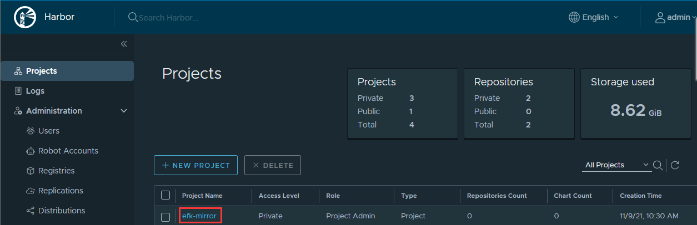

# 离线环境部署 OperatorHub

对于在受限网络中安装的 OpenShift Container Platform 集群（也称为 *断开连接的集群* ），Operator Lifecycle Manager(OLM)默认无法访问远程 registry 上托管的红帽提供的 OperatorHub 源，因为这些远程源需要足够的互联网连接。

但是，作为集群管理员，如果您有一个可以完全访问互联网的服务器，则仍然可以让集群在受限网络中使用 OLM。服务器需要访问互联网来拉取远程 OperatorHub 内容，用于准备远程源的本地镜像，并将内容推送到内网的镜像 registry。

内网的镜像 registry 可以位于完全隔离的网络环境中，只需要可移动介质物理将镜像内容转移到该环境中即可。

本指南描述了在受限网络中启用 OLM 所需的流程：

本指南描述了在受限网络中启用 OLM 所需的流程：

- 为 OLM 禁用默认远程 OperatorHub 源。
- 使用有完全互联网访问的服务器来创建并推送 OperatorHub 内容的本地镜像到镜像 registry。
- 将 OLM 配置为从内网镜像 registry 上的本地源而不是默认的远程源安装和管理 Operator。

 

## 前言

虽然 OLM 可以从本地源管理 Operator，但给定 Operator 在受限网络中能否成功运行仍取决于 Operator 本身。Operator 必须：

- 在 `ClusterServiceVersion` (CSV) 对象的 `relatedImages`参数中列出所有相关的镜像，或 Operator 执行时可能需要的其他容器镜像。
- 通过摘要 (SHA) 而不是标签来引用所有指定的镜像。

如需了解在断开连接的模式模中可以运行的 Operator 列表，请参阅以下红帽知识库文章：

https://access.redhat.com/articles/4740011


## 修改离线环境的配置

由于内网环境默认的market-place不可用，所以需要做一些修改替换成内部的。


### 禁用默认的 operatorhub 源

禁用默认的 operatorhub 源有两种方式，一种是命令行的方式禁用，一种是登录控制台界面点击禁用


命令行操作方式：

```bash
oc patch OperatorHub cluster --type json -p '[{"op": "add", "path": "/spec/disableAllDefaultSources", "value": true}]'
```


控制台操作方式：

From the **Administration** → **Cluster Settings** → **Global Configuration** → **OperatorHub** page, click the **Sources** tab, where you can create, delete, disable, and enable individual sources.

额外说明：点击单个 CatalogSource 后面的选项卡，是只能 disable 这个来源的，如果想要删除需要点击上面的 Action ，选择 delete 后才能删除。


## 裁剪 index image

对于 Operator ，官方会提供一个 index image，这个 image 里面包含了当前来源的所有 operator ，然后就可以根据这个 image 来完整的离线所有 operators，或者裁剪这个镜像，离线部分自己需要的 operator。

因为完整下载 redhat 官方所有的 operator 需要六七百G起步的空间，所以一般是按需求来裁剪镜像离线部分 operator 即可。

这里以离线 efk 部署需要的 operator 为例。


### 配置相关工具

裁剪镜像需要提前准备一些软件工具，例如 opm，grpcurl 等

- podman：1.9.3+
- opm：1.12.3+
- grpcurl

**注意**：必须要在能够使用 podman 的机器上进行，因为 opm 工具需要使用到 podman 去进行操作，否则会报错：

```
Error: error pulling image: . exec: "podman": executable file not found in $PATH
```


### 裁剪 image

#### 镜像仓库登录

登录 registry.redhat.io

```bash
~]# podman login registry.redhat.io
Username: username
Password:
Login Succeeded!
```

登录本地仓库

```bash
~]# podman login registry.ocp4.shinefire.com:8443
Username: admin
Password:
Login Succeeded!
```


#### 镜像索引获取

在不知道当前版本的 index image 中有哪些清单时，需要通过 grpcurl 工具去获取 index image 中包含的所有清单，用于后面的离线下载

1. 运行您要修剪容器中的源索引镜像。例如：

   ```terminal
   $ podman run -p50051:50051 \
       -it registry.redhat.io/redhat/redhat-operator-index:v4.8
   ```

   **输出示例**

   ```terminal
   Trying to pull registry.redhat.io/redhat/redhat-operator-index:v4.8...
   Getting image source signatures
   Copying blob ae8a0c23f5b1 done
   ...
   INFO[0000] serving registry                              database=/database/index.db port=50051
   ```

2. 在一个单独的终端会话中，使用 `grpcurl` 命令获取由索引提供的软件包列表：

   ```terminal
   $ grpcurl -plaintext localhost:50051 api.Registry/ListPackages > packages.out
   ```

3. 检查 `package.out` 文件，确定要保留在此列表中的哪个软件包名称。例如：

   **软件包列表片断示例**

   ```text
   ...
   {
     "name": "advanced-cluster-management"
   }
   ...
   {
     "name": "jaeger-product"
   }
   ...
   {
     "name": "quay-operator"
   }
   ...
   ```
   
4. 在您执行 `podman run` 命令的终端会话中，按 **Ctrl** 和 **C** 停止容器进程。


## 离线部署 OperatorHub


思路说明：

1. skopeo同步官方的operator-index到本地镜像仓库中，例如：

   ```bash
   skopeo copy \
       docker://registry.redhat.io/redhat/redhat-operator-index:v4.8 \
       docker://quay.io/wangzheng422/operator-catalog:redhat-${var_major_version}-$var_date

2. 如果有定制需求就对官方的index image进行裁剪，因为默认会有很多，如果你不想要那么多就裁剪掉一些，参考：https://docs.openshift.com/container-platform/4.8/operators/admin/olm-restricted-networks.html#olm-pruning-index-image_olm-restricted-networks

3. 使用 `oc image mirror` 命令将 index image 离线到本地镜像仓库中

4. 使用 `oc adm catalog mirror` 命令将所有镜像离线到本地

5. 将离线好的文件打包带到离线环境中

6. 再次使用 `oc adm catalog mirror` 命令将打包好的文件导入到离线环境中

 

## 离线 index image 到本地镜像仓库

裁剪镜像

```bash
~]# opm index prune \
   -f registry.redhat.io/redhat/redhat-operator-index:v4.8 \
   -p elasticsearch-operator,cluster-logging \
   -t registry.ocp4.shinefire.com:8443/my-operator/my-operator-index:v4.8-202111
```

推送镜像到镜像仓库

```bash
~]# podman push registry.ocp4.shinefire.com:8443/my-operator/my-operator-index:v4.8-202111
Getting image source signatures
Copying blob 6a1c42e146d1 done
Copying blob a527b6a8b991 done
Copying blob bc276c40b172 done
Copying blob 4e7f383eb531 done
Copying blob ffccc184ddfe done
Copying blob a98a386b6ec2 done
Copying config a811a16284 done
Writing manifest to image destination
Storing signatures
```


## 离线指定的 Operator 到本地目录下

创建保存用的目录

```bash
~]# mkdir /efk-mirror && cd /efk-mirror
```


指定裁剪后的镜像将需要的 operator 到本地

```bash
~]# oc adm catalog mirror \
-a /root/pull-secret.json \
registry.ocp4.shinefire.com:8443/my-operator/my-operator-index:v4.8-202111 \
file:///efk-mirror \
--insecure \
--index-filter-by-os='linux/amd64'
```


注意：pull-secret.json 需要配置好访问红帽官网和本地镜像仓库的账户，或者像之前一样提前两边登录应该也可以，暂未验证。


命令执行后的输出示例：

```bash
~]# oc adm catalog mirror -a /root/pull-secret.json \
> registry.ocp4.shinefire.com:8443/my-operator/my-operator-index:v4.8-202111 \
> file:///efk-mirror \
> --insecure \
> --index-filter-by-os='linux/amd64'
src image has index label for database path: /database/index.db
using database path mapping: /database/index.db:/tmp/213862001
wrote database to /tmp/213862001
using database at: /tmp/213862001/index.db
<dir>
  efk-mirror/my-operator/my-operator-index
    blobs:
      registry.ocp4.shinefire.com:8443/my-operator/my-operator-index sha256:3f64a6388cf7c7a07bb47425fd3e0ca8c1fc03ae41996d41feef2d28347935d7 169B
      registry.ocp4.shinefire.com:8443/my-operator/my-operator-index sha256:a811a16284ce6d50eb8adb1f48d6f19160cd204a83599129ddc2cd4cbe4c9b46 3.533KiB
      registry.ocp4.shinefire.com:8443/my-operator/my-operator-index sha256:06e6e09d4ea5dc8a1634d4fef335d56799636040d2a80f1124cab643efb1e96b 2.329MiB
      registry.ocp4.shinefire.com:8443/my-operator/my-operator-index sha256:f0eabd2439ac41f6c32888ed08f51728cf77b48693697271c67c0e05b656aa4f 2.765MiB
      registry.ocp4.shinefire.com:8443/my-operator/my-operator-index sha256:c7cff27ae683d5d52edbf1dbcd04d97bd7548c7d4aed1caaccaa3ba70d29ea08 3.746MiB
      registry.ocp4.shinefire.com:8443/my-operator/my-operator-index sha256:74087151adccc86b6d90da8fd50b61574c22fb4660d3ab11f8408084eb449131 13.14MiB
      registry.ocp4.shinefire.com:8443/my-operator/my-operator-index sha256:3dc2e7b1a65ce7e1126fb43b56ec84793c92a04de6948b8a22a31a2b118f8f54 16.17MiB
    manifests:
      sha256:d748e19f1b0dac872266ac74120ccb744192299377c042c422145806f64444ce -> v4.8-202111
...
info: Mirroring completed in 40ms (0B/s)
wrote mirroring manifests to manifests-my-operator-index-1636424076

To upload local images to a registry, run:

        oc adm catalog mirror file://efk-mirror/my-operator/my-operator-index:v4.8-202111 REGISTRY/REPOSITORY
```

**注意：**最后的输出结果中，提示的这条命令需要保存一下，用于后续导入到离线镜像仓库中使用。


打包离线后的镜像，用于后续转移到离线环境中使用

```bash
[root@mirror-ocp efk-mirror]# ls
manifests-my-operator-index-1636424076  v2
[root@mirror-ocp efk-mirror]# cd ../
[root@mirror-ocp /]# tar czvf efk-mirror.tar.gz efk-mirror/
```


## 导入离线的 Operator 到离线环境中

将之前离线后打包后的目录，上传到离线环境里可以访问内部镜像仓库的节点中，我这里是直接上传到了 bastion 机器中。

```bash
[root@bastion /]# ls /efk-mirror.tar.gz
/efk-mirror.tar.gz
```

解压压缩包

```bash
[root@bastion /]# tar xzvf efk-mirror.tar.gz
[root@bastion /]# ls /efk-mirror
manifests-my-operator-index-1636424076  v2
[root@bastion /]# cd efk-mirror/
```


登录内部镜像仓库

```bash
[root@bastion efk-mirror]# docker login registry.ocp4.shinefire.com:8443
Authenticating with existing credentials...
WARNING! Your password will be stored unencrypted in /root/.docker/config.json.
Configure a credential helper to remove this warning. See
https://docs.docker.com/engine/reference/commandline/login/#credentials-store

Login Succeeded
```


在内部镜像仓库创建一个用于报错离线好的 operator 的 project

这里创建了一个名为`efk-mirror`的 Project




导入离线包到内部镜像仓库中

```bash
~]# cd /efk-mirror/
~]# oc adm catalog mirror \
    file://efk-mirror/my-operator/my-operator-index:v4.8-202111 \
    registry.ocp4.shinefire.com:8443/efk-mirror
info: Mirroring completed in 1m19.09s (680.7kB/s)
no digest mapping available for file://efk-mirror/my-operator/my-operator-index:v4.8-202111, skip writing to ImageContentSourcePolicy
wrote mirroring manifests to manifests-my-operator/my-operator-index-1636602048
```

如果这一步导入报错，大概率就是因为离线的时候有问题，建议重新离线一次再来导入


导入完毕后会生成一个`manifest-xxx`文件

```bash
[root@bastion efk-mirror]# ls
manifests-my-operator  manifests-my-operator-index-1636424076  v2
[root@bastion efk-mirror]# tree manifests-my-operator/
manifests-my-operator/
└── my-operator-index-1636602048
    ├── catalogSource.yaml
    ├── imageContentSourcePolicy.yaml
    └── mapping.txt

1 directory, 3 files
```


## 配置自定义的 operatorhub

### 修改 catalogSource.yaml

在上面导入 operator 后生成的文件里面包含一个 `catalogSource.yaml` 文件，此文件是 `CatalogSource` 对象的基本定义，它预先填充索引镜像标签及其他相关元数据。此文件可原样使用，或进行相应修改来在集群中添加目录源。

但是因为前面是采用的离线到本地的方式进行的，所以该文件的 `metadata.name` 字段里面可能包含了 `/` 符号，这是需要删除的，否则后续的步骤中会失败并显示 "invalid resource name” 错误。

查看原文件：

```yaml
apiVersion: operators.coreos.com/v1alpha1
kind: CatalogSource
metadata:
  name: my-operator/my-operator-index
  namespace: openshift-marketplace
spec:
  image: registry.ocp4.shinefire.com:8443/efk-mirror/efk-mirror-my-operator-my-operator-index:v4.8-202111
  sourceType: grpc
```

修改后的文件：

```yaml
apiVersion: operators.coreos.com/v1alpha1
kind: CatalogSource
metadata:
  name: my-operator
  namespace: openshift-marketplace
spec:
  image: registry.ocp4.shinefire.com:8443/efk-mirror/efk-mirror-my-operator-my-operator-index:v4.8-202111
  sourceType: grpc
```


### 创建 imageContentSourcePolicy

根据需求可以修改 imageContentSourcePolicy.yaml 中定义的 name

```yaml
---
apiVersion: operator.openshift.io/v1alpha1
kind: ImageContentSourcePolicy
metadata:
  labels:
    operators.openshift.org/catalog: "true"
  name: my-operator
...
```

根据实际环境修改 imageContentSourcePolicy.yaml 中的镜像路径映射

默认的镜像映射路径，示例如下：

```bash
~]# tail -n6 imageContentSourcePolicy.yaml
  - mirrors:
    - registry.ocp4.shinefire.com:8443/efk-mirror/openshift4-ose-elasticsearch-operator-bundle
    source: efk-mirror/my-operator/my-operator-index/openshift4/ose-elasticsearch-operator-bundle
  - mirrors:
    - registry.ocp4.shinefire.com:8443/efk-mirror/openshift4-ose-elasticsearch-proxy
    source: efk-mirror/my-operator/my-operator-index/openshift4/ose-elasticsearch-proxy
```

因为是采用了离线到指定目录再上传到 openshift 离线环境中，所以导入时自动生成的 imageContentSourcePolicy 文件里面，source 字段是一个之前离线的目录，如果直接使用这个默认文件部署的话会导致后面在安装 operator 时无法将 operator 中默认的来自 registry.redhat.io 的镜像路径，映射到我们的内部镜像仓库中，从而导致超时失败。

修改后的文件，示例如下：

```bash
~]# sed -i 's#efk-mirror/my-operator/my-operator-index#registry.redhat.io#g' imageContentSourcePolicy.yaml
~]# tail -n6 imageContentSourcePolicy.yaml
  - mirrors:
    - registry.ocp4.shinefire.com:8443/efk-mirror/openshift4-ose-elasticsearch-operator-bundle
    source: registry.redhat.io/openshift4/ose-elasticsearch-operator-bundle
  - mirrors:
    - registry.ocp4.shinefire.com:8443/efk-mirror/openshift4-ose-elasticsearch-proxy
    source: registry.redhat.io/openshift4/ose-elasticsearch-proxy
```

**注意：**根据自己的实际环境来替换，可能你的 source 路径和镜像仓库路径和我的都不一样


运行以下命令指定清单目录中的 `imageContentSourcePolicy.yaml` 文件，创建 ImageContentSourcePolicy (ICSP)对象：

```bash
[root@bastion efk-mirror]# oc create -f manifests-my-operator/my-operator-index-1636602048/imageContentSourcePolicy.yaml
imagecontentsourcepolicy.operator.openshift.io/my-operator-my-operator-index-0 created
[root@bastion efk-mirror]# oc get imagecontentsourcepolicies.operator.openshift.io
NAME             AGE
image-policy-0   3d20h
image-policy-1   3d20h
my-operator      10s
```

**注意：**应用 ICSP 会导致集群中的所有 worker 节点重启。在继续操作前，您必须等待此重启过程完成每个 worker 节点的循环。

```bash
[root@bastion efk-mirror]# oc get nodes
NAME                          STATUS                     ROLES           AGE     VERSION
master-1.ocp4.shinefire.com   Ready                      master,worker   3d20h   v1.21.1+d8043e1
master-2.ocp4.shinefire.com   Ready                      master,worker   3d20h   v1.21.1+d8043e1
master-3.ocp4.shinefire.com   Ready,SchedulingDisabled   master,worker   3d19h   v1.21.1+d8043e1
```


## 离线指定的 Operator 到本地目录下

这个和离线 OpenShift4 安装镜像比较类似，需要先找一台能够联网的机器，指定需要的版本的 index 镜像，然后程序会根据 index 镜像中的镜像清单，一个个的离线到本地目录中，就可以打包用于后续放入到离线环境中导入到离线的 OpenShift 环境中使用了。

创建保存用的目录

```bash
[root@mirror-ocp ~]# mkdir -p /operatorhub/
```

使用 oc 命令离线所有的官方镜像，这个要等很久才会开始，先不要着急...

```bash
oc adm catalog mirror -a /root/pull-secret.json \
registry.redhat.io/redhat/redhat-operator-index:v4.8 \
file:///operatorhub \
--insecure \
--index-filter-by-os='linux/amd64' \
--max-components=5
```

命令执行后的输出示例：

```bash
[root@mirror-ocp ~]# oc adm catalog mirror \
> registry.redhat.io/redhat/redhat-operator-index:v4.8 \
> file:///operatorhub/redhat-operators -a /root/pull-secret.json \
> --insecure \
> --index-filter-by-os='linux/amd64'
src image has index label for database path: /database/index.db
using database path mapping: /database/index.db:/tmp/612318678
W1018 20:12:16.187983    3260 manifest.go:442] Chose linux/amd64 manifest from the manifest list.
wrote database to /tmp/612318678
using database at: /tmp/612318678/index.db
...
```


### 从 index image 中创建 catalog

创建一个 CatalogSource 类型的对象来引用 index image 资源。

进一步修改 catalogSource.yaml 文件内容

```yaml
apiVersion: operators.coreos.com/v1alpha1
kind: CatalogSource
metadata:
  name: my-operator-catalog
  namespace: openshift-marketplace
spec:
  image: registry.ocp4.shinefire.com:8443/efk-mirror/efk-mirror-my-operator-my-operator-index:v4.8-202111
  sourceType: grpc
  secrets:
  - "my-registry"
  displayName: My Operator Catalog
  publisher: redhat
```

参数说明：

- metadata.namespace：如果要设置为全局的，则使用 openshift-marketplace ，否则将限定在某一个指定的 ns 中使用
- spec.image：用默认的即可，从离线后的文件导入到镜像仓库中，会自动生成这么一个 index image 
- spec.secrets：这个字段一定要进行额外添加，并且把前面创建的 secret name 加入这里来做个指向，这样才可以在后面正常的使用这个 catalogsource
- spec.displayName：显示的名称，这个可以根据实际需要定义即可
- spec.publisher：发行商，这是个可选项，不过建议加上比较好一点，我这里就直接填了 redhat 官方


oc 命令创建资源

```bash
[root@bastion efk-mirror]# oc create -f manifests-my-operator/my-operator-index-1636602048/catalogSource.yaml
catalogsource.operators.coreos.com/my-operator-catalog created
[root@bastion efk-mirror]# oc get po -n openshift-marketplace
NAME                                    READY   STATUS    RESTARTS   AGE
marketplace-operator-64d88db5df-p9rkj   1/1     Running   0          104m
my-operator-catalog-24pnr               1/1     Running   0          32s
```


检查结果

```bash
~]# oc get pods -n openshift-marketplace
NAME                                    READY   STATUS    RESTARTS   AGE
marketplace-operator-64d88db5df-p9rkj   1/1     Running   0          104m
my-operator-catalog-24pnr               1/1     Running   0          59s

~]# oc get catalogsource -n openshift-marketplace
NAME                  DISPLAY               TYPE   PUBLISHER   AGE
my-operator-catalog   My Operator Catalog   grpc   redhat      72s

~]# oc get packagemanifest -n openshift-marketplace
NAME                     CATALOG               AGE
elasticsearch-operator   My Operator Catalog   80s
cluster-logging          My Operator Catalog   80s
```


## Q&A


Q1： 

离线镜像的时候参考的官方的离线到本地的命令来进行，但是最后出错误了，理论上是没有下载完全的，错误提示信息如下：

```
[root@mirror-ocp ~]# oc adm catalog mirror -a /root/pull-secret.json registry.redhat.io/redhat/redhat-operator-index:v4.8 file:///operatorhub --insecure --index-filter-by-os='linux/amd64'
...
sha256:88fd8428423fb5db2c8c3e757d7c8e8e627be4a8036321089f91ac2446dd0e50 file://operatorhub/redhat/redhat-operator-index/amq7/amq-online-1-standard-controller:46ad0df3
sha256:73627b56a996337effd0c35e1a73c12257492bb8ba0b3c0c6d0822392e085212 file://operatorhub/redhat/redhat-operator-index/amq7/amq-online-1-standard-controller:9b87761c
sha256:1e65603c267a572602d47f9d3ee01fec481c8d7b869de01e6112a148e0b7a3fc file://operatorhub/redhat/redhat-operator-index/fuse7/fuse-ignite-upgrade
sha256:5e3e9d565510c1a12351f89f912e21f318ee0d7ed52fc8cca6051a6dbf3a6e6d file://operatorhub/redhat/redhat-operator-index/fuse7/fuse-console-operator-bundle:fc35daa2
sha256:7e3ff1800f8fd8090b8d3d54816e30f0f737d548fc7ac3d920058f91ccbe7427 file://operatorhub/redhat/redhat-operator-index/openshift-gitops-1-tech-preview/gitops-rhel8-operator
sha256:8a5447d9bc05b2dbbc80a95319232fd730619e6173e7e09a865ca11cb20e9fab file://operatorhub/redhat/redhat-operator-index/openshift-gitops-1-tech-preview/gitops-rhel8-operator
sha256:e2e2c2455adc8e051482981e796a2f6be3dd7f763ab2271aa827887bd7e8ba00 file://operatorhub/redhat/redhat-operator-index/fuse7/fuse-ignite-upgrade:b371e8c7
sha256:c819f6d20d0e845d14dfb76e656c388f5239ff2620fcb7419592f1dccc933968 file://operatorhub/redhat/redhat-operator-index/openshift-gitops-1-tech-preview/gitops-rhel8-operator:fe037cb
sha256:67ea7fd20920d8b2397a37058f4d08c1b878a2b46bee9f38d086ea763d5f5bd1 file://operatorhub/redhat/redhat-operator-index/openshift-gitops-1-tech-preview/gitops-rhel8-operator:b96f9c3c
uploading: file://operatorhub/redhat/redhat-operator-index/openshift4/poison-pill-manager-rhel8-operator sha256:3d31a22f1fd5263f7233fb97b10ae1d3a6a6e3826bf72f5a1233651632fdae9d 19.71MiB
sha256:bb808e896f5a4fbaa681a350cfae4d848711d5719d89539783d4c7786eb8b817 file://operatorhub/redhat/redhat-operator-index/openshift4/poison-pill-manager-rhel8-operator
sha256:bb50656ebf36ef22fe180e38e55c49189037264a0c65ff69484e5c4174961ddf file://operatorhub/redhat/redhat-operator-index/openshift4/poison-pill-manager-rhel8-operator
sha256:9f13fdfa24273ac6a1d32b79a1cb38a55bde22a96356746a0fafe84306974ce4 file://operatorhub/redhat/redhat-operator-index/openshift4/poison-pill-manager-rhel8-operator:a1f10c90
sha256:58d3d4737dfc4c5184f6b6f15da87c914143cdfb729bdf7b3bf4df89a196077d file://operatorhub/redhat/redhat-operator-index/openshift4/poison-pill-manager-rhel8-operator:c438e87b

info: Mirroring completed in 14.21s (4.281MB/s)
error mirroring image: one or more errors occurred
wrote mirroring manifests to manifests-redhat-operator-index-1634594897

To upload local images to a registry, run:

        oc adm catalog mirror file://operatorhub/redhat/redhat-operator-index:v4.8 REGISTRY/REPOSITORY
```

A：

建议将 v2 目录和 manifest 目录都删除后重新同步，不然后面导入的时候可能也会有报错。

不过从我的实际遭遇来看，即使导入的时候报错了也可以在镜像仓库中正常的看到那些导入的镜像，但是至于后面会不会有其他坑不确定，请自行斟酌。


Q2：

离线 operator 的时候，遇到报错，看上去是在源位置，并没有找到指定的 layer ，导致离线出错了。

```
error: unable to copy layer sha256:ae7776707cca9412af407f1f84ccb74c1afbf5b5453d4dbe1eefed9b4b2b823d to file://efk-mirror/my-operator/my-operator-index/openshift-logging/kibana6-rhel8: rename v2/efk-mirror/my-operator/my-operator-index/openshift-logging/kibana6-rhel8/blobs/sha256:ae7776707cca9412af407f1f84ccb74c1afbf5b5453d4dbe1eefed9b4b2b823d.download v2/efk-mirror/my-operator/my-operator-index/openshift-logging/kibana6-rhel8/blobs/sha256:ae7776707cca9412af407f1f84ccb74c1afbf5b5453d4dbe1eefed9b4b2b823d: no such file or directory
error: unable to copy layer sha256:ed6ee657d49e14dc574507ea575b857343d444d423231c7f827ae0d3105b7937 to file://efk-mirror/my-operator/my-operator-index/openshift-logging/kibana6-rhel8: rename v2/efk-mirror/my-operator/my-operator-index/openshift-logging/kibana6-rhel8/blobs/sha256:ed6ee657d49e14dc574507ea575b857343d444d423231c7f827ae0d3105b7937.download v2/efk-mirror/my-operator/my-operator-index/openshift-logging/kibana6-rhel8/blobs/sha256:ed6ee657d49e14dc574507ea575b857343d444d423231c7f827ae0d3105b7937: no such file or directory
```

A：

最好还是删掉重新离线试试吧，猜测是官方的那个镜像存在一点问题或者是网络传输过程中出现了一些问题。


## References

- https://docs.openshift.com/container-platform/4.8/operators/admin/olm-restricted-networks.html#olm-pruning-index-image_olm-restricted-networks
- [Operator installation fails with "Bundle unpacking failed. Reason: DeadlineExceeded, and Message: Job was active longer than specified deadline"](https://access.redhat.com/solutions/6459071)

