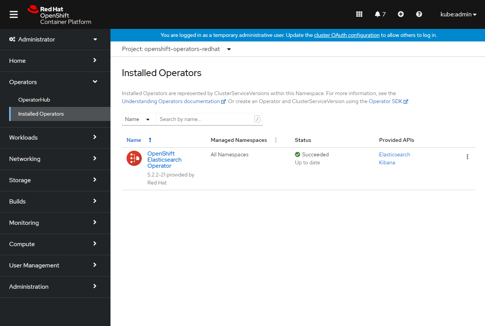
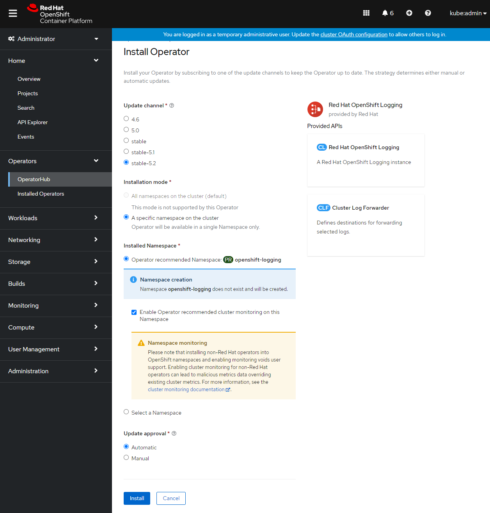
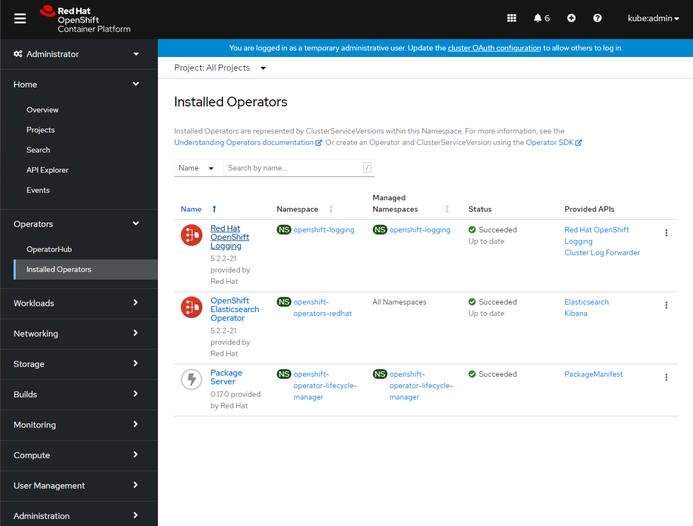
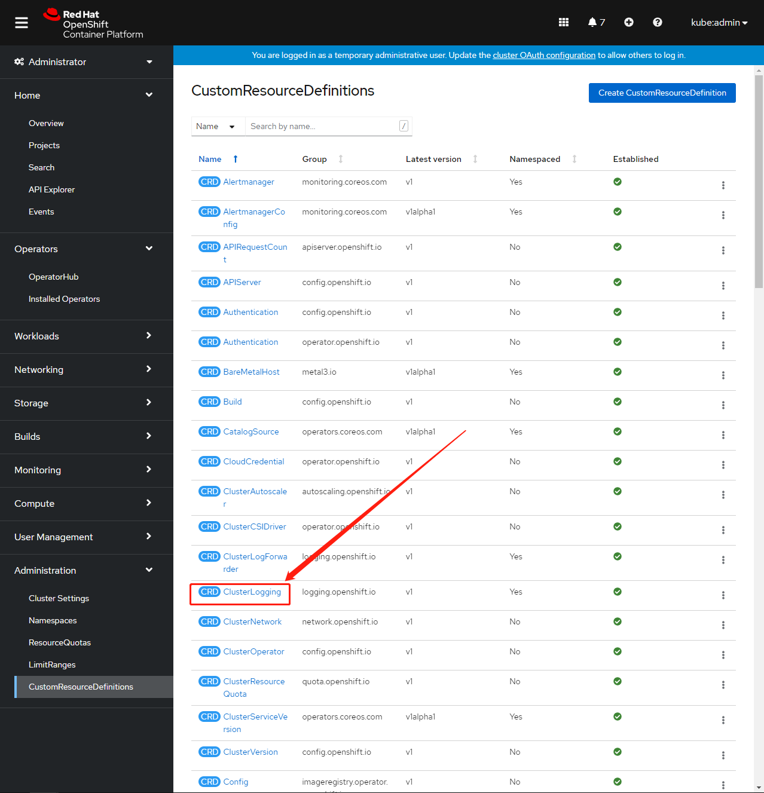
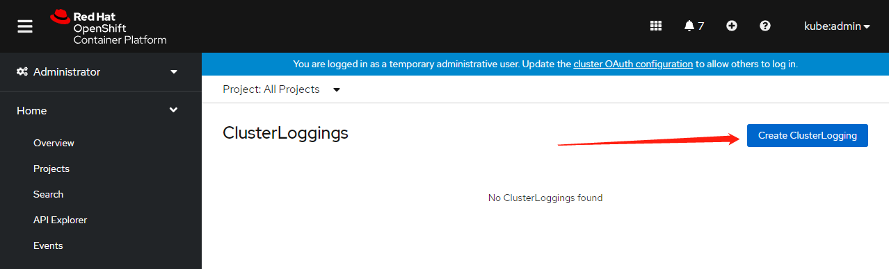

# OpenShift Deploy EFK


## 环境说明

OpenShift：4.8.12


## 安装 OpenShift Elasticsearch Operator

### 安装步骤文字说明

1. In the OpenShift Container Platform web console, click **Operators** → **OperatorHub**.
2. Choose **OpenShift Elasticsearch Operator** from the list of available Operators, and click **Install**.
3. Ensure that the **All namespaces on the cluster** is selected under **Installation Mode**.
4. Ensure that **openshift-operators-redhat** is selected under **Installed Namespace**.
   You must specify the `openshift-operators-redhat` namespace. The `openshift-operators` namespace might contain Community Operators, which are untrusted and could publish a metric with the same name as an OpenShift Container Platform metric, which would cause conflicts.
5. Select **Enable operator recommended cluster monitoring on this namespace**.
   This option sets the `openshift.io/cluster-monitoring: "true"` label in the Namespace object. You must select this option to ensure that cluster monitoring scrapes the `openshift-operators-redhat` namespace.
6. Select **stable-5.x** as the **Update Channel**.
7. Select an **Approval Strategy**.
   - The **Automatic** strategy allows Operator Lifecycle Manager (OLM) to automatically update the Operator when a new version is available.
   - The **Manual** strategy requires a user with appropriate credentials to approve the Operator update.
8. Click **Install**.
9. Verify that the OpenShift Elasticsearch Operator installed by switching to the **Operators** → **Installed Operators** page.
10. Ensure that **OpenShift Elasticsearch Operator** is listed in all projects with a **Status** of **Succeeded**.


### 图形操作步骤

进入到 OperatorHub 界面


点击"OpenShift Elasticsearch Operator"进行安装


点击"Install"进行安装，点击"Installed Operators"查看安装结果，等待状态变成"Succeeded"即可




## 安装 Red Hat OpenShift Logging Operator

### 安装步骤文字说明

1. In the OpenShift Container Platform web console, click **Operators** → **OperatorHub**.

2. Choose **Red Hat OpenShift Logging** from the list of available Operators, and click **Install**.

3. Ensure that the **A specific namespace on the cluster** is selected under **Installation Mode**.

4. Ensure that **Operator recommended namespace** is **openshift-logging** under **Installed Namespace**.

5. Select **Enable operator recommended cluster monitoring on this namespace**.

   This option sets the `openshift.io/cluster-monitoring: "true"` label in the Namespace object. You must select this option to ensure that cluster monitoring scrapes the `openshift-logging` namespace.

6. Select **stable-5.x** as the **Update Channel**.

7. Select an **Approval Strategy**.

   - The **Automatic** strategy allows Operator Lifecycle Manager (OLM) to automatically update the Operator when a new version is available.
   - The **Manual** strategy requires a user with appropriate credentials to approve the Operator update.

8. Click **Install**.

9. Verify that the Red Hat OpenShift Logging Operator installed by switching to the **Operators** → **Installed Operators** page.

10. Ensure that **Red Hat OpenShift Logging** is listed in the **openshift-logging** project with a **Status** of **Succeeded**.

    If the Operator does not appear as installed, to troubleshoot further:

    - Switch to the **Operators** → **Installed Operators** page and inspect the **Status** column for any errors or failures.
    - Switch to the **Workloads** → **Pods** page and check the logs in any pods in the `openshift-logging` project that are reporting issues.


### 图形操作步骤

进入到 OperatorHub 界面


点击 "Red Hat OpenShift Logging" 进去点击 "Install"，进入安装选项界面勾选下面这些选项




点击 "Install" 进行 operator 的安装，等待安装完成


也可以在 "Installed Operators" 界面查看结果




## 创建 OpenShift Logging 实例

### 安装步骤

切换到 **Administration** → **Custom Resource Definitions** 界面，点击 **ClusterLogging**




到详情页之后，再到 **Action** 菜单栏选择 **View Instances**


点击 **Create ClusterLogging**




在编辑器代码框填写代码，示例：

```yaml
apiVersion: "logging.openshift.io/v1"
kind: "ClusterLogging"
metadata:
  name: "instance" 
  namespace: "openshift-logging"
spec:
  managementState: "Managed"  
  logStore:
    type: "elasticsearch"  
    retentionPolicy: 
      application:
        maxAge: 1d
      infra:
        maxAge: 7d
      audit:
        maxAge: 7d
    elasticsearch:
      nodeCount: 3 
      storage:
        storageClassName: "nfs-csi" 
        size: 200G
      resources: 
          limits:
            memory: "16Gi"
          requests:
            memory: "16Gi"
      proxy: 
        resources:
          limits:
            memory: 256Mi
          requests:
            memory: 256Mi
      redundancyPolicy: "SingleRedundancy"
  visualization:
    type: "kibana"  
    kibana:
      replicas: 1
  collection:
    logs:
      type: "fluentd"  
      fluentd: {}
```

部分参数说明：


代码填写完毕后点击 **Create** 创建，这将创建 OpenShift Logging 组件、Elasticsearch 自定义资源和组件以及 Kibana 界面。


### 检查安装结果

切换到 **Workloads** → **Pods** 界面


## Q&A

Q1：

在安装 Elasticsearch Operator 的时候遇到报错：

在拉取镜像的时候，集群尝试去公网官方地址拉取镜像，从而导致 pull image 失败。

```
Failed to pull image "registry.redhat.io/openshift-logging/elasticsearch-operator-bundle@sha256:6e05a9f3f276f1679d4b18a6e105b2222cefc1710ae7d54b46f00f86cca344c1": rpc error: code = Unknown desc = error pinging docker registry registry.redhat.io: Get "https://registry.redhat.io/v2/": dial tcp: lookup registry.redhat.io on 192.168.31.100:53: server misbehaving
```

全部日志如下：

```bash
[root@bastion efk-mirror]# oc project openshift-marketplace
Now using project "openshift-marketplace" on server "https://api.ocp4.shinefire.com:6443".
[root@bastion efk-mirror]# oc get events
LAST SEEN   TYPE      REASON                         OBJECT                                                                MESSAGE
7m21s       Normal    SuccessfulCreate               job/a0d5082e2af00511c8ff1c5cefa240ac2f27b216bfe4acb8e74e0b06eafc06e   Created pod: a0d5082e2af00511c8ff1c5cefa240ac2f27b216bfe4acb8e74e0b06eaps26q
2m43s       Normal    SuccessfulCreate               job/a0d5082e2af00511c8ff1c5cefa240ac2f27b216bfe4acb8e74e0b06eafc06e   Created pod: a0d5082e2af00511c8ff1c5cefa240ac2f27b216bfe4acb8e74e0b06ealh5bt
2m43s       Normal    Scheduled                      pod/a0d5082e2af00511c8ff1c5cefa240ac2f27b216bfe4acb8e74e0b06ealh5bt   Successfully assigned openshift-marketplace/a0d5082e2af00511c8ff1c5cefa240ac2f27b216bfe4acb8e74e0b06ealh5bt to master-1.ocp4.shinefire.com
2m42s       Normal    AddedInterface                 pod/a0d5082e2af00511c8ff1c5cefa240ac2f27b216bfe4acb8e74e0b06ealh5bt   Add eth0 [10.254.0.22/24] from openshift-sdn
2m42s       Normal    Pulled                         pod/a0d5082e2af00511c8ff1c5cefa240ac2f27b216bfe4acb8e74e0b06ealh5bt   Container image "quay.io/openshift-release-dev/ocp-v4.0-art-dev@sha256:e3ad8432b849ce6785a8de6e2e079031a5a20c90a646ba239f8b844045b9280b" already present on machine
2m42s       Normal    Created                        pod/a0d5082e2af00511c8ff1c5cefa240ac2f27b216bfe4acb8e74e0b06ealh5bt   Created container util
2m42s       Normal    Started                        pod/a0d5082e2af00511c8ff1c5cefa240ac2f27b216bfe4acb8e74e0b06ealh5bt   Started container util
69s         Normal    Pulling                        pod/a0d5082e2af00511c8ff1c5cefa240ac2f27b216bfe4acb8e74e0b06ealh5bt   Pulling image "registry.redhat.io/openshift-logging/elasticsearch-operator-bundle@sha256:6e05a9f3f276f1679d4b18a6e105b2222cefc1710ae7d54b46f00f86cca344c1"
69s         Warning   Failed                         pod/a0d5082e2af00511c8ff1c5cefa240ac2f27b216bfe4acb8e74e0b06ealh5bt   Failed to pull image "registry.redhat.io/openshift-logging/elasticsearch-operator-bundle@sha256:6e05a9f3f276f1679d4b18a6e105b2222cefc1710ae7d54b46f00f86cca344c1": rpc error: code = Unknown desc = error pinging docker registry registry.redhat.io: Get "https://registry.redhat.io/v2/": dial tcp: lookup registry.redhat.io on 192.168.31.100:53: server misbehaving
69s         Warning   Failed                         pod/a0d5082e2af00511c8ff1c5cefa240ac2f27b216bfe4acb8e74e0b06ealh5bt   Error: ErrImagePull
84s         Normal    BackOff                        pod/a0d5082e2af00511c8ff1c5cefa240ac2f27b216bfe4acb8e74e0b06ealh5bt   Back-off pulling image "registry.redhat.io/openshift-logging/elasticsearch-operator-bundle@sha256:6e05a9f3f276f1679d4b18a6e105b2222cefc1710ae7d54b46f00f86cca344c1"
84s         Warning   Failed                         pod/a0d5082e2af00511c8ff1c5cefa240ac2f27b216bfe4acb8e74e0b06ealh5bt   Error: ImagePullBackOff
7m22s       Normal    Scheduled                      pod/a0d5082e2af00511c8ff1c5cefa240ac2f27b216bfe4acb8e74e0b06eaps26q   Successfully assigned openshift-marketplace/a0d5082e2af00511c8ff1c5cefa240ac2f27b216bfe4acb8e74e0b06eaps26q to master-1.ocp4.shinefire.com
7m19s       Normal    AddedInterface                 pod/a0d5082e2af00511c8ff1c5cefa240ac2f27b216bfe4acb8e74e0b06eaps26q   Add eth0 [10.254.0.21/24] from openshift-sdn
7m19s       Normal    Pulled                         pod/a0d5082e2af00511c8ff1c5cefa240ac2f27b216bfe4acb8e74e0b06eaps26q   Container image "quay.io/openshift-release-dev/ocp-v4.0-art-dev@sha256:e3ad8432b849ce6785a8de6e2e079031a5a20c90a646ba239f8b844045b9280b" already present on machine
7m19s       Normal    Created                        pod/a0d5082e2af00511c8ff1c5cefa240ac2f27b216bfe4acb8e74e0b06eaps26q   Created container util
7m19s       Normal    Started                        pod/a0d5082e2af00511c8ff1c5cefa240ac2f27b216bfe4acb8e74e0b06eaps26q   Started container util
5m49s       Normal    Pulling                        pod/a0d5082e2af00511c8ff1c5cefa240ac2f27b216bfe4acb8e74e0b06eaps26q   Pulling image "registry.redhat.io/openshift-logging/elasticsearch-operator-bundle@sha256:6e05a9f3f276f1679d4b18a6e105b2222cefc1710ae7d54b46f00f86cca344c1"
5m49s       Warning   Failed                         pod/a0d5082e2af00511c8ff1c5cefa240ac2f27b216bfe4acb8e74e0b06eaps26q   Failed to pull image "registry.redhat.io/openshift-logging/elasticsearch-operator-bundle@sha256:6e05a9f3f276f1679d4b18a6e105b2222cefc1710ae7d54b46f00f86cca344c1": rpc error: code = Unknown desc = error pinging docker registry registry.redhat.io: Get "https://registry.redhat.io/v2/": dial tcp: lookup registry.redhat.io on 192.168.31.100:53: server misbehaving
5m49s       Warning   Failed                         pod/a0d5082e2af00511c8ff1c5cefa240ac2f27b216bfe4acb8e74e0b06eaps26q   Error: ErrImagePull
6m3s        Normal    BackOff                        pod/a0d5082e2af00511c8ff1c5cefa240ac2f27b216bfe4acb8e74e0b06eaps26q   Back-off pulling image "registry.redhat.io/openshift-logging/elasticsearch-operator-bundle@sha256:6e05a9f3f276f1679d4b18a6e105b2222cefc1710ae7d54b46f00f86cca344c1"
6m3s        Warning   Failed                         pod/a0d5082e2af00511c8ff1c5cefa240ac2f27b216bfe4acb8e74e0b06eaps26q   Error: ImagePullBackOff
54m         Normal    Scheduled                      pod/my-operator-catalog-tjzwg                                         Successfully assigned openshift-marketplace/my-operator-catalog-tjzwg to master-1.ocp4.shinefire.com
54m         Normal    AddedInterface                 pod/my-operator-catalog-tjzwg                                         Add eth0 [10.254.0.20/24] from openshift-sdn
54m         Normal    Pulling                        pod/my-operator-catalog-tjzwg                                         Pulling image "registry.ocp4.shinefire.com:8443/efk-mirror/efk-mirror-my-operator-my-operator-index:v4.8-202111"
54m         Normal    Pulled                         pod/my-operator-catalog-tjzwg                                         Successfully pulled image "registry.ocp4.shinefire.com:8443/efk-mirror/efk-mirror-my-operator-my-operator-index:v4.8-202111" in 73.912916ms
54m         Normal    Created                        pod/my-operator-catalog-tjzwg                                         Created container registry-server
54m         Normal    Started                        pod/my-operator-catalog-tjzwg                                         Started container registry-server
55m         Normal    Scheduled                      pod/my-operator-trgfr                                                 Successfully assigned openshift-marketplace/my-operator-trgfr to master-1.ocp4.shinefire.com
55m         Normal    AddedInterface                 pod/my-operator-trgfr                                                 Add eth0 [10.254.0.18/24] from openshift-sdn
55m         Normal    Scheduled                      pod/my-operator-xgbrs                                                 Successfully assigned openshift-marketplace/my-operator-xgbrs to master-1.ocp4.shinefire.com
55m         Normal    AddedInterface                 pod/my-operator-xgbrs                                                 Add eth0 [10.254.0.19/24] from openshift-sdn
55m         Normal    Pulling                        pod/my-operator-xgbrs                                                 Pulling image "registry.ocp4.shinefire.com:8443/efk-mirror/efk-mirror-my-operator-my-operator-index:v4.8-202111"
55m         Normal    Pulled                         pod/my-operator-xgbrs                                                 Successfully pulled image "registry.ocp4.shinefire.com:8443/efk-mirror/efk-mirror-my-operator-my-operator-index:v4.8-202111" in 3.203093796s
55m         Normal    Created                        pod/my-operator-xgbrs                                                 Created container registry-server
55m         Normal    Started                        pod/my-operator-xgbrs                                                 Started container registry-server
54m         Normal    Killing                        pod/my-operator-xgbrs                                                 Stopping container registry-server
55m         Warning   FailedToUpdateEndpointSlices   service/my-operator                                                   Error updating Endpoint Slices for Service openshift-marketplace/my-operator: failed to delete my-operator-7nkxl EndpointSlice for Service openshift-marketplace/my-operator: endpointslices.discovery.k8s.io "my-operator-7nkxl" not found
54m         Warning   FailedToUpdateEndpoint         endpoints/my-operator                                                 Failed to update endpoint openshift-marketplace/my-operator: Operation cannot be fulfilled on endpoints "my-operator": StorageError: invalid object, Code: 4, Key: /kubernetes.io/services/endpoints/openshift-marketplace/my-operator, ResourceVersion: 0, AdditionalErrorMsg: Precondition failed: UID in precondition: 244f1703-96a6-4b4b-ab19-20ad7de70e19, UID in object meta:
```

A：


Q2：

安装Elasticsearch Operator的时候，还是会一直去尝试在官网拉取镜像，发现如下message

```
unpack job not completed: Unpack pod(openshift-marketplace/a0d5082e2af00511c8ff1c5cefa240ac2f27b216bfe4acb8e74e0b06eaz8p7p) container(pull) is pending. Reason: ErrImagePull, Message: rpc error: code = Unknown desc = error pinging docker registry registry.redhat.io: Get "https://registry.redhat.io/v2/": dial tcp:lookup registry.redhat.io on 192.168.31.100:53: server misbehaving
```

Bundle unpacking failed. Reason: DeadlineExceeded, and Message: Job was

​    active longer than specified deadline


bundle contents have not yet been persisted to installplan status


Q3：

创建 Instance 的时候，遇到不能正常启动的情况

```bash
~]# oc get po
NAME                                            READY   STATUS             RESTARTS   AGE
cluster-logging-operator-57f8bbc44-gm78r        1/1     Running            0          4h25m
elasticsearch-cdm-eewku96v-1-5968656988-269pf   1/2     CrashLoopBackOff   5          6m13s
elasticsearch-cdm-eewku96v-2-597bb54db7-s2r59   1/2     CrashLoopBackOff   5          6m12s
elasticsearch-cdm-eewku96v-3-6d4d47ff4b-rfncd   1/2     CrashLoopBackOff   5          6m11s
fluentd-4wctn                                   0/2     Init:0/1           4          6m12s
fluentd-tdx4r                                   0/2     Init:0/1           4          6m12s
fluentd-vkl78                                   0/2     Init:0/1           4          6m12s
kibana-7f74b8cb89-492sb                         2/2     Running            0          6m10s
```

A：

发现 elasticsearch cdm 的 pod 里面有如下一些报错

```
[2021-11-15 13:33:11,135][INFO ][container.run            ] Removing unnecessary JKS files
[2021-11-15 13:33:11,142][INFO ][container.run            ] Checking if Elasticsearch is ready
[2021-11-15 13:33:11,142][INFO ][container.run            ] Setting heap dump location /elasticsearch/persistent/heapdump.hprof
[2021-11-15 13:33:11,145][INFO ][container.run            ] ES_JAVA_OPTS: ' -Xms128m -Xmx128m -XX:HeapDumpPath=/elasticsearch/persistent/heapdump.hprof -Xlog:gc*,gc+age=trace,safepoint:file=/elasticsearch/persistent/elasticsearch/logs/gc.log:utctime,pid,tags:filecount=8,filesize=64m -XX:ErrorFile=/elasticsearch/persistent/elasticsearch/logs/error.log -Djdk.tls.ephemeralDHKeySize=2048 -Des.cgroups.hierarchy.override=/ -Dlog4j2.configurationFile=/usr/share/java/elasticsearch/config/log4j2.properties'
mkdir: cannot create directory '/elasticsearch/persistent/elasticsearch': Permission denied
```

另外又 describe 看了一些 pod ，发现又提示了我节点内存不够的报错

```
Events:
  Type     Reason            Age                From               Message
  ----     ------            ----               ----               -------
  Warning  FailedScheduling  8m11s              default-scheduler  0/3 nodes are available: 3 pod has unbound immediate PersistentVolumeClaims.
  Warning  FailedScheduling  4m5s               default-scheduler  0/3 nodes are available: 1 Insufficient cpu, 3 Insufficient memory.
  Warning  FailedScheduling  5s (x9 over 8m9s)  default-scheduler  0/3 nodes are available: 3 Insufficient memory.
```

估计原因大概就是因为这个造成的，但是我后来有尝试过降低 request 的资源数量，也似乎没能够成功。暂时放一下，还没时间继续测试，要先睡觉...

和官方这个solution描述的极其类似：https://access.redhat.com/solutions/4431881

