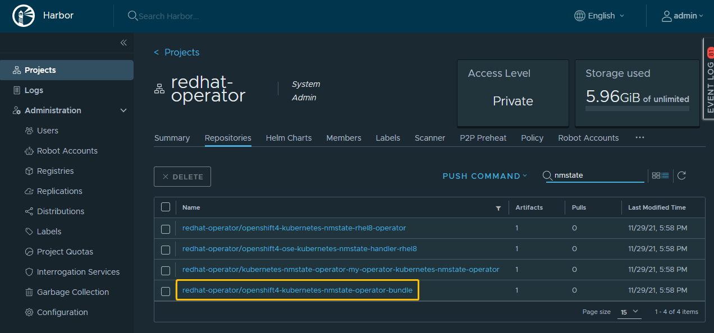
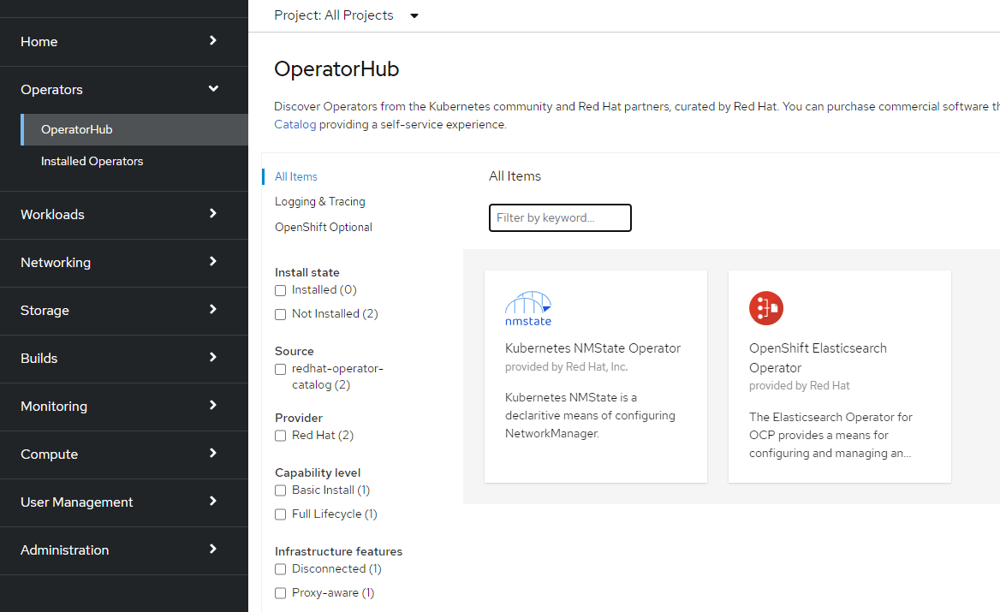

# Update OperatorHub

> 在管理 OperatorHub 的时候，在第一次离线导入了一些需要的 operator 之后，可能还会陆续需要离线导入添加一些需要的operator或者删除一些不再需要的operator，这时候就需要对涉及到一些更新的操作，本章主要是以 kubernetes-nmstate-operator 这个 operator 为例，描述如何来对 operatorhub 中的 operator 进行增删操作。


## 导入 operator 离线包到镜像仓库

这一步具体操作可以参考：[离线部署OperatorHub.md](../Deployment/离线部署OperatorHub.md)


以下为 `Kubernetes NMState Operator` 参考：

解压压缩包

```bash
[root@bastion home]# tar xzvf kubernetes-nmstate-operator.tar.gz
```


进入解压后的目录，将 operator 导入到离线环境的镜像仓库中

```bash
[root@bastion home]# cd kubernetes-nmstate-operator/
[root@bastion kubernetes-nmstate-operator]# ls
command  manifests-kubernetes-nmstate-operator-1638178023  v2
[root@bastion kubernetes-nmstate-operator]# cat command
oc adm catalog mirror file://kubernetes-nmstate-operator/my-operator/kubernetes-nmstate-operator:v4.8-202111 REGISTRY/REPOSITORY
[root@bastion kubernetes-nmstate-operator]# oc adm catalog mirror \
    file://kubernetes-nmstate-operator/my-operator/kubernetes-nmstate-operator:v4.8-202111 \
    registry.ocp4.shinefire.com:8443/redhat-operator \
    -a /root/registry-secret.json \
    --insecure \
    --index-filter-by-os='linux/amd64'
```

> 注意：command 文件是我在离线完成后，将输出的命令保存起来了，用于后续导入的时候方便查看


##  更新 index image

在新导入的 kubernetes-nmstate-operator 中，可以在镜像仓库里面看到是存在一个名称结尾为 bundle 的镜像，先记录这个镜像名称




找到需要导入的 operator 的已存在 index image ，例如我当前环境中 redhat-operator 的 index image 如下


更新已存在的 index image

```bash
opm index add \
    --bundles <registry>/<namespace>/<new_bundle_image>@sha256:<digest> \
    --from-index <registry>/<namespace>/<existing_index_image>:<tag> \
    --tag <registry>/<namespace>/<existing_index_image>:<tag>
```


以添加新导入的 kubernetes-nmstate-operator 的 bundle 为例，命令如下

```bash
opm index add \
    --bundles registry.ocp4.shinefire.com:8443/redhat-operator/openshift4-kubernetes-nmstate-operator-bundle@sha256:b4e1c2a9c3bc00cdaadeeffe1e750d5f0d96455150770fb4658cabe14f426f03 \
    --from-index registry.ocp4.shinefire.com:8443/redhat-operator/redhat-operator-my-operator-redhat-operator-index:v4.8-202111 \
    --tag registry.ocp4.shinefire.com:8443/redhat-operator/redhat-operator-my-operator-redhat-operator-index:v4.8-20211129 \
    -c podman
```

> 注意：
>
> --tag 指定的新的 index image 的 tag ，自定义命名即可，建议可以考虑使用当前日期来命名
>
> -c 选项指定与容器镜像交互的工具，如果当前系统中安装的是docker就指定docker，podman就指定podman，建议添加此参数，实际测试如果没有添加此参数在某些环境下会报错无法成功构建新的镜像


将新生成的镜像 push 到镜像仓库中

```bash
[root@bastion ~]# docker push registry.ocp4.shinefire.com:8443/redhat-operator/redhat-operator-my-operator-redhat-operator-index:v4.8-20211129
The push refers to repository [registry.ocp4.shinefire.com:8443/redhat-operator/redhat-operator-my-operator-redhat-operator-index]
0c36dd5f40ea: Pushed
86aadf4df7dc: Layer already exists
b15904f6a114: Layer already exists
a98a386b6ec2: Layer already exists
4e7f383eb531: Layer already exists
bc276c40b172: Layer already exists
v4.8-20211129: digest: sha256:53f393d8d1b73828a7814c670ad2d30946c5c35b570e9d2dcf84ddc86b64574c size: 1581
```


## 更新 imageContentSourcePolicy

查看新增 operator 的 imageContentSourcePolicy

```bash
[root@bastion kubernetes-nmstate-operator-1638179916]# pwd
/home/kubernetes-nmstate-operator/manifests-my-operator/kubernetes-nmstate-operator-1638179916
[root@bastion kubernetes-nmstate-operator-1638179916]# cat imageContentSourcePolicy.yaml
---
apiVersion: operator.openshift.io/v1alpha1
kind: ImageContentSourcePolicy
metadata:
  labels:
    operators.openshift.org/catalog: "true"
  name: my-operator-kubernetes-nmstate-operator-0
spec:
  repositoryDigestMirrors:
  - mirrors:
    - registry.ocp4.shinefire.com:8443/redhat-operator/openshift4-kubernetes-nmstate-operator-bundle
    source: kubernetes-nmstate-operator/my-operator/kubernetes-nmstate-operator/openshift4/kubernetes-nmstate-operator-bundle
  - mirrors:
    - registry.ocp4.shinefire.com:8443/redhat-operator/openshift4-kubernetes-nmstate-rhel8-operator
    source: kubernetes-nmstate-operator/my-operator/kubernetes-nmstate-operator/openshift4/kubernetes-nmstate-rhel8-operator
  - mirrors:
    - registry.ocp4.shinefire.com:8443/redhat-operator/openshift4-ose-kubernetes-nmstate-handler-rhel8
    source: kubernetes-nmstate-operator/my-operator/kubernetes-nmstate-operator/openshift4/ose-kubernetes-nmstate-handler-rhel8
```


因为是采用了离线到指定目录再上传到 openshift 离线环境中，所以导入时自动生成的 imageContentSourcePolicy 文件里面，source 字段是一个之前离线的目录，如果直接使用这个默认文件部署的话会导致后面在安装 operator 时无法将 operator 中默认的来自 registry.redhat.io 的镜像路径，映射到我们的内部镜像仓库中，从而导致超时失败。

修改后的文件，示例如下：

```bash
[root@bastion kubernetes-nmstate-operator-1638179916]# sed -i 's#kubernetes-nmstate-operator/my-operator/kubernetes-nmstate-operator#registry.redhat.io#g' imageContentSourcePolicy.yaml
[root@bastion kubernetes-nmstate-operator-1638179916]# cat imageContentSourcePolicy.yaml
---
apiVersion: operator.openshift.io/v1alpha1
kind: ImageContentSourcePolicy
metadata:
  labels:
    operators.openshift.org/catalog: "true"
  name: my-operator-kubernetes-nmstate-operator-0
spec:
  repositoryDigestMirrors:
  - mirrors:
    - registry.ocp4.shinefire.com:8443/redhat-operator/openshift4-kubernetes-nmstate-operator-bundle
    source: registry.redhat.io/openshift4/kubernetes-nmstate-operator-bundle
  - mirrors:
    - registry.ocp4.shinefire.com:8443/redhat-operator/openshift4-kubernetes-nmstate-rhel8-operator
    source: registry.redhat.io/openshift4/kubernetes-nmstate-rhel8-operator
  - mirrors:
    - registry.ocp4.shinefire.com:8443/redhat-operator/openshift4-ose-kubernetes-nmstate-handler-rhel8
    source: registry.redhat.io/openshift4/ose-kubernetes-nmstate-handler-rhel8
```


记录新增 operator 的当前所有 spec.repositoryDigestMirrors，即

```yaml
  - mirrors:
    - registry.ocp4.shinefire.com:8443/redhat-operator/openshift4-kubernetes-nmstate-operator-bundle
    source: registry.redhat.io/openshift4/kubernetes-nmstate-operator-bundle
  - mirrors:
    - registry.ocp4.shinefire.com:8443/redhat-operator/openshift4-kubernetes-nmstate-rhel8-operator
    source: registry.redhat.io/openshift4/kubernetes-nmstate-rhel8-operator
  - mirrors:
    - registry.ocp4.shinefire.com:8443/redhat-operator/openshift4-ose-kubernetes-nmstate-handler-rhel8
    source: registry.redhat.io/openshift4/ose-kubernetes-nmstate-handler-rhel8
```


将新增 operator 的所有 spec.repositoryDigestMirrors 添加到当前需要使用的 imageContentSourcePolicy 文件中

```bash
[root@bastion redhat-operator-index-1638174014]# pwd
/home/redhat-operator/manifests-my-operator/redhat-operator-index-1638174014
[root@bastion redhat-operator-index-1638174014]# ls imageContentSourcePolicy.yaml
imageContentSourcePolicy.yaml
[root@bastion redhat-operator-index-1638174014]# vim imageContentSourcePolicy.yaml
[root@bastion redhat-operator-index-1638174014]# tail -n9 imageContentSourcePolicy.yaml
  - mirrors:
    - registry.ocp4.shinefire.com:8443/redhat-operator/openshift4-kubernetes-nmstate-operator-bundle
    source: registry.redhat.io/openshift4/kubernetes-nmstate-operator-bundle
  - mirrors:
    - registry.ocp4.shinefire.com:8443/redhat-operator/openshift4-kubernetes-nmstate-rhel8-operator
    source: registry.redhat.io/openshift4/kubernetes-nmstate-rhel8-operator
  - mirrors:
    - registry.ocp4.shinefire.com:8443/redhat-operator/openshift4-ose-kubernetes-nmstate-handler-rhel8
    source: registry.redhat.io/openshift4/ose-kubernetes-nmstate-handler-rhel8
```


更新 imageContentSourcePolicy 

```bash
[root@bastion redhat-operator-index-1638174014]# oc replace -f imageContentSourcePolicy.yaml
imagecontentsourcepolicy.operator.openshift.io/redhat-operator replaced
```


## 更新 catalog

修改 catalog 指定新的镜像

```bash
[root@bastion redhat-operator-index-1638174014]# pwd
/home/redhat-operator/manifests-my-operator/redhat-operator-index-1638174014
[root@bastion redhat-operator-index-1638174014]# vim catalogSource.yaml
[root@bastion redhat-operator-index-1638174014]# cat catalogSource.yaml
apiVersion: operators.coreos.com/v1alpha1
kind: CatalogSource
metadata:
  name: redhat-operator-catalog
  namespace: openshift-marketplace
spec:
  image: registry.ocp4.shinefire.com:8443/redhat-operator/redhat-operator-my-operator-redhat-operator-index:v4.8-20211129
  sourceType: grpc
```


replace 更新 catalog

```bash
~]# oc replace -f catalogSource.yaml
catalogsource.operators.coreos.com/redhat-operator-catalog replaced
~]# oc get packagemanifest -n openshift-marketplace
NAME                          CATALOG   AGE
kubernetes-nmstate-operator             16h
elasticsearch-operator                  16h
```


## 检查更新后的结果

也可以在 web 端查看新增后的结果，可以看到 `Kubernetes NMState Operator` 已成功添加



