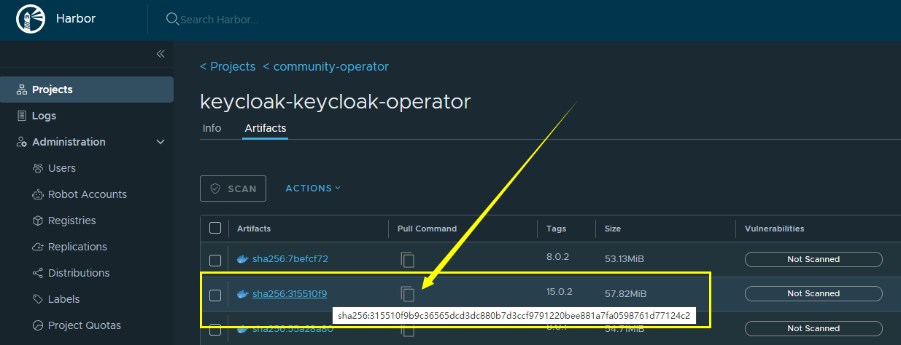
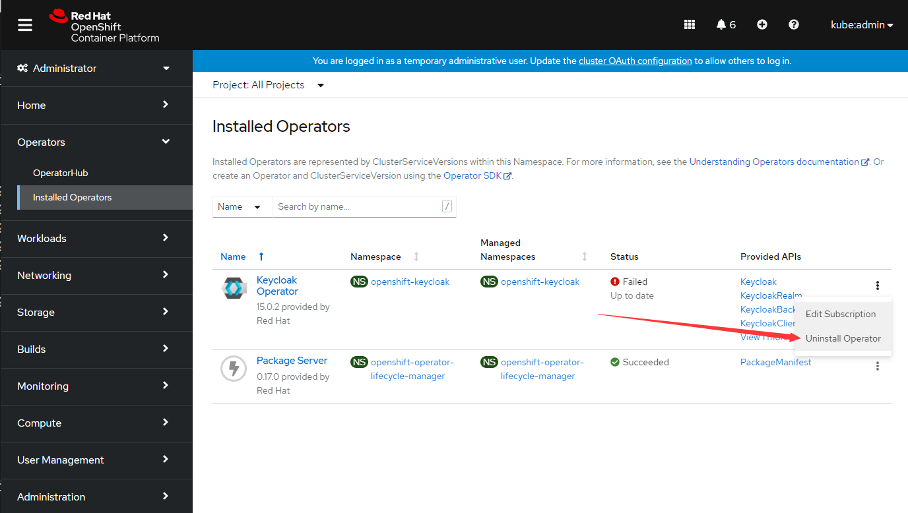
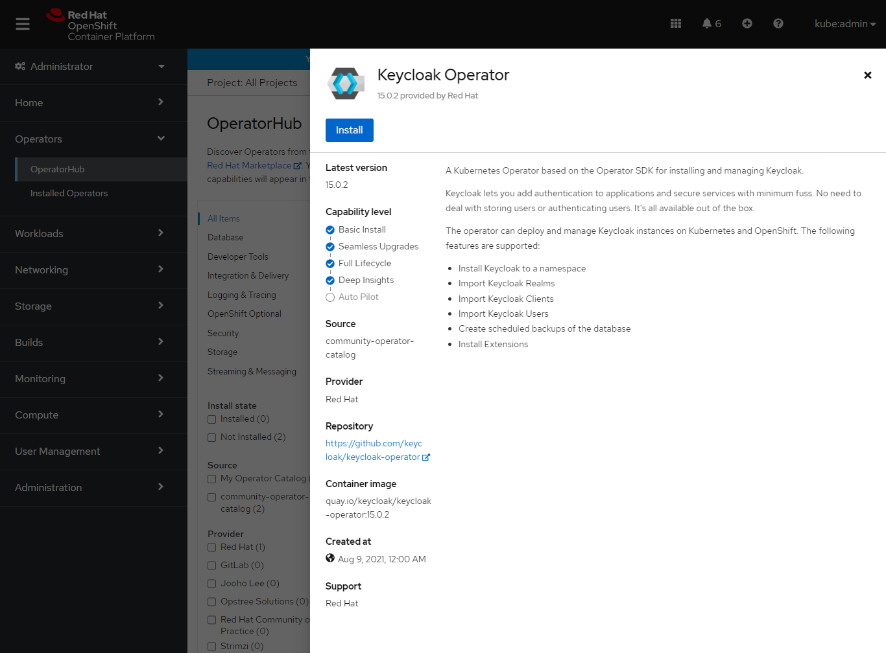
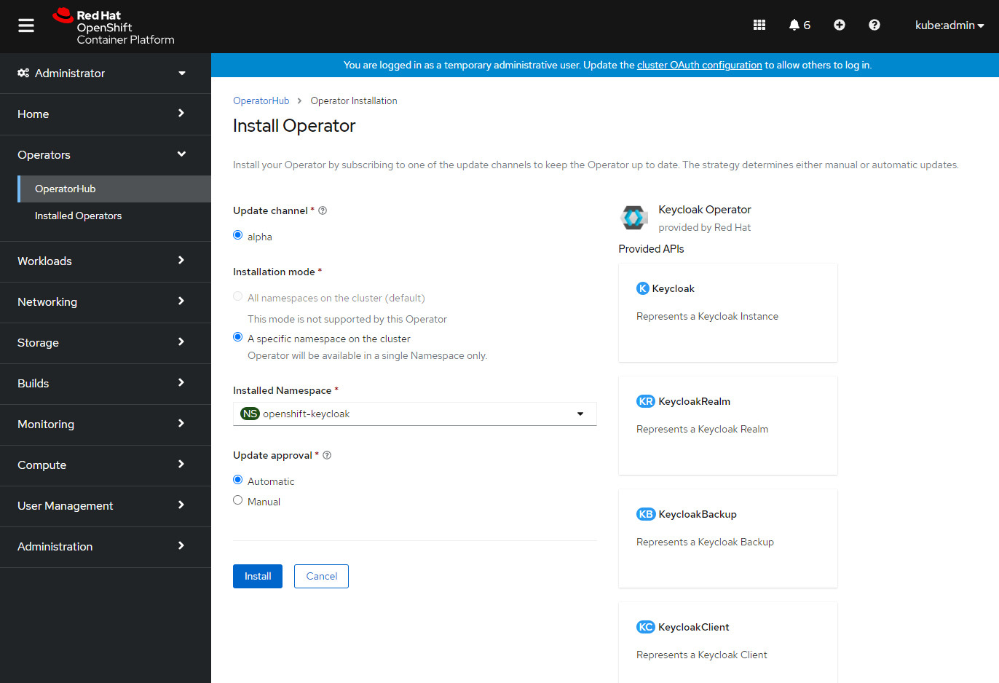
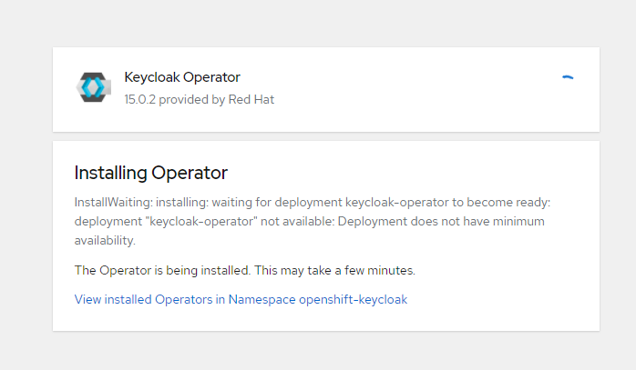

## 问题描述

离线了指定的一些operator导入到离线环境时，遇到了一些问题，存在一些image无法写入imagecontentsourcePolicy的问题


```
no digest mapping available for file://community-operator/my-operator/community-operator-index/jetstack/cert-manager-cainjector:v1.5.4, skip writing to ImageContentSourcePolicy
no digest mapping available for file://community-operator/my-operator/community-operator-index/strimzi/operator:0.13.0, skip writing to ImageContentSourcePolicy
no digest mapping available for file://community-operator/my-operator/community-operator-index/jetstack/cert-manager-webhook:v1.4.2, skip writing to ImageContentSourcePolicy
no digest mapping available for file://community-operator/my-operator/community-operator-index/jetstack/cert-manager-cainjector:v1.4.2, skip writing to ImageContentSourcePolicy
no digest mapping available for file://community-operator/my-operator/community-operator-index/jetstack/cert-manager-webhook:v1.6.1, skip writing to ImageContentSourcePolicy
no digest mapping available for file://community-operator/my-operator/community-operator-index/jetstack/cert-manager-cainjector:v1.6.1, skip writing to ImageContentSourcePolicy
no digest mapping available for file://community-operator/my-operator/community-operator-index/keycloak/keycloak-operator:12.0.3, skip writing to ImageContentSourcePolicy
no digest mapping available for file://community-operator/my-operator/community-operator-index/jooholee/nfs-provisioner-operator:0.0.3, skip writing to ImageContentSourcePolicy
no digest mapping available for file://community-operator/my-operator/community-operator-index/strimzi/operator:0.12.1, skip writing to ImageContentSourcePolicy
no digest mapping available for file://community-operator/my-operator/community-operator-index/jetstack/cert-manager-webhook:v1.6.0, skip writing to ImageContentSourcePolicy
no digest mapping available for file://community-operator/my-operator/community-operator-index/keycloak/keycloak-operator:10.0.0, skip writing to ImageContentSourcePolicy
no digest mapping available for file://community-operator/my-operator/community-operator-index/keycloak/keycloak-operator:11.0.0, skip writing to ImageContentSourcePolicy
no digest mapping available for file://community-operator/my-operator/community-operator-index/jetstack/cert-manager-controller:v1.4.2, skip writing to ImageContentSourcePolicy
no digest mapping available for file://community-operator/my-operator/community-operator-index/jetstack/cert-manager-cainjector:v1.4.4, skip writing to ImageContentSourcePolicy
no digest mapping available for file://community-operator/my-operator/community-operator-index/strimzi/cluster-operator:0.11.1, skip writing to ImageContentSourcePolicy
no digest mapping available for file://community-operator/my-operator/community-operator-index:v4.8-202111, skip writing to ImageContentSourcePolicy
no digest mapping available for file://community-operator/my-operator/community-operator-index/opstree/redis-operator:v0.4.0, skip writing to ImageContentSourcePolicy
no digest mapping available for file://community-operator/my-operator/community-operator-index/jooholee/nfs-provisioner-operator:0.0.2, skip writing to ImageContentSourcePolicy
no digest mapping available for file://community-operator/my-operator/community-operator-index/opstree/redis-operator:v0.3.0, skip writing to ImageContentSourcePolicy
no digest mapping available for file://community-operator/my-operator/community-operator-index/gitlab-org/gl-openshift/gitlab-runner-operator/gitlab-runner-operator:v1.1.0, skip writing to ImageContentSourcePolicy
no digest mapping available for file://community-operator/my-operator/community-operator-index/opstree/redis-operator:v0.5.0, skip writing to ImageContentSourcePolicy
no digest mapping available for file://community-operator/my-operator/community-operator-index/keycloak/keycloak-operator:13.0.1, skip writing to ImageContentSourcePolicy
no digest mapping available for file://community-operator/my-operator/community-operator-index/keycloak/keycloak-operator:13.0.0, skip writing to ImageContentSourcePolicy
no digest mapping available for file://community-operator/my-operator/community-operator-index/keycloak/keycloak-operator:8.0.2, skip writing to ImageContentSourcePolicy
no digest mapping available for file://community-operator/my-operator/community-operator-index/jetstack/cert-manager-controller:v1.5.3, skip writing to ImageContentSourcePolicy
no digest mapping available for file://community-operator/my-operator/community-operator-index/jetstack/cert-manager-webhook:v1.5.4, skip writing to ImageContentSourcePolicy
no digest mapping available for file://community-operator/my-operator/community-operator-index/jetstack/cert-manager-cainjector:v1.4.1, skip writing to ImageContentSourcePolicy
no digest mapping available for file://community-operator/my-operator/community-operator-index/keycloak/keycloak-operator:12.0.1, skip writing to ImageContentSourcePolicy
no digest mapping available for file://community-operator/my-operator/community-operator-index/opstree/redis-operator:latest, skip writing to ImageContentSourcePolicy
no digest mapping available for file://community-operator/my-operator/community-operator-index/jetstack/cert-manager-webhook:v1.5.3, skip writing to ImageContentSourcePolicy
no digest mapping available for file://community-operator/my-operator/community-operator-index/jetstack/cert-manager-cainjector:v1.5.3, skip writing to ImageContentSourcePolicy
no digest mapping available for file://community-operator/my-operator/community-operator-index/keycloak/keycloak-operator:15.0.0, skip writing to ImageContentSourcePolicy
no digest mapping available for file://community-operator/my-operator/community-operator-index/jetstack/cert-manager-webhook:v1.4.1, skip writing to ImageContentSourcePolicy
no digest mapping available for file://community-operator/my-operator/community-operator-index/jetstack/cert-manager-cainjector:v1.6.0, skip writing to ImageContentSourcePolicy
no digest mapping available for file://community-operator/my-operator/community-operator-index/jetstack/cert-manager-controller:v1.6.0, skip writing to ImageContentSourcePolicy
no digest mapping available for file://community-operator/my-operator/community-operator-index/strimzi/cluster-operator:0.11.0, skip writing to ImageContentSourcePolicy
no digest mapping available for file://community-operator/my-operator/community-operator-index/keycloak/keycloak-operator:15.0.1, skip writing to ImageContentSourcePolicy
no digest mapping available for file://community-operator/my-operator/community-operator-index/jetstack/cert-manager-controller:v1.4.1, skip writing to ImageContentSourcePolicy
no digest mapping available for file://community-operator/my-operator/community-operator-index/jetstack/cert-manager-controller:v1.4.0, skip writing to ImageContentSourcePolicy
no digest mapping available for file://community-operator/my-operator/community-operator-index/jetstack/cert-manager-webhook:v1.4.0, skip writing to ImageContentSourcePolicy
no digest mapping available for file://community-operator/my-operator/community-operator-index/keycloak/keycloak-operator:8.0.1, skip writing to ImageContentSourcePolicy
no digest mapping available for file://community-operator/my-operator/community-operator-index/opstree/redis-operator:v0.2, skip writing to ImageContentSourcePolicy
no digest mapping available for file://community-operator/my-operator/community-operator-index/keycloak/keycloak-operator:15.0.2, skip writing to ImageContentSourcePolicy
no digest mapping available for file://community-operator/my-operator/community-operator-index/jetstack/cert-manager-controller:v1.5.4, skip writing to ImageContentSourcePolicy
no digest mapping available for file://community-operator/my-operator/community-operator-index/jetstack/cert-manager-webhook:v1.4.4, skip writing to ImageContentSourcePolicy
no digest mapping available for file://community-operator/my-operator/community-operator-index/jetstack/cert-manager-controller:v1.4.4, skip writing to ImageContentSourcePolicy
no digest mapping available for file://community-operator/my-operator/community-operator-index/jetstack/cert-manager-controller:v1.6.1, skip writing to ImageContentSourcePolicy
no digest mapping available for file://community-operator/my-operator/community-operator-index/jetstack/cert-manager-controller:v1.4.3, skip writing to ImageContentSourcePolicy
no digest mapping available for file://community-operator/my-operator/community-operator-index/opstree/redis-operator:v0.8.0, skip writing to ImageContentSourcePolicy
no digest mapping available for file://community-operator/my-operator/community-operator-index/keycloak/keycloak-operator:9.0.2, skip writing to ImageContentSourcePolicy
no digest mapping available for file://community-operator/my-operator/community-operator-index/opstree/redis-operator:v0.6.0, skip writing to ImageContentSourcePolicy
no digest mapping available for file://community-operator/my-operator/community-operator-index/strimzi/operator:0.12.2, skip writing to ImageContentSourcePolicy
no digest mapping available for file://community-operator/my-operator/community-operator-index/keycloak/keycloak-operator:9.0.0, skip writing to ImageContentSourcePolicy
no digest mapping available for file://community-operator/my-operator/community-operator-index/kubebuilder/kube-rbac-proxy:v0.5.0, skip writing to ImageContentSourcePolicy
no digest mapping available for file://community-operator/my-operator/community-operator-index/jetstack/cert-manager-cainjector:v1.4.0, skip writing to ImageContentSourcePolicy
no digest mapping available for file://community-operator/my-operator/community-operator-index/jetstack/cert-manager-webhook:v1.4.3, skip writing to ImageContentSourcePolicy
no digest mapping available for file://community-operator/my-operator/community-operator-index/keycloak/keycloak-operator:7.0.1, skip writing to ImageContentSourcePolicy
no digest mapping available for file://community-operator/my-operator/community-operator-index/jetstack/cert-manager-cainjector:v1.4.3, skip writing to ImageContentSourcePolicy
no digest mapping available for file://community-operator/my-operator/community-operator-index/strimzi/operator:0.14.0, skip writing to ImageContentSourcePolicy
no digest mapping available for file://community-operator/my-operator/community-operator-index/keycloak/keycloak-operator:14.0.0, skip writing to ImageContentSourcePolicy
wrote mirroring manifests to manifests-my-operator/community-operator-index-1637720538
```


如果没有遇到问题的话，可能上面的这些也是可以忽略的，但是刚好在安装的时候就碰到了一个问题，导致 operator 无法正常安装，在安装 keycloak 这个 operator 的时候，在 event 中看到了如下报错

``` 
[root@bastion ~]# oc get events
LAST SEEN   TYPE      REASON                OBJECT                                            MESSAGE
10m         Normal    Scheduled             pod/keycloak-operator-7575d66466-59z7g            Successfully assigned openshift-keycloak/keycloak-operator-7575d66466-59z7g to master-2.ocp4.shinefire.com
10m         Normal    AddedInterface        pod/keycloak-operator-7575d66466-59z7g            Add eth0 [10.254.1.17/24] from openshift-sdn
9m31s       Normal    Pulling               pod/keycloak-operator-7575d66466-59z7g            Pulling image "quay.io/keycloak/keycloak-operator:15.0.2"
9m31s       Warning   Failed                pod/keycloak-operator-7575d66466-59z7g            Failed to pull image "quay.io/keycloak/keycloak-operator:15.0.2": rpc error: code = Unknown desc = error pinging docker registry quay.io: Get "https://quay.io/v2/": dial tcp: lookup quay.io on 192.168.31.100:53: server misbehaving
9m31s       Warning   Failed                pod/keycloak-operator-7575d66466-59z7g            Error: ErrImagePull
50s         Normal    BackOff               pod/keycloak-operator-7575d66466-59z7g            Back-off pulling image "quay.io/keycloak/keycloak-operator:15.0.2"
9m20s       Warning   Failed                pod/keycloak-operator-7575d66466-59z7g            Error: ImagePullBackOff
10m         Normal    SuccessfulCreate      replicaset/keycloak-operator-7575d66466           Created pod: keycloak-operator-7575d66466-59z7g
10m         Normal    ScalingReplicaSet     deployment/keycloak-operator                      Scaled up replica set keycloak-operator-7575d66466 to 1
11m         Normal    RequirementsUnknown   clusterserviceversion/keycloak-operator.v15.0.2   requirements not yet checked
10m         Normal    RequirementsNotMet    clusterserviceversion/keycloak-operator.v15.0.2   one or more requirements couldn't be found
55s         Normal    AllRequirementsMet    clusterserviceversion/keycloak-operator.v15.0.2   all requirements found, attempting install
55s         Normal    InstallSucceeded      clusterserviceversion/keycloak-operator.v15.0.2   waiting for install components to report healthy
55s         Normal    InstallWaiting        clusterserviceversion/keycloak-operator.v15.0.2   installing: waiting for deployment keycloak-operator to become ready: waiting for spec update of deployment "keycloak-operator" to be observed...
5m56s       Normal    InstallWaiting        clusterserviceversion/keycloak-operator.v15.0.2   installing: waiting for deployment keycloak-operator to become ready: deployment "keycloak-operator" not available: Deployment does not have minimum availability.
57s         Warning   InstallCheckFailed    clusterserviceversion/keycloak-operator.v15.0.2   install timeout
56s         Normal    NeedsReinstall        clusterserviceversion/keycloak-operator.v15.0.2   installing: waiting for deployment keycloak-operator to become ready: deployment "keycloak-operator" not available: Deployment does not have minimum availability.
55s         Warning   InstallCheckFailed    clusterserviceversion/keycloak-operator.v15.0.2   install failed: deployment keycloak-operator not ready before timeout: deployment "keycloak-operator" exceeded its progress deadline
11m         Normal    CreatedSCCRanges      namespace/openshift-keycloak                      created SCC ranges
```


image无法正常拉取

```
Events:
  Type     Reason          Age               From               Message
  ----     ------          ----              ----               -------
  Normal   Scheduled       13s               default-scheduler  Successfully assigned openshift-keycloak/keycloak-operator-7575d66466-d9r84 to master-2.ocp4.shinefire.com
  Normal   AddedInterface  10s               multus             Add eth0 [10.254.1.66/24] from openshift-sdn
  Normal   Pulling         10s               kubelet            Pulling image "quay.io/keycloak/keycloak-operator:15.0.2"
  Warning  Failed          10s               kubelet            Failed to pull image "quay.io/keycloak/keycloak-operator:15.0.2": rpc error: code = Unknown desc = error pinging docker registry quay.io: Get "https://quay.io/v2/": dial tcp: lookup quay.io on 192.168.31.100:53: server misbehaving
  Warning  Failed          10s               kubelet            Error: ErrImagePull
  Normal   BackOff         9s (x2 over 10s)  kubelet            Back-off pulling image "quay.io/keycloak/keycloak-operator:15.0.2"
  Warning  Failed          9s (x2 over 10s)  kubelet            Error: ImagePullBackOff
[root@bastion ~]# oc get po
NAME                                 READY   STATUS             RESTARTS   AGE
keycloak-operator-7575d66466-d9r84   0/1     ImagePullBackOff   0          31m

```


## 解决方案

此问题与现有的一个 bug 非常类似，可以参考下面的 bug

Red Hat Bugzilla – Bug 1910399：https://bugzilla.redhat.com/show_bug.cgi?id=1910399


image 离线后会生成一个 mapping.txt 的文件，发现如果是正常离线了的 image，文件内的映射关系使用的是 sha256，如果是离线异常的，也就是像报错的这样提示 `no digest mapping available` 的镜像，都是直接写版本号在 mapping.txt 文件中。


目前的情况，例如 `Strimzi` 这个 operator ，虽然也出现了部分版本提示 `no digest` 的问题，不过也还能正常的安装，但是这个 `keycloak-operator` 目前是真的有的令人头大


### 尝试解决

导入时没有自动写入 ImageContentSourcePolicy ，尝试手动写入后能不能正常使用


#### 修改 mapping.txt

 

可以通过点击 pull 的按钮，会自动复制这一个镜像的 sha256，例如我的点击后会自动获取到：

```
docker pull registry.ocp4.shinefire.com:8443/community-operator/keycloak-keycloak-operator@sha256:315510f9b9c36565dcd3dc880b7d3ccf9791220bee881a7fa0598761d77124c2
```


使用这个去修改 mapping.txt 文件

原始的文件中，对应的这一行内容如下：

```
file://community-operator/my-operator/community-operator-index/keycloak/keycloak-operator:15.0.2=registry.ocp4.shinefire.com:8443/community-operator/keycloak-keycloak-operator:15.0.2
```

将原始文件中此镜像的版本号修改成 sha256，修改后的结果如下

```
file://community-operator/my-operator/community-operator-index/keycloak/keycloak-operator@sha256:315510f9b9c36565dcd3dc880b7d3ccf9791220bee881a7fa0598761d77124c2=registry.ocp4.shinefire.com:8443/community-operator/keycloak-keycloak-operator:15.0.2
```

```
sha256:46cdcde062b27f6c24775848f60eeb6a7216a98d4d6d7617927f5024fc8edfc3
```

#### 更新 ImageContentSourcePolicy

尝试手动写入需要的镜像到 ImageContentSourcePolicy ，修改 yaml 文件

 ```yaml
  - mirrors:
    - registry.ocp4.shinefire.com:8443/community-operator/keycloak-keycloak-operator
    source: quay.io/keycloak/keycloak-operator
 ```

更新 imageContentSourcePolicy

```bash
~]# oc replace -f imageContentSourcePolicy.yaml
imagecontentsourcepolicy.operator.openshift.io/community-operator replaced
```


### 一次失败的尝试

#### 更新 ImageContentSourcePolicy

尝试手动写入需要的镜像到 ImageContentSourcePolicy ，修改 yaml 文件

 ```yaml
   - mirrors:
     - registry.ocp4.shinefire.com:8443/community-operator/keycloak-keycloak-operator
     source: quay.io/keycloak/keycloak-operator
 ```

更新 imageContentSourcePolicy

```bash
~]# oc replace -f imageContentSourcePolicy.yaml
imagecontentsourcepolicy.operator.openshift.io/community-operator replaced
```


#### 尝试重装 keycloak operator

卸载安装失败的 operator




再次安装 operator




选择好安装选项后点击安装




等待安装结果



发现直接这样改也是不行的...
