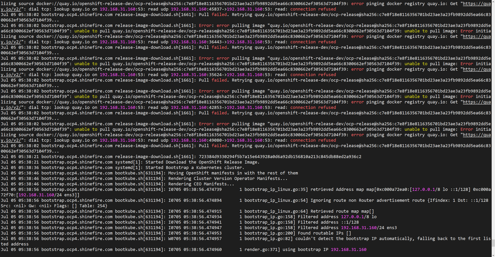
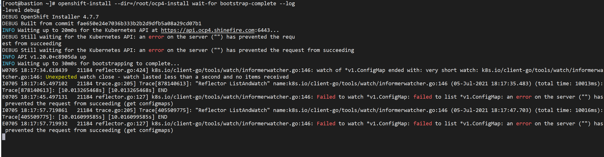

# Deployment UPI Online   (未完成文档，仅供参考部分内容)


## Architecture

### Install Produce

在安装 OCP 时，我们需要有一台引导主机（`Bootstrap`）。这个主机可以访问所有的 OCP 节点。引导主机启动一个临时控制平面，它启动 OCP 集群的其余部分然后被销毁。引导主机使用 Ignition 配置文件进行集群安装引导，该文件描述了如何创建 OCP 集群。**安装程序生成的 Ignition 配置文件包含 24 小时后过期的证书，所以必须在证书过期之前完成集群安装。**


### Softwares List

| 软件名称 | 软件包名                             |
| -------- | ------------------------------------ |
|          | openshift-client-linux-4.7.7.tar.gz  |
|          | openshift-install-linux-4.7.7.tar.gz |
|          | rhcos-4.7.7-x86_64-live.x86_64.iso   |


## Troubleshooting

Q1：

安装bootstrap的时候报错：

```
Jul 05 05:38:02 bootstrap.ocp4.shinefire.com release-image-download.sh[1661]: Error: error pulling image "quay.io/openshift-release-dev/ocp-release@sha256:c7e8f18e8116356701bd23ae3a23fb9892dd5ea66c8300662ef30563d7104f39": unable to pull quay.io/openshift-release-dev/ocp-release@sha256:c7e8f18e8116356701bd23ae3a23fb9892dd5ea66c8300662ef30563d7104f39: unable to pull image: Error initializing source docker://quay.io/openshift-release-dev/ocp-release@sha256:c7e8f18e8116356701bd23ae3a23fb9892dd5ea66c8300662ef30563d7104f39: error pinging docker registry quay.io: Get "https://quay.io/v2/": dial tcp: lookup quay.io on 192.168.31.160:53: read udp 192.168.31.160:36443->192.168.31.160:53: read: connection refused
```



A1：

解决方法是配置了一个8.8.8.8的DNS，原因应该是podman在bootstrap机器启动后需要联网去pull image，但是我默认配置的nameserver是本地的，所以无法解析到其他域名导致pull image失败


Q2：

监控安装过程中遇到报错：

```
./openshift-install --dir=/root/ocp4/install_binary wait-for bootstrap-complete --log-level=debug
...
E0705 14:23:02.821260   23542 reflector.go:307] k8s.io/client-go/tools/watch/informerwatcher.go:146: Failed to watch *v1.ConfigMap: Get "https://api.ocp4.shinefire.com:6443/api/v1/namespaces/kube-system/configmaps?allowWatchBookmarks=true&fieldSelector=metadata.name%3Dbootstrap&resourceVersion=16911&timeoutSeconds=494&watch=true": dial tcp 192.168.31.160:6443: connect: connection refused
```


Q3：

pod_workers.go:191] Error syncing pod 8b5ad476-efab-4d24-9511-587c475f1be8 ("kube-apiserver-master-1.orkers.go:191] Error syncing pod 8b5ad476-efab-4d24-9511-587c475f1be8 ("kube-apiserver-master-1.ocp4.shinefire.com_openshift-kube-apiserver(8b5ad476-efab-4d24-9511-587c475f1be8)"), skipping: f>ocp4.shinefire.com_openshift-kube-apiserver(8b5ad476-efab-4d24-9511-587c475f1be8)"), skipping: failed to "StartContainer" for "kube-apiserver" with CrashLoopBackOff: "back-off 40s restarting f>ailed to "StartContainer" for "kube-apiserver" with CrashLoopBackOff: "back-off 40s restarting failed container=kube-apiserver pod=kube-apiserver-master-1.ocp4.shinefire.com_openshift-kube-api>ailed container=kube-apiserver pod=kube-apiserver-master-1.ocp4.shinefire.com_openshift-kube-apiserver(8b5ad476-efab-4d24-9511-587c475f1be8)"


Q4：

bootstrap网络错误：

```
kubelet.go:2190] Container runtime network not ready: NetworkReady=false reason:NetworkPluginNotReadymessage:Network plugin returns error: No CNI configuration file in /etc/kubernetes/cni/net.d/.Has your network provider started?
```


Q5：

