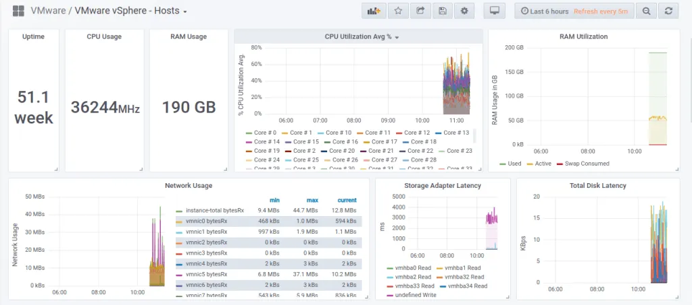
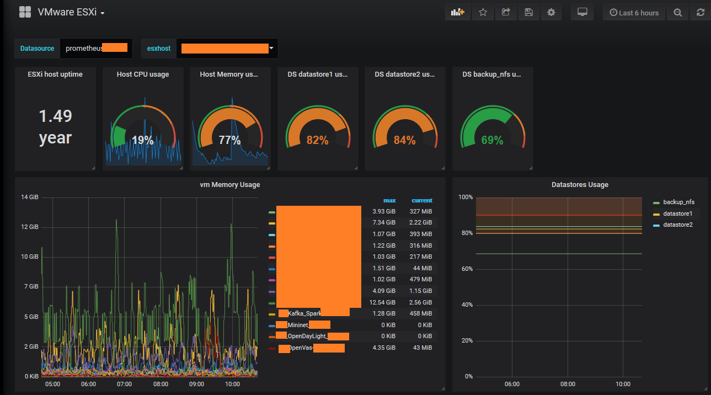
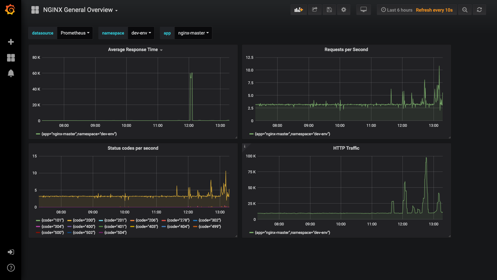
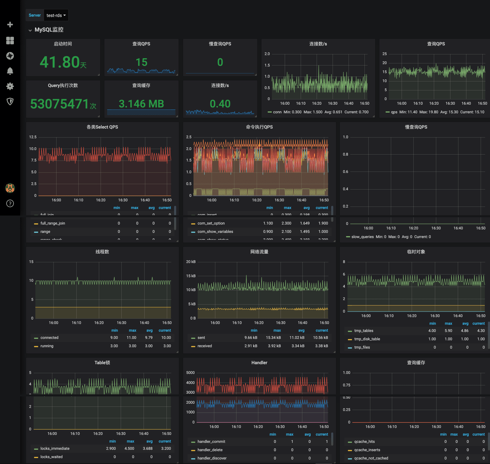
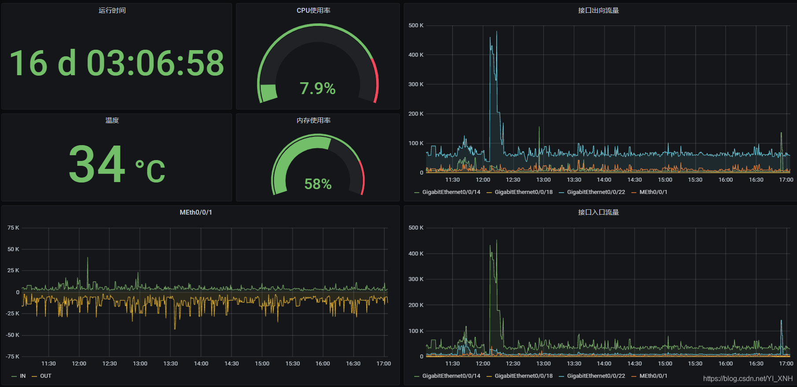

## Prometheus应用场景示例

本文档主要介绍Prometheus对基础设施及系统应用等各种场景的应用场景介绍，以及该应用场景下的监控指标与Grafana实现的大致效果界面展示。

### 一、Prometheus监控的对象

prometheus监控系统的监控对象主要考虑有以下：

- 操作系统：Linux、Windows
- 中间件：NGINX，Tomcat、Jenkins...
- 数据库：MySQL、Oracle、SQL server...
- 底层基础设施：vSphere，物理服务器，交换机...

### 二、应用场景示例

#### Linux

指标：

- CPU使用率
- CPU负载
- 内存使用率
- 文件系统使用率
- 交换分区使用率
- 磁盘读写
- 流量出入
- 网络socket连接信息
- 每次IO读写耗时

界面展示：

#### Windows

指标：

- CPU使用率
- 内存使用率
- 磁盘使用率
- 磁盘读写详情
- 网络流量统计
- 网络丢包
- 服务数量与状态统计
- 进程数量统计

界面展示

#### VMware

vm相关指标

- vm 电源状态
- vm 启动时间
- vm cpu数量
- vm内存总量
- vm cpu最大可用量(hz)
- vm 模板

vm guest相关指标

- VM tools运行状态
- VM tools 版本号
- VM tools version status

snapshots相关指标

- 已存在的snapshot数量
- 创建snapshot的耗时

Datastore相关指标

- Datastore容量大小
- Datastore剩余空间大小
- VMWare Datastore uncommitted 
- VMWare Datastore provisoned
- 使用该Datastore的Host数量
- 使用该Datastore的vm数量
- Datastore的维护模式（normal / inMaintenance / enteringMaintenance）
- Datastore类型（VMFS, NetworkFileSystem, NetworkFileSystem41, CIFS, VFAT, VSAN, VFFS）
- Datastore是否可访问

Host相关

- Host 电源状态
- Host 待机模式 (entering / exiting / in / none)
- Host 连接状态 (connected / disconnected / notResponding)
- Host 维护模式状态
- Host 启动时间
- Host CPU 使用量(Mhz)
- Host CPU 总量(Mhz)
- Host CPU 数量
- Host 内存使用量(Mbytes)
- Host 内存总量(Mbytes)
- Host produce info
- Host hardware info
- Host 传感器状态 (0=red / 1=yellow / 2=green / 3=unknown)
- Host 传感器风扇转速
- Host 传感器温度
- Host 传感器电源电压
- Host 传感器电源电流
- Host 传感器电源功率
- Host 传感器冗余值 (1=ok / 0=ko)

#### vCenter

指标

- 运行时间
- 集群CPU使用情况
- 集群内存使用情况
- 集群网络使用情况
- 集群存储使用情况
- DataStore使用情况
- Host电源情况

界面展示：

#### ESXi

针对每个单独的ESXi也可以进行监控

指标

- 运行时长
- CPU使用情况
- 内存使用情况
- 每台vm的内存使用情况
- DS使用情况等

界面展示

#### nginx

指标

- 平均相应时间
- 每秒请求数
- 不同http status code的数量统计
- http流量统计
- 连接数统计
- 连接状态统计，active/waiting/reading/writing等

界面展示

#### MySQL

指标

- 当前连接数
- 最大可用连接数
- uptime
- QPS
- 慢查询
- 流量
- 线程数
- 查询缓存
- Table锁

界面展示：

#### 物理服务器

指标

- 内存条
- 服务器电源模块
- 服务器风扇
- 服务器处理器
- 硬盘监控

#### 交换机

指标

- 运行时间
- 温度
- CPU使用率
- 内存使用率
- 接口出口/入口流量

界面展示：

