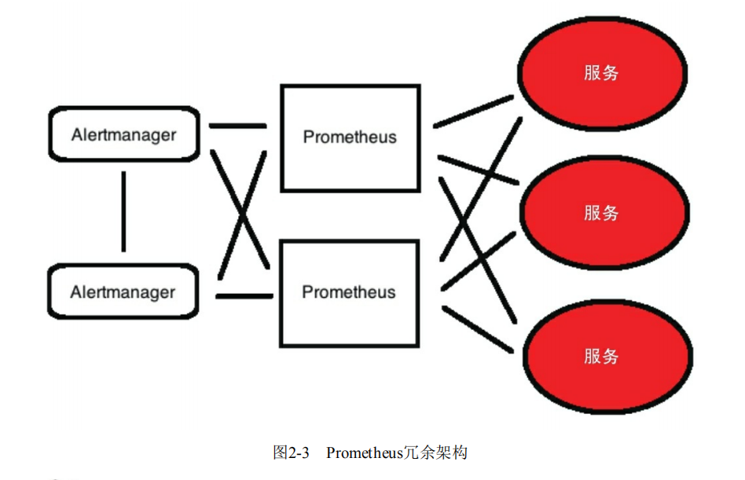

## Prometheus监控系统项目方案

[TOC]

### 当前环境说明

vCenter * 3

### 实现目标

第一阶段：

- 实现Prometheus监控系统从无到有
- 实现结合grafana可视化来展示具体的监控情况
- 实现对vCenter层面的监控
- 实现通过企业微信的告警

第二阶段：

- 实现对vmware中vm（Linux、Windows）层面的监控
- 对vm实现服务发现，新建的云主机能够自动添加到prometheus监控系统中被监控

第三阶段：

- 实现对云平台的云主机进行监控
- 对云主机实现服务发现，新建的云主机能够自动添加到prometheus监控系统中被监控
- 实现对业务应用层面的监控，例如中间件，数据库等

第四阶段：

- 实现对硬件设备、网络设备的监控

第五阶段：

- 实现对容器平台的监控
- 实现对容器的监控

### Prometheus监控系统架构设计

#### 高可用的实现

Prometheus联邦

时间序列存储很重要，所以使用共享存储逻辑来完成比较合适。

selnos？ protocols？

AlertManager高可用

高可用的情况下还要考虑避免重复发送，例如给Alert1上发送了，又给Alert2重复发送就不得了

### 部署设计

#### 服务发现方案

暂时先考虑用现成比较容易实现的使用ansible来调用vmware api来查询所有的vm/host来实现

### 面临的问题

#### 关于这个vmware的exporter

现在最流行的这个vmware_exporter它里面不包含任何网络流量相关以及集群状态之类的监控功能。

可能还需要另外找办法来解决这个问题

### Exporter

refer follow github...

vmware_exporter: https://github.com/pryorda/vmware_exporter

exsi_exporter: https://github.com/devinotelecom/prometheus-vmware-exporter

### Reference

- [prometheus 使用 ipmi exporter 增加硬件级别监控](https://www.cnblogs.com/lixinliang/p/15019679.html)
- [How To Monitor VMware ESXi with Grafana and Telegraf](https://computingforgeeks.com/how-to-monitor-vmware-esxi-with-grafana-and-telegraf/)
- [Monitoring VMware clusters using Prometheus and Grafana](https://michaelkotelnikov.medium.com/monitoring-vmware-clusters-using-prometheus-and-grafana-6223bb7936f9)
- [ansible部署prometheus的GitHub](https://github.com/cloudalchemy/ansible-prometheus)