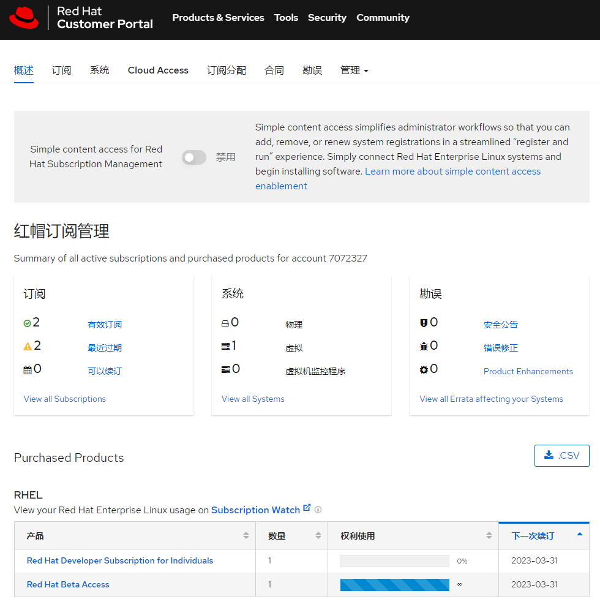

# How to renew your Red Hat Developer Subscription for Red Hat Enterprise Linux

**original**：https://developers.redhat.com/articles/renew-your-red-hat-developer-program-subscription#


*Updated: January 2022.*

The [Red Hat Developer program](https://developers.redhat.com/about) provides a number of member benefits, including a no-cost Red Hat Developer Subscription for Individuals. The subscription provides access to Red Hat’s product portfolio via the [Red Hat software access for developers](https://developers.redhat.com/products) page. [Red Hat Enterprise Linux](https://developers.redhat.com/products/rhel/overview) (RHEL) is one of the products included.

The Red Hat Developer Subscription for Individuals lasts for one year. When it expires, you must re-register in order to continue accessing all the support and benefits associated with the subscription. The support won't change, and it's still available at no cost for developers. This article guides you through the process to re-register and answers frequently asked questions about the process.

**Note:** See [How to activate your no-cost Red Hat Enterprise Linux subscription](https://developers.redhat.com/blog/2021/02/10/how-to-activate-your-no-cost-red-hat-enterprise-linux-subscription) for how to set up your RHEL subscription.


## You can't renew your subscription, but you can re-register

The first thing to understand is that you cannot renew your no-cost Red Hat Developer Subscription for individuals after the first year. Unlike a paid subscription, the no-cost edition for developers is limited to one year.

So, what's a developer to do? Fortunately, that's easy: *You can just register again*. Yes, it's that simple. Once your developer subscription expires, simply re-register and get a new, no-cost subscription. Note that you must wait until your current subscription expires before you can renew it.


## Why do we ask you to re-register once a year?

The Red Hat Developer Subscription is free for developers, but the services and support it provides aren't free for Red Hat. So, we want to encourage developers who download RHEL to actually use it. One way to do this is to ask developers to re-register their subscriptions once a year. Re-registering confirms that the subscription is still active, and it's a small price to pay for support, security, updates, and more.


## How to re-register for your Red Hat Developer Subscription

Red Hat Principal Customer Support Specialist Daniel Marshburn offered the following guidance on re-registering for a Red Hat Developer Subscription for Individuals after the initial one-year subscription expires:

1. Open [developers.redhat.com](http://developers.redhat.com/) in an Incognito window in Chrome, a Private window in Firefox, or an InPrivate window in Edge.
2. Use your Red Hat login ID to sign in to the site.
3. Acknowledge the provided Terms and Conditions.
4. Log out of all Red Hat sites and close your browser(s).
5. Wait 15 to 20 minutes, then log in to [access.redhat.com/management](http://access.redhat.com/management).
6. You should now see a new Red Hat Developer for Individuals Subscription on your account.


## Troubleshooting

You may need to remove and then re-attach your license after accepting the new terms and conditions for your system to recognize the renewed subscription:

```bash
sudo subscription-manager remove --all
sudo subscription-manager unregister
sudo subscription-manager clean
sudo subscription-manager register
sudo subscription-manager refresh
sudo subscription-manager attach --auto
```

Copy snippet


## Frequently asked questions

Below are answers to frequently asked questions about what happens after the one-year Red Hat Developer Subscription for Individuals has expired.

### 1. What if I don't re-register immediately? Will I lose all my software and tools?

In a word, *no*. Nothing will be removed from your RHEL instance if you don't re-register immediately after your subscription expires. Nothing will be deleted. Until you re-register, you will not be eligible for updates and access to the support documents and other benefits that you will probably want. But in the meantime, you can keep developing software.

### 2. Will the container images I've created still run?

If you've created container images using Red Hat's Universal Base Images (UBI) base images, you are all set. Those images will keep humming along, running the bug-free software that you wrote without issue.


## What if I have more questions?

We're here to help! Feel free to leave a comment below if you have questions after reading this article. You can also check the [No-cost Red Hat Enterprise Linux Individual Developer Subscription FAQs](https://developers.redhat.com/articles/faqs-no-cost-red-hat-enterprise-linux) for more information.

Thanks for being a member of the Red Hat Developer program.


## 其他说明

登录后，就会跳转到这样的界面：


勾选这些条款后，提交就行了。

其实在原文的评论区也有很多人说即使通过匿名标签去访问也收不到的，我上个月也用 Chrome 浏览器尝试过这个方法，确实也是无效。

今天用 edge 浏览器的匿名模式试了一下倒是成功了。

不知道之前没有弹出这个条款勾选是因为那会儿服务器网络有问题还是说和浏览器有关系之类的，总之如果自己试了不行的话，可以多尝试两个浏览器，再不行的话，就过段时间再试试吧


订阅复活了：

