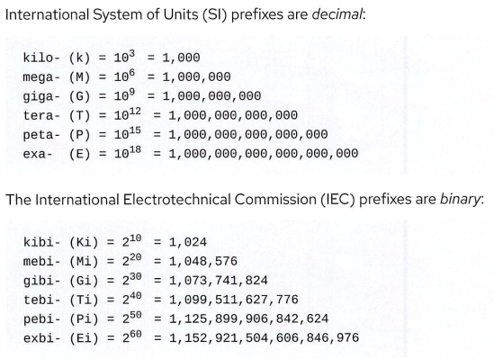
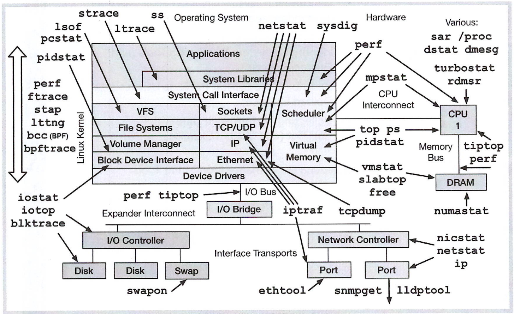

# Performance Tuning

> 基于文档的一个学习

## 一、调优介绍

### 调优概念

#### 调优的优劣

系统默认的很多参数，是折中方案，不好也不差，需要根据实际的应用场景去进行调整，通常在这一方面优化的同时会给另外一方面带来负面影响。

例如系统对于大文件和小文件的处理时，默认的参数是折中的话，对大小文件的处理都不会很快也不会很慢，而针对主要处理小文件的系统进行优化后，可能会在处理小文件时的性能大幅度提升，但是在处理大文件时的性能会有所下降。

#### 调优层次

架构层面 --> 硬件级 --> 软件级 --> 配置级

层次越高，成本越高，效果越好；

层次越低，成本越低，效果越差。

### 描述系统计量单位

KB：Byte

Kbps：bit

K vs. Ki ↓

## 二、选择性能监控工具

针对各种类型指标的都有不同类型的监控，监控工具一览：

ps：静态查看进程相关的信息

top：动态查看进程资源使用情况

## 小计

note1：

/proc /sys 都是运行在内存里面的东西

note2：

