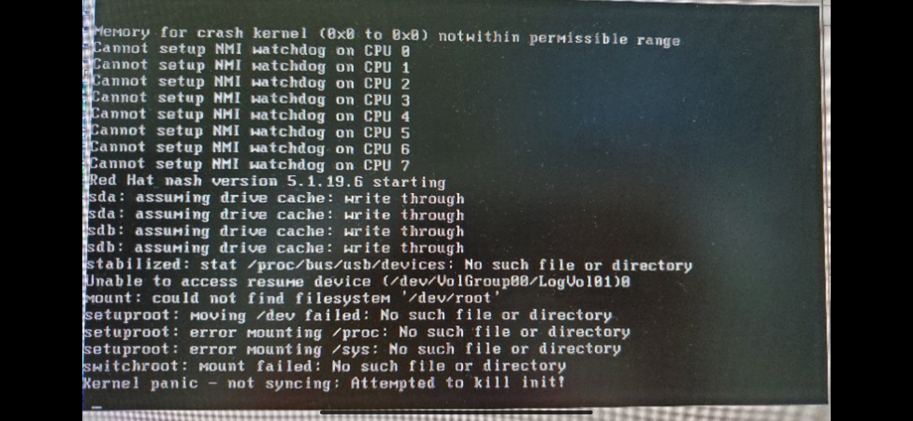
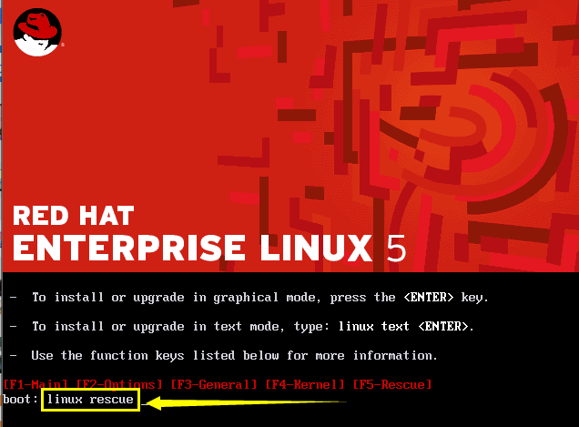
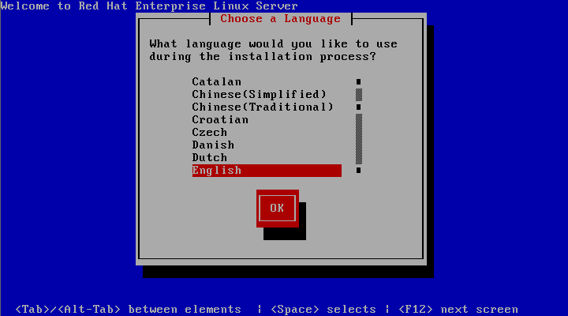
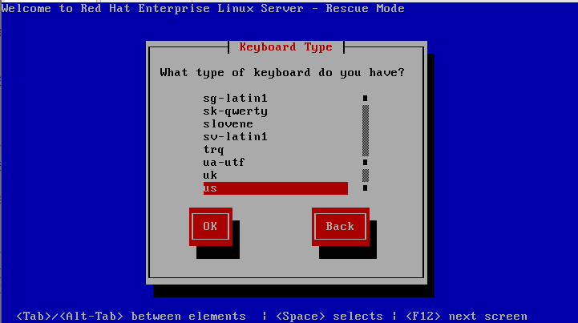
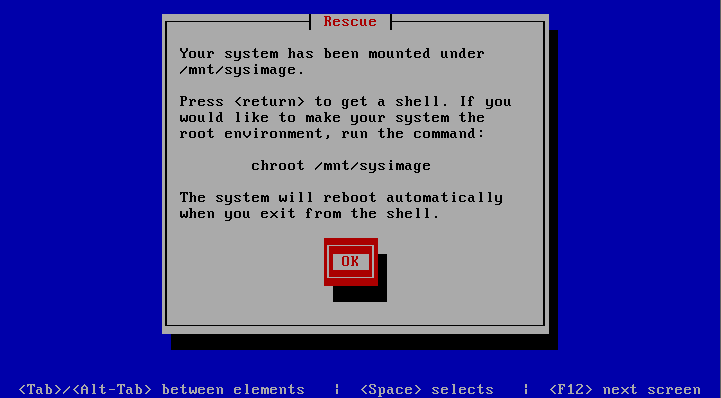
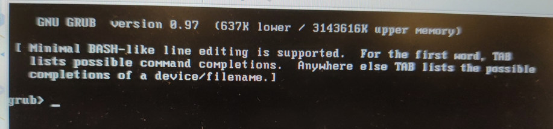
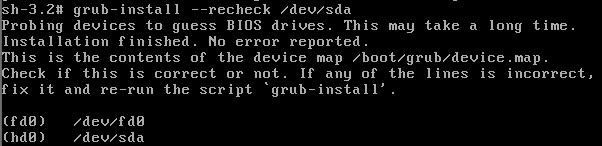
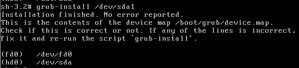

# p2v故障解决方案


## 一、问题描述

p2v转移完成后，部分新的虚拟机无法正常启动进入系统。

故障界面如下图：




## 二、问题原因

引发此故障导致系统启动失败的根因为源物理机中的`/etc/lvm/lvm.conf`配置文件中的`filter`设置错误所导致。

源物理机中`filter`项的配置内容为：`filter = [ "a/emcpower.*","r/sd.*/","r/disk.*/" ]`

错误原因说明：r代表reject，源物理机的配置项这样配置会导致无法发现sda、sdb这类设备，从而导致启动时无法找到需要挂载的文件系统而启动失败。

额外说明：物理机这样配置应该也会导致下次物理机重启的时候启动失败（未实际验证），建议条件允许的情况下进行验证，如果不行的话修改配置避免这样的问题出现。


## 三、解决方案

### 3.1 解决方案一：修正源物理机中lvm配置文件

**此方案理论可行，待验证.......**

直接修改源物理机的`/etc/lvm/lvm.conf`配置文件，可以在进行p2v之前就将问题的从根源解决，避免了后续p2v完毕后，再去针对迁移后的虚拟机做更多繁琐的操作。

修改filter配置项至如下：

```bash
# vim /etc/lvm/lvm.conf

filter = [ "a/sd.*/","r/disk.*/" ]
```

说明：这样配置即可发现sd*设备，正常开机。

### 3.2 解决方案二：修正虚拟机中lvm配置文件

此方案建议方案一不行的时候才采用，即按当前的方法不改动任何源物理机直接进行p2v，此方案的步骤更多并且操作起来也会更加的繁琐。

#### 3.2.1 进入系统救援模式

1. console连接相同版本的iso镜像文件，并修改BIOS配置从镜像启动

2. 在启动等等输入界面，输入`linux rescue`进入救援模式，如下图：

   

3. 选择语言

   

4. 选择键盘

   

5. 一般不需要网络，选择`No`

   

6. 选择`Continue`

   

7. 选择`OK`

   

8. 进入救援模式后chroot切换根位置

   ```bash
   sh-3.2# chroot /mnt/sysimage/
   ```

#### 3.2.2 检查修改lvm配置文件

1. 修改`/etc/lvm/lvm.conf`配置文件的filter配置项至如下：

   ```bash
   sh-3.2# vim /etc/lvm/lvm.conf

   filter = [ "a/sd.*/","r/disk.*/" ]
   ```

#### 3.2.3 重做initrd并重启系统

1. 备份原始的initrd文件

   ```bash
   sh-3.2# mv /boot/initrd-2.6.18-194.el5.img /boot/initrd-2.6.18-194.el5.img.bak
   ```

2. 使用mkinitrd命令重做initrd

   ```bash
   sh-3.2# mkinitrd /boot/initrd-2.6.18-194.el5.img `uname -r`
   ```

   注意：生成在boot下面的initrd文件根据实际内核版本填写，便于人为区分，也减少了更改`grub.cfg`配置文件的操作。

3. 连续`exit`两次即可重启

#### 3.2.4 修复grub

如果在上面的重做initrd文件后，重启操作系统时启动失败，直接进入到grub命令行界面，如下：



则需要再次进入救援模式使用grub-install来修复grub。

操作步骤如下：

1. 进入救援模式

2. chroot /mnt/sysimage

3. cd /boot

4. grub-install --recheck /dev/sda 检查

   

5. grub-install /dev/sda

   

   /dev/sda1即boot分区挂载点的磁盘设备。

6. 再次重启进入系统即可。