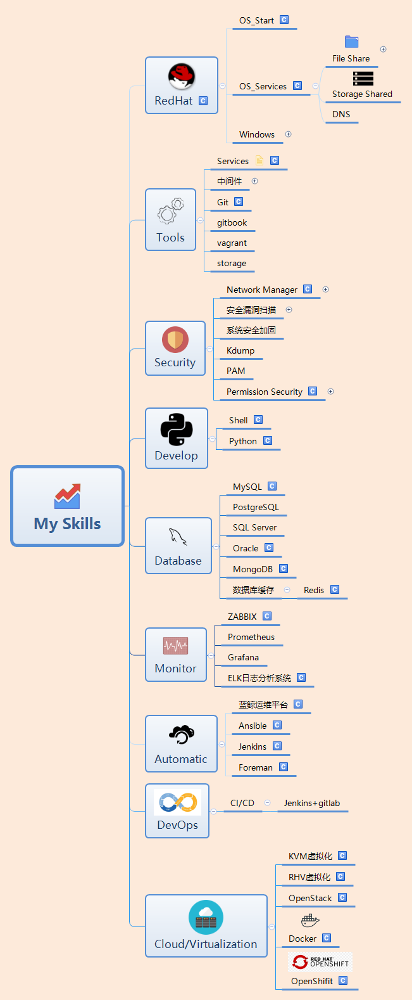

# Ops_Notes

> Hello! Nice to meet you.
>
> My all notes that about Ops in here.
>
> Include the Linux OS, auto ops, monitor... 

本人的博客文档通过Typora这个超级棒的markdown编辑器所编写，如果在github上某些地方显示不太合适，影响了你的体验的话敬请包容，如果你也使用Typora并有意下载我的笔记的话，那么也许会有一个更好的体验。

因为本人英语水平较差，所以有意的在加强一下自己的英语，很多地方会尽量使用英文来编写，可能会存在很多语法错误，如果你发现了存在的语法错误并能帮我指正的话感激不尽。

2021年会努力完善很多方面的笔记，谢谢支持！

个人技能与学习方向：

