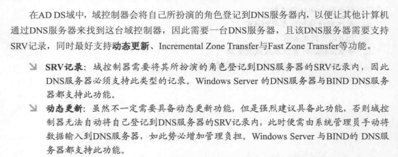

# 测试结论

[TOC]

## 结论简述

现有情况下，无法集成AD域来使用

## 结论详述

### IdM域无法从现有的域中独立创建

IdM可以理解为是一个独立于现有AD域的"AD"域，但是目前的情况下，似乎无法让它成为一个独立的域。

如果我们的IDM服务器是cn.wal-mart.com的话，这样的话在AD域看来，并不是一个独立的域，因为cn.wal-mart.com已经是wal-mart.com的一个子域，是一个建立了双向trust的关系，IDM域就无法再次与wal-mart.com建立trust。

### 直接用cn.wal-mart.com的测试

如果直接在cn.wal-mart.com这个DNS域中创建的虚拟机，来部署idm的话，会导致无法正常通信...

例如，server.cn.wal-mart.com作为idm server端，client1.cn.wal-mart.com作为idm client端。

不太合规的使用这种方法来创建一个名称为 idm.cn.wal-mart.com 的idm域，也是能够创建成功的，不过正常情况下都是一个AD域的根域名称和DNS域的名称会保持一致，这样才能在创建AD域的时候，自动将那些SRV记录自动添加到DNS中。

这里因为创建的idm.cn.wal-mart.com与dns域cn.wal-mart.com是不一致的，所以是没办法自动添加SRV记录之类的，即使手动添加也不行，因为正常情况下，cn.wal-mart.com这个dns zone肯定包含了一些cn.wal-mart.com这个AD域的一些记录，让这个域内其他的客户端来找这个AD域中的server。

在这种不太合规的方法创建好这个idm.cn.wal-mart.com的idm域之后，也是可以与AD域wal-mart.com建立trust，这一步倒是没有问题。

但是在后续client加入到idm域时会出问题，因为server/client的DNS域还是cn.wal-mart.com，将它加入到idm域时，会有一些冲突，不能自动加入，只能手动来指定，即使手动指定了ipa server，domain，realm等信息，也还是会有些异常，因为client没有办法去确认指定的ipaserver是一个真的IPA server，DNS中完全没有记录关于idm域的信息，只能强行继续，这一步的操作也会导致无法自动化安装client。

强行加入idm域后，也无法使用AD域中的用户来进行ssh登录，似乎是无法验证。

### DNS再增加一个idm.cn.wal-mart.com域给idm用

## 相关背景/知识介绍

### AD域与DNS域名

在创建第一个AD域控制器，它会同事创建此域控制器所属的域，也会创建域所属的域树以及域树所属的林，所属的域也是整个林的根域。

AD域的域名也应该要附和DNS格式，例如example.com

在创建AD域控制器之前，必须要有一个DNS服务器来支撑，可以使用外部的也可以使用集成的DNS服务器，一般情况下DNS域都需要与AD根域名同名的。

### AD域中定位/查找域控制器

在AD域中，AD DS域名采用DNS的架构及命名方式，所以要为AD DS域取一个符合DNS格式的域名。

域控制器会将自己所扮演的角色登记到DNS服务器内，以便让其他计算机通过DNS服务器来找到这台域控制器，因此需要一台DNS服务器，且该DNS服务器需要支持SRV记录，同事最好支持动态更新、incremental zone transfer域fast zone transfer等功能。

### 域控制器的SRV记录

域控制器如果要将其扮演的角色正确的登记到DNS服务器，还需要能够在DNS中查询到域控制器的一些SRV记录。

SRV的_ldap记录，表示成功登记为域控制器；

_gc记录啧表示**全局编录服务器**的角色也由该服务器所扮演。 

### IDM域不能是已有AD域林的一部分

Multiple AD domains can be organized together into an *Active Directory forest*. A root domain of the forest is the first domain created in the forest. Identity Management domain cannot be part of an existing AD forest, thus it is always seen as a separate forest.

## 解决方案

增加一个DNS zone，例如idm.cn.wal-mart.com，专门用于idm服务端部署名称为idm.cn.wal-mart.com的idm域。

主要要求：

- 创建一个新的DNS zone，例如idm.cn.wal-mart.com
- idm.cn.wal-mart.com中的idm server能与AD域根域的域控制器服务器相互解析
- 一个AD域根域控制器的domain admin/enterprise admin组的用户与密码用于建立trust

## 疑问

### DNS domain name VS. AD domain name

在建立AD域控制器的时候，需要有一个DNS建立的domain来支持AD DS域的domain，那么如果两个domain name不一致的话，有办法继续创建好AD域控制器并使用吗？

