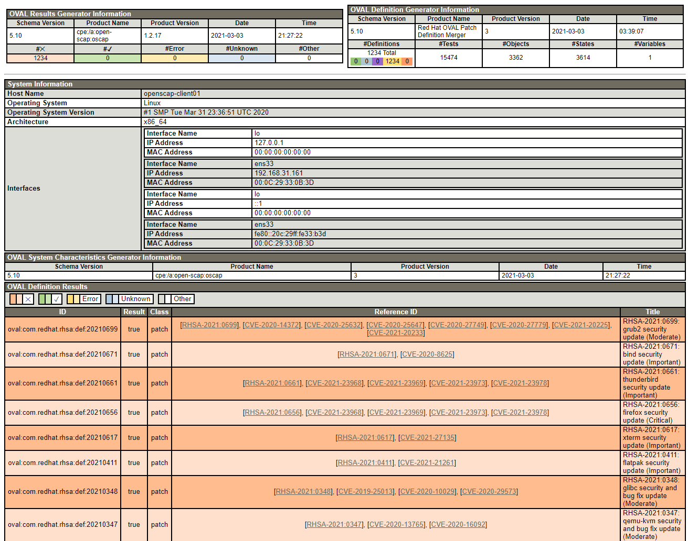

# OpenSCAP

> 本章主要介绍如何对OpenSCAP进行一个快速的简单上手使用，用于对企业内部的安全漏洞管理。

## Author

```
Name:Shinefire
Blog:https://github.com/shine-fire/Ops_Notes
E-mail:shine_fire@outlook.com
```

## Introduction

### What is OpenSCAP

### Security Content Automation Protocol (SCAP)

安全内容自动化协议（SCAP）

SCAP 是一种综合的可互操作的规范，这种规范对格式与术语进行了标准化，通过这种标准化的规范向人类和机器传达软件缺陷以及安全配置信息。SCAP 是一种多用途的框架规范，它支持自动化配置、漏洞和补丁检查、技术控制达标活动以及安全性度量。

换句话说，SCAP 是一个独立于供应商外用于表达安全策略的方式，因此它被广泛的应用于现代企业中。 SCAP 的规格打造了一个生态系统，其中安全性内容的格式著名且标准，同时扫描或者策略编辑的执行也不是强制性的。这种状态使得企业或者机构一旦建立起他们自己的安全策略(含SCAP内容)，就无需在意他们究竟雇佣了多少安全提供商。

## Configuration Compliance Tools in RHEL

- SCAP Workbench
  The scap-workbench graphical utility is designed to perform configuration and vulnerability scans on a single local or remote system. You can also use it to generate security reports based on these scans and evaluations.
- OpenSCAP
  The OpenSCAP library, with the accompanying oscap command-line utility, is designed to perform configuration and vulnerability scans on a local system, to validate configuration compliance content, and to generate reports and guides based on these scans and evaluations.
- SCAP Security Guide (SSG)
  The scap-security-guide package provides the latest collection of security policies for Linux systems. The guidance consists of a catalog of practical hardening advice, linked to government requirements where applicable. The project bridges the gap between generalized policy requirements and specific implementation guidelines.
- Script Check Engine (SCE)
  SCE is an extension to the SCAP protocol that enables administrators to write their security content using a scripting language, such as Bash, Python, and Ruby. The SCE extension is provided in the openscap-engine-sce package. The SCE itself is not part of the SCAP environment.

## Terminology

| term | explain                                |
| ---- | -------------------------------------- |
| SCAP | Security Content Automation Protocol   |
| OVAL | Open Vulnerability Assessment Language |
| CVSS | Common Vulnerability Scoring System    |
| RHSA | Red Hat Security Advisory              |
| CVE  | Common Vulnerabilities and Exposures   |


## Vulnerability Scanning

### Scanning the system for vulnerabilities

#### Procedure

1. install 

   ```bash
   ~]# yum install openscap-scanner bzip2
   ```

2. download 

   ```bash
   ~]# wget -O - https://www.redhat.com/security/data/oval/v2/RHEL7/rhel-7.oval.xml.bz2 | bzip2 --decompress > rhel-7.oval.xml
   ```

3. scan and  save results

   ```bash
   ~]# oscap oval eval --report vulnerability.html rhel-7.oval.xml
   ```

4. export  and check the results
   


### Scanning Remote Systems for Vulnerabilities 

#### Produce

1. Install openscap in local system and **remote system** 

   ```bash
   ~]# yum install openscap-utils
   ```

2. Download oval file in local system 

   ```bash
   ~]# wget -O - https://www.redhat.com/security/data/oval/v2/RHEL7/rhel-7.oval.xml.bz2 | bzip2 --decompress > rhel-7.oval.xml
   ```

3. Scan a remote system and save results 

   ```bash
   ~]# oscap-ssh root@openscap-client01 22 oval eval --report remote-vulnerability.html rhel-7.oval.xml
   ```

4. export and check the results 
   


## References

- https://access.redhat.com/documentation/en-us/red_hat_enterprise_linux/7/html/security_guide/vulnerability-scanning_scanning-the-system-for-configuration-compliance-and-vulnerabilities
