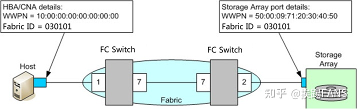

### SAN

SAN（Storage Area Network）存储区域网络，是一种高速的、专门用于存储操作的网络，通常独立于计算机局域网（LAN）。SAN将主机和存储设备连接在一起，能够为其上的任意一台主机和任意一台存储设备提供专用的通信通道。

SAN将存储设备从服务器中独立出来，实现了**服务器层次上的存储资源共享**。

SAN将通道技术和网络技术引入存储环境中，提供了一种新型的网络存储解决方案，能够同时满足吞吐率、可用性、可靠性、可扩展性和可管理性等方面的要求。

参考：

- [什么是 SAN（存储区域网络）？](https://zhuanlan.zhihu.com/p/355158330#:~:text=SAN%20%E5%B0%86%E6%95%B0%E6%8D%AE%E5%AD%98%E5%82%A8%E5%9C%A8%E9%9B%86%E4%B8%AD%E5%BC%8F%E5%85%B1%E4%BA%AB%E5%AD%98%E5%82%A8%E4%B8%AD%EF%BC%8C%E4%BD%BF%E4%BC%81%E4%B8%9A%E8%83%BD%E5%A4%9F%E8%BF%90%E7%94%A8%E4%B8%80%E8%87%B4%E7%9A%84%E6%96%B9%E6%B3%95%E5%92%8C%E5%B7%A5%E5%85%B7%E6%9D%A5%E5%AE%9E%E6%96%BD%E5%AE%89%E5%85%A8%E9%98%B2%E6%8A%A4%E3%80%81%E6%95%B0%E6%8D%AE%E4%BF%9D%E6%8A%A4%E5%92%8C%E7%81%BE%E9%9A%BE%E6%81%A2%E5%A4%8D%E3%80%82%20SAN%20%E6%98%AF%E4%B8%80%E7%A7%8D%E5%9F%BA%E4%BA%8E%E5%9D%97%E7%9A%84%E5%AD%98%E5%82%A8%EF%BC%8C%E5%88%A9%E7%94%A8%E9%AB%98%E9%80%9F%E6%9E%B6%E6%9E%84%E5%B0%86%E6%9C%8D%E5%8A%A1%E5%99%A8%E4%B8%8E%E5%85%B6%E9%80%BB%E8%BE%91%E7%A3%81%E7%9B%98%E5%8D%95%E5%85%83,%28Logical%20Disk%20Unit%2C%20LUN%29%20%E7%9B%B8%E8%BF%9E%E3%80%82)
- 