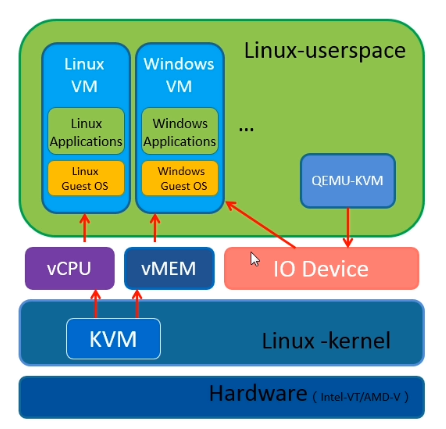
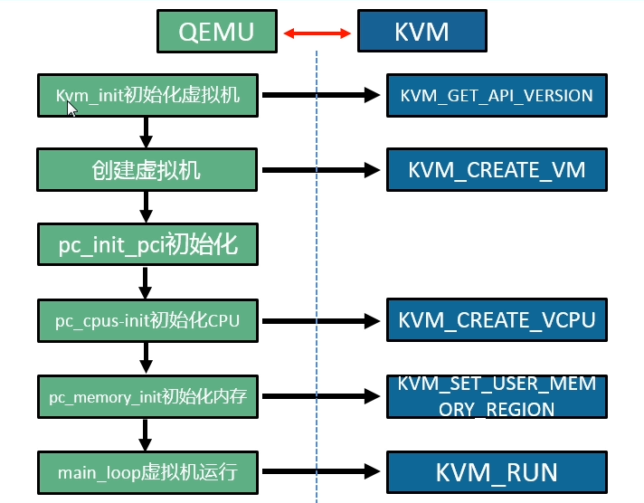

# KVM Theory

## What is KVM 

KVM：Kernel-based Virtual Machine

KVM基础架构

qemu-kvm调用KVM的过程：

## 虚拟化基础

### 虚拟化方法

虚拟化的方法主要包括以下3个方面：

- 全虚拟化
- 半虚拟化
- 硬件辅助虚拟化

|           | 全虚拟化        | 半虚拟化      | 硬件辅助虚拟化 |
| --------- | --------------- | ------------- | -------------- |
| CPU虚拟化 | 特权压缩+BT翻译 | 内核改造      | VT-x/AMD-v     |
| MEM虚拟化 | 影子页表        | 页表写入法    | EPT            |
| I/O虚拟化 | 模拟I/O设备     | 前端/后端架构 | VT-d/IOMMU/IOV |

### CPU虚拟化

### 内存虚拟化

### I/O虚拟化