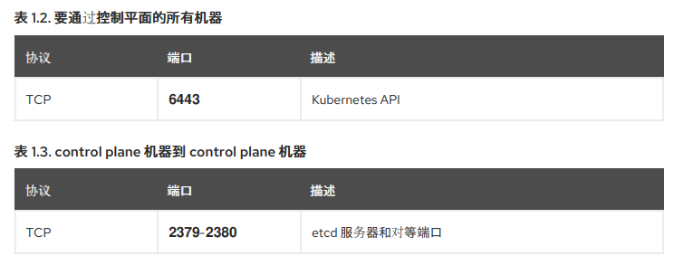

# Deployment

> 本章主要介绍如何对OpenShift4.6.1环境进行快速部署，能够简单上手使用的记录，适用于个人或者公司中对OpenShift容器平台的学习与研究


## Author

```
Name:Shinefire
Blog:https://github.com/shine-fire/Ops_Notes
E-mail:shine_fire@outlook.com
```


## Introduction

### Terminology

#### OpenShift是什么？

#### UPI（UserProvisioned Infrastructure）

离线环境安装的方案	

#### IPI（Installer Provisioned Infrastructure）

在线环境安装的方案


## Architecture

### Host List

| Hostname                   | IP             | Hardware     | Role       |
| -------------------------- | -------------- | ------------ | ---------- |
| bastion.ocp4.example.com   | 192.168.31.159 | 4C/8G/120GB  |            |
| registry.ocp4.example.com  | 192.168.31.159 | 4C/8G/120GB  | 镜像仓库   |
| api.ocp4.example.com       | 192.168.31.159 | 4C/8G/120GB  |            |
| api-int.ocp4.example.com   | 192.168.31.159 | 4C/8G/120GB  |            |
| bootstrap.ocp4.example.com | 192.168.31.160 | 4C/16G/120GB | bootstrap  |
| master-1.ocp4.example.com  | 192.168.31.161 | 4C/16G/120GB | master节点 |
| etcd-1.ocp4.example.com    | 192.168.31.161 | 4C/16G/120GB |            |
| master-2.ocp4.example.com  | 192.168.31.162 | 4C/16G/120GB | master节点 |
| etcd-2.ocp4.example.com    | 192.168.31.162 | 4C/16G/120GB |            |
| master-3.ocp4.example.com  | 192.168.31.163 | 4C/16G/120GB | master节点 |
| etcd-3.ocp4.example.com    | 192.168.31.163 | 4C/16G/120GB |            |
| worker-1.ocp4.example.com  | 192.168.31.164 | 2C/8G/120GB  | worker节点 |
| apps.ocp4.example.com      | 192.168.31.164 | 2C/8G/120GB  |            |
| worker-2.ocp4.example.com  | 192.168.31.165 | 2C/8G/120GB  | worker节点 |
| 192.168.31.100             | 192.168.31.100 | N/A          | YUM/DNS    |

Each cluster machine must meet the following **minimum requirements**:

| Machine                                                      | Operating System        | vCPU | Virtual RAM | Storage |
| :----------------------------------------------------------- | :---------------------- | :---- | :---------- | :------ |
| Bootstrap                                                    | RHCOS                   | 4     | 16 GB       | 120 GB  |
| Control plane                                                | RHCOS                   | 4     | 16 GB       | 120 GB  |
| Compute                                                      | RHCOS or RHEL 7.8 - 7.9 | 2     | 8 GB        | 120 GB  |


### Softwares List

| 软件名称              | 软件包名                                    |
| --------------------- | ------------------------------------------- |
| RHEL7.8 DVD           | rhel-server-7.8-x86_64-dvd.iso              |
| Extras仓库            | rhel-7-server-extras-rpms.tar.gz            |
| 镜像仓库软件          | docker-io-registry-2.tar                    |
| Registry仓库镜像      | openshift-4.5.13-registry.tar.gz2           |
| Openshift客户端oc命令 | openshift-client-linux-4.5.13.tar.gz        |
| Openshift安装程序     | openshift-install-4.5.13-example.com.tar.gz |
| CoreOS引导光盘        | rhcos-4.5.6-x86_64-installer.iso            |
| CoreOS远程部署内核    | rhcos-4.5.6-x86_64-metal.raw.gz             |


### Firewalld Ports

#### 所有机器到所有机器

| 协议    | 端口        | 描述                                                         |
| ------- | :---------- | ------------------------------------------------------------ |
| ICMP    | N/A         | 网络可访问性测试                                             |
| TCP     | 1936        | 指标                                                         |
| TCP     | 9000-9999   | 主机级别的服务，包括端口 9100-9101 上的节点导出器和端口 9099 上的 Cluster Version Operator |
| TCP     | 10250-10259 | kubernetes保留的默认端口                                     |
| TCP     | 10256       | openshift-sdn                                                |
| UDP     | 4789        | VXLAN & Geneve                                               |
| UDP     | 6081        | VXLAN & Geneve                                               |
| UDP     | 9000-9999   | 主机级别的服务，包括端口9100-9101上的节点导出器              |
| TCP/UDP | 30000-32767 | kubernetes节点端口                                           |




## Deployment


### Create bastion

---

all machines are kvm VMs in this test environment 

```bash
virt-install \
--virt-type kvm \
--name ocp461-bastion \
--vcpus 4 \
--memory 8192 \
--os-variant=rhel7 \
--disk path=/var/lib/libvirt/images/ocp461-bastion.qcow2,size=60,format=qcow2,bus=virtio \
--location /ISO/rhel7/rhel-server-7.8-x86_64-dvd.iso \
--nographics \
-x "ks=http://192.168.31.100/ks/rhel7/ks.cfg"
```


### bastion env deploy

---

#### Network Configure

etc.

#### SELinux Configure

```bash
[root@bastion ~]# sed -i 's/SELINUX=enforcing/SELINUX=disabled/g' /etc/selinux/config
[root@bastion ~]# setenforce 0
```

#### Firewalld Configure

```bash
[root@bastion ~]# systemctl disable firewalld
Removed symlink /etc/systemd/system/multi-user.target.wants/firewalld.service.
Removed symlink /etc/systemd/system/dbus-org.fedoraproject.FirewallD1.service.
[root@bastion ~]# iptables -F
```

#### Yum Repo Configure

192.168.31.100 是我的环境内现成的一个yum服务器，所以只要配置一下repofile即可使用两个需要的源。

```bash
[root@bastion ~]# yum repolist
Loaded plugins: product-id, search-disabled-repos, subscription-manager

This system is not registered with an entitlement server. You can use subscriptioregister.

repo id                                     repo name
rhel-7-server-extras-rpms                   rhel-7-server-extras-rpms
rhel-7-server-rpms                          rhel-7-server-rpms
repolist: 6,651
```

#### Install some rpms

install podman and httpd-tools

```
[root@bastion ~]# yum -y install podman httpd httpd-tools vim
```

#### Configure Httpd

```bash
[root@bastion ~]# vi /etc/httpd/conf/httpd.conf
[root@bastion ~]# grep 8080 /etc/httpd/conf/httpd.conf
Listen 8080
[root@bastion ~]# systemctl enable httpd --now
```

#### Deploy DNS

正常应该是这样在bastion里面配置好DNS即可，不过我的环境里面有一个DNS服务器了，所以就没有配置在bastion这台服务器里面了，直接所有的服务器连接DNS服务器即可。

DNS 用于名称解析和反向名称解析。DNS A/AAAA 或 CNAME 记录用于名称解析，PTR 记录用于反向解析名称。反向记录很重要，因为 Red Hat Enterprise Linux CoreOS（RHCOS）使用反向记录为所有节点设置主机名。另外，反向记录用于生成 OpenShift Container Platform 需要操作的证书签名请求（CSR）。

```bash
[root@bastion ~]# yum install dnsmasq -y
[root@bastion ~]# vim /etc/dnsmasq.d/ocp4.conf
ddress=/bastion.ocp4.shinefire.com/192.168.31.159
address=/registry.ocp4.shinefire.com/192.168.31.159
address=/api.ocp4.shinefire.com/192.168.31.159
address=/api-int.ocp4.shinefire.com/192.168.31.159
address=/bootstrap.ocp4.shinefire.com/192.168.31.160
address=/master-1.ocp4.shinefire.com/192.168.31.161
address=/etcd-1.ocp4.shinefire.com/192.168.31.161
address=/master-2.ocp4.shinefire.com/192.168.31.162
address=/etcd-2.ocp4.shinefire.com/192.168.31.162
address=/master-3.ocp4.shinefire.com/192.168.31.163
address=/etcd-3.ocp4.shinefire.com/192.168.31.163
address=/worker-1.ocp4.shinefire.com/192.168.31.164
address=/worker-2.ocp4.shinefire.com/192.168.31.165
address=/apps.ocp4.shinefire.com/192.168.31.163
ptr-record=159.31.168.192.in-addr.arpa,bastion.ocp4.shinefire.com
ptr-record=159.31.168.192.in-addr.arpa,api.ocp4.shinefire.com
ptr-record=160.31.168.192.in-addr.arpa,bootstrap.ocp4.shinefire.com
ptr-record=161.31.168.192.in-addr.arpa,master-1.ocp4.shinefire.com
ptr-record=162.31.168.192.in-addr.arpa,master-2.ocp4.shinefire.com
ptr-record=163.31.168.192.in-addr.arpa,master-3.ocp4.shinefire.com
ptr-record=164.31.168.192.in-addr.arpa,worker-1.ocp4.shinefire.com
ptr-record=165.31.168.192.in-addr.arpa,worker-2.ocp4.shinefire.com
srv-host=_etcd-server-ssl._tcp.ocp4.shinefire.com,etcd-0.ocp4.shinefire.com,2380,10
srv-host=_etcd-server-ssl._tcp.ocp4.shinefire.com,etcd-1.ocp4.shinefire.com,2380,10
srv-host=_etcd-server-ssl._tcp.ocp4.shinefire.com,etcd-2.ocp4.shinefire.com,2380,10
log-queries

[root@bastion ~]# systemctl enable dnsmasq --now
Created symlink from /etc/systemd/system/multi-user.target.wants/dnsmasq.service to /usr/lib/systemd/system/dnsmasq.service.
```

#### Configure DNS Server

```bash
[root@bastion ~]# vim /etc/resolv.conf
# Generated by NetworkManager
search ocp4.shinefire.com
nameserver 192.168.31.159

[root@bastion ~]# nslookup bootstrap.ocp4.shinefire.com
Server:         192.168.31.159
Address:        192.168.31.159#53

Name:   bootstrap.ocp4.shinefire.com
Address: 192.168.31.158

[root@bastion ~]# ping -c 2 bootstrap.ocp4.shinefire.com
PING bootstrap.ocp4.shinefire.com (192.168.31.158) 56(84) bytes of data.
64 bytes from bootstrap.ocp4.shinefire.com (192.168.31.158): icmp_seq=1 ttl=64 time=0.372 ms
64 bytes from bootstrap.ocp4.shinefire.com (192.168.31.158): icmp_seq=2 ttl=64 time=0.369 ms

--- bootstrap.ocp4.example.com ping statistics ---
2 packets transmitted, 2 received, 0% packet loss, time 1000ms
rtt min/avg/max/mdev = 0.369/0.370/0.372/0.019 ms
```

#### Upload all softwares

```bash
[root@bastion ~]# ls softwares/
docker-io-registry-2.tar                    openshift-client-linux-4.6.6.tar.gz
ocp4.6.6-registry-fullsize-20200105.tar.gz  openshift-install
rhcos-4.6.1-x86_64-metal.x86_64.raw.gz      rhcos-4.5.1-x86_64-installer.x86_64.iso
```

#### Install Openshift Client

```bash
[root@bastion ~]# wget https://mirror.openshift.com/pub/openshift-v4/clients/ocp/4.6.6/openshift-client-linux-4.6.6.tar.gz
--2021-06-01 00:24:54--  https://mirror.openshift.com/pub/openshift-v4/clients/ocp/4.6.6/openshift-client-linux-4.6.6.tar.gz
Resolving mirror.openshift.com (mirror.openshift.com)... 54.173.18.88, 54.172.163.83
Connecting to mirror.openshift.com (mirror.openshift.com)|54.173.18.88|:443... connected.
HTTP request sent, awaiting response... 200 OK
Length: 24316599 (23M) [application/x-gzip]
Saving to: ‘openshift-client-linux-4.6.6.tar.gz’

100%[====================================================>] 24,316,599  1.55MB/s   in 26s

2021-06-01 00:25:20 (926 KB/s) - ‘openshift-client-linux-4.6.6.tar.gz’ saved [24316599/24316599]

[root@bastion ~]# tar xzvf openshift-client-linux-4.6.6.tar.gz -C /usr/local/bin/ 
README.md
oc
kubectl

# 验证版本号
[root@bastion ~]# oc version
Client Version: 4.6.6
```

#### Install openshift-install

```bash
# 去官网下载资源
[root@bastion ~]# wget https://mirror.openshift.com/pub/openshift-v4/clients/ocp/4.6.6/openshift-install-linux-4.6.6.tar.gz
--2021-06-01 00:29:05--  https://mirror.openshift.com/pub/openshift-v4/clients/ocp/4.6.6/openshift-install-linux-4.6.6.tar.gz
Resolving mirror.openshift.com (mirror.openshift.com)... 54.173.18.88, 54.172.173.155
Connecting to mirror.openshift.com (mirror.openshift.com)|54.173.18.88|:443... connected.
HTTP request sent, awaiting response... 200 OK
Length: 86926929 (83M) [application/x-gzip]
Saving to: ‘openshift-install-linux-4.6.6.tar.gz’

100%[====================================================>] 86,926,929   997KB/s   in 69s

2021-06-01 00:30:16 (1.19 MB/s) - ‘openshift-install-linux-4.6.6.tar.gz’ saved [86926929/86926929]

[root@bastion ~]# tar xzvf openshift-install-linux-4.6.6.tar.gz -C /usr/local/bin/
README.md
openshift-install

# 验证版本
[root@bastion ~]# openshift-install version
openshift-install 4.6.6
built from commit db0f93089a64c5fd459d226fc224a2584e8cfb7e
release image quay.io/openshift-release-dev/ocp-release@sha256:c7e8f18e8116356701bd23ae3a23fb9892dd5ea66c8300662ef30563d7104f39
```


### Download image

---

#### Download pull secret

进入官网使用自己的红帽用户获取pull secret，用于后续pull镜像。可以直接点击`Copy pull secret`然后粘贴到linux中自己创建的文件里即可（主要是比直接下载了这个文件再上传到服务器中方便一点）。

> 未订阅Openshift的用户，也可以申请试用的。


#### Install jq

配置好epel源安装jq软件即可，安装jq工具是为了解析这个secret文件。

```bash
]# yum install jq -y
```

#### Save recret

```bash
[root@bastion ~]# mkdir -p /data/OCP-Install/ocp/secret/
[root@bastion ~]# jq . ./pull-secret.txt  > /data/OCP-Install/ocp/secret/redhat-secret.json

# 验证
[root@bastion ~]# jq . /data/OCP-Install/ocp/secret/pull-secret.txt
[root@bastion ~]# cat /data/OCP-Install/ocp/secret/redhat-secret.json
```

#### View images info

```bash
[root@bastion ~]# oc adm release info "quay.io/openshift-release-dev/ocp-release:4.6.6-x86_64"
Name:      4.6.6
Digest:    sha256:c7e8f18e8116356701bd23ae3a23fb9892dd5ea66c8300662ef30563d7104f39
Created:   2020-11-26T04:01:37Z
OS/Arch:   linux/amd64
Manifests: 444

Pull From: quay.io/openshift-release-dev/ocp-release@sha256:c7e8f18e8116356701bd23ae3a23fb9892dd5ea66c8300662ef30563d7104f39

Release Metadata:
  Version:  4.6.6
  Upgrades: 4.5.16, 4.5.17, 4.5.18, 4.5.19, 4.5.20, 4.5.21, 4.6.1, 4.6.3, 4.6.4, 4.6.5
  Metadata:

Component Versions:
  kubernetes 1.19.0
  machine-os 46.82.202011210620-0 Red Hat Enterprise Linux CoreOS

Images:
  NAME                                           DIGEST
  aws-ebs-csi-driver                             sha256:0fa7138849062610db75f1de94606e1275dffb8f41af64e7d57afa6e09d0d2d9
  aws-ebs-csi-driver-operator                    sha256:2c3bc6cfd85707b0e11f478c8d3bbf321e0d0a0c75accba25501e9290937dbba
  aws-machine-controllers                        sha256:4c56695dceb2df100348432e10fc4939319a581b148f1981af53a82310681332
```

#### Download ocp core images

```bash
[root@bastion ~]# mkdir -p /data/OCP-4.6.6/ocp-image/ocp-image-4.6.6/
[root@bastion ~]# oc adm release mirror -a /data/OCP-Install/ocp/secret/redhat-secret.json --from=quay.io/openshift-release-dev/ocp-release:4.6.6-x86_64 --to-dir=/data/OCP-4.6.6/ocp-image/ocp-image-4.6.6
...
...
Success
Update image:  openshift/release:4.6.6

To upload local images to a registry, run:

    oc image mirror --from-dir=/data/OCP-4.6.6/ocp-image/ocp-image-4.6.6 'file://openshift/release:4.6.6*' REGISTRY/REPOSITORY

Configmap signature file /data/OCP-4.6.6/ocp-image/ocp-image-4.6.6/config/signature-sha256-c7e8f18e81163567.yaml created
```


### Deploy Container Registry

---

#### Create Directory

```bash
[root@bastion ~]# mkdir -p /opt/registry/{auth,certs,data}
```

#### Configure Certificate

```bash
[root@bastion ~]# cd /opt/registry/certs/
[root@bastion certs]# openssl req -subj '/CN=registry.ocp4.shinefire.com/O=My Company Name LTD./C=US' -new -newkey rsa:2048 -days 3650 -nodes -x509 -keyout domain.key -out domain.crt
Generating a 2048 bit RSA private key
.............................................+++
........+++
writing new private key to 'domain.key'
-----
```

#### Update crt

```bash
[root@bastion certs]# cp /opt/registry/certs/domain.crt /etc/pki/ca-trust/source/anchors/
[root@bastion certs]# update-ca-trust
```

#### Configure User & Password

Create the core user and set password

```bash
[root@bastion certs]# htpasswd -bBc /opt/registry/auth/htpasswd core redhat
Adding password for user core
```

#### Import registry2 image

```bash
[root@bastion ~]# podman load -i /root/softwares/docker-io-registry-2.tar
Getting image source signatures
Copying blob a330d9dc14ce done
Copying blob 9d08b7a37338 done
Copying blob c62467775792 done
Copying blob 588f0b714a86 done
Copying blob 7444ea29e45e done
Copying config 708bc6af7e done
Writing manifest to image destination
Storing signatures
Loaded image(s): docker.io/library/registry:2
```

#### Start registry2 podman

```bash
[root@bastion ~]# podman run --name mirror-registry -p 5000:5000 \
-v /opt/registry/data:/var/lib/registry:z \
-v /opt/registry/auth:/auth:z \
-e "REGISTRY_AUTH=htpasswd" \
-e "REGISTRY_AUTH_HTPASSWD_REALM=Registry Realm" \
-e REGISTRY_AUTH_HTPASSWD_PATH=/auth/htpasswd \
-v /opt/registry/certs:/certs:z \
-e REGISTRY_HTTP_TLS_CERTIFICATE=/certs/domain.crt \
-e REGISTRY_HTTP_TLS_KEY=/certs/domain.key \
-d docker.io/library/registry:2
8f1254b20992f843793f574101bf74b255d0f65e45802b26c46b6f4f757e6f99

[root@bastion ~]# podman ps
CONTAINER ID  IMAGE                         COMMAND               CREATED         STATUS             PORTS                   NAMES
b222b1dad284  docker.io/library/registry:2  /entrypoint.sh /e...  32 seconds ago  Up 31 seconds ago  0.0.0.0:5000->5000/tcp  mirror-registry
```

#### Generate local registry secret

用于后续镜像导入使用

```bash
[root@bastion certs]# podman login -u core -p redhat --authfile /data/OCP-Install/ocp/secret/registry-secret.json https://registry.ocp4.shinefire.com:5000
Login Succeeded!
[root@bastion certs]# ls /data/OCP-Install/ocp/secret/registry-secret.json
/data/OCP-Install/ocp/secret/registry-secret.json
```

#### Mirror images

将下载好的openshift核心镜像全部同步到内部的这个registry中

```bash
[root@bastion ~]# oc image mirror -a /data/OCP-Install/ocp/secret/registry-secret.json --dir=/data/OCP-4.6.6/ocp-image/ocp-image-4.6.6/ file://openshift/release:4.6.6* https://registry.ocp4.shinefire.com:5000/ocp4/openshift4
```


#### Uncompress ocp registry

```bash
[root@bastion ~]# tar xzvf /root/softwares/ocp4.6.6-registry-fullsize-20200105.tar.gz -C /opt/registry/data/
```

#### Restart Pod

need to restart twice

```bash
[root@bastion ~]# podman ps
CONTAINER ID  IMAGE                         COMMAND               CREATED         STATUS             PORTS                   NAMES
fd1527a06d4f  docker.io/library/registry:2  /entrypoint.sh /e...  35 seconds ago  Up 35 seconds ago  0.0.0.0:5000->5000/tcp  mirror-registry
[root@bastion ~]# podman restart fd1527a06d4f
Error: cannot listen on the TCP port: listen tcp4 :5000: bind: address already in use
[root@bastion ~]# podman restart fd1527a06d4f
660e36f04ec8cea77b4ac47eb64bb28c512f2b83b999ecb69257b45181d4ae85
```

#### Test result

```bash
[root@bastion ~]# curl -u core:redhat -k https://registry.ocp4.shinefire.com:5000/v2/_catalog
{"repositories":["ocp4/openshift466","operator/openshift4/ose-cluster-logging-operator","operator/openshift4/ose-cluster-logging-operator-bundle","operator/openshift4/ose-elasticsearch-operator","operator/openshift4/ose-elasticsearch-operator-bundle","operator/openshift4/ose-elasticsearch-proxy","operator/openshift4/ose-logging-curator5","operator/openshift4/ose-logging-elasticsearch6","operator/openshift4/ose-logging-fluentd","operator/openshift4/ose-logging-kibana6","operator/openshift4/ose-oauth-proxy","redhat/redhat-operator-index"]}

[root@bastion ~]# curl -u core:redhat -k https://registry.ocp4.example.com:5000/v2/ocp4/openshift466/tags/list
{"name":"ocp4/openshift466","tags":["4.6.6-cluster-openshift-apiserver-operator","4.6.6-ironic-machine-os-downloader","4.6.6-cluster-openshift-controller-manager-operator","4.6.6-prom-label-proxy","4.6.6-cluster-samples-operator","4.6.6-installer","4.6.6-jenkins-agent-maven","4.6.6-machine-os-content","4.6.6-libvirt-machine-controllers","4.6.6-network-metrics-daemon","4.6.6-cluster-kube-storage-version-migrator-operator","4.6.6-ovirt-machine-controllers","4.6.6-kuryr-controller","4.6.6-kube-storage-version-migrator","4.6.6-ovirt-csi-driver","4.6.6-cluster-network-operator","4.6.6-openshift-apiserver","4.6.6-kube-state-metrics","4.6.6-machine-config-operator","4.6.6-local-storage-static-provisioner","4.6.6-cluster-kube-apiserver-operator","4.6.6-operator-marketplace","4.6.6-console-operator","4.6.6-prometheus-node-exporter","4.6.6-cluster-monitoring-operator","4.6.6-csi-external-resizer","4.6.6-docker-registry","4.6.6-cluster-bootstrap","4.6.6-csi-external-snapshotter","4.6.6-tests","4.6.6-csi-external-provisioner","4.6.6-cluster-storage-operator","4.6.6-cloud-credential-operator","4.6.6-cluster-machine-approver","4.6.6-ironic-ipa-downloader","4.6.6-openstack-machine-controllers","4.6.6-cluster-authentication-operator","4.6.6-machine-api-operator","4.6.6-cluster-version-operator","4.6.6-aws-pod-identity-webhook","4.6.6-operator-registry","4.6.6-ironic-static-ip-manager","4.6.6-oauth-apiserver","4.6.6-insights-operator","4.6.6-prometheus","4.6.6-pod","4.6.6-openshift-controller-manager","4.6.6-openshift-state-metrics","4.6.6-cluster-kube-scheduler-operator","4.6.6-jenkins-agent-nodejs","4.6.6-csi-driver-manila","4.6.6-cluster-update-keys","4.6.6-sdn","4.6.6-multus-whereabouts-ipam-cni","4.6.6-csi-snapshot-controller","4.6.6-cluster-kube-controller-manager-operator","4.6.6-aws-ebs-csi-driver","4.6.6-ovirt-csi-driver-operator","4.6.6-hyperkube","4.6.6-cluster-etcd-operator","4.6.6-cli-artifacts","4.6.6-telemeter","4.6.6-oauth-proxy","4.6.6-cluster-image-registry-operator","4.6.6-multus-admission-controller","4.6.6-grafana","4.6.6-multus-cni","4.6.6-gcp-machine-controllers","4.6.6-aws-machine-controllers","4.6.6-csi-external-attacher","4.6.6-prometheus-config-reloader","4.6.6-cluster-dns-operator","4.6.6-installer-artifacts","4.6.6-haproxy-router","4.6.6-kube-rbac-proxy","4.6.6-tools","4.6.6-cluster-autoscaler-operator","4.6.6-deployer","4.6.6-prometheus-operator","4.6.6-cluster-autoscaler","4.6.6-container-networking-plugins","4.6.6-ironic","4.6.6-prometheus-alertmanager","4.6.6-oauth-server","4.6.6-keepalived-ipfailover","4.6.6-ovn-kubernetes","4.6.6-thanos","4.6.6-docker-builder","4.6.6-multus-route-override-cni","4.6.6-mdns-publisher","4.6.6-cluster-node-tuning-operator","4.6.6-ironic-hardware-inventory-recorder","4.6.6-cluster-csi-snapshot-controller-operator","4.6.6-cli","4.6.6-jenkins","4.6.6-baremetal-machine-controllers","4.6.6-cluster-ingress-operator","4.6.6-console","4.6.6-baremetal-installer","4.6.6-csi-driver-nfs","4.6.6-baremetal-runtimecfg","4.6.6-cluster-policy-controller","4.6.6-x86_64","4.6.6-coredns","4.6.6-csi-node-driver-registrar","4.6.6-kube-proxy","4.6.6-etcd","4.6.6-configmap-reloader","4.6.6-azure-machine-controllers","4.6.6-csi-driver-manila-operator","4.6.6-aws-ebs-csi-driver-operator","4.6.6-service-ca-operator","4.6.6-ironic-inspector","4.6.6-kuryr-cni","4.6.6-k8s-prometheus-adapter","4.6.6-baremetal-operator","4.6.6-must-gather","4.6.6-operator-lifecycle-manager","4.6.6-cluster-config-operator","4.6.6-csi-livenessprobe"]}
```

#### Login Test

```bash
[root@bastion ~]# cp /opt/registry/certs/domain.crt /etc/pki/ca-trust/source/anchors/
[root@bastion ~]# update-ca-trust
[root@bastion ~]# podman login -u core -p redhat registry.ocp4.example.com:5000
```


### Deploy oc & openshift-install command

---

#### Deploy oc command

```bash
[root@bastion ~]# tar xzvf softwares/openshift-client-linux-4.6.6.tar.gz
README.md
oc
kubectl
[root@bastion ~]# mv oc /usr/local/bin/
[root@bastion ~]# mv kubectl /usr/local/bin/
[root@bastion ~]# oc version
Client Version: 4.6.6
```

#### Deploy openshift-install command

```bash
[root@bastion ~]# mv softwares/openshift-install /usr/local/bin/
[root@bastion ~]# openshift-install version
openshift-install v4.6.1-10yrs
built from commit 9335058f0d796abc3f36a21f5398a700b32a6c68
release image registry.svc.ci.openshift.org/origin/release:4.6
```

> the openshift-install file was modified


### Deploy HAProxy

haproxy主要用于负载master api 6443 ，worker节点的router 80 443

#### Install HAProxy

```bash
[root@bastion ~]# yum install haproxy -y
```

#### Configure HAProxy(need modify )

```bash
[root@bastion ~]# vim /etc/haproxy/haproxy.cfg
[root@bastion ~]# cat /etc/haproxy/haproxy.cfg
#---------------------------------------------------------------------
# Example configuration for a possible web application.  See the
# full configuration options online.
#
#   http://haproxy.1wt.eu/download/1.4/doc/configuration.txt
#
#---------------------------------------------------------------------

#---------------------------------------------------------------------
# Global settings
#---------------------------------------------------------------------
global
    # to have these messages end up in /var/log/haproxy.log you will
    # need to:
    #
    # 1) configure syslog to accept network log events.  This is done
    #    by adding the '-r' option to the SYSLOGD_OPTIONS in
    #    /etc/sysconfig/syslog
    #
    # 2) configure local2 events to go to the /var/log/haproxy.log
    #   file. A line like the following can be added to
    #   /etc/sysconfig/syslog
    #
    #    local2.*                       /var/log/haproxy.log
    #
    log         127.0.0.1 local2

    chroot      /var/lib/haproxy
    pidfile     /var/run/haproxy.pid
    maxconn     40000
    user        haproxy
    group       haproxy
    daemon

    # turn on stats unix socket
    stats socket /var/lib/haproxy/stats

#---------------------------------------------------------------------
# common defaults that all the 'listen' and 'backend' sections will
# use if not designated in their block
#---------------------------------------------------------------------
defaults
    mode                    tcp
    log                     global
    option                  tcplog
    option                  dontlognull
    option http-server-close
    option forwardfor       except 127.0.0.0/8
    option                  redispatch
    retries                 3
    timeout http-request    10s
    timeout queue           1m
    timeout connect         10s
    timeout client          1m
    timeout server          1m
    timeout http-keep-alive 10s
    timeout check           10s
    maxconn                 30000


# 可选项,可以通过页面查看负载监控状态
listen stats
    bind :9000
    mode http
    stats enable
    stats uri /
    monitor-uri /healthz

# 负载master api，bootstrap 后面删掉
frontend openshift-api-server
    bind *:6443
    default_backend openshift-api-server

backend openshift-api-server
    #balance source
    server bootstrap 192.168.31.158:6443 check
    server master0 192.168.31.160:6443 check
    server master1 192.168.31.161:6443 check
    server master2 192.168.31.162:6443 check

frontend machine-config-server
    bind *:22623
    default_backend machine-config-server

backend machine-config-server
    #balance source
    server bootstrap 192.168.31.158:22623 check
    server master0 192.168.31.160:22623 check
    server master1 192.168.31.161:22623 check
    server master2 192.168.31.162:22623 check

# 负载router，就是*.apps.ocp4.example.com , 这个域名如果 dns server 指向了本机，则这边必须配置，否则对于测试环境可选项。
frontend ingress-http
    bind *:80
    default_backend ingress-http

backend ingress-http
    #balance source
    server worker-0 192.168.31.163:80 check
    server worker-1 192.168.31.164:80 check

frontend ingress-https
    bind *:443
    default_backend ingress-https

backend ingress-https
    #balance source
    server worker-0 192.168.31.163:443 check
    server worker-1 192.168.31.164:443 check

```

#### Start HAProxy

```bash
[root@bastion ~]# systemctl enable haproxy --now
Created symlink from /etc/systemd/system/multi-user.target.wants/haproxy.service to /usr/lib/systemd/system/haproxy.service.
```


### Build RHCOS ISO

---

#### Install RPMs

```bash
[root@bastion ~]# yum -y install genisoimage libguestfs-tools libvirt
```

#### Start libvirtd Service

```bash
[root@bastion ~]# systemctl start libvirtd
```

#### Develop shell script

```bash
[root@bastion ~]# vim custom_rhcos.sh 
[root@bastion ~]# cat custom_rhcos.sh
export RHCOS_ISO_DIRECTORY=/root/softwares
export NEW_ISO_DIRECTORY=/root/isos
export TEMPDIR=/tmp/genisos
echo $TEMPDIR
sudo rm -rf ${TEMPDIR}
mkdir ${TEMPDIR}
mkdir ${NEW_ISO_DIRECTORY}
cd ${TEMPDIR}

export RHCOSVERSION=4.5.1
export LIBGUESTFS_BACKEND=direct
export VOLID=$(isoinfo -d -i ${RHCOS_ISO_DIRECTORY}/rhcos-${RHCOSVERSION}-x86_64-installer.x86_64.iso | awk '/Volume id/ { print $3 }')
echo $VOLID


# Extract the ISO content using guestfish (to avoid sudo mount)
guestfish -a ${RHCOS_ISO_DIRECTORY}/rhcos-${RHCOSVERSION}-x86_64-installer.x86_64.iso \
  -m /dev/sda tar-out / - | tar xvf -

chmod u+w ${TEMPDIR}
# Helper function to modify the config files
modify_cfg(){
  for file in "EFI/redhat/grub.cfg" "isolinux/isolinux.cfg"; do
    # Append the proper image and ignition urls
    sed -e '/coreos.inst=yes/s|$| coreos.inst.install_dev=sda coreos.inst.image_url='"${URL}"'\/install\/rhcos-4.6.1-x86_64-metal.x86_64.raw.gz coreos.inst.ignition_url='"${URL}"'\/ignition\/'"${TYPE}"'.ign ip='"${IP}"'::'"${GATEWAY}"':'"${NETMASK}"':'"${FQDN}"':'"${NET_INTERFACE}"':none:'"${DNS}"' nameserver='"${DNS}"'|' ${file} > $(pwd)/${NODE}_${file##*/}
    # Boot directly in the installation
    sed -i -e 's/default vesamenu.c32/default linux/g' -e 's/timeout 600/timeout 10/g' $(pwd)/${NODE}_${file##*/}
  done
}

URL="http://192.168.31.159:8080"
GATEWAY="192.168.31.1"
NETMASK="255.255.255.0"
DNS="192.168.31.159"

# BOOTSTRAP
TYPE="bootstrap"
NODE="bootstrap-static"
IP="192.168.31.158"
FQDN="bootstrap"
BIOSMODE="bios"
NET_INTERFACE="ens3"
modify_cfg

# MASTERS
TYPE="master"
# MASTER-0
NODE="master-0"
IP="192.168.31.160"
FQDN="master-0"
BIOSMODE="bios"
NET_INTERFACE="ens3"
modify_cfg

# MASTER-1
TYPE="master"
NODE="master-1"
IP="192.168.31.161"
FQDN="master-1"
BIOSMODE="bios"
NET_INTERFACE="ens3"
modify_cfg

# MASTER-2
TYPE="master"
NODE="master-2"
IP="192.168.31.162"
FQDN="master-2"
BIOSMODE="bios"
NET_INTERFACE="ens3"
modify_cfg

# WORKERS
TYPE="worker"
NODE="worker-0"
IP="192.168.31.163"
FQDN="worker-0"
BIOSMODE="bios"
NET_INTERFACE="ens3"
modify_cfg

TYPE="worker"
NODE="worker-1"
IP="192.168.31.164"
FQDN="worker-1"
BIOSMODE="bios"
NET_INTERFACE="ens3"
modify_cfg

# Generate the images, one per node as the IP configuration is different...
# https://github.com/coreos/coreos-assembler/blob/master/src/cmd-buildextend-installer#L97-L103
for node in master-0 master-1 master-2 worker-0 worker-1 bootstrap-static; do
  # Overwrite the grub.cfg and isolinux.cfg files for each node type
  for file in "EFI/redhat/grub.cfg" "isolinux/isolinux.cfg"; do
   sudo /bin/cp -f $(pwd)/${node}_${file##*/} ${file}
  done
  # As regular user!
sudo genisoimage -verbose -rock -J -joliet-long -volset ${VOLID} \
    -eltorito-boot isolinux/isolinux.bin -eltorito-catalog isolinux/boot.cat \
    -no-emul-boot -boot-load-size 4 -boot-info-table \
    -eltorito-alt-boot -efi-boot images/efiboot.img -no-emul-boot \
    -o ${NEW_ISO_DIRECTORY}/${node}.iso .
done
```

#### Run script create iso file

```bash
[root@bastion ~]# sh custom_rhcos.sh
[root@bastion ~]# ls isos/
bootstrap-static.iso  master-0.iso  master-1.iso  master-2.iso  worker-0.iso  worker-1.iso
```

#### Check the result

check the iso grub.cfg

```bash
[root@bastion ~]# cat /tmp/genisos/master-0_grub.cfg
# This file is copied from
# https://github.com/coreos/fedora-coreos-config

set default="1"

function load_video {
  insmod efi_gop
  insmod efi_uga
  insmod video_bochs
  insmod video_cirrus
  insmod all_video
}

load_video
set gfxpayload=keep
insmod gzio
insmod part_gpt
insmod ext2

set timeout=60
### END /etc/grub.d/00_header ###

### BEGIN /etc/grub.d/10_linux ###
menuentry 'Install RHEL CoreOS' --class fedora --class gnu-linux --class gnu --class os {
        linux /images/vmlinuz nomodeset rd.neednet=1 coreos.inst=yes coreos.inst.install_dev=sda coreos.inst.image_url=http://192.168.31.159:8080/install/rhcos-4.5.1-x86_64-metal.x86_64.raw.gz coreos.inst.ignition_url=http://192.168.31.159:8080/ignition/master.ign ip=192.168.31.160::192.168.31.1:255.255.255.0:master-0:eth0:none:192.168.31.159 nameserver=192.168.31.159
        initrd /images/initramfs.img
}
```

right: coreos.inst.install_dev=sda ...


### Install OpenShift

---

#### Create ssh key on bastion

```bash
[root@bastion ~]# ssh-keygen -t rsa -b 2048 -N "" -f ~/.ssh/id_rsa
```

#### View the pub key and registry cert

```bash
[root@bastion ~]# cat /root/.ssh/id_rsa.pub
ssh-rsa AAAAB3NzaC1yc2EAAAADAQABAAABAQC4H7j5oBox40Ikezq5i32JSwNroFxLDBRVd0OAXF/2+n85ORS3LcsZiYsuumnGCb8QkFUsXdxkCL/vIn55ARB/9eASn/5I/KfPEwKdFlLXWpbLVZDtFW++BGHcGFgOY7YWPC7iPjAbX00SIHezyzEV1B2Rfd+GIykDykwHdcEeJSmOZb2u0BWMkaaXhLClU0qo2Uw7pkXfxZ8ALuRRHn5AMbSMNskSdOQUTo8hRSixjA03JD65t4FbMQt0mr9Lu1jRTGr+7cBVydQn5ZKvFeKmhawqrW2D9O6ngNvLQVvW7Te5v3QuJApwgrRdl7LClce45JPTKqQSZuQDkFaIR9iF root@bastion.ocp4.example.com

[root@bastion ~]# cat /opt/registry/certs/domain.crt
-----BEGIN CERTIFICATE-----
MIIDczCCAlugAwIBAgIJAK0n0qJVn1y0MA0GCSqGSIb3DQEBCwUAMFAxIjAgBgNV
BAMMGXJlZ2lzdHJ5Lm9jcDQuZXhhbXBsZS5jb20xHTAbBgNVBAoMFE15IENvbXBh
bnkgTmFtZSBMVEQuMQswCQYDVQQGEwJVUzAeFw0yMTAzMDgwMzU4MjRaFw0yMjAz
MDgwMzU4MjRaMFAxIjAgBgNVBAMMGXJlZ2lzdHJ5Lm9jcDQuZXhhbXBsZS5jb20x
HTAbBgNVBAoMFE15IENvbXBhbnkgTmFtZSBMVEQuMQswCQYDVQQGEwJVUzCCASIw
DQYJKoZIhvcNAQEBBQADggEPADCCAQoCggEBAL4e7XLeDK8WR1G/baVLqvb5k1vG
O0ftDXE81hiETtOX1Qwc6RugeoU+thueF8/iaraAD1Q7thvSHnacbAAC1mn/1X2u
WknD6z7bq5X2TAB2ikwCgMF1NSQOkF25WfJzD16vdK+dIx+8lQRrffJ2w2xjm8UZ
Gk+uzRbhc6pBG5NdJswwUywBOX5Uzax14HuWk2v8LFkGEAgOiRIVh1WUYI7J5ocX
Hfkp0uzgRMqTR9X2xpQcH5wznBOAg5uUiznLgfKu1Bpo8fY1r2CYkoAL8n+MzMxR
qtGM7a1QzJZ8H0ApeIkkV2g5JWoh835c8xgSRDM1fKKHf8V1ZYynpgVl+ikCAwEA
AaNQME4wHQYDVR0OBBYEFMU1Mlwg5bmUZuWCbR9lH2ECgrXAMB8GA1UdIwQYMBaA
FMU1Mlwg5bmUZuWCbR9lH2ECgrXAMAwGA1UdEwQFMAMBAf8wDQYJKoZIhvcNAQEL
BQADggEBAKNR5P6iphbE0XJy1oZPHf0dIgRPEs54cc9PP2P0kQTcNShHtck9o4YJ
g9A3vG6jzfhjeFuYHchruVbLMHT1Jh/PCHCSX2Z38rKtDptKpW5QcCcgc7FCizOz
680p/2nPT7g29IX250owPeQNQn/mmnvPB1eOLjuusCcLXUvuO0VXN/+fXByEwdWC
SnuTIM/FikW+nLnbQgxqb8MoAGzwS6nHXcBGeXp8K5V4+X0R3cWjLqCrsn9Mue81
7rCWDIgGGxJEZu8vDxufZvdhoqBfwNwwLSe/x1QchFLbtAJ9keoUyPF5Bh6amJI6
Hmmg3lWoLp/yd+en3BQk3qgDkjPTf+M=
-----END CERTIFICATE-----
```

#### Decode registry user and password

``` bash
[root@bastion ~]# echo -n 'core:redhat' | base64 -w0
Y29yZTpyZWRoYXQ=
```

#### Create install-config.yaml

```bash
[root@bastion ~]# mkdir /root/ocp4
[root@bastion ~]# cd /root/ocp4
[root@bastion ocp4]# vim install-config.yaml
apiVersion: v1
baseDomain: example.com
compute:
- hyperthreading: Enabled
  name: worker
  replicas: 0
controlPlane:
  hyperthreading: Enabled
  name: master
  replicas: 3
metadata:
  name: ocp4
networking:
  clusterNetworks:
  - cidr: 10.254.0.0/16
    hostPrefix: 24
  networkType: OpenShiftSDN
  serviceNetwork:
  - 172.30.0.0/16
platform:
  none: {}
pullSecret: '{"auths":{"registry.ocp4.example.com:5000": {"auth": "Y29yZTpyZWRoYXQ=","email": "noemail@localhost"}}}'
sshKey: 'ssh-rsa AAAAB3NzaC1yc2EAAAADAQABAAABAQC4H7j5oBox40Ikezq5i32JSwNroFxLDBRVd0OAXF/2+n85ORS3LcsZiYsuumnGCb8QkFUsXdxkCL/vIn55ARB/9eASn/5I/KfPEwKdFlLXWpbLVZDtFW++BGHcGFgOY7YWPC7iPjAbX00SIHezyzEV1B2Rfd+GIykDykwHdcEeJSmOZb2u0BWMkaaXhLClU0qo2Uw7pkXfxZ8ALuRRHn5AMbSMNskSdOQUTo8hRSixjA03JD65t4FbMQt0mr9Lu1jRTGr+7cBVydQn5ZKvFeKmhawqrW2D9O6ngNvLQVvW7Te5v3QuJApwgrRdl7LClce45JPTKqQSZuQDkFaIR9iF root@bastion.ocp4.example.com'

additionalTrustBundle: |
  -----BEGIN CERTIFICATE-----
  MIIDczCCAlugAwIBAgIJAK0n0qJVn1y0MA0GCSqGSIb3DQEBCwUAMFAxIjAgBgNV
  BAMMGXJlZ2lzdHJ5Lm9jcDQuZXhhbXBsZS5jb20xHTAbBgNVBAoMFE15IENvbXBh
  bnkgTmFtZSBMVEQuMQswCQYDVQQGEwJVUzAeFw0yMTAzMDgwMzU4MjRaFw0yMjAz
  MDgwMzU4MjRaMFAxIjAgBgNVBAMMGXJlZ2lzdHJ5Lm9jcDQuZXhhbXBsZS5jb20x
  HTAbBgNVBAoMFE15IENvbXBhbnkgTmFtZSBMVEQuMQswCQYDVQQGEwJVUzCCASIw
  DQYJKoZIhvcNAQEBBQADggEPADCCAQoCggEBAL4e7XLeDK8WR1G/baVLqvb5k1vG
  O0ftDXE81hiETtOX1Qwc6RugeoU+thueF8/iaraAD1Q7thvSHnacbAAC1mn/1X2u
  WknD6z7bq5X2TAB2ikwCgMF1NSQOkF25WfJzD16vdK+dIx+8lQRrffJ2w2xjm8UZ
  Gk+uzRbhc6pBG5NdJswwUywBOX5Uzax14HuWk2v8LFkGEAgOiRIVh1WUYI7J5ocX
  Hfkp0uzgRMqTR9X2xpQcH5wznBOAg5uUiznLgfKu1Bpo8fY1r2CYkoAL8n+MzMxR
  qtGM7a1QzJZ8H0ApeIkkV2g5JWoh835c8xgSRDM1fKKHf8V1ZYynpgVl+ikCAwEA
  AaNQME4wHQYDVR0OBBYEFMU1Mlwg5bmUZuWCbR9lH2ECgrXAMB8GA1UdIwQYMBaA
  FMU1Mlwg5bmUZuWCbR9lH2ECgrXAMAwGA1UdEwQFMAMBAf8wDQYJKoZIhvcNAQEL
  BQADggEBAKNR5P6iphbE0XJy1oZPHf0dIgRPEs54cc9PP2P0kQTcNShHtck9o4YJ
  g9A3vG6jzfhjeFuYHchruVbLMHT1Jh/PCHCSX2Z38rKtDptKpW5QcCcgc7FCizOz
  680p/2nPT7g29IX250owPeQNQn/mmnvPB1eOLjuusCcLXUvuO0VXN/+fXByEwdWC
  SnuTIM/FikW+nLnbQgxqb8MoAGzwS6nHXcBGeXp8K5V4+X0R3cWjLqCrsn9Mue81
  7rCWDIgGGxJEZu8vDxufZvdhoqBfwNwwLSe/x1QchFLbtAJ9keoUyPF5Bh6amJI6
  Hmmg3lWoLp/yd+en3BQk3qgDkjPTf+M=
  -----END CERTIFICATE-----

imageContentSources:
- mirrors:
  - registry.ocp4.example.com:5000/ocp4/openshift466
  source: quay.io/openshift-release-dev/ocp-release
- mirrors:
  - registry.ocp4.example.com:5000/ocp4/openshift466
  source: quay.io/openshift-release-dev/ocp-v4.0-art-dev
```

> auth: Y29yZTpyZWRoYXQ=  
>
> echo -n 'core:redhat' | base64 -w0
> Y29yZTpyZWRoYXQ=
>
> ssh key and registry cert fill in file

#### backup

exec install will auto delete install-config.yaml

```bash
[root@bastion ocp4]# cp install-config.yaml ../install-config.yaml.bak
```

#### Create ignitions

```bash
[root@bastion ocp4]# pwd
/root/ocp4
[root@bastion ocp4]# openshift-install create ignition-configs
INFO Consuming Install Config from target directory
WARNING Making control-plane schedulable by setting MastersSchedulable to true for Scheduler cluster settings
INFO Ignition-Configs created in: . and auth
[root@bastion ocp4]# ls
auth  bootstrap.ign  master.ign  metadata.json  worker.ign
```

#### copy all ignition files into httpd server

```bash
[root@bastion ~]# mkdir -p /var/www/html/{install,ignition}
[root@bastion ~]# cp /root/ocp4/*.ign /var/www/html/ignition/
[root@bastion ~]# chmod 666 /var/www/html/ignition/*
[root@bastion ~]# ls -l /var/www/html/ignition/*
-rw-rw-rw- 1 root root 289430 Mar  8 01:16 /var/www/html/ignition/bootstrap.ign
-rw-rw-rw- 1 root root   1723 Mar  8 01:16 /var/www/html/ignition/master.ign
-rw-rw-rw- 1 root root   1723 Mar  8 01:16 /var/www/html/ignition/worker.ign
```

#### copy the follow files into httpd server

```bash
[root@bastion ~]# cp /root/softwares/rhcos-4.6.1-x86_64-metal.x86_64.raw.gz /var/www/html/install/
[root@bastion ~]# ll /var/www/html/install/
total 866392
-rw-r--r-- 1 root root 887185205 Mar  8 01:17 rhcos-4.6.1-x86_64-metal.x86_64.raw.gz
```

#### Run openshift-install command monitor process of deployment 

```bash
[root@bastion ~]# openshift-install --dir=/root/ocp4 wait-for bootstrap-complete --log-level debug
DEBUG OpenShift Installer v4.6.1-10yrs
DEBUG Built from commit 9335058f0d796abc3f36a21f5398a700b32a6c68
INFO Waiting up to 20m0s for the Kubernetes API at https://api.ocp4.ocp4.example.com:6443...
DEBUG Still waiting for the Kubernetes API: Get "https://api.ocp4.ocp4.example.com:6443/version?timeout=32s": dial tcp: lookup api.ocp4.ocp4.example.com on 192.168.31.159:53: server misbehaving
```

#### Deploy RHCOS nodes

bootstrap

```bash
virt-install \
--connect qemu:///system \
--virt-type kvm \
--name ocp461-bootstrap-0 \
--vcpus 4 \
--memory 4096 \
--disk path=/var/lib/libvirt/images/ocp461-bootstrap.qcow2,size=40,format=qcow2,bus=virtio \
--location /root/Downloads/ISO/openshift4.6_install_dir/bootstrap-static.iso \
--nographics
```

master-0

```bash
virt-install \
--virt-type kvm \
--name ocp461-master-0 \
--vcpus 4 \
--memory 8192 \
--os-variant=rhel8 \
--disk path=/var/lib/libvirt/images/ocp461-master-0.qcow2,size=40,format=qcow2,bus=virtio \
--location /ISO/openshift4.6_install_dir/master-0.iso \
--nographics
```

master-1

```bash
virt-install \
--virt-type kvm \
--name ocp461-master-1 \
--vcpus 4 \
--memory 8192 \
--os-variant=rhel8 \
--disk path=/var/lib/libvirt/images/ocp461-master-1.qcow2,size=40,format=qcow2,bus=virtio \
--location /ISO/openshift4.6_install_dir/master-1.iso \
--nographics
```

master-2

```bash
virt-install \
--virt-type kvm \
--name ocp461-master-2 \
--vcpus 4 \
--memory 8192 \
--os-variant=rhel8 \
--disk path=/var/lib/libvirt/images/ocp461-master-2.qcow2,size=40,format=qcow2,bus=virtio \
--location /ISO/openshift4.6_install_dir/master-2.iso \
--nographics
```

worker-0

```bash
virt-install \
--virt-type kvm \
--name ocp461-worker-0 \
--vcpus 4 \
--memory 8192 \
--os-variant=rhel8 \
--disk path=/var/lib/libvirt/images/ocp461-worker-0.qcow2,size=40,format=qcow2,bus=virtio \
--location /ISO/openshift4.6_install_dir/worker-0.iso \
--nographics
```

worker-1

```bash
virt-install \
--virt-type kvm \
--name ocp461-worker-1 \
--vcpus 4 \
--memory 8192 \
--os-variant=rhel8 \
--disk path=/var/lib/libvirt/images/ocp461-worker-1.qcow2,size=40,format=qcow2,bus=virtio \
--location /ISO/openshift4.6_install_dir/worker-1.iso \
--nographics
```


## Troubleshooting

### Error initializing source

**问题描述**


```
Mar 17 06:10:10 bootstrap systemd[1]: Started Bootstrap a Kubernetes cluster.
Mar 17 06:10:20 bootstrap bootkube.sh[38343]: Rendering CEO Manifests...
Mar 17 06:10:22 bootstrap bootkube.sh[38343]: Error: unable to pull registry.ci.openshift.org/origin/4.6-2021-03-08-095403@sha256:759e0c9dab6848264b1fb974176923cce4b112b1753497283e09a90c92bdbebc: unable to pull image: Error initializing source docker://registry.ci.openshift.org/origin/4.6-2021-03-08-095403@sha256:759e0c9dab6848264b1fb974176923cce4b112b1753497283e09a90c92bdbebc: Error reading manifest sha256:759e0c9dab6848264b1fb974176923cce4b112b1753497283e09a90c92bdbebc in registry.ci.openshift.org/origin/4.6-2021-03-08-095403: manifest unknown: manifest unknown
Mar 17 06:10:22 bootstrap systemd[1]: bootkube.service: Main process exited, code=exited, status=125/n/a
Mar 17 06:10:22 bootstrap systemd[1]: bootkube.service: Failed with result 'exit-code'.
Mar 17 06:10:28 bootstrap systemd[1]: bootkube.service: Service RestartSec=5s expired, scheduling restart.
Mar 17 06:10:28 bootstrap systemd[1]: bootkube.service: Scheduled restart job, restart counter is at 14.
Mar 17 06:10:28 bootstrap systemd[1]: Stopped Bootstrap a Kubernetes cluster.
```

**解决方案**


## Reference

- openshift 4.5.9 离线安装 https://zhangguanzhang.github.io/2020/09/18/ocp-4.5-install/
- 官方文档 https://docs.openshift.com/container-platform/4.5/welcome/index.html
- Openshift4.5.6的安装参考指南 https://www.ethanzhang.xyz/openshift4.5.6%E7%9A%84%E5%AE%89%E8%A3%85%E5%8F%82%E8%80%83%E6%8C%87%E5%8D%97/
- 容器技术之Docker私有镜像仓库docker-distribution https://www.cnblogs.com/qiuhom-1874/p/13058338.html
- Docker Registry/Distribution概述 https://www.huaweicloud.com/articles/e1f211fd1f5104559cf77e4d28295c26.html
- OPENSHIFT4.7安装手册-其他 http://www.zhishibo.com/articles/4616.html