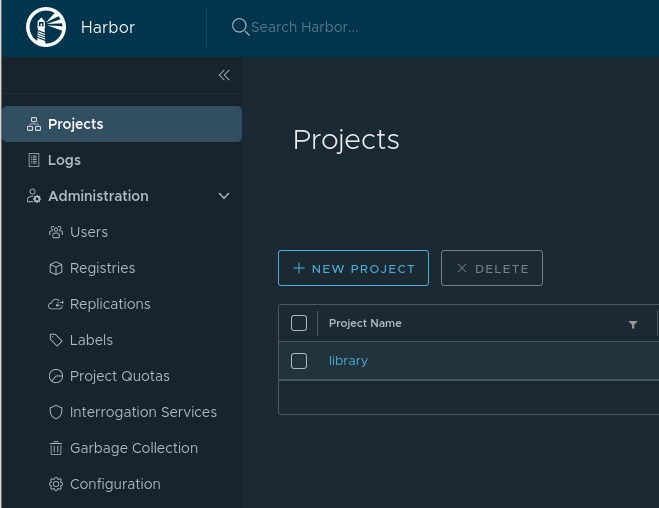
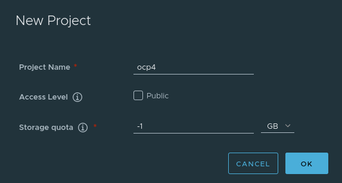
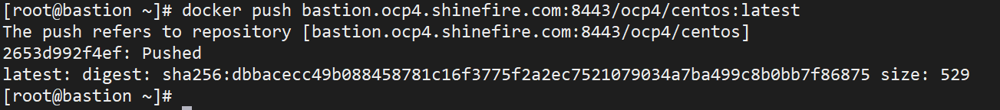

# Deployment UPI


## Introduction

#### UPI（UserProvisioned Infrastructure）

离线环境安装的方案	


## Architecture

### Install Produce

在安装 OCP 时，我们需要有一台引导主机（`Bootstrap`）。这个主机可以访问所有的 OCP 节点。引导主机启动一个临时控制平面，它启动 OCP 集群的其余部分然后被销毁。引导主机使用 Ignition 配置文件进行集群安装引导，该文件描述了如何创建 OCP 集群。**安装程序生成的 Ignition 配置文件包含 24 小时后过期的证书，所以必须在证书过期之前完成集群安装。**

引导集群安装包括如下步骤：

- 引导主机启动并开始托管 `Master` 节点启动所需的资源。
- `Master` 节点从引导主机远程获取资源并完成引导。
- `Master` 节点通过引导主机构建 `Etcd` 集群。
- 引导主机使用新的 `Etcd` 集群启动临时 `Kubernetes` 控制平面。
- 临时控制平面在 Master 节点启动生成控制平面。
- 临时控制平面关闭并将控制权传递给生产控制平面。
- 引导主机将 OCP 组件注入生成控制平面。
- 安装程序关闭引导主机。

引导安装过程完成以后，OCP 集群部署完毕。然后集群开始下载并配置日常操作所需的其余组件，包括创建计算节点、通过 `Operator` 安装其他服务等。


### Host List

服务器规划如下：

- 三个控制平面节点，安装 `Etcd`、控制平面组件和 `Infras` 基础组件。
- 两个计算节点，运行实际负载。
- 一个引导主机，执行安装任务，集群部署完成后可删除。
- 一个bastion节点，用于部署负载均衡、私有镜像仓库。
- 一个基础节点nuc，用于准备上节提到的离线资源，同时用来部署 DNS，这台机器同时也是我的宿主机，其他的节点都是创建在此之上的虚拟机。

| Hostname                     | IP             | Hardware     | Role          |
| ---------------------------- | -------------- | ------------ | ------------- |
| bastion.ocp4.shinefire.com   | 192.168.31.159 | 4C/8G/120GB  |               |
| registry.ocp4.shinefire.com  | 192.168.31.159 | 4C/8G/120GB  | 镜像仓库      |
| api.ocp4.shinefire.com       | 192.168.31.159 | 4C/8G/120GB  |               |
| api-int.ocp4.shinefire.com   | 192.168.31.159 | 4C/8G/120GB  |               |
| bootstrap.ocp4.shinefire.com | 192.168.31.160 | 4C/16G/120GB | bootstrap     |
| master-1.ocp4.shinefire.com  | 192.168.31.161 | 4C/16G/120GB | master节点    |
| etcd-1.ocp4.shinefire.com    | 192.168.31.161 | 4C/16G/120GB |               |
| master-2.ocp4.shinefire.com  | 192.168.31.162 | 4C/16G/120GB | master节点    |
| etcd-2.ocp4.shinefire.com    | 192.168.31.162 | 4C/16G/120GB |               |
| master-3.ocp4.shinefire.com  | 192.168.31.163 | 4C/16G/120GB | master节点    |
| etcd-3.ocp4.shinefire.com    | 192.168.31.163 | 4C/16G/120GB |               |
| worker-1.ocp4.shinefire.com  | 192.168.31.164 | 2C/8G/120GB  | worker节点    |
| apps.ocp4.shinefire.com      | 192.168.31.164 | 2C/8G/120GB  |               |
| worker-2.ocp4.shinefire.com  | 192.168.31.165 | 2C/8G/120GB  | worker节点    |
| nuc.shinefire.com            | 192.168.31.100 | N/A          | YUM/DNS/httpd |

Each cluster machine must meet the following **minimum requirements**:

| Machine       | Operating System        | vCPU | Virtual RAM | Storage |
| :------------ | :---------------------- | :--- | :---------- | :------ |
| Bootstrap     | RHCOS                   | 4    | 16 GB       | 120 GB  |
| Control plane | RHCOS                   | 4    | 16 GB       | 120 GB  |
| Compute       | RHCOS or RHEL 7.8 - 7.9 | 2    | 8 GB        | 120 GB  |


### Softwares List

| 软件名称              | 软件包名                                      |
| --------------------- | --------------------------------------------- |
| RHEL7.9 DVD           | rhel-server-7.9-x86_64-dvd.iso                |
| Extras仓库            | rhel-7-server-extras-rpms.tar.gz              |
| 镜像仓库软件          | docker-io-registry-2.tar                      |
| Registry仓库镜像      | openshift-4.6.5-registry.tar.gz2              |
| Openshift客户端oc命令 | openshift-client-linux-4.6.5.tar.gz           |
| Openshift安装程序     | openshift-install-4.5.13-shinefire.com.tar.gz |
| CoreOS引导光盘        | rhcos-4.5.6-x86_64-installer.iso              |
| CoreOS远程部署内核    | rhcos-4.5.6-x86_64-metal.raw.gz               |


## 准备离线资源

准备离线资源的操作均在bastion节点上面进行，把相关的工具安装后，直接在bastion节点上去离线需要的资源。


### 离线环境说明

单独准备一台节点用来执行安装任务和离线资源准备，这台节点最好具备**魔法上网**的能力，以便可以同时访问内外网。我们称这台节点为**基础节点**。

需要部署一个私有镜像仓库，以供 OCP 安装和运行时使用，**要求支持 version 2 schema 2 (manifest list)**，我这里选择的是 `Harbor 2.0`。

> 很多人误以为必须联系 Red Hat 销售，签单之后才能使用 OCP4，其实不然，注册一个**开发者账号[1]**后就可以获得 `quay.io` 和 `registry.redhat.io` 的拉取密钥了。


### 准备离线安装介质

#### 获取openshift client

目前使用的 OCP 版本是 4.6.6，可以从这里下载客户端：

- https://mirror.openshift.com/pub/openshift-v4/clients/ocp/4.6.6/

```bash
~]# wget https://mirror.openshift.com/pub/openshift-v4/clients/ocp/4.6.6/openshift-client-linux-4.6.6.tar.gz
~]# tar xzvf openshift-client-linux-4.6.6.tar.gz
README.md
oc
kubectl
~]# mv oc kubectl /usr/local/bin/
```

#### 获取版本信息

解压出来的二进制文件放到基础节点的 `$PATH` 下，看下版本信息：

```bash
[root@bastion ~]# oc adm release info quay.io/openshift-release-dev/ocp-release:4.6.6-x86_64
Name:      4.6.6
Digest:    sha256:b8154e802c17dae57d1cfb0580e6a79544712cea0f77e01ae6171854f75975ea
Created:   2020-11-18T09:40:24Z
OS/Arch:   linux/amd64
Manifests: 444

Pull From: quay.io/openshift-release-dev/ocp-release@sha256:b8154e802c17dae57d1cfb0580e6a79544712cea0f77e01ae6171854f75975ea

Release Metadata:
  Version:  4.6.6
  Upgrades: 4.5.16, 4.5.17, 4.5.18, 4.5.19, 4.5.20, 4.6.1, 4.6.3, 4.6.4
  Metadata:

Component Versions:
  kubernetes 1.19.0
  machine-os 46.82.202011111640-0 Red Hat Enterprise Linux CoreOS

Images:
  NAME                                           DIGEST
  aws-ebs-csi-driver                             sha256:a60648f3587949fadb95ecd6f7e732684709a73f718e548bb3cad129b2dc55b8
  aws-ebs-csi-driver-operator                    sha256:b8528b9d65f3591993f0b0b5566e9dd3f957e14a04e0eb0faa6ae17f8c0e6e82
  aws-machine-controllers                        sha256:bdcbfafd355a9aa6ccd8f303382ebb937658a37f225e6aa86fc158523f2f547f
  aws-pod-identity-webhook                       sha256:928d11276776d60f48ebdac67279439c3147286184f42d6143ed3cd48283901a
  azure-machine-controllers                      sha256:1bf1e77b0fd98f74c4a23c56b72a93c96f73bfa93f083729af3e48791bd63fda
  baremetal-installer                            sha256:d52d4effa47106bcc42cb765b305e52a712bca33f459e4e2f3c5153f6ad9babe
  baremetal-machine-controllers                  sha256:03ae145fe1387974273d2d70513c280f42f8cf777fb5605bf65435a0982dafa1
  baremetal-operator                             sha256:c0f8224333cd7d3dc9c65796a560507452b01f401a51f459a29e42a88b7a140a
  baremetal-runtimecfg                           sha256:3f42db5be366f771c2574e0c5919d5427f261e6f044a5128c61764b4b3e038a5
  cli                                            sha256:25b11e3bf12007d5d110e8e7932093cebafbcfc41e75d797c65872a2cddb4d7e
  cli-artifacts                                  sha256:86ce4ae0a984078ab8d18f7d111fc3b3abab9040980cf3e4612017ef6221d9ac
  cloud-credential-operator                      sha256:38d659ae2047d9c9f7df11d21cfa557ef2fe6e7991b8de9c4271a59974606ccd
  cluster-authentication-operator                sha256:86036bb5ed57fcd0f67dc8e6f9719c603464c70069f7b74de48112dad6b5bbf8
  cluster-autoscaler                             sha256:637c283a6777e7681db596abeae466ae08084f0c010ad1ca1bf77c4773380644
  cluster-autoscaler-operator                    sha256:634d3f2bb4456d7b61ab0874cba5731e2572e439262ed39adf5dd6d4d3d57774
  cluster-bootstrap                              sha256:b3581f6e517c927de3fff574309eee4baca273763b75bec2505fa39372bb8b50
  cluster-config-operator                        sha256:9fc44ef21c82434485ebb41f44fdaad6062ca96d57d7f3b29a188a9d252aaa3b
  cluster-csi-snapshot-controller-operator       sha256:732ea52ba70516afafd61a6a633ea4436d5d8eca8a2e6c872f235c4ac3621f0c
  cluster-dns-operator                           sha256:7c1ad15e38e4674be062f34a9af8edb35088a5f93f72cc2f61ef517a0b06e7cb
  cluster-etcd-operator                          sha256:ca2033171ac43fa7e1a04ba627dcadcf266fb596eb8a516d620bd6c2aaf3ca6a
  cluster-image-registry-operator                sha256:54edcf72e7be033a36ae96c53dfde823cacca35da397f1dedad64fdc08b4fd92
  cluster-ingress-operator                       sha256:7f56ddb3f2e7d0a7e7b9196bb912f84eb14f416e3fca0e5f6c770ca243b825db
  cluster-kube-apiserver-operator                sha256:0f949de8d5b960df57a8895237a6802d46c5730a025d43c8bda26dbed3c3953e
  cluster-kube-controller-manager-operator       sha256:7515d02348842018431569f50c9a1f54b27c22cebf217554653278d4d1d5da45
  cluster-kube-scheduler-operator                sha256:9c07f5ae518097b2c5180fff12ee5241bd39a47d14f83cef791e76cbc3235808
  cluster-kube-storage-version-migrator-operator sha256:b44a92799045181758071995b4ac0c6ea3cc4867eb88b99e52ecad785762b4d1
  cluster-machine-approver                       sha256:9443b660b499ef2b357bb31b4a0a034c9e8950d77506657eeb4f1c9a8844ef15
  cluster-monitoring-operator                    sha256:f7ed08886490d5db057ce4f1177a24bf84d165fe2faa254eef78e3ca6e0d7da9
  cluster-network-operator                       sha256:19270677d77891dabb98ac50bd1bf767c4e8bc83e0b07260f974f06962f73999
  cluster-node-tuning-operator                   sha256:701e156f68e3541f9ea72e81d2d5e00d86213b6c5843302ece27e40f17b04379
  cluster-openshift-apiserver-operator           sha256:973c181616e9811e23a64061a191d4acb1e6717b08447a1abc8add26d4d00f60
  cluster-openshift-controller-manager-operator  sha256:909c8dd1fa176c5ebdef132e6bffbd10b62f6a68fd8b7cd567271167e1a4d6e1
  cluster-policy-controller                      sha256:733724a38588f7edee5eed9d9f9dbd01a55d98c110c3ca52c5321263a0e25a99
  cluster-samples-operator                       sha256:4ad25645bc37924d5f185c83278aeddd23429c832460345450466809cef5322e
  cluster-storage-operator                       sha256:708756f7d4780891b941edc53724eb62953b47774fee1230e7bb30f9a2fbaea5
  cluster-update-keys                            sha256:ad039f54008a9d4d52aa23c4feb9f32fbfdef03b5b2f35f6917795035f24f886
  cluster-version-operator                       sha256:37bf369d0c70bf447de0ac0c79f0ff60cc57ccde7766403fc81e917356fa70b1
  configmap-reloader                             sha256:405cbac94fad9137e1b55e7391c846525e5089e1d766f564d956a69d03ecf11d
  console                                        sha256:8cf95bcc4aa14bf4521706a9902a2a60301462431044441afc8e9bf3d720f1de
  console-operator                               sha256:673cc5685d965d82c56b0157dd2fa7b3079d270e184d6f111986ee00f409706b
  container-networking-plugins                   sha256:2cf311515b345a5dcbcdcde1268df9fd5ecbbdae6bc495461547d90b80779f31
  coredns                                        sha256:8be1457287c0680a1f7586dc5e4c502c76e231d0431fa82b9720e4ebc90914a8
  csi-driver-manila                              sha256:2ea0b0839ef7f56e4b60a0989969cbb3daec42addf551e20539138b5b326ede8
  csi-driver-manila-operator                     sha256:f3cd29ad60f2556ec075d98b325781b62eea5651e210f9fc59df9e73152265bf
  csi-driver-nfs                                 sha256:b693097027dda73e2264412911b76dd1a52cf6b611047ad7df81b6f9319d2e40
  csi-external-attacher                          sha256:51958afc849a3a10431151f4424f645e0c23f2508fb2dc88a763f5f2de5f9f78
  csi-external-provisioner                       sha256:d62b5f5007ba35980a10d37129978463570d5869950932c97414074561805f53
  csi-external-resizer                           sha256:b7629ca4373189dfb7b2839832de125c55e5d762131b8b74d57bfb2b37755995
  csi-external-snapshotter                       sha256:eb17ff173c02270afd2f3a53ad348813281ab9605565fa8d334a25e0272d5a3f
  csi-livenessprobe                              sha256:2fc0a6c202c224863ca5afe147d7be1b235c076c219f8df754f54c59ce4f2eca
  csi-node-driver-registrar                      sha256:e7f6a04c91e379d4289584d5c63a567d4a6969380ecbbbf7957c2fb5d3d58a3a
  csi-snapshot-controller                        sha256:f0f4e2fa8fdfa0e3344c82014153d25b589411e4cc1455166e237c0f5900ab86
  deployer                                       sha256:35b6b1d6a5f5ae024e7afd47d65cd800ea4dc3dba0f28f162b54b8e5a8667b42
  docker-builder                                 sha256:bdf11a23236d589cff9ae424c3156d7240deffbef9f09279934d897d52771099
  docker-registry                                sha256:267acd97e56aac429fedbd40d086c343f35ab8769be98ccad38391f45ec2c414
  etcd                                           sha256:326516b79a528dc627e5a5d84c986fd35e5f8ff5cbd74ff0ef802473efccd285
  gcp-machine-controllers                        sha256:8a9066e16637e2cadeddc23c2d739d5afb53fd343f83cca4a08187e28ed8d846
  grafana                                        sha256:05f6abf874d1c582385508bc674cc1f5e29243f425bfebbfa705b9f9ba436569
  haproxy-router                                 sha256:08fd016ff11f68a660df2fe663c25e4ec0885e1d6880d231bb4f9da13db39a66
  hyperkube                                      sha256:f61f2be37a46e7a3b7c1902383fffca7f31315e31b5cd385fb656ae07646e7b5
  insights-operator                              sha256:861ca3dad943de45ac7250d4a2ce1fdf32b3c82133285632a54fbd8532bdf8ec
  installer                                      sha256:30230a80a086927190ab55badc91bd4bf02655fb4bbc6e237655ca8090d52e7a
  installer-artifacts                            sha256:609e257f10e4d48fbedde10218ae20ad65d9789614e029d57fd17e519cb4402a
  ironic                                         sha256:c875e393f3ae45b87f74e3e546020e096a31c3f8321f1ee6bdacf5f79cb101ae
  ironic-hardware-inventory-recorder             sha256:98fb19e515fbe1488919ad24e31fc11aa52ed7f7d5187757188380d7ebf8a1c9
  ironic-inspector                               sha256:17c1921069a7fc882a99df7f482181b73baf8a3b6bc76cac6fe18e9c82170eee
  ironic-ipa-downloader                          sha256:ad6d87a8e1eee9fac58a6c85e34d8186509075f8ed2f1fe5efc9c9dda5138e00
  ironic-machine-os-downloader                   sha256:931e5b5dd5e6e36ed70cd72a07574f74408dfd371e0b3f8d41f78b4d99790bc1
  ironic-static-ip-manager                       sha256:531dcce5496318f2f32e008bf6cd03e713a36e73ea6fa8bdbf560a9c6c7f5b14
  jenkins                                        sha256:5244eb131713eb9372a474a851a561f803c9c9b474e86f3903fc638d929f04b1
  jenkins-agent-maven                            sha256:aeff0c6e915e8506bb10702431a3169a03608b43f1c41b7e157ad502a4857239
  jenkins-agent-nodejs                           sha256:89b4cc10e4fdd03494e9153685808d9ad4c7a11862e8104ebe32a0d6ba62b05d
  k8s-prometheus-adapter                         sha256:40730e931817d00896509f6bb54133c1b64be48159da1445c1b99f3b3bef15d2
  keepalived-ipfailover                          sha256:d8bdb0125b1287565b5464a6d6181fd9fe706641efd68063bdb317270bd11887
  kube-proxy                                     sha256:764a0946d35782e9261235706ef05b71b60897e1cf1f98c6be6d7d33af9e6d6b
  kube-rbac-proxy                                sha256:6ed24b8f33be1f9339d4f569905a357f20e7c955b63a6de6742b05e3a5c0b771
  kube-state-metrics                             sha256:cf441b4a49fc6950af8d5a6fd45072f21ddf76114b67e1f8c10780f66e4a5b47
  kube-storage-version-migrator                  sha256:7a4994ec1b248fce61a27949afa0c9a0a1e2323784932def042494ba27419277
  kuryr-cni                                      sha256:bd1595d919425b0837d7454bdbbdb680b2f4a0f0f3d0cbecd7818c84283f054c
  kuryr-controller                               sha256:fc5f164ba66e176bff7eb09fc3b155aa131faf35b2b6e77be260b818dfa26b9a
  libvirt-machine-controllers                    sha256:6e7a1323089fbd7e3ddc7aa4bc511df29e1b9d444dd2da85137febe6a7407f43
  local-storage-static-provisioner               sha256:7e08650f34e5b413f90cb053d5d089d08d0da7097465a93e4f27921308478b23
  machine-api-operator                           sha256:daf4ccd1d0b48d9fa5d2141127b60239bc064f58f1e99b88061f8c2cdc29264b
  machine-config-operator                        sha256:c310d1387881ec675f55c561e787fd89ff7a1235977fcd5346c98f74e01ce56f
  machine-os-content                             sha256:cf0cf94cb448680ed817906b03e632a10cd2a5e1d0610f821653a08ecbf10a56
  mdns-publisher                                 sha256:e95a14a6747f83c733161b44f7e847a7b098155ee15c1d7f501acc9b3041af48
  multus-admission-controller                    sha256:f31c48a2c4146d05350524c8321317ce01fe93a23f8bf1db3b5dfbe7e53a948b
  multus-cni                                     sha256:1f0c17e7306fd5056c6a23a694adb217e8524c8aa20282600e48522e91c1693c
  multus-route-override-cni                      sha256:fc4826ccc626c0b6b38bf755e1a3cfeef83bc2c65b45581a19ec9fe535972627
  multus-whereabouts-ipam-cni                    sha256:e8fc3d258d1cefade3d2b17ef45f690091c7568e168cbd22c75498ccd2cbe3a4
  must-gather                                    sha256:2157f446d1917731d93a3212b71af07d4f73696aca788518656c77f5031d8279
  network-metrics-daemon                         sha256:fb034bf27443f20c615a25ee912d105325bb3015472a77d44cbddce7dfa5a87c
  oauth-apiserver                                sha256:cbe1b1dc3be00433718de5c1c0b32d76e85577c39098e173164a853211a12d2c
  oauth-proxy                                    sha256:815521232bfa2db43e28dcb40ba8eb3c03308b99102200f68bfaca35431fc20d
  oauth-server                                   sha256:03e2eef1f1567da983b307f868cf5aefd0bd91bf0ec8b3950937ca2e0b3f80d2
  openshift-apiserver                            sha256:6367d8c2a1a1c4e427052eed5c4860e8b8fe51928e6573e63b5440f493bead76
  openshift-controller-manager                   sha256:39678d53761c3e6e03025d1ad3de34e91247fdf1c327f987e640c39a1ec6c259
  openshift-state-metrics                        sha256:0cb687471e6b91a325598ef4d33adb89af89b9f1ff5cab759fde2636ba7f589d
  openstack-machine-controllers                  sha256:b6520c3fd8bf172c8fddec07db5b9a94fdb8eb476f15b863f8da28884bee8f2d
  operator-lifecycle-manager                     sha256:3bd85be1e98b6f2a4854471c3dcaefbfa594753380f6db2617c37f7da7e26ec2
  operator-marketplace                           sha256:aeb7980e9e0c82e0106719973c54f8135646d34eec0af28a267c1a1b5ff0b114
  operator-registry                              sha256:8f73a4f76eca5e75326aff240b5fc13a64a3672b14a3fe2253528fd1e992f645
  ovirt-csi-driver                               sha256:abe99f6567391eb79635c236de02e2847fb3c51e739b1438f72254eb2e5aefa3
  ovirt-csi-driver-operator                      sha256:7131c32f525d35cb85d9d27edbb4a58e9a11498a25fd8e3c0ff941e1b4fd8295
  ovirt-machine-controllers                      sha256:0a58c518264ba89d2fc2f5b17a07f62e32cf2ab57d66f35ae69b9b35934c8a2d
  ovn-kubernetes                                 sha256:1280c7050539576cb7224beaaefd368a1dfa3b520cf0487b6e202f5cb27c2e01
  pod                                            sha256:9906a051a2acf0533569135934abc4e6aff02670086e123e2857fa4c4d390036
  prom-label-proxy                               sha256:c2c60d16b60c217e0790720abf68ee65559626602540eb7857a311f1117b0319
  prometheus                                     sha256:d5eb6237da3d8d7c070511b5e426584c9245bfd06491be4cae4560de2a825091
  prometheus-alertmanager                        sha256:e91252fec5cc06b2826aa9c34af51d058b285e6a117adc2895c20145729607b2
  prometheus-config-reloader                     sha256:acae4a390ac655f22fe4e315ad3a1ba839446b828cf28edb646851b142ce4d0c
  prometheus-node-exporter                       sha256:bdccbfdc6cc5a4065ed4f3c8bbf51b9f5398687a3371c446ae26bebcda253587
  prometheus-operator                            sha256:ab1029668894db6c3be28a2cdcdcf2a35c6c919e3c19835f3f034e374622ff5b
  sdn                                            sha256:7034a9da9a87ff63ff6718361a4b2f2014191983c35319d5df8ec0c634d60989
  service-ca-operator                            sha256:9b9833bf38f934d8eaf61c5a6052ab4ecc21d7e765a03ca04d9597d56b5cc669
  telemeter                                      sha256:324c90a70b428dc2f681b6d3ea4b4d5b4a4922673ae577c4fccd66f5814ee121
  tests                                          sha256:643d6da850f7528681f6e10c2dafe5f2731f4721b09ba77bd7975719b25be858
  thanos                                         sha256:5ed70c9e752d3610853c8b37ffaff7ba51af3b4cde7a5259bd0c186d27241e25
  tools                                          sha256:830e4bae80489264c91b693ca157ff558aec85b865317e6a1ea92a41ddac3385
```


#### 创建自签名证书

生成自签名证书：

```bash
~]# mkdir /opt/harbor/certs
~]# cd /opt/harbor/certs

# 生成私钥
~]# openssl genrsa -out server.key 1024
```

根据私钥生成证书申请文件 `csr`：

```bash
~]# openssl req -new -key server.key -out server.csr
```

这里根据命令行向导来进行信息输入：

```bash
[root@bastion certs]# openssl req -new -key server.key -out server.csr
You are about to be asked to enter information that will be incorporated
into your certificate request.
What you are about to enter is what is called a Distinguished Name or a DN.
There are quite a few fields but you can leave some blank
For some fields there will be a default value,
If you enter '.', the field will be left blank.
-----
Country Name (2 letter code) [XX]:CN
State or Province Name (full name) []:Shenzhen
Locality Name (eg, city) [Default City]:Shenzhen
Organization Name (eg, company) [Default Company Ltd]:Shinefire
Organizational Unit Name (eg, section) []:Shinefire
Common Name (eg, your name or your server's hostname) []:*.ocp4.shinefire.com
Email Address []:shine_fire@qq.com

Please enter the following 'extra' attributes
to be sent with your certificate request
A challenge password []:
An optional company name []:
```

> Common Name 可以输入：`*.ocp4.shinefire.com`，这种方式可以生成通配符域名证书。
>
> 最后的密码输入，没有密码可以直接跳过
>
> 另外这些交互式的创建，也可以通过直接命令行加参数换成非交互式来实现，这里先略过了

使用私钥对证书申请进行签名从而生成证书：

```bash
[root@bastion certs]# openssl x509 -req -days 3650 -in server.csr -signkey server.key -out server.crt
Signature ok
subject=/C=CN/ST=Shenzhen/L=Shenzhen/O=Shinefire/OU=Shinefire/CN=*.ocp4.shinefire.com/emailAddress=shine_fire@qq.com
Getting Private key
```

这样就生成了有效期为 10 年的证书文件，对于自己内网服务使用足够。

证书搞定了之后，就可以接着配置 Harbor 了。


#### 安装部署harbor

内部镜像仓库用于存放部署 OCP 集群所需的镜像，仓库本身使用 `Harbor` 部署，目前最为流行的私有镜像仓库便是 CNCF 的毕业生之一的 Harbor（中文含义：港口）。

修改基础节点主机名：

```bash
~]# hostnamectl set-hostname bastion.ocp4.shinefire.com
```

> 所有节点主机名都要采用三级域名格式，如 `master1.aa.bb.com`

Docker安装

```bash
# step 1: 安装必要的一些系统工具
yum install -y yum-utils device-mapper-persistent-data lvm2
# Step 2: 添加软件源信息
yum-config-manager --add-repo https://mirrors.aliyun.com/docker-ce/linux/centos/docker-ce.repo
# Step 3: 更新并安装Docker-CE
yum makecache fast
yum -y install docker-ce
# Step 4: 开启Docker服务
systemctl enable docker --now

# 注意：
# 官方软件源默认启用了最新的软件，您可以通过编辑软件源的方式获取各个版本的软件包。例如官方并没有将测试版本的软件源置为可用，您可以通过以下方式开启。同理可以开启各种测试版本等。
# vim /etc/yum.repos.d/docker-ee.repo
# 将[docker-ce-test]下方的enabled=0修改为enabled=1
#
# 安装指定版本的Docker-CE:
# Step 1: 查找Docker-CE的版本:
# yum list docker-ce.x86_64 --showduplicates | sort -r
#   Loading mirror speeds from cached hostfile
#   Loaded plugins: branch, fastestmirror, langpacks
#   docker-ce.x86_64            17.03.1.ce-1.el7.centos            docker-ce-stable
#   docker-ce.x86_64            17.03.1.ce-1.el7.centos            @docker-ce-stable
#   docker-ce.x86_64            17.03.0.ce-1.el7.centos            docker-ce-stable
#   Available Packages
# Step2: 安装指定版本的Docker-CE: (VERSION例如上面的17.03.0.ce.1-1.el7.centos)
# sudo yum -y install docker-ce-[VERSION]
```

docker-compose安装

```bash
~]# curl -L "https://github.com/docker/compose/releases/download/1.29.2/docker-compose-$(uname -s)-$(uname -m)" -o /usr/local/bin/docker-compose
~]# chmod +x /usr/local/bin/docker-compose
```


下载 Harbor 离线安装包并解压

```bash
~]# wget https://github.com/goharbor/harbor/releases/download/v2.0.0/harbor-offline-installer-v2.0.0.tgz
~]# tar -xvf harbor-offline-installer-v2.0.0.tgz -C /opt/
```

打开 `/opt/harbor/harbor.yml` 文件，修改 hostname 域名、https 证书等配置信息，具体如下：

```tex
# Configuration file of Harbor
# The IP address or hostname to access admin UI and registry service.
# DO NOT use localhost or 127.0.0.1, because Harbor needs to be accessed by external clients.
hostname: bastion.openshift4.example.com
# http related config
http:
  # port for http, default is 80. If https enabled, this port will redirect to https port
  port: 8080
# https related config
https:
  # https port for harbor, default is 443
  port: 8443
  # The path of cert and key files for nginx
  certificate: /opt/harbor/certs/server.crt
  private_key: /opt/harbor/certs/server.key
```

> 我这里把所有需要的基础服务都部署在同一个节点上，后面安装 OCP 时需要用到负载均衡器的 `443` 和 `80` 端口，所以这里 Harbor 使用了非标准端口。如果你资源充足，可以将 Harbor 部署在不同的节点上。


接着执行下面的命令进行安装：

```bash
[root@bastion harbor]# ./install.sh
```

以上安装命令同时安装了 Clair 服务，一个用户镜像漏洞静态分析的工具。如果不需要，可以省略该选项。

安装成功后，将自签名的证书复制到默认信任证书路径：

```bash
~]# cp /opt/harbor/certs/server.crt /etc/pki/ca-trust/source/anchors/
~]# update-ca-trust extract
```

或者将其复制到 docker 的信任证书路径：

```bash
~]# mkdir -p /etc/docker/certs.d/bastion.openshift4.example.com:8443
~]# cp /opt/harbor/certs/server.crt /etc/docker/certs.d/bastion.openshift4.example.com:8443/
~]# systemctl restart docker
```

现在可以通过 `docker login` 命令来测试仓库的连通性，看到如下字样即表示安装成功（也可以通过浏览器访问 Web UI）：

```bash
[root@bastion harbor]# docker login bastion.ocp4.shinefire.com:8443
Username: admin
Password:
WARNING! Your password will be stored unencrypted in /root/.docker/config.json.
Configure a credential helper to remove this warning. See
https://docs.docker.com/engine/reference/commandline/login/#credentials-store

Login Succeeded
```


#### 下载镜像文件

准备拉取镜像权限认证文件。从 `Red Hat OpenShift Cluster Manager` 站点的 **[Pull Secret 页面](https://cloud.redhat.com/openshift/install/pull-secret)** 下载 `registry.redhat.io` 的 `pull secret`。

```bash
# 把下载的 txt 文件转出 json 格式，如果没有 jq 命令，通过 epel 源安装
[root@bastion ~]# cat ./pull-secret.txt | jq . > pull-secret.json
```

JSON 内容如下：

```json
{
  "auths": {
    "cloud.openshift.com": {
      "auth": "b3Blbn...",
      "email": "shine_fire@qq.com"
    },
    "quay.io": {
      "auth": "b3Blbn...",
      "email": "shine_fire@qq.com"
    },
    "registry.connect.redhat.com": {
      "auth": "fHVoYy1wb...",
      "email": "shine_fire@qq.com"
    },
    "registry.redhat.io": {
      "auth": "fHVoYy1wb...",
      "email": "shine_fire@qq.com"
    }
  }
}
```

把本地仓库的用户密码转换成 `base64` 编码：

```bash
~]# echo -n 'admin:Harbor12345' | base64 -w0
YWRtaW46SGFyYm9yMTIzNDU=
```

然后在 `pull-secret.json` 里面加一段本地仓库的权限。第一行仓库域名和端口，第二行是上面的 `base64`，第三行随便填个邮箱：

```json
  "auths": {
...
    "registry.shinefire.com:5000": {
      "auth": "YWRtaW46SGFyYm9yMTIzNDU=",
      "email": "you@example.com"
   },
...
```

设置环境变量：

```bash
$ export OCP_RELEASE="4.6.5-x86_64"
$ export LOCAL_REGISTRY='bastion.ocp4.shinefire.com:8443' 
$ export LOCAL_REPOSITORY='ocp4/openshift4'
$ export PRODUCT_REPO='openshift-release-dev'
$ export LOCAL_SECRET_JSON='/root/pull-secret.json'
$ export RELEASE_NAME="ocp-release"
```

- **OCP_RELEASE** : OCP 版本，可以在**[这个页面](https://quay.io/repository/openshift-release-dev/ocp-release?tab=tags)**查看。如果版本不对，下面执行 `oc adm` 时会提示 `image does not exist`。
- **LOCAL_REGISTRY** : 本地仓库的域名和端口。
- **LOCAL_REPOSITORY** : 镜像存储库名称，使用 ocp4/openshift4。
- `PRODUCT_REPO` 和 `RELEASE_NAME` 都不需要改，这些都是一些版本特征，保持不变即可。
- **LOCAL_SECRET_JSON** : 密钥路径，就是上面 `pull-secret.json` 的存放路径。

在 Harbor 中创建一个项目 `ocp4` 用来存放同步过来的镜像，我这里是直接其他的机器使用firefox打开 `bastion.ocp4.shinefire.com:8080` 登录到harbor web端进行创建项目，注意创建项目的时候项目名称要跟上面设置环境变量中使用的名称一致

创建project如下：





最后一步就是同步镜像，这一步的动作就是把 `quay` 官方仓库中的镜像，同步到本地仓库，如果失败了可以重新执行命令，整体内容大概 `5G`。

```bash
[root@bastion ~]# docker login -u admin https://bastion.ocp4.shinefire.com:8443
[root@bastion ~]# oc adm release mirror -a ${LOCAL_SECRET_JSON} \
     --from=quay.io/${PRODUCT_REPO}/${RELEASE_NAME}:${OCP_RELEASE} \
     --to=${LOCAL_REGISTRY}/${LOCAL_REPOSITORY} \
     --to-release-image=${LOCAL_REGISTRY}/${LOCAL_REPOSITORY}:${OCP_RELEASE}
...
Success
Update image:  bastion.ocp4.shinefire.com:8443/ocp4/openshift4:4.6.5-x86_64
Mirror prefix: bastion.ocp4.shinefire.com:8443/ocp4/openshift4

To use the new mirrored repository to install, add the following section to the install-config.yaml:

imageContentSources:
- mirrors:
  - bastion.ocp4.shinefire.com:8443/ocp4/openshift4
  source: quay.io/openshift-release-dev/ocp-release
- mirrors:
  - bastion.ocp4.shinefire.com:8443/ocp4/openshift4
  source: quay.io/openshift-release-dev/ocp-v4.0-art-dev


To use the new mirrored repository for upgrades, use the following to create an ImageContentSourcePolicy:

apiVersion: operator.openshift.io/v1alpha1
kind: ImageContentSourcePolicy
metadata:
  name: example
spec:
  repositoryDigestMirrors:
  - mirrors:
    - bastion.ocp4.shinefire.com:8443/ocp4/openshift4
    source: quay.io/openshift-release-dev/ocp-release
  - mirrors:
    - bastion.ocp4.shinefire.com:8443/ocp4/openshift4
    source: quay.io/openshift-release-dev/ocp-v4.0-art-dev
```

`oc adm release mirror` 命令执行完成后会输出下面类似的信息，保存下来，将来会用在 `install-config.yaml` 文件中：

```bash
imageContentSources:
- mirrors:
  - bastion.ocp4.shinefire.com:8443/ocp4/openshift4
  source: quay.io/openshift-release-dev/ocp-release
- mirrors:
  - bastion.ocp4.shinefire.com:8443/ocp4/openshift4
  source: quay.io/openshift-release-dev/ocp-v4.0-art-dev
```

本地镜像仓库缓存好镜像之后，通过 `tag/list` 接口查看所有 tag，如果能列出来一堆就说明是正常的：

```bash
[root@bastion ~]# curl -s -u admin:Harbor12345 -k https://bastion.ocp4.shinefire.com:8443/v2/ocp4/openshift4/tags/list|jq .
{
  "name": "ocp4/openshift4",
  "tags": [
    "4.6.5-aws-ebs-csi-driver",
    "4.6.5-aws-ebs-csi-driver-operator",
    "4.6.5-aws-machine-controllers",
    "4.6.5-aws-pod-identity-webhook",
    "4.6.5-azure-machine-controllers",
    "4.6.5-baremetal-installer",
    "4.6.5-baremetal-machine-controllers",
    "4.6.5-baremetal-operator",
    "4.6.5-baremetal-runtimecfg",
    "4.6.5-cli",
    "4.6.5-cli-artifacts",
    "4.6.5-cloud-credential-operator",
    "4.6.5-cluster-authentication-operator",
    "4.6.5-cluster-autoscaler",
    "4.6.5-cluster-autoscaler-operator",
    "4.6.5-cluster-bootstrap",
    "4.6.5-cluster-config-operator",
    "4.6.5-cluster-csi-snapshot-controller-operator",
    "4.6.5-cluster-dns-operator",
    "4.6.5-cluster-etcd-operator",
    "4.6.5-cluster-image-registry-operator",
    "4.6.5-cluster-ingress-operator",
    "4.6.5-cluster-kube-apiserver-operator",
    "4.6.5-cluster-kube-controller-manager-operator",
    "4.6.5-cluster-kube-scheduler-operator",
    "4.6.5-cluster-kube-storage-version-migrator-operator",
    "4.6.5-cluster-machine-approver",
    "4.6.5-cluster-monitoring-operator",
    "4.6.5-cluster-network-operator",
    "4.6.5-cluster-node-tuning-operator",
    "4.6.5-cluster-openshift-apiserver-operator",
    "4.6.5-cluster-openshift-controller-manager-operator",
    "4.6.5-cluster-policy-controller",
    "4.6.5-cluster-samples-operator",
    "4.6.5-cluster-storage-operator",
    "4.6.5-cluster-update-keys",
    "4.6.5-cluster-version-operator",
    "4.6.5-configmap-reloader",
    "4.6.5-console",
    "4.6.5-console-operator",
    "4.6.5-container-networking-plugins",
    "4.6.5-coredns",
    "4.6.5-csi-driver-manila",
    "4.6.5-csi-driver-manila-operator",
    "4.6.5-csi-driver-nfs",
    "4.6.5-csi-external-attacher",
    "4.6.5-csi-external-provisioner",
    "4.6.5-csi-external-resizer",
    "4.6.5-csi-external-snapshotter",
    "4.6.5-csi-livenessprobe",
    "4.6.5-csi-node-driver-registrar",
    "4.6.5-csi-snapshot-controller",
    "4.6.5-deployer",
    "4.6.5-docker-builder",
    "4.6.5-docker-registry",
    "4.6.5-etcd",
    "4.6.5-gcp-machine-controllers",
    "4.6.5-grafana",
    "4.6.5-haproxy-router",
    "4.6.5-hyperkube",
    "4.6.5-insights-operator",
    "4.6.5-installer",
    "4.6.5-installer-artifacts",
    "4.6.5-ironic",
    "4.6.5-ironic-hardware-inventory-recorder",
    "4.6.5-ironic-inspector",
    "4.6.5-ironic-ipa-downloader",
    "4.6.5-ironic-machine-os-downloader",
    "4.6.5-ironic-static-ip-manager",
    "4.6.5-jenkins",
    "4.6.5-jenkins-agent-maven",
    "4.6.5-jenkins-agent-nodejs",
    "4.6.5-k8s-prometheus-adapter",
    "4.6.5-keepalived-ipfailover",
    "4.6.5-kube-proxy",
    "4.6.5-kube-rbac-proxy",
    "4.6.5-kube-state-metrics",
    "4.6.5-kube-storage-version-migrator",
    "4.6.5-kuryr-cni",
    "4.6.5-kuryr-controller",
    "4.6.5-libvirt-machine-controllers",
    "4.6.5-local-storage-static-provisioner",
    "4.6.5-machine-api-operator",
    "4.6.5-machine-config-operator",
    "4.6.5-machine-os-content",
    "4.6.5-mdns-publisher",
    "4.6.5-multus-admission-controller",
    "4.6.5-multus-cni",
    "4.6.5-multus-route-override-cni",
    "4.6.5-multus-whereabouts-ipam-cni",
    "4.6.5-must-gather",
    "4.6.5-network-metrics-daemon",
    "4.6.5-oauth-apiserver",
    "4.6.5-oauth-proxy",
    "4.6.5-oauth-server",
    "4.6.5-openshift-apiserver",
    "4.6.5-openshift-controller-manager",
    "4.6.5-openshift-state-metrics",
    "4.6.5-openstack-machine-controllers",
    "4.6.5-operator-lifecycle-manager",
    "4.6.5-operator-marketplace",
    "4.6.5-operator-registry",
    "4.6.5-ovirt-csi-driver",
    "4.6.5-ovirt-csi-driver-operator",
    "4.6.5-ovirt-machine-controllers",
    "4.6.5-ovn-kubernetes",
    "4.6.5-pod",
    "4.6.5-prom-label-proxy",
    "4.6.5-prometheus",
    "4.6.5-prometheus-alertmanager",
    "4.6.5-prometheus-config-reloader",
    "4.6.5-prometheus-node-exporter",
    "4.6.5-prometheus-operator",
    "4.6.5-sdn",
    "4.6.5-service-ca-operator",
    "4.6.5-telemeter",
    "4.6.5-tests",
    "4.6.5-thanos",
    "4.6.5-tools",
    "4.6.5-x86_64"
  ]
}
```

Harbor 中也能看到所有的镜像：


#### 提取openshift-install命令

为了保证安装版本一致性，需要从镜像库中提取 `openshift-install` 二进制文件，不能直接从 https://mirror.openshift.com/pub/openshift-v4/clients/ocp/4.4.5 下载，不然后面会有 `sha256` 匹配不上的问题。

```bash
# 这一步需要用到上面的 export 变量
[root@bastion ~]# oc adm release extract \
>   -a ${LOCAL_SECRET_JSON} \
>   --command=openshift-install \
>   "${LOCAL_REGISTRY}/${LOCAL_REPOSITORY}:${OCP_RELEASE}"
[root@bastion ~]# ls openshift-install
openshift-install
```

如果提示 `error: image dose not exist`，说明拉取的镜像不全，或者版本不对。

把文件移动到 `$PATH` 并确认版本：

```bash
[root@bastion ~]# mv openshift-install /usr/local/bin/
[root@bastion ~]# openshift-install version
openshift-install 4.6.5
built from commit db0f93089a64c5fd459d226fc224a2584e8cfb7e
release image bastion.ocp4.shinefire.com:8443/ocp4/openshift4@sha256:b8154e802c17dae57d1cfb0580e6a79544712cea0f77e01ae6171854f75975ea
```


### 准备 Image Stream 样例镜像（待更新）

**目前还完全没搞懂这个image stream的作用和同步方法，暂时先跳过看看行不行**

准备一个镜像列表，然后使用 `oc image mirror` 将镜像同步到私有仓库中：

```bash
cat sample-images.txt | while read line; do
  target=$(echo $line | sed 's/registry.redhat.io/bastion.ocp4.shinefire.com:8443/')
  oc image mirror -a ${LOCAL_SECRET_JSON} $line $target
done
```

如果之前装过 OCP 4.4.5，把 `openshift-cluster-samples-operator` 项目下 `cluster-samples-operator` Pod 的 `/opt/openshift` 目录同步出来，简单 grep 一下就都有了完整的镜像列表。


### 准备 OperatorHub 离线资源

首先在 Harbor 中创建一个 `devinfra` 项目，然后构建 RedHat Operators 的 `catalog image`, 保存为 `bastion.openshift4.example.com:8443/devinfra/redhat-operators:v1`

```bash
~]# oc adm catalog build \
  -a ${LOCAL_SECRET_JSON} \
  --appregistry-endpoint https://quay.io/cnr \
  --from=registry.redhat.io/openshift4/ose-operator-registry:v4.6 \
  --appregistry-org redhat-operators \
  --to=bastion.ocp4.shinefire.com:8443/devinfra/redhat-operators:v1
```

这个 catalog image 相当于 `RedHat Operators` 的一个目录，通过 `catalog image` 可以找到  `RedHat Operators` 的所有镜像。而且 catalog image 使用 `sha256 digest` 来引用镜像，能够确保应用有稳定可重复的部署。

然后使用 catalog image 同步 `RedHat Operators` 的所有镜像到私有仓库：

```bash
~]# oc adm catalog mirror \
  -a ${LOCAL_SECRET_JSON} \
  bastion.ocp4.shinefire.com:8443/devinfra/redhat-operators:v1 \
  bastion.ocp4.shinefire.com:8443
```

**如果执行过程中遇到 `project not found` 之类的错误，可根据报错信息到 Harbor 中创建相应的项目，不用中断任务。**

这个命令结束后会产生 `redhat-operators-manifests` 目录，下面有两个文件:

- **imageContentSourcePolicy.yaml** : 定义了一个 `ImageContentSourcePolicy` 对象，该对象可以配置节点将其对官方 Operator manifests 中镜像的引用改为对本地镜像仓库中镜像的引用。
- **mapping.txt** : 包含了所有的源镜像在本地镜像仓库中的映射位置。`oc image mirror` 命令可以引用该文件进一步修改镜像配置。

然而目前这么做还是有问题[1800674](https://bugzilla.redhat.com/show_bug.cgi?id=1800674): 同步出来的镜像 `manifest digest` 不对，导致后面离线安装 Operator 时会报镜像无法获取的错误。

暂时可以使用上面 bugzilla 链接里给出的临时解决方案，先安装 skopeo：

```bash
[root@bastion ~]# yum install -y golang gpgme-devel libassuan-devel btrfs-progs-devel device-mapper-devel
[root@bastion ~]# git clone https://github.com/containers/skopeo
[root@bastion ~]# cd skopeo
[root@bastion ~]# make binary-local
[root@bastion ~]# mv skopeo /usr/local/bin/
```

从 `pull-secret.json` 中解码 `quay.io`、`registry.redhat.io` 和 `registry.access.redhat.com` 的用户名密码，然后通过下面的命令认证：

```bash
$ skopeo login -u <quay.io_user> -p <quay.io_psw> quay.io
$ skopeo login -u <registry.redhat.io_user> -p <registry.redhat.io_psw> registry.redhat.io
$ skopeo login -u <registry.access.redhat.com_user> -p <registry.access.redhat.com_psw> registry.access.redhat.com
```

最后同步镜像的 manifest digest：

```bash
cat redhat-operators-manifests/mapping.txt | while read line; do
  origin=$(echo $line | cut -d= -f1)
  target=$(echo $line | cut -d= -f2)
  if [[ "$origin" =~ "sha256" ]]; then
    tag=$(echo $origin | cut -d: -f2 | cut -c -8)
    skopeo copy --all docker://$origin docker://$target:$tag
  else
    skopeo copy --all docker://$origin docker://$target
  fi
done
```

不得不说，OCP 的安装真是个浩大的工程，这洋洋洒洒的一大篇也只是准备了离线资源，这只是安装的一小步，还有很长的步骤要写，心理素质不过关的同学切勿随意模仿。


## 基础环境公共资源配置

### 配置DNS

正常应该是这样在bastion里面配置好DNS即可，不过我的环境里面有一个DNS服务器了，所以就没有配置在bastion这台服务器里面了，直接所有的服务器连接DNS服务器即可。

DNS 用于名称解析和反向名称解析。DNS A/AAAA 或 CNAME 记录用于名称解析，PTR 记录用于反向解析名称。反向记录很重要，因为 Red Hat Enterprise Linux CoreOS（RHCOS）使用反向记录为所有节点设置主机名。另外，反向记录用于生成 OpenShift Container Platform 需要操作的证书签名请求（CSR）。

```bash
[root@bastion ~]# yum install dnsmasq -y
[root@bastion ~]# vim /etc/dnsmasq.d/ocp4.conf
ddress=/bastion.ocp4.shinefire.com/192.168.31.159
address=/registry.ocp4.shinefire.com/192.168.31.159
address=/api.ocp4.shinefire.com/192.168.31.159
address=/api-int.ocp4.shinefire.com/192.168.31.159
address=/bootstrap.ocp4.shinefire.com/192.168.31.160
address=/master-1.ocp4.shinefire.com/192.168.31.161
address=/etcd-1.ocp4.shinefire.com/192.168.31.161
address=/master-2.ocp4.shinefire.com/192.168.31.162
address=/etcd-2.ocp4.shinefire.com/192.168.31.162
address=/master-3.ocp4.shinefire.com/192.168.31.163
address=/etcd-3.ocp4.shinefire.com/192.168.31.163
address=/worker-1.ocp4.shinefire.com/192.168.31.164
address=/worker-2.ocp4.shinefire.com/192.168.31.165
address=/apps.ocp4.shinefire.com/192.168.31.163
ptr-record=159.31.168.192.in-addr.arpa,bastion.ocp4.shinefire.com
ptr-record=159.31.168.192.in-addr.arpa,api.ocp4.shinefire.com
ptr-record=160.31.168.192.in-addr.arpa,bootstrap.ocp4.shinefire.com
ptr-record=161.31.168.192.in-addr.arpa,master-1.ocp4.shinefire.com
ptr-record=162.31.168.192.in-addr.arpa,master-2.ocp4.shinefire.com
ptr-record=163.31.168.192.in-addr.arpa,master-3.ocp4.shinefire.com
ptr-record=164.31.168.192.in-addr.arpa,worker-1.ocp4.shinefire.com
ptr-record=165.31.168.192.in-addr.arpa,worker-2.ocp4.shinefire.com
srv-host=_etcd-server-ssl._tcp.ocp4.shinefire.com,etcd-0.ocp4.shinefire.com,2380,10
srv-host=_etcd-server-ssl._tcp.ocp4.shinefire.com,etcd-1.ocp4.shinefire.com,2380,10
srv-host=_etcd-server-ssl._tcp.ocp4.shinefire.com,etcd-2.ocp4.shinefire.com,2380,10
log-queries

[root@bastion ~]# systemctl enable dnsmasq --now
Created symlink from /etc/systemd/system/multi-user.target.wants/dnsmasq.service to /usr/lib/systemd/system/dnsmasq.service.
```

#### Configure DNS Server

```bash
[root@bastion ~]# cat /etc/resolv.conf
# Generated by NetworkManager
search ocp4.shinefire.com
nameserver 192.168.31.100
nameserver 114.114.114.114
nameserver 8.8.8.8
[root@bastion ~]# nslookup bootstrap.ocp4.shinefire.com
Server:         192.168.31.100
Address:        192.168.31.100#53

Name:   bootstrap.ocp4.shinefire.com
Address: 192.168.31.160
```


### 配置负载均衡

这里使用haproxy来做负载均衡，haproxy主要用于负载master api 6443 ，worker节点的router 80 443

#### Install HAProxy

```bash
[root@bastion ~]# yum install haproxy -y
```

#### Configure HAProxy(need modify)

```bash
[root@bastion ~]# cat /etc/haproxy/haproxy.cfg
#---------------------------------------------------------------------
# Example configuration for a possible web application.  See the
# full configuration options online.
#
#   http://haproxy.1wt.eu/download/1.4/doc/configuration.txt
#
#---------------------------------------------------------------------

#---------------------------------------------------------------------
# Global settings
#---------------------------------------------------------------------
global
    # to have these messages end up in /var/log/haproxy.log you will
    # need to:
    #
    # 1) configure syslog to accept network log events.  This is done
    #    by adding the '-r' option to the SYSLOGD_OPTIONS in
    #    /etc/sysconfig/syslog
    #
    # 2) configure local2 events to go to the /var/log/haproxy.log
    #   file. A line like the following can be added to
    #   /etc/sysconfig/syslog
    #
    #    local2.*                       /var/log/haproxy.log
    #
    log         127.0.0.1 local2

    chroot      /var/lib/haproxy
    pidfile     /var/run/haproxy.pid
    maxconn     40000
    user        haproxy
    group       haproxy
    daemon

    # turn on stats unix socket
    stats socket /var/lib/haproxy/stats

#---------------------------------------------------------------------
# common defaults that all the 'listen' and 'backend' sections will
# use if not designated in their block
#---------------------------------------------------------------------
defaults
    mode                    tcp
    log                     global
    option                  tcplog
    option                  dontlognull
    option http-server-close
    option forwardfor       except 127.0.0.0/8
    option                  redispatch
    retries                 3
    timeout http-request    10s
    timeout queue           1m
    timeout connect         10s
    timeout client          1m
    timeout server          1m
    timeout http-keep-alive 10s
    timeout check           10s
    maxconn                 30000


# 可选项,可以通过页面查看负载监控状态
listen stats
    bind :9000
    mode http
    stats enable
    stats uri /
    monitor-uri /healthz

# 负载master api，bootstrap 后面删掉
frontend openshift-api-server
    bind *:6443
    default_backend openshift-api-server

backend openshift-api-server
    #balance source
    server bootstrap 192.168.31.160:6443 check
    server master-1 192.168.31.161:6443 check
    server master-2 192.168.31.162:6443 check
    server master-3 192.168.31.163:6443 check

frontend machine-config-server
    bind *:22623
    default_backend machine-config-server

backend machine-config-server
    #balance source
    server bootstrap 192.168.31.160:22623 check
    server master-1 192.168.31.161:22623 check
    server master-2 192.168.31.162:22623 check
    server master-3 192.168.31.163:22623 check

# 负载router，就是*.apps.ocp4.example.com , 这个域名如果 dns server 指向了本机，则这边必须配置，否则对于测试环境可选项。
frontend ingress-http
    bind *:80
    default_backend ingress-http

backend ingress-http
    #balance source
    server worker-1 192.168.31.164:80 check
    server worker-2 192.168.31.165:80 check

frontend ingress-https
    bind *:443
    default_backend ingress-https

backend ingress-https
    #balance source
    server worker-1 192.168.31.164:443 check
    server worker-2 192.168.31.165:443 check
```

#### Start HAProxy

```bash
[root@bastion ~]# systemctl enable haproxy --now
Created symlink from /etc/systemd/system/multi-user.target.wants/haproxy.service to /usr/lib/systemd/system/haproxy.service.
```


### 安装前的准备

#### 生成 SSH 私钥并将其添加到 agent

在安装过程中，我们会在基础节点上执行 OCP 安装调试和灾难恢复，因此必须在基础节点上配置 SSH key，`ssh-agent` 将会用它来执行安装程序。

基础节点上的 `core` 用户可以使用该私钥登录到 Master 节点。部署集群时，该私钥会被添加到 core 用户的 `~/.ssh/authorized_keys` 列表中。

```bash
[root@bastion ~]# ssh-keygen -t rsa -b 4096 -N "" -f /root/.ssh/id_rsa
Generating public/private rsa key pair.
Your identification has been saved in /root/.ssh/id_rsa.
Your public key has been saved in /root/.ssh/id_rsa.pub.
The key fingerprint is:
SHA256:ARAn5j6gbHpyjwZ7hffmznnf//RzYVZ/LQq5D7Kq17c root@bastion.ocp4.shinefire.com
The key's randomart image is:
+---[RSA 4096]----+
|    =oo          |
|   o o .         |
|  . .   .        |
|.. o     .      .|
|.o .o   S  .    +|
|+ . o.    o   .++|
|oooo . .. .o .o.+|
|.+oo .+.oooo.  oo|
| o. o**o.oEoo...=|
+----[SHA256]-----+
```

#### 查看密钥内容

查看公钥以及registry证书内容，用于创建install-config.yaml

```bash
[root@bastion ~]# cat /root/.ssh/id_rsa.pub
ssh-rsa AAAAB3NzaC1yc2EAAAADAQABAAACAQDUObnmjUwSEL04F40Ki3/Tb0NivUY5MCiEISmoVLlXzfZJJlhFnDZC7+/+dAYLODk8X5/U3anlzodojOtHn8b3EEX94kUj/+UYbfHwTWXQWmkfQn83yLN9D1JH25++rCSXtcGBHATiJwxpJnwWih5Cj2qs5x/pu0283u+MqpbMMlxwckMSDEqt2AbYPvk3FpUnGt6PKQVkv0P3Ca4TQ8TkUhYcI81rNfbvoUa6f3UMtI8j4MoSYGtC6wCfnwa4HhzZtvCBnlnrjWDhnBvql4Murga5Teeo8en+3JSQNtnzW3LXs/AAmGDdJy0reeypIH+wXn4IvAGrszPvkHYDBf9+MWeB2YKof0g6IsZt4avG1tlVUPquVwawwJ3Rley1gFJboJUxTdf6j0e9yXAqoFj7Z1cym5wPqEeAycJSKZjX+c2pr6fTmbnrU7rWye9Xs729pON59EoVnA02YOYG7aA/aRUD742LCVEZzkTbT+m8CE7ZmayFkur8WPRQoMrzOHdXk4Yu2vvIvOvaB2xoD/5xYo1vIp40PlvSUQzkDEv1mLRmnUOK+/odwY1O5QKhTiTqwbXZIMOdRmjhq8qZwCtX1wPH4fFVM+FIitMuW/rpj4VT4AFgm5h+DpoVYofWi85Des8G59PyYrSv4DxM1TVxdqT6ghrfWY2FUCdzS4iXmQ== root@bastion.ocp4.shinefire.com
```

#### 查看pullSecret

之前使用到的pull secret，后面的install-config.yaml文件中还会需要，可以使用`cat /root/pull-secret.json | jq -c`命令来将内容压缩成一行

```bash
[root@bastion ~]# cat /root/pull-secret.json | jq -c
{"auths":{"cloud.openshift.com":{"auth":"b3BlbnNoaWZ0LXJlbGVhc2UtZGV2K29jbV9hY2Nlc3NfODljMzBhNWEyYTFhNDM3OGI0ZDljNDZkMjI5OGZmMGQ6MVNQTVpPNlRTNzk5RVpDSFgwM1o0UFowQkkxUFBMQVRWUzI1TVBEVlI4WFZNOVVMUzlPRVpHMFo3U1k0VldYOA==","email":"rhuser2@hytec.org"},"quay.io":{"auth":"b3BlbnNoaWZ0LXJlbGVhc2UtZGV2K29jbV9hY2Nlc3NfODljMzBhNWEyYTFhNDM3OGI0ZDljNDZkMjI5OGZmMGQ6MVNQTVpPNlRTNzk5RVpDSFgwM1o0UFowQkkxUFBMQVRWUzI1TVBEVlI4WFZNOVVMUzlPRVpHMFo3U1k0VldYOA==","email":"rhuser2@hytec.org"},"registry.connect.redhat.com":{"auth":"fHVoYy1wb29sLThhZWNhZWZkLTY3ZjItNDUwNy04MDMwLTg3Nzc5ZDM3NGE1NTpleUpoYkdjaU9pSlNVelV4TWlKOS5leUp6ZFdJaU9pSTRZelV3TkRReU1UQm1OalEwWmprNE9UazNZamhoT0dFd1lUUXdZbU5sTXlKOS5DdDJTU1RyX28tZ3NWZHhoWU0wSV9Lc3piVFRjV2pqdjJHcUc3ZkdFeFhRdTlZM0ppQWowR29vMmtLeFFoQkVaaGxLck1TemNiXzc2RkZuMEMzNmVsNUg5T0tlNWIwRllRemIyc2pwR1BLY3RfN0RSbGNmOVpIMXVjbXhGQW9JRm55cldaSy1uaVVZZzV0dnRfY0pucVI4SUpENmYtazhMcTJ3NVFibTJrUl9FNjZuSWJUbXVLREVRcVlUTWI5RjJNbDN0VGNacndhYVh5anM2X1VKbm1IdUdGY0xXdEtwTDZZaEkzdDFWQmRzMURHd0xkc0lKYXlSUWZvbWlIaV9VbDZJTmItTjY0ODZsNFhpbVJ4SUdXSVRrUHZUVllzZmdfZjdnSUFFUHFiS053RkVKamVXUEhVa2t1Vk52NDRDT0pDNWFydlFmMWVZWlBCb1FXN1c3OGZyMmUyVElDNm40bk1pVV94S0YwbUNiY2k5TWwtMTNsaW1QdS1QQ1oxeFdvR3VvN0lURU1aczlDSU1ONXh0N2NDbHR5RFR2aFZxajRLRXdOclh4QVZkbm5YMW1DY3ZodTREcnplR3I0NW5OSUNSM1UwTF80T0ZvS1M2Ykl6UUh1SDVab1JaY2lNZ0lfWUtaLW9fUU81eVN2VTlFMjA2cVNYZGI0akp3X0YzZ1A0UkNvX3Z6MUNUaUdXTmdZbjByMUR2cHZyWWItUmRJeS0tY1Vnb0NlX2UyQ0Z5aktaamc4UnpwSEg2OGxTN0dlSmxKd3RPLVZRWjc0bHJRLWJodjY4SUF6MHFIekRiYXZiN0tic2Z0MnFnUmZoXzFXM1JqY2VhYUM3MDRXT3JTTGRFNmdKQmhIUE44RkdEeGVIZnJ2U2Y2eFFtS1g4dXVLcGlsVHhpRUVlaw==","email":"rhuser2@hytec.org"},"registry.redhat.io":{"auth":"fHVoYy1wb29sLThhZWNhZWZkLTY3ZjItNDUwNy04MDMwLTg3Nzc5ZDM3NGE1NTpleUpoYkdjaU9pSlNVelV4TWlKOS5leUp6ZFdJaU9pSTRZelV3TkRReU1UQm1OalEwWmprNE9UazNZamhoT0dFd1lUUXdZbU5sTXlKOS5DdDJTU1RyX28tZ3NWZHhoWU0wSV9Lc3piVFRjV2pqdjJHcUc3ZkdFeFhRdTlZM0ppQWowR29vMmtLeFFoQkVaaGxLck1TemNiXzc2RkZuMEMzNmVsNUg5T0tlNWIwRllRemIyc2pwR1BLY3RfN0RSbGNmOVpIMXVjbXhGQW9JRm55cldaSy1uaVVZZzV0dnRfY0pucVI4SUpENmYtazhMcTJ3NVFibTJrUl9FNjZuSWJUbXVLREVRcVlUTWI5RjJNbDN0VGNacndhYVh5anM2X1VKbm1IdUdGY0xXdEtwTDZZaEkzdDFWQmRzMURHd0xkc0lKYXlSUWZvbWlIaV9VbDZJTmItTjY0ODZsNFhpbVJ4SUdXSVRrUHZUVllzZmdfZjdnSUFFUHFiS053RkVKamVXUEhVa2t1Vk52NDRDT0pDNWFydlFmMWVZWlBCb1FXN1c3OGZyMmUyVElDNm40bk1pVV94S0YwbUNiY2k5TWwtMTNsaW1QdS1QQ1oxeFdvR3VvN0lURU1aczlDSU1ONXh0N2NDbHR5RFR2aFZxajRLRXdOclh4QVZkbm5YMW1DY3ZodTREcnplR3I0NW5OSUNSM1UwTF80T0ZvS1M2Ykl6UUh1SDVab1JaY2lNZ0lfWUtaLW9fUU81eVN2VTlFMjA2cVNYZGI0akp3X0YzZ1A0UkNvX3Z6MUNUaUdXTmdZbjByMUR2cHZyWWItUmRJeS0tY1Vnb0NlX2UyQ0Z5aktaamc4UnpwSEg2OGxTN0dlSmxKd3RPLVZRWjc0bHJRLWJodjY4SUF6MHFIekRiYXZiN0tic2Z0MnFnUmZoXzFXM1JqY2VhYUM3MDRXT3JTTGRFNmdKQmhIUE44RkdEeGVIZnJ2U2Y2eFFtS1g4dXVLcGlsVHhpRUVlaw==","email":"rhuser2@hytec.org"},"bastion.ocp4.shinefire.com:8443":{"auth":"YWRtaW46SGFyYm9yMTIzNDU=","email":"rhuser2@hytec.org"}}}
```


#### 创建安装配置文件

首先创建一个安装目录，用来存储安装所需要的文件：

```bash
[root@bastion ~]# mkdir /root/ocp4-install
```

自定义 `install-config.yaml` 并将其保存在 `/ocpinstall` 目录中。配置文件必须命名为 `install-config.yaml`。配置文件内容：

```
[root@bastion ~]# cat /root/ocp4-install/install-config.yaml
apiVersion: v1
baseDomain: shinefire.com
compute:
- hyperthreading: Enabled
  name: worker
  replicas: 0
controlPlane:
  hyperthreading: Enabled
  name: master
  replicas: 3
metadata:
  name: ocp4
networking:
  clusterNetwork:
  - cidr: 10.128.0.0/14
    hostPrefix: 23
  networkType: OpenShiftSDN
  serviceNetwork:
  - 172.30.0.0/16
platform:
  none: {}
fips: false
pullSecret: '{"auths": ...}'
sshKey: 'ssh-rsa AAA...'
additionalTrustBundle: |
  -----BEGIN CERTIFICATE-----
  ...
  -----END CERTIFICATE-----
imageContentSources:
- mirrors:
  - registry.ocp4.shinefire.com/ocp4/openshift4
  source: quay.io/openshift-release-dev/ocp-release
- mirrors:
  - registry.ocp4.shinefire.com/ocp4/openshift4
  source: quay.io/openshift-release-dev/ocp-v4.0-art-dev
```

- **baseDomain** : 所有 Openshift 内部的 DNS 记录必须是此基础的子域，并包含集群名称。
- **compute** : 计算节点配置。这是一个数组，每一个元素必须以连字符 `-` 开头。
- **hyperthreading** : Enabled 表示启用同步多线程或超线程。默认启用同步多线程，可以提高机器内核的性能。如果要禁用，则控制平面和计算节点都要禁用。
- **compute.replicas** : 计算节点数量。因为我们要手动创建计算节点，所以这里要设置为 0。
- **controlPlane.replicas** : 控制平面节点数量。控制平面节点数量必须和 etcd 节点数量一致，为了实现高可用，本文设置为 3。
- **metadata.name** : 集群名称。即前面 DNS 记录中的 `<cluster_name>`。
- **cidr** : 定义了分配 Pod IP 的 IP 地址段，不能和物理网络重叠。
- **hostPrefix** : 分配给每个节点的子网前缀长度。例如，如果将 `hostPrefix` 设置为 `23`，则为每一个节点分配一个给定 cidr 的 `/23` 子网。

- **serviceNetwork** : Service IP 的地址池，只能设置一个。
- **pullSecret** : 上篇文章使用的 pull secret，可通过命令 `cat /root/pull-secret.json|jq -c` 来压缩成一行。
- **sshKey** : 上面创建的公钥，可通过命令 `cat ~/.ssh/new_rsa.pub` 查看。
- **additionalTrustBundle** : 私有镜像仓库 Quay 的信任证书，可在镜像节点上通过命令 `cat /data/quay/config/ssl.cert` 查看。
- **imageContentSources** : 来自前面 `oc adm release mirror` 的输出结果。

备份安装配置文件，便于以后重复使用：

```bash
~]# cp /root/ocp4-install/install-config.yaml /root/install-config.yaml.bak
```

#### 创建 Kubernetes 部署清单

> 创建 Kubernetes 部署清单后 `install-config.yaml` 将被删除，请务必先备份此文件！

创建 Kubernetes 部署清单文件：

```bash
[root@bastion ~]# openshift-install create manifests --dir=/root/ocp4-install/
INFO Consuming Install Config from target directory
WARNING Certificate 9035622580284D61 from additionalTrustBundle is x509 v1
WARNING Making control-plane schedulable by setting MastersSchedulable to true for Scheduler cluster settings
INFO Manifests created in: /root/ocp4-install/manifests and /root/ocp4-install/openshift
```

修改 `manifests/cluster-scheduler-02-config.yml` 文件，将 `mastersSchedulable` 的值设为 `flase`，以防止 Pod 调度到控制节点。

#### 创建 Ignition 配置文件

> 创建 Ignition 配置文件后 `install-config.yaml` 将被删除，请务必先备份此文件！

```bash
[root@bastion ~]# openshift-install create ignition-configs --dir=/root/ocp4-install
INFO Consuming Worker Machines from target directory
INFO Consuming Common Manifests from target directory
INFO Consuming OpenShift Install (Manifests) from target directory
INFO Consuming Master Machines from target directory
INFO Consuming Openshift Manifests from target directory
INFO Ignition-Configs created in: /root/ocp4-install and /root/ocp4-install/auth
```

生成的文件：

```javascript
[root@bastion ~]# tree /root/ocp4-install/
/root/ocp4-install/
├── auth
│   ├── kubeadmin-password
│   └── kubeconfig
├── bootstrap.ign
├── install-config.yaml.bak
├── master.ign
├── metadata.json
└── worker.ign
```

准备一个HTTP服务，这里选择使用我宿主机nuc中现成的 httpd 来提供服务，关于httpd的具体部署此处步骤略过。

将 `Ignition` 配置文件拷贝到HTTP服务器的ignition目录：

```bash
[root@nuc ~]# mkdir -p /var/www/html/ignition
[root@nuc ~]# scp bastion.ocp4.shinefire.com:/root/ocp4-install/*ign /var/www/html/ignition/
[root@nuc ~]# chmod 755 /var/www/html/ignition/ -R
```

配置oc命令使用

```bash
# export KUBECONFIG=~/ocp-install/auth/kubeconfig
```

#### 获取 RHCOS 的 BIOS 文件

下载用于裸机安装的 BIOS 文件，并上传到 httpd 的目录：

```bash
[root@nuc ~]# mkdir /usr/share/nginx/html/install
[root@nuc ~]# wget https://mirror.openshift.com/pub/openshift-v4/dependencies/rhcos/4.6/4.6.1/rhcos-4.6.1-x86_64-metal.x86_64.raw.gz -O /var/www/html/ocp465_official/rhcos-4.6.1-x86_64-metal.x86_64.raw.gz
```

#### 获取RHCOS的ISO文件

```bash
[root@nuc ~]# cd /var/www/html/ocp465_official/
[root@nuc ~]# wget https://mirror.openshift.com/pub/openshift-v4/dependencies/rhcos/4.6/4.6.1/rhcos-installer.x86_64.iso
```

我的nuc宿主机也是使用kvm，将iso下载到nuc中之后，创建后面的集群主机，可以直接挂载宿主机上的iso文件


### 安装cluster

安装cluster时，可以使用openshift-install命令监控部署状态

```bash
[root@bastion ~]# openshift-install --dir=/root/ocp4-install wait-for bootstrap-complete --log-level debug
DEBUG OpenShift Installer 4.6.5
DEBUG Built from commit db0f93089a64c5fd459d226fc224a2584e8cfb7e
INFO Waiting up to 20m0s for the Kubernetes API at https://api.ocp4.shinefire.com:6443...
DEBUG Still waiting for the Kubernetes API: Get "https://api.ocp4.shinefire.com:6443/version?timeout=32s": EOF
```

#### Bootstrap

最后开始正式安装集群，先创建 bootstrap 节点虚拟机，操作系统选择『Red Hat Enterprise Linux 7 (64-Bit)』，并挂载之前上传的 ISO，按照之前的表格设置 CPU 、内存和硬盘，打开电源，然后按照下面的步骤操作：

① 在 RHCOS Installer 安装界面按 `Tab` 键进入引导参数配置选项。

② 在默认选项 `coreos.inst = yes` 之后添加（由于无法拷贝粘贴，请输入**仔细核对**后再回车进行）：

```bash
coreos.inst.insecure=yes coreos.inst.install_dev=sda coreos.inst.image_url=http://192.168.31.100/ocp465_official/rhcos-4.6.1-x86_64-metal.x86_64.raw.gz coreos.inst.ignition_url=http://192.168.31.100/ignition/bootstrap.ign ip=192.168.31.160::192.168.31.1:255.255.255.0:bootstrap.ocp4.shinefire.com:ens3:none nameserver=192.168.31.100   
```

其中 ip=... 的含义为 ip=IPADDRESS::DEFAULTGW:NETMASK:HOSTNAMEFQDN:INTERFACE:*NAMESERVER*


如图所示：

#### Master

master-1

```
coreos.inst.insecure=yes coreos.inst.install_dev=sda coreos.inst.image_url=http://192.168.31.100/ocp465_official/rhcos-4.6.1-x86_64-metal.x86_64.raw.gz coreos.inst.ignition_url=http://192.168.31.100/ignition/master.ign ip=192.168.31.161::192.168.31.1:255.255.255.0:master-1.ocp4.shinefire.com:ens3:none nameserver=192.168.31.100
```

master-2

```
coreos.inst.insecure=yes coreos.inst.install_dev=sda coreos.inst.image_url=http://192.168.31.100/ocp465_official/rhcos-4.6.1-x86_64-metal.x86_64.raw.gz coreos.inst.ignition_url=http://192.168.31.100/ignition/master.ign ip=192.168.31.162::192.168.31.1:255.255.255.0:master-2.ocp4.shinefire.com:ens3:none nameserver=192.168.31.100
```

master-3

```
coreos.inst.insecure=yes coreos.inst.install_dev=sda coreos.inst.image_url=http://192.168.31.100/ocp465_official/rhcos-4.6.1-x86_64-metal.x86_64.raw.gz coreos.inst.ignition_url=http://192.168.31.100/ignition/master.ign ip=192.168.31.163::192.168.31.1:255.255.255.0:master-3.ocp4.shinefire.com:ens3:none nameserver=192.168.31.100
```


#### Worker


#### 登录集群


#### Operator自动初始化


## Troubleshooting

Q1：

同步镜像到本地仓库时，遇到无法连接的报错

error: unable to connect to bastion.ocp4.shinefire.com:8443/ocp4/openshift4: Get "https://bast                                                                                                   ion.ocp4.shinefire.com:8443/v2/": x509: certificate relies on legacy Common Name field, use SA                                                                                                   Ns or temporarily enable Common Name matching with GODEBUG=x509ignoreCN=0


A1：

报错是因为 go 1.15 版本开始废弃 CommonName，因此推荐使用 SAN 证书

临时解决方法，按报错提示，设置GODEBUG变量值为`x509ignoreCN=0`

```bash
[root@bastion ~]# export GODEBUG="x509ignoreCN=0"
```


Q2：

同步镜像 oc adm release mirror 到本地仓库时，遇到无法通过认证访问本地仓库的报错

error: unable to upload blob sha256:415b96ebc4e11337d8445b922ff276251de13e94c0482784ec9a1011b78dda9f to bastion.ocp4.shinefire.com:8443/ocp4/openshift4: unauthorized: unauthorized to access repository: ocp4/openshift4, action: push: unauthorized to access repository: ocp4/openshift4, action: push

error: unable to push quay.io/openshift-release-dev/ocp-v4.0-art-dev: failed to upload blob sha256:c8df0aaf03d7361ad4f70374e1eeb9ddb218a54bc6e0db9fd1e56068a083ac1f: unauthorized: unauthorized to access repository: ocp4/openshift4, action: push: unauthorized to access repository: ocp4/openshift4, action: push

A2：

测试了自己手动push，发现是可以push成功到bastion.ocp4.shinefire.com:8443/ocp4仓库中的



最后是先在命令行界面做了login操作，然后就行了


Q3：

因为Q2中遇到的问题，所以想尝试把8443端口换成8080端口来进行，于是把环境变量中的本地registry的端口换成了8080，但是又遇到了另外一个报错

error: unable to connect to bastion.ocp4.shinefire.com:8080/ocp4/openshift4: Get "https://bastion.ocp4.shinefire.com:8080/v2/": http: server gave HTTP response to HTTPS client

A3：

尝试网上说的，在`/etc/docker/daemon.json`中加入`{ "insecure-registries": ["bastion.ocp4.shinefire.com:8080"] }`，重启docker后重新尝试同步镜像发现也依旧没有用

再次修改回8443，发现至少用8443的时候，还能列出来那些blobs和manifests，所以目前就不管这个问题了，这条路应该是更加没希望的


Q4：

准备Image Stream的时候，遇到报错：

```tex
error: unable to upload blob sha256:378837c0e24ad4a2e33f0eb3d68dc0c31d9a7dbbd5357d4acafec1d3a7930602 to bastion.ocp4.shinefire.com:8443/fuse7/fuse-karaf-openshift: unauthorized: project not found, name: fuse7: project not found, name: fuse7
error: unable to upload blob sha256:e5ce1c514681e586df1d1bc14ebc3e37b9ef2164202b54267be700e3fd445fa1 to bastion.ocp4.shinefire.com:8443/fuse7/fuse-karaf-openshift: unauthorized: project not found, name: fuse7: project not found, name: fuse7
error: unable to upload blob sha256:77187f02cbeff1e8de9cdd8e850f300e7267ddf19991dcbc588a498c14df3ff0 to bastion.ocp4.shinefire.com:8443/fuse7/fuse-karaf-openshift: unauthorized: project not found, name: fuse7: project not found, name: fuse7
error: unable to upload blob sha256:0eeb656bc1e64b6c3ba63f2fa9450feaef3c60159d48eb2171ad1f25f5e655d9 to bastion.ocp4.shinefire.com:8443/fuse7/fuse-karaf-openshift: unauthorized: project not found, name: fuse7: project not found, name: fuse7
error: unable to push registry.redhat.io/fuse7/fuse-karaf-openshift: failed to upload blob sha256:02c9b9ef185aade797ca6141ca66a53afa7f6bf70ee0ec336643d0470ebc3042: unauthorized: project not found, name: fuse7: project not found, name: fuse7
error: unable to push registry.redhat.io/fuse7/fuse-karaf-openshift: failed to upload blob sha256:e17262bc23414bd3c0e9808ad7a87b055fe5afec386da42115a839ea2083d233: unauthorized: project not found, name: fuse7: project not found, name: fuse7
info: Mirroring completed in 1.71s (0B/s)
error: one or more errors occurred while uploading images
```

基本上按照博主列的image清单，全部都会有这样的问题。

A4：


Q5：

在看博客的时候，关于一个创建ssh密钥对的，看博主的操作和我自己常用的方法不太一样，结果上来说应该都是一样的，但是不知道他这样的用法有什么优势，后面有时间的话再研究一下。如下：

密钥创建步骤如下：

① 创建无密码验证的 SSH key：

```bash
$ ssh-keygen -t rsa -b 4096 -N '' -f ~/.ssh/new_rsa
```

② 启动 `ssh-agent` 进程作为后台任务：

```bash
$ eval "$(ssh-agent -s)"
```

③ 将 SSH 私钥添加到 `ssh-agent`：

```bash
$ ssh-add ~/.ssh/new_rsa
```

后续集群安装过程中，有一步会提示输入 SSH public key，届时使用前面创建的公钥 `new_rsa.pub` 就可以了。

A5：


Q6：

master机器创建好之后，发现里面的6443端口并没有开启监听，无法正常运行集群。而且一旦bootstrap停掉之后，安装监控进程马上就报错了：

```
E0705 03:29:05.147542    5654 reflector.go:153] k8s.io/client-go/tools/watch/informerwatcher.go:146: Failed to list *v1.ConfigMap: Get "https://api.ocp4.shinefire.com:6443/api/v1/namespaces/kube-system/configmaps?fieldSelector=metadata.name%3Dbootstrap&limit=500&resourceVersion=0": EOF
```

A6：


A7：

为了排查master的6443端口为什么没有在listening，登录到一台机器中发现images的tag都是none，不知道这个是不是会有影响，这个问题怀疑是不是和之前的image stream没有弄之类的有关系。


A8：


Q8：

Jul 04 20:39:29 localhost ignition[734]: GET error: Get "https://api-int.ocp4.shinefire.com:22623/config/master": dial tcp: lookup api-int.ocp4.shinefire.com on [::1]:53: read udp [::1]:41633/config/master": dial tcp: lookup api-int.ocp4.shinefire.com on [::1]:53: read udp [::1]:41633->[::1]:53: read: connection refused


Q9：

```
Error syncing pod b4d6c6f6-6971-405f-83d4-915922ba7597 ("network-metrics-daemon-spzvl_openshift-multus(b4d6c6f6-6971-405f-83d4-915922ba7597)"), skipping: network is not ready: NetworkReady=false reason:NetworkPluginNotReady message:Network plugin returns error: No CNI configuration file in /etc/kubernetes/cni/net.d/. Has your network provider started?
```

A9：


Q10：

集群重启之后，登录提示oc login失败，提示：

```bash
# oc login
The connection to the server oauth-openshift.apps.ocp4.example.com was refused - did you specify the right host or port?
```

检查了域名解析是正常的，haproxy服务也都是正常的

后来在master节点上查看日志，发现有快三百万行的报错日志，类似下面列出的这种：

```
Jul 02 04:36:48 master.example.com hyperkube[1384]: I0702 04:36:48.215520 1384 csi_plugin.go:947] Failed to contact API server when waiting for CSINode publishing： csinodes.storage.k8s.io "master-1" is Forbidden: User "System:anonymous" cannot get resource "csinodes" in API group "storage.ks8.io" at the cluster scope
Jul 02 04:37:33 master.example.com hyperkube[1376]: E0702 04:37:33.547301 1376 kubelet.go:2274] node "master.example.com" not found
```

我的 node "master-1" not found ，并且有大量的failed contact

参考：https://github.com/openshift/installer/issues/3711

A10：


Q11：

console pod无法成功创建，oc describe 看了一下这个pod，发现如下日志：

```
pollimmediate error waiting for readinessindicatorfile timed out waiting for the condition
```


## Reference

- Openshift 4.4 静态 IP 离线安装系列（一）：准备离线资源 https://cloud.tencent.com/developer/article/1638330
- 万字长文，说透了 Openshift4 的安装过程！https://cloud.tencent.com/developer/article/1640415
- openssl生成SSL证书的流程 https://blog.csdn.net/liuchunming033/article/details/48470575